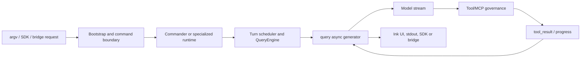
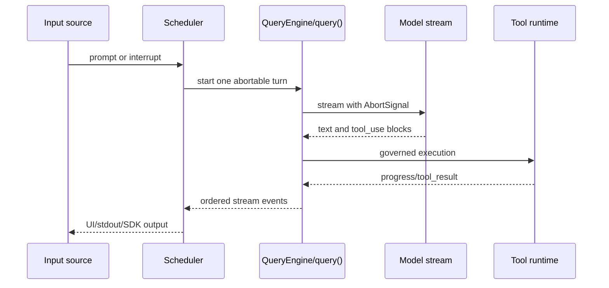
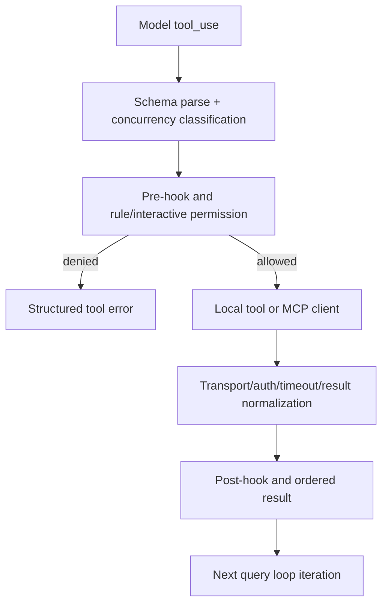

# Claude Code Source Snapshot: Architecture Analysis

## 1. Scope, Evidence, and Limits

This is a static analysis of the fixed source snapshot at `/Users/chuzu/projests/stark-repo-analyzer-reference-sources/claude-code`, HEAD `a371abbe75ffa0d0a3c92290e2bbf56a7ef54367`. The source tree was read only; no Git history was queried and no source file was modified.

The snapshot has 1,884 TypeScript/TSX files and 512,664 counted lines under `src/`. A standard-mode analysis cannot responsibly call that whole corpus “read” after inspecting a few entrypoints. This report therefore deeply covers three end-to-end modules, with 91.0% aggregate line coverage across their 22 specifically assigned files. The rest of the tree is structural context only.

Primary evidence is the source and its `README.md`. External Web research, website traversal, build/test execution, and runtime invocation were **not performed**: the invocation restricted analysis to the supplied source tree, and the checked root contains no standalone package manifest. The README identifies this as a research mirror rather than an official product; its broader claims are not used as implementation evidence.

## 2. What System This Is

The covered code describes a terminal agent, not a thin command wrapper. A single executable must admit fast informational commands, ordinary interactive and print modes, background/daemon routes, IDE/SDK paths, and a higher-risk remote-control process. Once a session starts, it receives more than one kind of event: user prompts, interrupts, permission decisions, background-task notifications, model-stream chunks, tool progress and final results. Finally, its action surface can be local or MCP-provided, through several transports and organization-level policy constraints.

The architectural through-line is: **classify a process before loading capabilities; serialize a conversational turn while keeping it interruptible; execute external capabilities only through an explicit governance boundary.**

This is more disciplined than having each UI surface call a model client and invoke functions directly. The cost is that entry rules, scheduling semantics and capability governance live in several large boundary files and must be kept coherent.

## 3. Startup and Command Boundary

The first boundary is intentionally two-tiered. `src/entrypoints/cli.tsx:33-302` cheaply classifies arguments and dynamically imports specialized runtimes for fast paths. `--version` can return without loading the main CLI, while bridge, daemon and MCP-host forms do not accidentally acquire the semantics or startup cost of an interactive session. Ordinary commands then enter `src/main.tsx`, where `run()` registers commands and Commander `preAction` performs shared initialization only when an action will actually execute (`src/main.tsx:884-967`).

That decision resolves a real tension: eager global setup makes every invocation consistent but makes `--help` and tiny commands pay for settings, telemetry and migration work; per-handler setup is fast to start but drifts. The `preAction` approach keeps the shared runtime contract without charging help text for it. Its hidden cost is that direct handler callers must know the hook is a prerequisite.

Remote control is deliberately not “just another command.” The bootstrap path checks authentication, feature/version availability and policy before calling `bridgeMain` (`src/entrypoints/cli.tsx:108-160`). Since bridge bypasses the normal interactive setup, it explicitly enables configuration, sinks, cwd state and prior workspace trust (`src/bridge/bridgeMain.ts:2036-2093`). This duplication is defensible: a remote request that can cause local work needs a stronger and separately auditable entry gate. It does, however, create an evolution hazard: new preconditions must be added to both the standard and bridge initializers.

## 4. Interactive Session Orchestration

After a route is chosen, the hard problem changes from parsing arguments to preserving turn semantics. `src/cli/print.ts:1833-2008` maintains a single running consumer, gives “now” inputs a chance to abort the active operation, and batches adjacent prompts. This is not a generic queue optimization. Concurrent model calls against the same message history would make ordering, tool side effects and transcript state ambiguous. The scheduler instead trades some latency for a single serial conversational reality, while retaining a high-priority interruption channel.

`QueryEngine` holds the durable session state and exposes a streaming interface; its `ask()` construction is an `AsyncGenerator` (`src/QueryEngine.ts:1186-1295`). The core loop passes the same abort signal to the model call (`src/query.ts:659-665`), receives model events, then returns tool results to the loop. A user interrupt is therefore not UI-local cancellation: it has a path through the scheduler, model stream and tool context.

This generator-centered arrangement is a better fit than a callback bus for the specific problem: it gives consumers ordered incremental output and a native completion/cancellation protocol. It also concentrates lifecycle complexity. `src/cli/print.ts` and `src/screens/REPL.tsx` are each roughly five thousand lines, so a future input source can easily miss one lifecycle notification or abort condition. An extractable `TurnScheduler` with explicit `accepted`, `started`, `streaming`, `interrupted`, and `terminal` states would make the cross-entry contract testable.

## 5. Tools and MCP: Governed Capabilities

Tool execution is not treated as a list of arbitrary callbacks. `src/services/tools/toolOrchestration.ts:91-115` parses each tool input and asks that tool whether that concrete invocation is concurrency-safe. Only consecutive safe calls are grouped; parse errors or a throwing safety predicate fall back to serial execution. Concurrent work may finish at different times, but context modifiers are committed in original tool order (`:26-67`). The point is not maximal parallelism; it is parallelism that does not scramble the model-visible conversation state.

Permission hooks do not become an escape hatch. Even after a Hook returns allow, rule-based deny and ask outcomes still apply (`src/services/tools/toolHooks.ts:347-405`). That establishes a useful precedence order: extensions can enhance the decision experience, but user or organization policy retains the final veto. This is an appropriate compromise for a programmable local agent, though Hook authors need to understand that allow is conditional.

MCP is the networked version of the same stance. The covered types/config/client code supports several transport shapes and lifecycle states, while `MCPConnectionManager` keeps UI management separate from connection work. `src/services/mcp/elicitationHandler.ts:53-65,187-199` shows the reverse direction: a server can request input, but the request is queued as application state and completion notification targets the corresponding request by server and elicitation identifier. This is safer than allowing an arbitrary transport callback to mutate the terminal directly.

The tradeoff is an unusually dense MCP client boundary. `src/services/mcp/client.ts` combines connection, auth, discovery, invocation, result governance and SDK handling. It is coherent for now, but protocol changes are likely to touch too much of one 3,348-line file. Internally splitting it into Connection, Discovery, Invocation, and Result-normalization services would improve change isolation without exposing a more complicated public API.

## 6. Cross-Module Assessment

Three choices reinforce one another:

1. **Delayed loading and security gates align.** Entry classification controls which code is loaded, while bridge authorization/trust controls which high-risk path is usable. Performance isolation and failure-domain isolation are achieved together, not separately.
2. **Cancellation is end-to-end.** The scheduler decides when a turn stops, the query loop passes that decision to the model, and the tool layer can cancel child work. A system that only aborted the HTTP request would still leave permission waits and subprocess work semantically unresolved.
3. **Extension is subordinate to governance.** Dynamic commands and multiple MCP transports increase capability, but policy gates, workspace trust, tool rules and structured elicitation preserve the system’s control plane.

The main risks are architectural rather than localized defects:

- Dual initialization paths (`main.tsx` and bridge) can drift. Extract a shared, non-UI runtime prerequisite function and test a command-form matrix.
- Large `print.ts`/REPL boundaries mix input, scheduling and presentation. Extract a state-machine scheduler that owns command priority and terminal bookkeeping.
- The MCP client owns too many concerns. Split internal collaborators while holding the existing connection-facing contract steady.

No code defect is asserted for the elicitation completion call: an initial candidate concern was disproved by direct line-level validation (`src/services/mcp/elicitationHandler.ts:189-193`).

## 7. Conclusion

The covered architecture is strongest where it treats an agent run as a controlled lifecycle instead of a model request: classify the execution context, serialize and observe its turn, then authorize and execute capabilities under explicit cancellation and policy constraints. The same design makes the system sophisticated enough to support CLI, SDK, bridge and MCP variations, but it places a premium on keeping shared lifecycle contracts centralized. The most valuable next engineering work is not adding another transport or command; it is reducing the number of places that define initialization and turn state.

## Evidence Index

- Module evidence: `drafts/06-module-cli-boundary.md`, `drafts/06-module-session-orchestration.md`, `drafts/06-module-tools-mcp.md`
- Cross-validation: `drafts/07-cross-validation.md`
- Insights: `drafts/08-insights.md`
- Coverage: `drafts/08-coverage.md`
- Commands and checks: `EXECUTION_LOG.md`, `checks/ANALYSIS_CHECKS.md`
