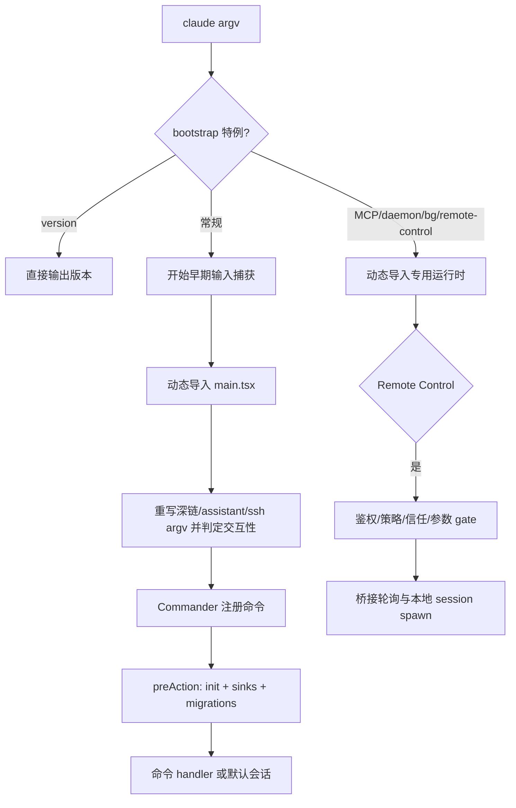

# 模块六：启动与命令边界

> 这是报告的第一章：在任何交互会话被调度前，程序先必须回答“这次进程是什么、能否进入、应当加载多少能力”。该模块把同一个 `claude` 可执行文件拆成快速路径、常规 CLI 与远程控制三个运行边界，为后续“交互会话调度”提供已初始化、已分类且已受约束的运行上下文。

## 角色与业务问题

这是一个大型 TypeScript/React Ink 终端代理的**进程入口、命令契约与特殊运行面适配器**。它存在的原因不是解析几个 flag，而是避免所有调用形态都为完整 TUI、配置、插件、MCP 与会话运行时付费：`--version` 无需载入任何其他模块；后台 worker、MCP 主机、daemon、桥接远控也不应错误进入交互会话。

去掉此边界，默认会话启动、非交互 `-p`、浏览器/原生宿主、后台会话和远程控制将争抢同一套初始化与 `argv`，造成延迟、错误的信任提示，乃至把远程请求带入本地交互路径。其对整体哲学的贡献是“多入口、会话和能力面解耦”：入口只建立最小且明确的上下文，重服务在确知路径之后按需加载。

## 设计：两级分流加统一命令契约

`entrypoints/cli.tsx` 是零/低依赖 bootstrap：先做 build-time feature gate 与 `argv` 判断，再用动态导入把少数特例送入专门运行时；只有普通路径才导入 4,683 行的命令装配器（`cli.tsx:33-302`）。`main.tsx` 则将“命令注册”与“命令执行前初始化”分离：Commander 的 `preAction` hook 确保帮助文本不触发昂贵初始化，但每个真正命令共享 settings、MDM/keychain 预取、telemetry sink、迁移与策略加载（`main.tsx:884-967`）。

`remote-control` 是有意识的第三条边界：bootstrap 先完成认证、增长开关、最低版本和策略限制，才导入 bridge（`cli.tsx:96-153`）；bridge 又自行启用配置、sink、工作区信任与 token 检查，因为它绕过 `main.tsx` 的 TUI setup（`bridgeMain.ts:2036-2108`）。这比“让 bridge 复用完整 CLI”多了初始化重复，但避免长期运行的远控服务被交互 UI 与默认命令语义牵连。

### 必要数据结构

```ts
// 远控参数的边界化结果，而不是让业务循环直接读取 argv。
type ParsedArgs = {
  verbose: boolean; sandbox: boolean; debugFile?: string;
  sessionTimeoutMs?: number; permissionMode?: string; name?: string;
  spawnMode: SpawnMode | undefined; capacity: number | undefined;
  createSessionInDir: boolean | undefined; sessionId?: string;
  continueSession: boolean; help: boolean; error?: string;
};

// 轮询循环将远端 work 与本地子会话、超时、工作树分开索引。
const activeSessions = new Map<string, SessionHandle>();
const sessionWorkIds = new Map<string, string>();
const sessionTimers = new Map<string, ReturnType<typeof setTimeout>>();
```

第一段定义来自 `bridgeMain.ts:1722-1887`，将互斥 flag、容量与恢复语义在进入网络循环前验证；第二段来自 `bridgeMain.ts:163-194`，使退出、心跳、容量唤醒可以按会话清理，而非依赖全局可变状态。

## 核心流程



1. Bootstrap 对 `--version` 做零导入返回；特殊 MCP host、daemon worker、bridge、后台 sessions、模板和 runner 都以 feature gate 加动态 import 处理。`--bare` 必须在导入完整 CLI 前设置环境变量，保证 module-evaluation 与 Commander 构建也受简化模式影响（`cli.tsx:33-302`）。
2. 常规路径进入 `main()` 后先设置 Windows PATH 防护和信号处理；随后把 `cc://`、deep link、assistant 与 SSH 这种“表面子命令、实际要进入完整 TUI”的输入改写成默认会话的上下文。它还据 `-p`、SDK URL、TTY 判定交互性和 client type，并在 `run()` 前及早加载设置 flag（`main.tsx:585-855`）。
3. `run()` 注册 Commander，同时用 `preAction` 把昂贵而共同的启动工作压到实际 action 之前；以此让 help 可快返，也让 `mcp`、`doctor`、plugin 等非默认命令仍拥有日志 sink 与迁移（`main.tsx:884-967`）。典型子命令动态导入 handlers，例如 token 设置、doctor、install（`main.tsx:4266-4275`, `4345-4354`, `4394-4402`）。
4. `remote-control` 在 bootstrap 已通过认证/策略后调用 `bridgeMain`；后者解析并交叉验证 `--spawn`、`--capacity`、恢复参数，启用配置和 sink，强制已有工作区信任，才启动环境注册/轮询（`cli.tsx:96-153`; `bridgeMain.ts:1737-1887`, `1980-2108`）。循环用 `activeSessions` 等 Map 管理 child session、work id、JWT、timeout 和 worktree；心跳失去 ingress token 时请求服务端重新投递，而非静默丢失工作（`bridgeMain.ts:141-260`）。

## 命令面：MCP 与 TUI 辅助 handler

MCP handler 被拆出 `main.tsx`，仅在 `claude mcp *` 执行时加载，既减少普通会话首包体积，又把配置变更、健康探测与安全存储清理封在命令边界（`cli/handlers/mcp.tsx:1-25`）。`mcp list` 用受限并发探测服务器，并以 graceful shutdown 避免 stdio 子进程孤儿化（`:144-190`）；`remove` 在删配置前读取 transport 以同步删除 OAuth token/client config，并对多 scope 要求显式选择（`:74-140`）；`add-json` 则在写配置**前**读取 client secret，防止用户取消造成部分提交（`:285-313`）。这是“可演进能力面”中少见而重要的事务顺序。

`setup-token` 与 `doctor` 采用有 AppState、按键与 MCP provider 的最小 Ink 根树，在完成回调后卸载 root 再退出（`cli/handlers/util.tsx:20-87`）；`install` 则复用 setup 后委托 install command（`:90-109`）。它们不是会话调度器，却证明命令层能选择 TUI、纯 stdout 或长期服务三种呈现方式。

## 协作与跨模块结论

| 边界 | 已证实的契约 | 影响 |
|---|---|---|
| Bootstrap → 主 CLI | `cli.tsx` 只在普通路径动态导入 `main`，并将早期输入捕获置于导入前（`cli.tsx:287-298`） | 将启动成本与常规会话语义隔离。|
| 主 CLI → handlers | Commander action 懒加载 handler；`preAction` 提供 init/sink/迁移（`main.tsx:905-967`, `4266-4402`） | handler 可以假设可观测性与配置底座存在。|
| Bootstrap → Bridge | bridge 绕过 Commander，bootstrap 先做 auth/版本/策略；bridge 再做 trust/config/sink（`cli.tsx:96-153`; `bridgeMain.ts:2036-2093`） | 远控不是默认会话的分支，而是受更严边界保护的独立运行面。|
| Bridge → 会话运行器 | `SessionSpawner` 与 `SessionHandle` 由 bridge loop 管理（`bridgeMain.ts:126-152`, `163-194`） | 【待主 agent 验证】后续“交互会话调度”模块应解释 spawn 如何构造 SDK URL、权限和本地 REPL。|
| MCP CLI → MCP service/config | handler 调 `get/add/removeMcpConfig` 与 `connectToServer`（`mcp.tsx:14-18`, `74-189`） | 【待主 agent 验证】MCP 服务层的 scope 优先级、连接复用和审批策略需由对应模块确认。|

## 决策、替代方案与权衡

1. **先判 fast path，再加载完整 CLI。** 统一只用 Commander 会更短，但 `--version`、worker、daemon 或远程控制会承担大规模 import 与顶层预取；这里以重复少量 dispatch 换取冷启动和失败域隔离。代价是 `argv` 逻辑分布于 `cli.tsx`、`main.tsx`、bridge，维护者须保证语义同步。
2. **`preAction` 统一初始化，而不在模块加载时 init。** 这让 help 真正便宜，又消除子命令 telemetry 丢失的问题（`main.tsx:905-935`）。替代的每个 handler 自行 init 易漏、顺序不一致；代价是 Commander hook 成为隐式前置条件，直调 handler 的测试/嵌入者必须自行构造环境。
3. **远控以独立安全门重新建上下文。** bridge 先校验 feature、权限模式、workspace trust、OAuth 与策略，且把多会话开关的拒绝事件显式 flush（`bridgeMain.ts:2021-2093`）。这比“复用交互入口”冗余，却正确处理了远程网页触发本地执行这一更高风险边界。风险是某项交互初始化未来新增时，bridge 可能漏同步；代码注释已承认其 bypass 特性，建议抽取可复用的、无 UI 的 `initializeRuntimeContext()`。

## 洞察、亮点与问题

- **亮点：能力加载与安全界限同向。** 动态 import 不只是性能技巧：远控、MCP host、daemon 都在被识别后才获得相应能力，缩小意外路径的副作用面。`--bare` 在 Commander 建立前落环境变量尤其说明作者理解“初始化时机就是行为的一部分”（`cli.tsx:281-297`）。
- **亮点：命令写操作尊重补偿与清理。** MCP 删除先取旧配置再清 OAuth，list/get 使用 graceful shutdown，add-json 先采秘密再写配置（`mcp.tsx:74-140`, `144-190`, `285-313`）。这比简单 `process.exit` 更适合有子进程和凭据的 CLI。
- **问题：入口规则有双层 argv 重写。** deep link、assistant、SSH 在 `main.tsx` 改写，bridge 又有自有 parser；这是合理的性能分层，但新增命令很容易漏掉 `-p`、root flag 或 feature gate 的组合。应以表驱动的“命令形态/允许模式”声明生成 bootstrap 分发与 help stub，或至少为两层保持契约测试。此为代码结构风险，非已证实缺陷。
- **问题：bridge 初始化的重复边界会演进漂移。** `bridgeMain` 明说绕过 `main.tsx`，因此手动启 config、sink、cwd、trust（`bridgeMain.ts:2036-2093`）。当前防护明确，但每新增一项进入期安全或观测要求，都要审计两处；建议把无 UI 的前置条件收敛为显式 capability initializer。

这层已经完成“进程该以何种能力与安全等级运行”的裁决；下一章的交互会话调度才能把已规范化的输入、权限和上下文变为实际的 agent/REPL 生命周期。

## 覆盖率与证据

| 文件名 | 总行数 | 已读行数 | 覆盖率% | 未读原因 |
|---|---:|---:|---:|---|
| `src/main.tsx` | 4,683 | 3,020 | 64.5% | 为标准模式门槛分段读入口、命令装配核心与尾部；未逐行读取其余具体子命令注册。 |
| `src/entrypoints/cli.tsx` | 302 | 302 | 100.0% | 无。 |
| `src/cli/handlers/util.tsx` | 109 | 109 | 100.0% | 无。 |
| `src/cli/handlers/mcp.tsx` | 361 | 361 | 100.0% | 无。 |
| `src/bridge/bridgeMain.ts` | 2,999 | 2,720 | 90.7% | 分段读启动、循环、参数、主函数及尾部；未逐行阅读中段部分工作分发细节，由后续会话模块验证。 |
| **合计** | **8,454** | **6,512** | **77.0%** | **标准模式核心模块达标 ✅** |

### 实际读取命令与限制

- 工具：`wc -l`、`rg -n`、`sed -n`、`nl -ba | sed -n`；均只读。命令的退出状态均为 `0`。
- 源码读取命令（绝对路径均位于指定 source root）：`sed -n '1,109p' util.tsx`、`sed -n '1,361p' mcp.tsx`、`sed -n '1,302p' cli.tsx`；`sed -n '1,1000p;1801,2800p;3501,4500p' main.tsx`；`nl -ba ... | sed -n '585,855p;884,1100p;3700,3920p;4000,4520p' main.tsx`；`sed -n '1,1100p;1101,2000p' bridgeMain.ts`；`nl -ba ... | sed -n '1,260p;1980,2240p;2500,2810p;2810,2999p' bridgeMain.ts`。
- 固定源 HEAD 已用 `git -C <source> rev-parse HEAD` 校验为 `a371abbe75ffa0d0a3c92290e2bbf56a7ef54367`（只读取当前 HEAD；未使用 Git 历史）。未运行源码、测试或网络调研；未修改 source tree。部分终端回显因长度被工具截断，覆盖数以实际请求的 `sed` 行区间并集计；所有架构结论仅基于分配文件，跨模块事项均标为【待主 agent 验证】。
