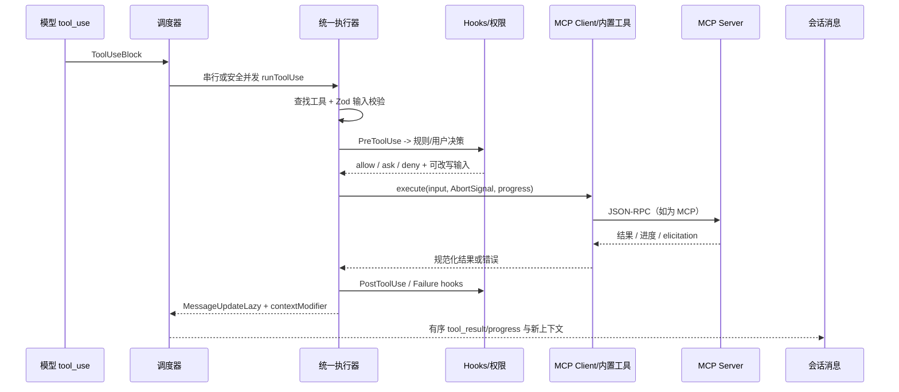

# 06 工具执行与 MCP 能力面

## 叙事位置与结论

前一模块已将模型流中的 `tool_use` 事件转换为能力请求；本章处理它真正进入现实世界后的问题：哪些工具可见、参数是否有效、谁有权批准、能否并发、远端能力如何连通，以及输出怎样成为下一轮上下文。本模块把这些高风险、异步且多来源的细节收束在统一的工具协议边界中，符合本项目“多入口/会话/能力面解耦，以明确契约维持可演进性”的初判。

若删除此模块，CLI 仍能生成工具名称，却无法安全地执行本地能力、无法把 MCP 服务器变成模型可调用工具，也无法把进度、拒绝、错误和远端结果可靠地回流为消息。它是主线终点：执行结果重新成为会话消息，供模型决定后续动作【待主 agent 验证】。

## 业务问题与角色

终端代理面对的不是单一 RPC：内置工具可能改文件或启动 shell，MCP 能力可经子进程、HTTP/SSE/WebSocket、IDE、同进程或 SDK 控制通道提供；每一种都可能需要权限、认证、用户表单/URL 确认、取消和长任务进度。设计没有让模型直接触碰这些通道，而是构造三层边界：

1. **统一执行面**：`runToolUse` 先找工具、做 schema 校验和 Hook/规则/交互式权限决策，再将结果规整成 `MessageUpdateLazy`（`src/services/tools/toolExecution.ts:337-598,599-1250`）。
2. **调度面**：批处理与流式到达分别由 `runTools` 和 `StreamingToolExecutor` 执行；两者只按工具声明的 `isConcurrencySafe` 并发，写入/副作用能力保序（`toolOrchestration.ts:19-115`；`StreamingToolExecutor.ts:40-530`）。
3. **MCP 适配面**：配置先经 schema、环境变量、企业策略、禁用状态处理；连接层按传输创建 SDK Client、缓存/重连，进而将远端 tools/resources/commands 归一化（`mcp/config.ts:536-556,1258-1578`; `mcp/client.ts:595-1647,1743-2032,2226-2407`）。

## 必要的数据结构

```ts
// 工具执行的可流式回流单元
type MessageUpdateLazy<M extends Message = Message> = {
  message: M
  contextModifier?: { toolUseID: string; modifyContext: (c: ToolUseContext) => ToolUseContext }
}

// 同一 MCP 名称的显式生命周期和配置归属
type MCPServerConnection =
  | ConnectedMCPServer | FailedMCPServer | NeedsAuthMCPServer
  | PendingMCPServer | DisabledMCPServer
```

前者把 UI/模型消息和延迟上下文变换分开，允许调度器先按到达顺序输出消息、后确定性地提交变换（`toolExecution.ts:264-270`; `toolOrchestration.ts:31-67`）。后者把连接成功、认证中、失败、重试和禁用建模为互斥状态，而不是散落的布尔字段；配置携带 `scope` 与可选 `pluginSource`，为多来源覆盖与插件门控保留出处（`mcp/types.ts:148-226`）。

## 核心流程



证据链如下。

- `partitionToolCalls` 将连续、已验证且声明可并发的调用合为一批；解析失败或 `isConcurrencySafe` 自身异常一律降级为串行，随后并发批次的 context modifier 按原工具顺序提交，防止“并发完成顺序”污染会话状态（`toolOrchestration.ts:26-67,91-115`）。
- 流式版本允许安全工具立即启动，却缓存最终结果以输入顺序吐出；进度消息可越过缓存即时显示。Bash 错误才会中断兄弟进程，避免独立 Read/WebFetch 的失败扩大为整批取消（`StreamingToolExecutor.ts:76-155,270-411,417-514`）。
- `checkPermissionsAndCallTool` 在真正调用前进行 Zod 校验、预执行 Hook、权限规则/交互决策和 trace/统计；执行后仍经成功或失败 Hook，说明 Hook 是受协议包裹的扩展点，而非旁路（`toolExecution.ts:599-1250,1483-1518`; `toolHooks.ts:39-330,332-650`）。
- MCP 工具调用以 SDK schema 约束结果，增加自有超时兜底、进度回调、401 认证失效与 HTTP session 过期的缓存清理，并处理大结果落盘/截断；URL elicitation 最多重试三次且在 UI/SDK 两种入口间复用 Hook（`mcp/client.ts:2478-2812,2813-3261`）。

## MCP 接入不是单一路径

配置 schema 接受 stdio、SSE、HTTP、WS、IDE 专用、SDK 和 Claude.ai 代理等判别联合；`ScopedMcpServerConfig` 为每项附加来源范围（`mcp/types.ts:10-147`）。配置加载再合并项目/用户/企业/动态等来源，执行 allow/deny 策略与同内容去重，最后才允许连接（`mcp/config.ts:202-556,843-1100,1258-1383`）。这把“是否允许存在”与“是否当前可连”分离，适合企业策略覆盖个人便利性的产品边界。

连接端以 memoized `connectToServer` 管理传输、认证与清理；工具、资源、命令分阶段抓取，批量连接受本地/远端批量大小约束，并会跳过禁用项（`mcp/client.ts:552-595,595-1647,1688-1718,2226-2407`）。SDK server 则使用控制消息桥，不伪装为子进程：客户端/服务端 transport 保留 JSON-RPC message id，允许多个 SDK 服务器路由（`mcp/SdkControlTransport.ts:1-136`; `mcp/client.ts:3262-3348`）。同进程 transport 使用 microtask 转发，刻意避免同步请求/响应递归加深调用栈（`mcp/InProcessTransport.ts:1-63`）。

## 权限、Hook 与 Elicitation 的协同

PreToolUse Hook 可拒绝、请求询问、允许或改写输入；但 Hook 的 allow 仍必须经过静态 deny/ask 规则，避免自动化扩展绕过用户/组织策略（`toolHooks.ts:332-433,435-650`）。Post hook 可以附加上下文、停止后续推理，并且只有 MCP 工具的输出允许被 hook 改写（`toolHooks.ts:39-170`）。这是一条很好的不变量：扩展性不应削弱基线安全策略。

MCP 反向向用户请求信息时，elicitation handler 先给 hooks 机会，未解决才入 AppState 队列，并将 abort 变为 cancel；URL 模式再用完成通知改变对应队列项状态（`mcp/elicitationHandler.ts:68-209,214-313`）。远程频道权限则要求“已连接 + 会话 allowlist + 同时声明 channel 与 permission capability”，并用每 session 闭包保存 pending resolver；结构化通知而非普通聊天文本才能完成批准（`mcp/channelPermissions.ts:1-240`）。【待主 agent 验证】这些回调的创建与通知注册位于未分配文件，因此本章只确认其契约，未断言完整调用链。

## 三个关键决策与权衡

### 1. 用能力声明来决定并发，而不是按工具名称白名单

**选择**：由已解析输入上的 `isConcurrencySafe` 决定批次，异常保守串行（`toolOrchestration.ts:91-115`; `StreamingToolExecutor.ts:104-131`）。

**收益**：工具作者能按具体输入声明读/写语义，调度器无需知道每种工具；并发吞吐与安全边界同源。**代价**：声明错误会产生竞态，且并发工具的 context modifier 当前不支持提交（代码明确注释），限制了以后有状态工具的并发空间（`StreamingToolExecutor.ts:387-395`）。替代的全串行设计简单且确定，但会把批量只读探索的等待时间线性叠加。

### 2. Hook 可参与决策，但策略规则拥有最终否决权

**选择**：Hook allow 之后仍检查规则；deny/ask 可覆盖 Hook（`toolHooks.ts:350-407`）。

**收益**：CI、企业审计和本地插件可扩展审批体验，却不会把 settings policy 变成可绕过建议。**代价**：Hook 作者必须理解“allow 非最终批准”，路径也比单一 middleware 更复杂。若让 Hook 直接短路，会更易集成，但会制造供应链/自动化脚本绕过组织控制的漏洞。

### 3. 将 MCP 的多运输与生命周期收敛为 Client + 联合状态

**选择**：传输细节隐藏在连接工厂和 Transport adapter 后，调用方只面对 `MCPServerConnection`；SDK/同进程路径保留独立 bridge（`mcp/types.ts:148-258`; `mcp/client.ts:595-1647,3262-3348`; `mcp/InProcessTransport.ts:1-63`）。

**收益**：工具层不为 stdio/HTTP/SDK 分叉，连接失败、需认证、禁用也能显式呈现。**代价**：`client.ts` 同时承载连接、认证、工具映射、结果压缩和 elicitation retry，3348 行的聚合边界会提高修改回归风险。若重构，可抽取 Connection/Discovery/Invocation/Result-normalization 四个内部服务，保持对外 API 不变。

## 亮点、问题与洞察

**亮点 1：顺序输出和并发执行分离。** 流式执行器即时呈现进度、缓存最终结果；批调度器按 tool-use 原序提交 context modifier。这比“Promise.all 后按完成顺序写消息”更适合 LLM 会话，因为消息顺序本身是模型的状态输入（`StreamingToolExecutor.ts:417-514`; `toolOrchestration.ts:31-67`）。

**亮点 2：MCP 被当作不可靠边界而非普通函数。** 输入/结果 schema、双层超时、认证缓存、session 失效重建、大输出持久化和 URL 确认重试共同把网络/身份/UI 故障转成可恢复状态（`mcp/client.ts:492-552,2478-3261`）。这比只把 JSON-RPC 包成 `await call()` 更贴近代理运行时的现实。

**问题 1：`client.ts` 的职责密度过高。** 连接、OAuth、transport、工具发现、调用、输出治理和 SDK 初始化同处，尽管有 memoization，仍容易让任何协议演进波及核心文件（`mcp/client.ts:595-1647,1743-2407,2478-3348`）。建议按上述四个内部协作者拆分，并用端到端 fixture 保住跨 transport 行为。

**问题 2（需优先复核）：URL elicitation 完成通知调用似有实参错位。** `findElicitationInQueue` 声明为 `(queue, serverName, elicitationId)`（`mcp/elicitationHandler.ts:51-64`），但当前固定文本在通知回调处传入了 `queue, queue, serverName, elicitationId`（`mcp/elicitationHandler.ts:153-158`）。按 TypeScript 原文这应造成参数个数/类型错误；即使构建链有转换，运行时第二参会成为数组，匹配不到 server。请主 agent 在全仓构建或同文件未分配上下文中验证，本文不将其定性为已证实缺陷。

**洞察：能力面真正的核心不是“插件协议”，而是可撤销的执行承诺。** 从 AbortSignal、并发安全声明、Hook/规则、认证/会话状态到 elicitation，每一层都在回答“这一次调用在什么条件下仍可继续”。这使 Claude Code 的工具系统更接近一个小型事务协调器，而不是函数注册表；代价是状态分散，未来最值得投资的是将这些取消/批准状态做成可观察的统一状态机。【待主 agent 验证】

## 协作与跨模块结论

- 上游会话/流模块只需生产 `ToolUseBlock` 和 `ToolUseContext`；本模块不要求它了解 MCP transport、权限 UI 或 Hook 实现细节（`toolExecution.ts:337-598`）。【待主 agent 验证】
- 工具注册表提供 `Tool`、输入 schema、`isConcurrencySafe`、执行器与可选交互语义；本模块据此负责治理与回流（`toolExecution.ts:599-1250`; `toolOrchestration.ts:91-115`）。【待主 agent 验证】
- MCP 管理 UI 通过 React Context 暴露重连/启停，而真正的连接逻辑委托未分配的 `useManageMCPConnections`，所以仅确认 UI 边界、不推断其状态管理（`mcp/MCPConnectionManager.tsx:1-72`）。

至此，模型事件已被转为经验证、可审批、可取消、可观测的能力调用；下一个报告层应从这些 `tool_result` / progress 消息回到会话循环，解释它们如何影响模型的下一步推理【待主 agent 验证】。

## 覆盖率

| 文件名 | 总行数 | 已读行数 | 覆盖率% | 未读原因 |
|---|---:|---:|---:|---|
| `src/services/tools/toolExecution.ts` | 1745 | 1507 | 86.4 | 未读 401-489、1251-1399：非核心遥测/映射段；核心入口、权限及后处理已覆盖 |
| `src/services/tools/toolOrchestration.ts` | 188 | 188 | 100.0 | 无 |
| `src/services/tools/StreamingToolExecutor.ts` | 530 | 530 | 100.0 | 无 |
| `src/services/tools/toolHooks.ts` | 650 | 650 | 100.0 | 无 |
| `src/services/mcp/MCPConnectionManager.tsx` | 72 | 72 | 100.0 | 无 |
| `src/services/mcp/client.ts` | 3348 | 2849 | 85.1 | 未读 1701-2199：资源/命令抓取细节；连接、工具、批量、调用、结果、SDK 路径已覆盖 |
| `src/services/mcp/config.ts` | 1578 | 1429 | 90.6 | 未读 1101-1249：中间来源合并分支；schema、策略、解析、最终合并及启停已覆盖 |
| `src/services/mcp/types.ts` | 258 | 258 | 100.0 | 无 |
| `src/services/mcp/InProcessTransport.ts` | 63 | 63 | 100.0 | 无 |
| `src/services/mcp/SdkControlTransport.ts` | 136 | 136 | 100.0 | 无 |
| `src/services/mcp/channelPermissions.ts` | 240 | 240 | 100.0 | 无 |
| `src/services/mcp/elicitationHandler.ts` | 313 | 313 | 100.0 | 无 |
| **合计（工具/MCP 核心模块）** | **9121** | **8235** | **90.3** | **标准模式核心模块要求 >=60%，达标 ✅** |

## 实际读取命令、来源与限制

- 源码来源：`/Users/chuzu/projests/stark-repo-analyzer-reference-sources/claude-code`，只读核验 HEAD：`git -C ... rev-parse HEAD`，输出 `a371abbe75ffa0d0a3c92290e2bbf56a7ef54367`；未读取 Git 历史，未修改源码树。
- 实际源码读取：`rg --files ... | rg '/(toolExecution|toolOrchestration|StreamingToolExecutor|toolHooks)\\.(ts|tsx)$'`（因任务给出的 `src/tools/` 路径不存在，定位实际 `src/services/tools/` 路径）；`wc -l <13 个分配文件>`；以及对各文件执行的 `sed -n '起,止p'`：toolExecution `1-400,490-1250,1400-1745`，toolOrchestration `1-188`，StreamingToolExecutor `1-530`，toolHooks `1-650`，MCPConnectionManager `1-72`，client `1-1700,2200-3348`，config `1-1100,1250-1578`，types `1-258`，InProcessTransport `1-63`，SdkControlTransport `1-136`，channelPermissions `1-240`，elicitationHandler `1-313`。另以 `rg -n` 定位声明与调用行。
- 限制：严格未读取任何未分配源码文件；因此 `Tool`、`ToolUseContext`、`useManageMCPConnections`、Hook 底层执行及会话消费端只按导入契约描述，跨模块结论均标为【待主 agent 验证】。未运行构建/测试（本子任务是只读模块分析，且避免扩大到未分配源码）。
