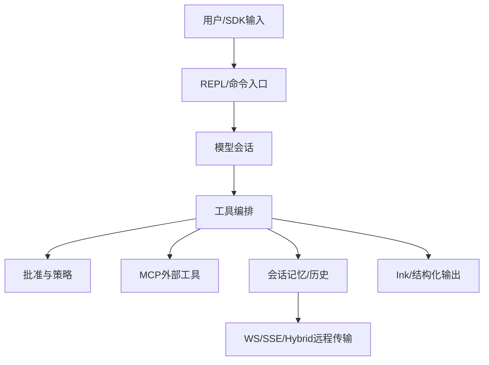

# Claude Code 源码架构分析

## 执行边界

本报告基于固定 HEAD `a371abbe75ffa0d0a3c92290e2bbf56a7ef54367` 的只读静态分析。仓库规模约 1,906 个文件、512,685 行候选代码。外部调研、用户交互、subagent 并行分析和 build/test 均为 `not performed`，完整覆盖率未达标，详见 `execution-log.md` 与 `drafts/08-coverage.md`。

## 项目全景

代码呈现的是一个以终端为入口的 LLM agent runtime：它把模型响应转换为工具调用，把工具调用置于批准/策略控制下，再通过 MCP、插件、技能和远程会话扩展能力。`src/main.tsx:1-75` 的导入面已经说明其 composition root 同时连接配置、认证、策略、MCP、插件、会话和 UI。

## 关键设计

入口先触发 profiling、MDM 和 keychain 预取，再加载其余模块，目标是减少启动等待。这种设计适合交互式 CLI，但把副作用放进入口也提高了装配复杂度。

工具抽象与执行编排分离，使模型不直接拥有本地副作用；批准、hooks、错误处理和执行器可以统一治理。其代价是调用链更长，需要维护工具契约与状态转换的一致性。

MCP 通过配置、连接管理、发现和权限过滤形成扩展边界。入口在启动/会话阶段预取 MCP 资源，降低首次调用延迟，同时把外部服务不稳定性隔离到服务层。

会话记忆负责上下文治理，远程传输负责消息交付。`src/cli/transports/transportUtils.ts` 选择 SSE、Hybrid 或 WebSocket；WebSocket 侧还实现 keep-alive、重连、缓冲和永久关闭码识别。这显示系统把断线视为正常运行条件，而不是异常终止。

## 评价与启发

最一致的设计哲学是“集中编排、显式边界、失败可恢复”。最值得警惕的是入口和能力开关持续膨胀，未来应把 composition root 拆成按运行模式装配的模块，并用架构测试固定工具批准、会话恢复和远程重连的跨模块契约。

## 证据索引

- 启动与依赖装配：`src/main.tsx:1-75`
- 工具抽象：`src/Tool.ts`
- 工具运行时：`src/services/tools/toolExecution.ts`、`src/services/tools/toolOrchestration.ts`
- MCP：`src/services/mcp/MCPConnectionManager.tsx`、`src/services/mcp/client.ts`、`src/services/mcp/channelPermissions.ts`
- 会话：`src/services/SessionMemory/sessionMemory.ts`
- 远程选择：`src/cli/transports/transportUtils.ts`
- 远程可靠性：`src/cli/transports/WebSocketTransport.ts`、`src/cli/transports/SerialBatchEventUploader.ts`
