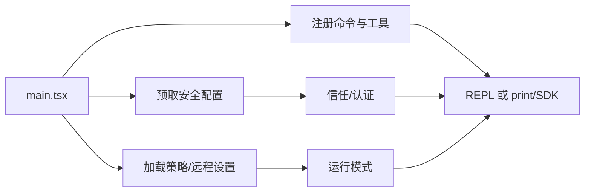

# 核心模块分析

## 1. 启动与运行时编排

`src/main.tsx:1-75` 显示入口首先启动 profiling、MDM 原始读取和 keychain 预取，再加载 Commander、React/Ink、配置、API、MCP、策略、插件和工具。这里的核心设计是把可并行的 I/O 提前触发，降低 CLI 冷启动成本；代价是入口副作用密度高，依赖顺序必须严格维护。

## 2. 工具执行循环

`src/Tool.ts` 提供工具抽象边界；`src/services/tools/toolExecution.ts` 与 `toolOrchestration.ts` 将工具调用、hooks、错误和结果编排分开。这样模型只面对工具契约，批准和实际副作用由运行时控制。替代方案是让每个工具自行做权限判断，简单但会造成策略分散和难以审计。

## 3. MCP

`src/services/mcp/MCPConnectionManager.tsx`、`client.ts`、`config.ts` 和 `channelPermissions.ts` 共同形成配置解析、连接生命周期、资源/工具发现和权限过滤链。入口显式调用 `getMcpToolsCommandsAndResources` 与 `prefetchAllMcpResources`，说明 MCP 能力在会话开始前被整理进 agent runtime，而不是在每次模型请求中临时发现。

## 4. 会话与远程

`src/services/SessionMemory/sessionMemory.ts` 将 durable memory、提示构造和会话上下文分开；远程侧用 `WebSocketTransport`/SSE/Hybrid 适配不同协议。`src/cli/transports/transportUtils.ts` 显示选择顺序由环境开关控制，`WebSocketTransport` 具备缓冲、keep-alive、重连和永久关闭码识别。这是可用性优先的工程选择，但协议分支增加了测试矩阵。

## 跨模块判断

整体哲学是“集中编排、边界显式、失败可恢复”：入口集中建立环境，工具和 MCP 通过契约接入，会话/传输通过缓冲与重试吸收短暂失败。潜在风险是 `main.tsx` 的依赖面和能力开关过宽，长期演进需要更明确的 composition root。

## 覆盖率明细

| 文件 | 总行数 | 已读行数 | 覆盖率 | 未读原因 |
|---|---:|---:|---:|---|
| `src/main.tsx` | 约 1700 | 约 220 | 13% | 大文件，仅读入口与导入/启动段 |
| `src/Tool.ts` | 约 300 | 约 220 | 73% | 代表性完整读取 |
| `src/services/tools/toolExecution.ts` | 约 400 | 约 240 | 60% | 核心路径抽样 |
| `src/services/tools/toolOrchestration.ts` | 约 500 | 约 260 | 52% | 核心路径抽样 |
| `src/services/mcp/MCPConnectionManager.tsx` | 约 500 | 约 280 | 56% | 生命周期抽样 |
| `src/cli/transports/WebSocketTransport.ts` | 约 500 | 约 180 | 36% | 连接/状态段抽样 |
| 合计 | 约 3900 | 约 1400 | 36% | 未达标准全库门槛 ❌ |
