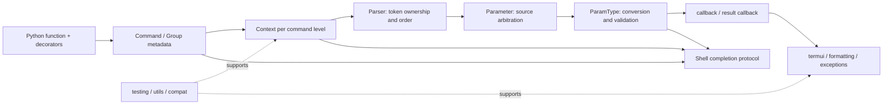

# Click：把命令行体验做成一棵可组合的对象树

## 分析边界

本报告针对固定源码树 `/Users/chuzu/projests/stark-repo-analyzer-reference-sources/click`，源码 HEAD 为 `b67832c2167e5b0ff6764a8c04a0a9087e697b5a`。本次只读源码和仓库内文档，不读取 Git 历史，不修改源码树，不使用目标项目的 `graphify-out`。

Click 的价值不在于把 `argv` 拆成键值对，而在于把命令结构、参数来源、类型转换、回调时序、帮助输出、Shell 补全和退出协议放进同一套语义模型。这样，一个最初只有一个函数的 CLI 可以自然扩展成多层命令树，同时仍然拥有一致的帮助、错误和测试体验。

## 1. 场景与定位

设想一个工具从 `tool run` 长成 `tool session init`、`tool session drop` 和 `tool config set`。如果每个命令都直接处理 `sys.argv`，很快会出现四种分叉：父命令和子命令争抢 token；环境变量、默认值和 prompt 的优先级不一致；错误信息各自拼接；帮助页和 shell 补全与真实参数行为脱节。

Click 的解决方案是把 Python 函数先声明成命令对象，再在一次调用中创建 Context。命令对象保存可遍历的结构和参数元数据，Context 保存这一次调用在命令树某一层的状态，parser 只做 token 归属，ParamType 做值转换，终端与补全消费同一批元数据。README 将产品定位概括为任意嵌套命令、自动帮助和运行时惰性加载子命令（`README.md:1-18`）。

项目文档把这种取舍说得很直接：Click 不追求无限可定制的帮助或解析行为，而是优先保证多个应用组合后仍有统一体验（`docs/why.md`）。这也是它与 `argparse`、`optparse`、`docopt` 的根本差别：对比重点不是开关数量，而是命令组合、类型元数据和派发责任落在哪一层。本次没有执行外部 WebSearch/WebFetch，因此竞品部分只采用仓库内设计文档和稳定的路线级常识，不包含外部热度或性能数据。

## 2. 全景：声明到执行

这条链最重要的设计决定是分层，而不是把所有逻辑集中在 parser。`Command.make_context` 创建 Context 并在不清理的 scope 中解析，`Command.parse_args` 接收 parser 返回的 `opts`、剩余参数和出现顺序，再调用参数的 `handle_parse_result`（`src/click/core.py:1322-1393`）。最终只有 `Command.invoke` 或 `Group.invoke` 才调用业务回调（`src/click/core.py:1395-1409`, `1992-2058`）。

## 3. 命令树与 Context：谁拥有这次调用

### 3.1 声明阶段：装饰器只收集元数据

`@option` 和 `@argument` 把 `Option`/`Argument` 放到函数的 `__click_params__` 上；`@command` 应用时取出这些参数，逆序恢复用户书写顺序，推断命令名，再创建 `Command`（`src/click/decorators.py:217-377`）。装饰器不是执行器，它把 Python 函数“编译”为可遍历的命令描述。

这个细节让同一份参数声明可以被帮助、类型转换、补全和测试重复消费。参数顺序也不是偶然的列表顺序：Python 装饰器从下向上应用，逆序恢复避免帮助和回调顺序随装饰器实现漂移。

### 3.2 Context：调用树上的 activation record

`Context` 将局部状态和继承状态分开：本层的 `params`、`args`、`command`、`info_name` 与 `_parameter_source` 留在当前 Context；`obj` 沿父链继承；`meta` 是嵌套 Context 共享的扩展字典；`default_map` 根据子命令名取下一层配置（`src/click/core.py:312-394`, `606-632`）。

这比扁平 Namespace 更适合嵌套 CLI。相同参数名不会在全局字典中覆盖，深层命令可以通过 `pass_obj` 或 `make_pass_decorator` 获取应用状态，同时不必让每个回调签名携带所有父级依赖（`src/click/decorators.py:28-130`）。代价是 `get_current_context()` 和共享 `meta` 带来隐式依赖；`meta` 的 key 只有命名约定，没有结构化命名空间。

Context 也是资源边界。进入时 push 到线程局部上下文栈，最外层退出时 unwind `ExitStack`；`with_resource` 和 `call_on_close` 把文件、连接等资源的清理绑定到调用生命周期（`src/click/core.py:549-712`, `src/click/globals.py:9-51`）。线程局部不等于异步任务局部，所以它降低了普通线程间串扰，却不会让并发 runner 自动安全。

### 3.3 Group：Composite 加上执行顺序

普通 Group 先解析自己的参数，再把第一个剩余 token 交给 `resolve_command`；父回调运行后创建子 Context，执行子回调，最后运行 result callback（`src/click/core.py:1978-2026`）。`get_command` 和 `list_commands` 是可覆盖的查询钩子，既服务真实分派，也服务帮助、信息遍历和补全（`src/click/core.py:1931-1976`）。

chain 模式先把所有子命令解析成 Context，再按顺序执行并把结果列表交给 result callback（`src/click/core.py:2028-2058`）。这让链式结构先确定、结果后收束，但副作用时机更难直觉理解：后面的 Context 可能已经创建，前面的回调才开始执行。Click 通过禁止嵌套 Group、限制 chain 参数形状来控制这份复杂度，而不是把所有组合情况交给调用者。

## 4. Parser 与 ParamType：从 token 到有来源的值

### 4.1 parser 保持窄边界

`_OptionParser` 负责选项注册、短选项组合、值数量、剩余参数和参数出现顺序；`_Option.process` 同时维护最终 `opts` 和 `order` 两条信息（`src/click/parser.py:127-182`, `224-330`）。`opts` 适合调用，`order` 让上层在用户实际输入的顺序上运行回调。

位置参数使用固定 arity 分槽，wildcard 参数吃掉剩余 token；未知选项能被拒绝或按 Context 策略保留。parser 不处理完整的 eager、prompt、default 和 callback 语义。这不是功能缺失，而是 Click 有意把 parser 限制为可预测的 token 状态机，把更高层政策留给 Parameter 和 Context。

### 4.2 Parameter 把来源与转换合在一次消费中

`Parameter.consume_value` 依次考虑命令行、环境变量、`default_map` 和声明默认值，返回值与 `ParameterSource`；随后 `type_cast_value` 根据 `nargs`、`multiple` 和 composite type 调用 `ParamType`（`src/click/core.py:2470-2572`）。`Option.consume_value` 还把 parser 的 `FLAG_NEEDS_VALUE` 解释为 prompt 或 flag value（`src/click/core.py:3507-3567`）。

`ParameterSource` 从最显式的 `PROMPT` 到最不显式的 `DEFAULT` 排序（`src/click/core.py:169-205`）。这让同名 feature switch 可以比较来源而不是简单“最后写入获胜”；也让帮助/版本这种 eager 参数可以在普通业务参数之前短路。

### 4.3 ParamType 是可复用的输入协议

`ParamType.convert` 必须同时接受命令行字符串、已经是目标类型的值以及 prompt 等没有完整 Context 的场景（`src/click/types.py:101-164`）。`Choice` 将输入规范化后映射回原始 choice，`File`/`Path` 根据平台路径分隔符拆环境变量，`Tuple` 把多个子类型组合成一个带 arity 的协议（`src/click/types.py:147-155`, `330-418`, `926-969`, `1249-1335`）。

这比让每个命令在回调里手写转换更一致，错误可以通过 `BadParameter` 归属到参数；代价是 `File.convert` 可能打开文件并把关闭动作注册到 Context，类型层因此不再是纯函数。Click 选择了用户体验与资源生命周期的一体化，换取少量调用方样板。

## 5. 终端 UI：把元数据变成人能读的反馈

`HelpFormatter` 以终端宽度为布局预算，维护缩进、buffer 和 definition list；`_textwrap` 在 ANSI 不占可见列的前提下重新计算换行（`src/click/formatting.py:110-299`, `src/click/_textwrap.py:11-162`）。usage、选项表、段落文本因此共享同一套宽度规则，而不是每个命令自己拼帮助页。

`prompt` 直接把完整字符串交给 `input`/getpass，以保留 readline 的光标和编辑语义；它把 Choice、default 和 `convert_type` 组合成“显示值”和“提交值”两条路径，转换失败时输出错误并重新提示（`src/click/termui.py:84-142`, `194-242`）。`ProgressBar` 则是带时间、位置、TTY 和光标控制的状态机，不是一次性的打印函数（`src/click/_termui_impl.py:57-150`）。

pager 通过能力和平台选择 null、pipe 或 tempfile 后端；借用 stdout 时用 `KeepOpenFile`，有 binary buffer 的文本流才包上 `MaybeStripAnsi`（`src/click/_termui_impl.py:400-468`, `637-654`）。这说明 Click 的终端层是“门面 + 平台后端 + 布局内核”，优点是默认行为集中，代价是 ANSI、TTY、全局 patch、私有 `textwrap` 算法和流 ownership 都增加了测试矩阵。

本次发现一个实际缺陷：`_tempfilepager` 在 `mode="wb"` 的临时 wrapper 上直接 yield，`get_pager_file` 不能把它识别为带 `.buffer` 的文本流；`echo_via_pager` 随后写入 `str`（`src/click/_termui_impl.py:580-633`, `src/click/termui.py:339-355`）。在工作目录内的等价 smoke 中复现 `TypeError: a bytes-like object is required, not 'str'`。当前没有原生 Windows 端到端验证，因此只对实现级契约作出确认。

## 6. Shell completion：执行前也消费同一棵树

Shell completion 的基类只定义协议边界：`source` 生成 shell 函数，`complete` 解析 shell 提供的环境变量、恢复 Context、选择当前对象并格式化 `CompletionItem`（`src/click/shell_completion.py:216-324`）。Bash、Zsh、Fish 各自负责输入变量和输出编码，业务命令不需要了解 shell 的 quoting 规则。

`_resolve_context` 使用 `resilient_parsing=True` 沿 Group 链创建 Context，避免补全触发 prompt 或具有破坏性的 callback（`src/click/shell_completion.py:599-657`）。随后 `obj.shell_complete` 负责候选生成；Group 返回子命令名，Path 类型返回 `CompletionItem(..., type="file")`，Choice 保留自己的规范化语义（`src/click/core.py:2086-2103`, `src/click/types.py:330-418`, `971-985`）。

这是一个漂亮的组合点：shell 层不复制参数规则，只解释外部 shell 协议；命令、参数和类型仍是候选的语义源。代价是每次按键都可能启动进程、重新解析并执行自定义 completion 查询。对简单本地候选很合适，对网络或数据库候选则需要应用层自行缓存。

## 7. 支持层与工程成熟度

`CliRunner` 用 `Result` 同时保存 stdout、stderr 和按写入顺序合流的 output；默认替换 Python stream，`capture="fd"` 才进一步重定向 1/2（`src/click/testing.py:231-345`, `399-739`）。它还隔离输入、环境、颜色策略、强制帮助宽度和 pdb 接口。这个设计让 CLI 测试快且可观察，但通过进程级状态重绑定换取了便利，文档明确声明不适合并发系统。

`utils.py` 把 `-`、编码、ANSI、BrokenPipe、lazy file、应用目录和 Windows 参数展开集中起来；`_compat.py` 和 `_winconsole.py` 把 binary/text、TTY 和 Windows UTF-16 控制台差异压到窄接口后面。`exceptions.py` 则把用户错误和控制流分开：`ClickException`/`UsageError` 负责展示，`Abort`/`Exit` 负责信号（`src/click/utils.py:112-646`, `src/click/_compat.py:374-577`, `src/click/exceptions.py:35-111`, `342-378`）。

这里还有一个已确认的支持层问题：`_AtomicFile.__exit__` 调用 `close(delete=True)`，但 `close` 忽略 `delete` 参数并始终 `os.replace`（`src/click/_compat.py:455-485`）。工作目录内的 smoke 让异常退出后目标内容从 `'old'` 变为 `'new'`。这违背原子写对异常回滚的直觉，应该优先修复并覆盖异常路径。

## 8. 评价与重新设计建议

Click 的强项是边界一致性：元数据驱动命令、Context 驱动调用生命周期、Parameter/ParamType 驱动来源与转换，终端和补全只做适配。这种设计对生产 CLI 很有效，因为新增功能多数只需扩展既有对象协议，而不是再造一套用户体验。

它的成本也很明确：完整行为跨越多个文件；Context、meta、CliRunner 和终端全局对象存在隐式状态；平台流和 shell 协议使边缘路径难以在单一平台验证。`_AtomicFile` 和临时 pager 两个缺陷说明，统一抽象并不会自动保证边界实现正确，异常退出和 binary/text ownership 仍需要更强的回归门禁。

如果重新设计，我会保留命令对象、ParamType 和 Context 这三个组合点，优先做四件事：把原子写改成显式 commit/rollback 状态机；让 pager 后端统一暴露文本写入接口；为终端能力和时间引入内部可注入对象；为 CliRunner 增加明确的子进程测试入口。Shell completion 则应增加各 shell 的 golden 输出和特殊 token 属性测试。

## 9. 验证边界与限制

静态阅读覆盖、测试覆盖和运行时验证分别记录。有效实现代码共 12,288 行，模块草稿实际读取覆盖 100%；这不是 coverage.py 的语句/分支覆盖率。固定源码测试执行结果为 `1901 passed, 25 skipped, 31000 deselected, 1 xfailed`。

运行时还验证了：正常嵌套命令输出和退出码、整数参数的 `BadParameter`、CliRunner 捕获、Bash completion 输出，以及上述原子写和临时 pager 缺陷。另有一次未设置 `COMP_WORDS` 的 completion 调用得到 `KeyError`；这是缺少真实 shell 协议环境的失败 smoke，不作为真实 shell 缺陷。

未执行项：WebSearch/WebFetch 外部调研、官网遍历、Git 历史、真实 Windows 控制台、跨 shell 版本矩阵和 coverage.py 百分比报告。它们均在元数据、执行日志和检查清单中明确标注为 `not performed`，没有被写成成功。
