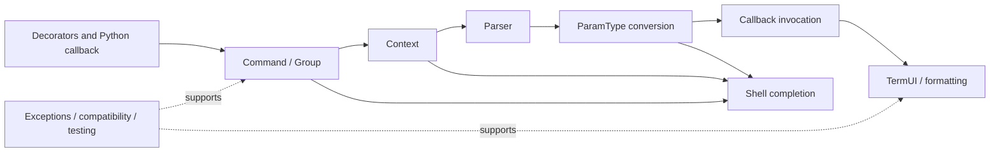

# Click 模块叙事与报告规划

## 总体叙事线

主线采用“声明到执行的数据流”：装饰器把 Python 回调声明成命令树和参数元数据 → `Command`/`Group`/`Context` 组织调用边界 → parser 消费 token 并按参数元数据分配值 → `ParamType` 完成转换、来源与错误语义 → 终端层将帮助、提示、输出和异常呈现给用户 → Shell completion 复用同一命令/参数元数据完成交互式发现。

完整过渡为：

`声明式命令与参数` →[元数据需要一个运行时边界承载]→ `命令树与 Context` →[Context 确定当前命令后仍需要把 argv 分配给参数]→ `Parser 与参数类型` →[参数值已转换，但用户仍需要可读反馈和交互输入]→ `终端 UI 与格式化` →[命令元数据还可以被 shell 在执行前消费]→ `Shell completion` →[可组合性需要可验证、可跨平台的支持层]→ `测试、文件工具与兼容层`。

## 模块清单

| 顺序 | 模块 | 类型 | 文件范围 | 读者带入的问题 | 为下一模块铺垫 |
|------|------|------|----------|----------------|----------------|
| 1 | 命令树与调用上下文 | 核心 | `src/click/core.py`, `src/click/decorators.py` | 声明的函数如何成为可嵌套应用？ | 当前命令和参数集合确定后，argv 如何被稳定分配？ |
| 2 | Parser 与参数类型 | 核心 | `src/click/parser.py`, `src/click/types.py` | 如何兼容 POSIX token 规则、环境变量、默认值和类型错误？ | 转换后的值如何进入统一帮助、提示和输出体验？ |
| 3 | 终端 UI 与格式化 | 核心 | `src/click/termui.py`, `src/click/_termui_impl.py`, `src/click/formatting.py`, `src/click/_textwrap.py` | CLI 的交互反馈如何跨平台且可读？ | 同一份命令元数据如何被 shell 用于补全？ |
| 4 | Shell completion | 核心 | `src/click/shell_completion.py` | 补全如何复用命令树和参数类型，而不侵入业务回调？ | 运行时边界和支持层如何被验证、扩展和隔离？ |
| 5 | 支持、异常、测试与文件工具 | 次要 | `src/click/testing.py`, `src/click/utils.py`, `src/click/exceptions.py`, `src/click/_compat.py`, `src/click/_winconsole.py`, `src/click/globals.py`, `src/click/_utils.py`, `src/click/__init__.py` | 可移植性、异常协议和测试调用如何托住核心抽象？ | 汇总工程成熟度与演进风险。 |

## 核心全景图

## 最终报告章节骨架

1. 用一个“从 `@click.command` 到用户看到输出”的场景引入问题。
2. 解释 Click 的组合性、一致性和有意限制，并与 `argparse`、`optparse`、`docopt`、类型驱动框架作路线对照。
3. 先给全景数据流，再按上表的自然过渡展开模块。
4. 每个核心模块必须写角色、业务问题、关键数据结构、Mermaid 流程、协作契约、Why/替代方案/权衡、亮点与架构级问题。
5. 结尾融合测试、跨平台与错误语义，提出“如果重新设计”的有限改进方向。

## 阶段 7/8 检查重点

- 验证 `Context`、`Parser`、`Parameter` 与终端层之间的调用方向和参数来源语义。
- 抽查 `Group.resolve_command`、参数解析循环、类型转换、回调排序、帮助格式化和补全入口的源码行号。
- 检查每个模块是否回到 Click 的整体哲学：可组合、显式约束、统一用户体验。
- 覆盖率汇总只从模块草稿末尾的表格提取，并单独写入 `drafts/08-coverage.md`。
