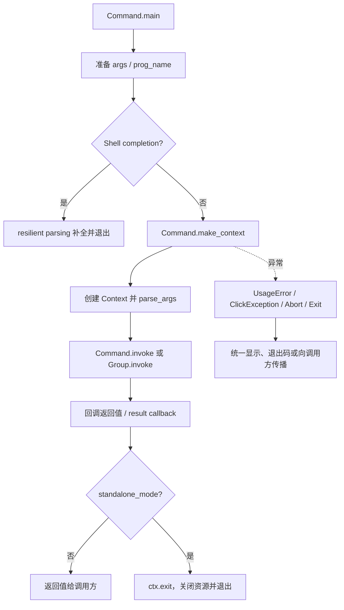
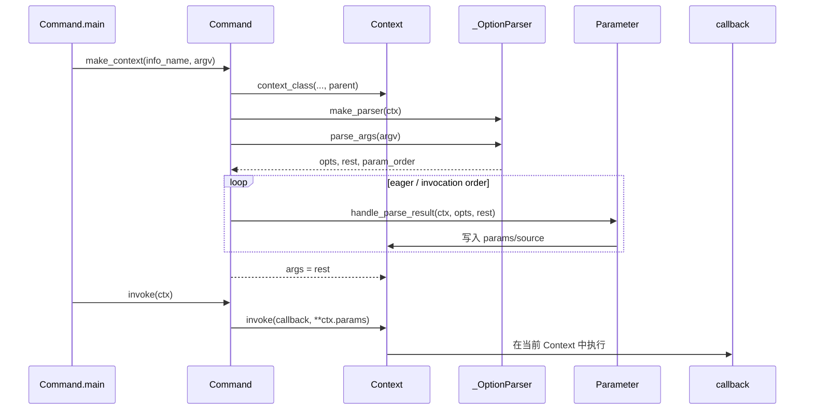

# Click 命令树与调用上下文

前文把 Click 的核心价值概括为 CLI 生命周期的一致性：同一套帮助、错误、退出和资源清理规则，能够覆盖不同规模的命令行应用。本节继续追问：一个声明式 Python 函数，究竟怎样被组织成可嵌套、可组合的应用。

## 1. 模块角色：把函数变成一次可管理的调用

这个模块解决的不是“如何识别一个 `--flag`”，而是“谁拥有这次调用、调用处在哪一层、下一层应该接收什么状态”。`Command` 是静态的命令描述与执行入口：保存名称、回调、参数和上下文策略；`Group` 是能够把剩余 token 解释成子命令并继续递归的 `Command`；`Context` 是每一层实际调用的 activation record，保存父子关系、已解析参数、未消费 token、用户对象、默认配置、参数来源和退出清理栈（`src/click/core.py:960-1078`, `src/click/core.py:1643-1700`）。

去掉这层抽象，应用代码必须自己维护至少四类状态：

1. 当前命令和父命令的路径，以及子命令的分派。
2. 哪些 token 属于父命令，哪些 token 应交给子命令。
3. 环境变量、默认映射、命令行值和 prompt 的来源与优先级。
4. 回调执行前后的资源清理、异常归属、帮助/版本提前退出。

Click 的选择是让这些状态集中进入 `Context`，再让命令树只通过少量稳定接口协作。它贯彻了“显式元数据 + 隐式但可 opt-in 的运行上下文”：命令结构在装饰阶段明确建立，回调只有使用 `pass_context`、`pass_obj` 等装饰器时才看到上下文（`src/click/decorators.py:28-130`）。

## 2. 业务问题与设计思路

### 2.1 嵌套 CLI 的边界

一个顶层命令可能先解析全局选项，再选择 `deploy`，随后 `deploy` 还要解析自己的选项和参数。父命令不能把所有参数塞进一个全局字典：同名参数会冲突，子命令的默认配置也不应污染父命令。Click 因此为每一层创建独立 `Context`，用 `parent` 连接树；子 Context 的 `params`、`args` 和参数来源是本层的，`obj`、`meta` 和若干展示/解析策略则按规则继承（`src/click/core.py:312-338`, `src/click/core.py:359-503`）。

这是一种“调用树上的局部状态 + 明确继承”的设计，而不是一个扁平的全局状态容器：

- `ctx.params` 只存本层暴露给回调的值；`expose_value=False` 的参数不进入其中（`src/click/core.py:365-367`, `src/click/core.py:2719-2805`）。
- `ctx.obj` 在子 Context 未显式提供对象时沿父链继承，适合把数据库连接、配置对象或应用状态传给深层命令（`src/click/core.py:378-383`）。
- `ctx.meta` 是所有嵌套 Context 共享的字典，专供 Click 工具或扩展保存跨层元数据；源码只要求调用方使用唯一的点分隔 key（`src/click/core.py:383`, `src/click/core.py:606-632`）。
- `default_map` 按子命令的 `info_name` 取得下一层映射，形成与命令树对齐的配置树（`src/click/core.py:385-394`）。
- 自动环境变量前缀按父前缀和子命令名扩展，并将短横线归一为下划线（`src/click/core.py:473-491`）。

### 2.2 声明式函数到命令对象

`decorators.py` 把 Python 装饰器只当作元数据收集器，而不是执行器。`@option` 和 `@argument` 先构造 `Option`/`Argument`，然后追加到函数的 `__click_params__`；`@command` 被应用时取出这些参数，逆序恢复声明顺序，推断命令名，最后创建 `Command(name, callback, params, **attrs)`（`src/click/decorators.py:314-377`, `src/click/decorators.py:217-255`）。

逆序不是偶然的实现细节：Python 多层装饰器从下向上应用，逐个 append 会得到反向列表，`reversed(decorator_params)` 恢复用户书写顺序。这样帮助页、参数注册和未被实际调用的参数排序仍可预测。`Group.command` 和 `Group.group` 再把生成的对象立即注册到父组，同时允许父组通过 `command_class`、`group_class` 注入自定义命令类（`src/click/core.py:1793-1884`）。

### 2.3 Context 是边界，不是业务对象

`Context` 同时承担三种角色，但边界仍然清楚：

1. **调用记录**：`command`、`info_name`、`parent`、`params`、`args`。
2. **策略快照**：帮助选项名、token 归一化、额外参数、交错参数、环境变量前缀、resilient parsing 等。
3. **生命周期容器**：当前上下文栈、`ExitStack` 资源、退出回调和错误上下文。

它不把命令回调的业务状态自动合并到所有层；业务状态通过 `obj` 显式传递，跨扩展元数据通过共享 `meta` 传递。`pass_context`/`pass_obj` 使用当前 Context 的入口取得这些值，`make_pass_decorator` 则沿父链寻找指定类型，必要时创建并记住对象（`src/click/decorators.py:28-97`）。这使普通回调保持干净签名，同时保留深层命令访问应用状态的能力。

从架构模式看，`Command`/`Group` 形成一个可递归的 Composite：叶子命令执行回调，Group 既是命令又拥有子命令；`Context.parent` 是沿调用树传播的 scoped context；`make_context`、`parse_args`、`invoke` 则构成可覆盖的模板方法式钩子。装饰器把函数编译成这棵对象树，运行期再由 Context 承载状态（`src/click/core.py:960-1065`, `src/click/core.py:1643-1700`, `src/click/core.py:1322-1409`）。替代方案可以是显式 Router + 独立依赖注入容器，边界更纯但需要更多装配代码；Click 选择把两者压缩到命令对象与 Context 这条稳定主路径。

## 3. 关键数据结构与接口

### 3.1 命令描述

理解命令树只需要抓住以下字段，而不是所有帮助格式字段：

```python
class Command:
    name: str | None
    callback: Callable[..., Any] | None
    params: list[Parameter]
    context_settings: MutableMapping[str, Any]
    context_class: type[Context] = Context

    def make_context(info_name, args, parent=None, **extra) -> Context: ...
    def parse_args(ctx, args) -> list[str]: ...
    def invoke(ctx) -> Any: ...
```

`make_context` 合并命令的 `context_settings`，创建指定的 `context_class`，然后在不清理的 scope 中调用 `parse_args`；它刻意不调用回调（`src/click/core.py:1322-1357`）。因此“建 Context/解析”和“执行回调”是两个可替换边界，调用方可以先建立状态再决定是否执行。

### 3.2 调用上下文

```python
class Context:
    parent: Context | None
    command: Command
    params: dict[str, Any]
    args: list[str]
    _protected_args: list[str]
    obj: Any
    default_map: MutableMapping[str, Any] | None
    invoked_subcommand: str | None
    _parameter_source: dict[str, ParameterSource]
    _exit_stack: ExitStack
```

`_protected_args` 是命令树的重要内部边界：父组解析自己的选项后，把候选子命令 token 暂存在这里，避免它被当成父命令的普通剩余参数再次传播；该属性已经标记为将被移除的兼容接口，而 `args` 将承载剩余未解析 token（`src/click/core.py:369-376`, `src/click/core.py:516-526`, `src/click/core.py:1978-1990`）。

`ParameterSource` 用可比较的 `IntEnum` 表示值的显式程度：`PROMPT < COMMANDLINE < ENVIRONMENT < DEFAULT_MAP < DEFAULT`（`src/click/core.py:169-205`）。这不是审计装饰，而是后续“同名选项竞争同一个 storage slot”时的仲裁依据（`src/click/core.py:2733-2803`）。

### 3.3 组与命令注册表

`Group.commands` 是导出名称到 `Command` 的可变映射；默认 `get_command` 从中查找，`list_commands` 排序返回名称。`get_command` 与 `list_commands` 被设计成可覆盖的两个查询钩子，分别服务实际分派、帮助、信息遍历和补全（`src/click/core.py:1696-1700`, `src/click/core.py:1931-1939`, `src/click/core.py:1950-1976`）。

`CommandCollection` 进一步把本地命令和多个源 Group 展平：本地命令优先，源组按注册顺序查找；源组的参数和回调不会自动参与被导出命令的执行（`src/click/core.py:2113-2168`）。这不是普通的继承，而是一个“查询代理/组合视图”。

## 4. 核心执行流程

### 4.1 顶层生命周期



`main` 负责把“库调用”和“命令行进程”两种语义接起来：默认从 `sys.argv[1:]` 取参数，先处理补全请求，再以根 Context 为 scope 调用命令；非 standalone 模式返回回调值，standalone 模式显式 `ctx.exit()`，避免把任意业务返回值误当退出码（`src/click/core.py:1478-1556`）。`ClickException`、`Abort`、`Exit` 和键盘中断在这里被转换为统一的输出与退出行为，非 standalone 模式则保留异常/退出码给宿主处理（`src/click/core.py:1557-1589`）。

Context 的 `__enter__` 将自己压入当前上下文栈，最外层退出时才运行 `ExitStack`；嵌套进入只增加深度。`with_resource` 和 `call_on_close` 因此把资源清理绑定在调用生命周期上，而不是依赖回调作者在每条异常路径手写 finally（`src/click/core.py:549-605`, `src/click/core.py:648-712`）。当前上下文栈的 push/pop/get 实现属于其他文件，具体线程隔离契约【待主 agent 验证】；本文件已经明确了它们在 Context 进入/退出和 decorators 中的调用位置。

### 4.2 普通命令：解析先于执行



`make_parser` 仅把每个参数注册给 parser；`parse_args` 再依据 parser 返回的参数出现顺序与参数声明，调用 `iter_params_for_processing`。排序规则先处理 eager 参数，再尊重命令行出现顺序，最后保留声明顺序作为未出现参数的稳定顺序（`src/click/core.py:1220-1225`, `src/click/core.py:1359-1393`, `src/click/core.py:142-166`）。parser 的返回三元组和参数注册 API 是与 `src/click/parser.py` 的契约，本文未读取该文件，具体实现【待主 agent 验证】。

`Command.invoke` 不自己拼装回调签名，而是把 `ctx.params` 交给 `Context.invoke`；后者会处理直接回调或另一个 Command 两种情况，并在执行前建立子 Context、填充缺失默认值、记录 kwargs（`src/click/core.py:857-911`, `src/click/core.py:1395-1409`）。这让装饰器包装的回调、命令间 `forward` 和普通 Python 直接调用共享同一套调用入口。

### 4.3 Group：父回调、子 Context 与结果处理

```mermaid
flowchart TD
    A[Group.parse_args] --> B[父参数解析]
    B --> C{chain?}
    C -- 否 --> D[protected_args=一个命令名, args=其余 token]
    C -- 是 --> E[protected_args=全部剩余 token]
    D --> F[resolve_command]
    F --> G[设置 invoked_subcommand]
    G --> H[调用 Group 回调]
    H --> I[子命令 make_context(parent=ctx)]
    I --> J[子命令 callback]
    J --> K[result_callback]
    E --> L[设置 invoked_subcommand='*']
    L --> M[调用 Group 回调]
    M --> N[逐个 resolve 命令并先创建所有子 Context]
    N --> O[按命令顺序执行子回调]
    O --> P[结果列表交给 result_callback]
```

普通 Group 在自己的参数解析完成后，把第一个剩余 token 作为候选子命令；`resolve_command` 先查找命令，必要时用 `token_normalize_func` 重试，找不到时若 token 像 option 会重新解析当前 Context，以便 `group --help` 仍得到帮助，然后抛出带候选集合的 `NoSuchCommand`（`src/click/core.py:1978-1990`, `src/click/core.py:2060-2084`）。

普通模式的顺序是：进入父 Context，解析子命令；设置 `ctx.invoked_subcommand`；执行 Group 回调；创建子 Context；执行子回调；最后执行 Group 的 result callback（`src/click/core.py:2013-2026`）。这让父回调可以准备 `ctx.obj`、打开资源或检查全局选项，同时 result callback 仍能看到子命令返回值。

chain 模式则先调用父回调，再逐步解析所有子命令并创建 Context，之后才顺序执行各子回调，最终把结果列表交给 result callback（`src/click/core.py:2028-2058`）。创建与执行分离使整个命令链先完成结构识别；代价是惰性副作用和错误时机更难直觉理解：后面的命令可能已经创建 Context，但前面的回调才开始执行。chain 模式禁止嵌套 Group，并且要求 Group 自身不能有可选 Argument；注册和从 CommandCollection 取出命令时都会防守这一限制（`src/click/core.py:82-99`, `src/click/core.py:1750-1755`, `src/click/core.py:2145-2158`）。

没有子命令时，`invoke_without_command=True` 允许只执行 Group 回调；普通模式把该回调值传给 result callback，chain 模式传空列表。否则 Group 直接生成“Missing command”错误（`src/click/core.py:1998-2006`）。`result_callback` 默认把多个装饰注册的处理器串成管道，也可用 `replace=True` 替换（`src/click/core.py:1886-1929`）。

## 5. 父子状态、参数来源与回调排序

### 5.1 参数来源是一条显式优先级链

父子 Context 只确定“在哪个命令层处理”，参数本身再在该层按以下顺序消费：parser 的命令行值、环境变量、`default_map`、参数声明的默认值；没有值时保留内部 `UNSET`，到解析末尾才转为用户可见的 `None`（`src/click/core.py:2470-2516`, `src/click/core.py:1369-1381`）。prompt 是 Option 在消费阶段插入的来源，因此完整来源集合仍可被 `ctx.get_parameter_source` 查询（`src/click/core.py:169-205`, `src/click/core.py:3507-3567`, `src/click/core.py:932-957`）。

类型转换和参数回调在来源记录之后执行；回调收到 `(ctx, param, value)`，并可能替换值。resilient parsing 下，转换失败会回退为 `UNSET`，以避免补全/帮助路径被无关的默认值或交互阻断（`src/click/core.py:2592-2656`, `src/click/core.py:2719-2775`）。参数类型的 callable、组合类型和环境变量拆分由 `src/click/types.py` 提供，本文未读取其实现，调用签名与异常契约【待主 agent 验证】。

同一 `name` 的多个参数可以竞争同一个 `ctx.params` slot，例如互斥 feature switch。`handle_parse_result` 保存已有 source、比较显式程度和“默认是否由用户显式设置”，获胜者写入值，落败者恢复原 source（`src/click/core.py:2733-2803`）。这比“最后一次赋值覆盖”复杂，但避免了声明顺序偶然决定最终配置。

### 5.2 为什么回调顺序不是简单的声明顺序

parser 返回参数实际出现顺序，`iter_params_for_processing` 将 eager 参数整体提前，然后按 invocation order 排序，未出现在命令行的参数保持 declaration order（`src/click/core.py:142-166`, `src/click/core.py:1359-1367`）。这满足三个现实需求：

- `--help`、`--version` 这类提前退出选项必须先于普通业务回调；内建 help option 被缓存，否则每次重建对象会破坏基于对象身份的排序（`src/click/core.py:1186-1218`）。
- 参数回调可以依赖用户在 argv 中先写入的另一个参数，而不被 Python 函数声明顺序强行改写。
- 未提供的参数仍需要稳定、可预测的默认/回调处理顺序。

这是把“解析 token 的顺序”和“声明 API 的顺序”分成两个概念。若只按声明顺序，声明位置会意外改变回调副作用；若只按出现顺序，默认值没有自然的顺序。Click 以 eager 优先、出现顺序优先、声明顺序兜底三层排序折中。

### 5.3 Context 的资源与错误边界

`Context.invoke` 在调用另一个 Command 时创建子 Context，补齐缺失参数默认值并把 kwargs 记录到子 Context；直接调用普通 callback 时复用当前 Context。两种路径都包在 usage error 增强和 Context scope 中（`src/click/core.py:857-911`）。`forward` 只允许转发到另一个 Command，并把当前 Context 参数补入 kwargs（`src/click/core.py:913-930`）。

这解释了为什么资源清理不是“回调返回后立即结束”：Group 在普通模式中用 `with ctx` 包住父回调、子 Context 和 result processor，确保 result callback 仍能使用父级资源；最外层退出时才真正 unwind `ExitStack`（`src/click/core.py:2017-2026`, `src/click/core.py:696-712`）。

## 6. 关键设计决策与权衡

### 决策一：用父链 Context，而不是扁平全局 Namespace

**Why。** 嵌套命令需要局部参数、继承配置、共享应用对象和层级错误路径同时存在。`parent`、本层 `params`、继承的 `obj/default_map` 与共享 `meta` 正好把这四种关系分开（`src/click/core.py:312-394`, `src/click/core.py:606-632`）。

**反事实。** 如果所有参数写入一个全局字典，同名参数会覆盖；如果每个回调都显式接收一串父级参数，命令深度越大签名越不稳定，插件也无法只依赖稳定的 Context API。手写 `argparse` 的 subparsers 能构造多个 Namespace，但资源清理、当前调用栈和跨层对象查找仍需应用代码补齐【待主 agent 验证】。

**权衡与业界对比。** Click 选择了类似动态作用域/依赖注入的 ambient context，换来装饰器 API 和低样板调用，代价是 `get_current_context()` 和共享 `meta` 带来隐式依赖，单测需要显式建立 Context。比完全显式的依赖注入更易写，比全局变量更有层级边界，但仍不是纯函数式接口。

### 决策二：父回调先运行，子回调后运行，结果处理最后运行

**Why。** Group 回调是建立应用级状态的自然位置：它可以根据父选项设置 `ctx.obj`，并用 `with_resource` 管理资源；子命令消费这些状态；result callback 则获得统一的后处理位置（`src/click/core.py:1992-2026`, `src/click/core.py:648-687`）。

**反事实。** 子回调先执行会迫使每个命令自己初始化连接、配置和日志；没有 result callback，chain 模式只能让业务代码手动收集多个结果。中间件框架通常把外层 middleware 包住内层处理器，Click 的 Group/子命令/结果处理实际上采用了相近的进入-执行-收束层次，但它把顺序固定在命令树语义上。

**真实代价。** chain 模式会先创建所有子 Context，再执行回调，错误可能在“解析阶段”而不是对应子回调阶段暴露；这换取了可预测的结果列表和统一的父级初始化。需要逐命令即时加载/执行的插件系统必须自行设计更窄的执行边界。

### 决策三：把参数来源和 eager 处理提升为一等状态

**Why。** CLI 的“用户显式传入”和“恰好与默认值相同”业务含义不同。`ParameterSource`、source 仲裁、eager 参数和 `resilient_parsing` 让帮助、版本、补全、环境变量和 feature switch 共享一条生命周期（`src/click/core.py:169-205`, `src/click/core.py:2733-2803`）。

**反事实。** 只保留最终值会丢掉审计信息；只按参数声明顺序执行会让 `--help` 触发业务回调，或让回调依赖声明位置。许多轻量 CLI 封装只把默认值合并进 Namespace，简单但无法可靠地区分来源；Click 牺牲了一些内部复杂度换取一致的扩展契约。

## 7. 扩展点、亮点与真实架构问题

### 扩展点与亮点

- `Command.context_class`、`Group.command_class/group_class` 允许在不改装饰器语法的前提下注入定制 Context/命令类型（`src/click/core.py:1008-1011`, `src/click/core.py:1676-1693`）。
- `get_command`、`list_commands` 是命令树的查询接口。子类可以按需发现命令，`CommandCollection` 则提供多个 Group 的扁平组合（`src/click/core.py:1931-1939`, `src/click/core.py:2141-2168`）。
- `to_info_dict` 沿命令树收集可供文档/工具消费的元数据；它体现了“命令描述是数据”的方向（`src/click/core.py:528-547`, `src/click/core.py:1757-1773`）。
- `pass_meta_key`、类型对象查找和 `ctx.find_object` 让扩展可以共享基础设施状态，却不必把所有状态塞进业务回调签名（`src/click/decorators.py:51-130`, `src/click/core.py:740-759`）。

### 惰性加载与一致性的冲突

本文件没有内建一个显式 LazyCommand 类，但 `get_command(ctx, name)` 和 `list_commands(ctx)` 都是可覆盖的虚方法，实际解析只在 `resolve_command` 需要时调用 `get_command`（`src/click/core.py:1931-1939`, `src/click/core.py:2060-2084`）。因此子类可以把命令加载推迟到真正选择命令的时刻，这是插件/大型 CLI 的关键扩展空间。

代价也清晰：帮助和补全会遍历 `list_commands` 后再逐个 `get_command`；`to_info_dict` 还会递归所有可见命令。一个实现若在 `list_commands` 中导入全部插件，就失去惰性；若只返回静态名称但 `get_command` 可能失败，帮助、补全和实际调用会看到不同的命令树。Click 提供了查询钩子，却没有在这两个文件中规定“发现、加载、缓存、失败时机”的一致协议，这正是可扩展性向一致性收取的成本【待主 agent 验证：插件加载方言需结合具体扩展实现】。

### 真实架构问题

1. `Context.meta` 是所有层共享的可变字典，命名只靠约定；一个扩展可以无意覆盖另一个扩展的 key，隐式依赖也不易从回调签名看出（`src/click/core.py:606-632`）。这是生态扩展点的实用性与可观测性的直接冲突。
2. 参数回调处理 `UNSET` 时会临时修改 `ctx.params`，再尝试恢复未改变的槽位；这是为兼容旧回调语义付出的状态复杂度。回调若修改其他参数，恢复逻辑也会保留这种修改（`src/click/core.py:2619-2655`）。
3. `Group.add_command` 直接写入映射，同名注册会覆盖旧命令；这让动态组装简单，却把命令冲突从注册期推迟为静默行为（`src/click/core.py:1775-1783`）。对插件生态而言，最好由上层明确冲突策略。
4. `CommandCollection` 展平源组时不会执行源组回调或合并源组参数。它适合“多个命令目录的视图”，不适合“多个完整应用的组合”；误把两者当成同一抽象会造成配置和资源未初始化（`src/click/core.py:2113-2127`）。
5. `_protected_args` 已进入弃用迁移期，说明嵌套解析的 token 边界曾经依赖一个额外缓冲区。未来统一到 `args` 会简化概念，但也要求自定义 Group/解析器重新检查剩余参数的所有权（`src/click/core.py:279-281`, `src/click/core.py:516-526`）。

## 8. 与其他模块的契约

以下是本文件能确认的调用面；实现细节因超出本次读取范围，统一标记为待验证：

| 契约 | 本模块的使用方式 | 状态 |
|---|---|---|
| parser | `make_parser` 注册参数；`parse_args` 消费 `opts, args, param_order`，并读取 `_opt_prefixes` | 【待主 agent 验证】|
| types | `Parameter` 调用类型转换、组合类型 arity、环境变量拆分和 metavar | 【待主 agent 验证】|
| globals | Context 进入/退出时 push/pop；decorators 通过 current context 注入状态 | 【待主 agent 验证】|
| exceptions | `UsageError`/`ClickException`/`Abort`/`Exit` 携带或触发统一错误、退出语义 | 【待主 agent 验证】|
| formatting | `Context.make_formatter`、`command_path` 和 Command 的 help/usage 方法协作 | 【待主 agent 验证】|
| shell completion | 通过 resilient parsing 和命令/参数查询复用同一命令树 | 【待主 agent 验证】|

## 9. 小结与下一节

Click 用 `Command` 固化结构，用 `Group` 递归分派，用 `Context` 保存每层调用的局部状态、继承关系和生命周期；它以这些边界换取了嵌套 CLI 的一致帮助、错误、资源清理和回调顺序。命令和 Context 已经划定“谁处理哪一层”的边界，下一步就要看 parser 与类型系统如何分配、转换并归还 `argv`。

## 覆盖率明细

| 文件名 | 总行数 | 已读行数 | 覆盖率% | 未读原因 |
|---|---:|---:|---:|---|
| `src/click/core.py` | 3723 | 3723 | 100% | 无；实际读取范围 `1-3723` |
| `src/click/decorators.py` | 627 | 627 | 100% | 无；实际读取范围 `1-627` |
| 合计 | 4350 | 4350 | 100% | 实际读取范围完整；达标✅ |
