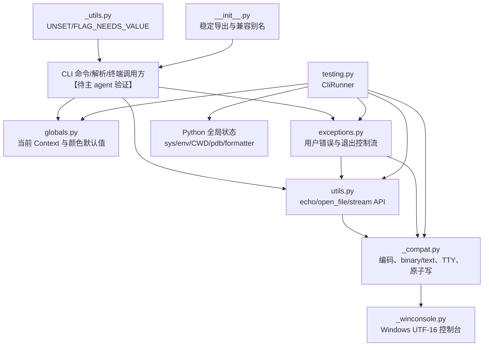
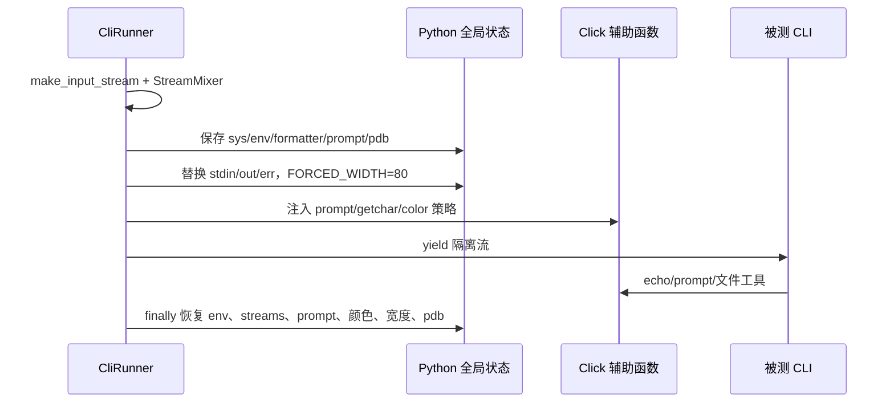

# Click 支持、异常、测试与文件工具模块分析

## 1. 分析边界与总判断

本稿只分析指定的八个文件，源码依据固定为用户给出的 Click HEAD。这个支持层的共同目标不是增加新的 CLI 业务语义，而是把「进程全局状态、操作系统流、编码、文件生命周期和用户可见错误」压缩成调用方可预测的小 API。其工程价值在于：上层命令、解析、终端和补全逻辑可以依赖稳定的文本流、上下文和错误契约，而不必各自重做平台探测。

总体上，Click 选择的是“边界适配 + 可恢复清理”的路线：`utils` 面向调用方提供文件/输出 API，`_compat` 负责把不可靠的 Python stream 变成可用的 binary/text stream，`exceptions` 负责把失败转成用户语言，`testing` 在测试期间临时接管这些边界。代价是支持层拥有大量隐式状态和平台分支，尤其 `CliRunner` 明确只能在单线程、无并发环境使用（`src/click/testing.py:317-337`）。

## 2. 支持层总体结构

图中的直接依赖以指定文件的 import 和函数调用为依据，例如 `testing.py` 直接接入 `_compat`、`utils` 和终端/格式化内部对象（`src/click/testing.py:14-18`），而异常层直接使用 `_compat.get_text_stderr`、`utils.echo` 和 `globals.resolve_color_default`（`src/click/exceptions.py:8-11`）。命令、解析、终端等上层模块的具体调用链不在本轮读取范围内，图中这部分统一标记【待主 agent 验证】。

## 3. `testing.py`：把 CLI 运行变成可观测的单线程实验

### 职责与整体角色

- **职责**：提供 `CliRunner`、`Result` 和隔离文件系统，把一次命令调用包装成可重复断言的输入、输出、退出码、返回值和异常记录。
- **整体角色**：它是支持层的“运行时替身”，在不启动子进程的前提下模拟 CLI 入口；因此测试速度快，但必须接管解释器全局状态。`CliRunner` 的文档直接声明其只适用于单线程、无并发系统（`src/click/testing.py:317-337`）。
- **实现方式**：用内存 `BytesIO` 和 `_NamedTextIOWrapper` 替换 `sys.stdin/out/err`，用临时环境映射修改 `os.environ`，用上下文管理器在退出时恢复；`capture="fd"` 时再用 `os.dup/dup2` 捕获文件描述符（`src/click/testing.py:398-594`、`653-727`）。
- **特别之处**：`sys` 和 `fd` 是两个不同隔离层级。默认 `sys` 只捕获 Python 层写入，保护宿主的真实 fd；`fd` 能捕获旧 stream 引用、C 扩展和子进程输出，但 Windows 禁用（`src/click/testing.py:331-345`、`368-375`）。
- **文件列表**：`src/click/testing.py`；直接依赖 `src/click/_compat.py`、`src/click/utils.py`，并临时改写终端提示与格式化模块对象（`src/click/testing.py:14-18`、`513-523`）。

### 核心对象与输出契约

`Result` 同时保存 `stdout_bytes`、`stderr_bytes`、按写入顺序混合的 `output_bytes`、命令返回值、退出码、异常和 traceback 信息（`src/click/testing.py:231-280`）。这不是简单的“stdout 字符串”：`output` 代表终端用户看到的合流顺序，而 `stdout`/`stderr` 保留独立断言面；三个属性都在读取时按 runner charset 解码、替换 CRLF，并用 `replace` 避免断言阶段因坏字节再抛异常（`src/click/testing.py:282-310`）。

`StreamMixer` 用两个 `BytesIOCopy` 让 stdout/stderr 各自写入，同时复制到共享 `output`（`src/click/testing.py:117-153`）。这把“独立流”和“终端时序”同时保留下来，避免旧式单一 `mix_stderr` 开关只能二选一。输入侧的 `EchoingStdin` 在读取时把字节复制到 stdout；交互式 prompt 通过 `_pause_echo` 暂停重复回显，避免同一输入被回显两次（`src/click/testing.py:32-78`）。

### `isolation()` 生命周期

`isolation` 先把输入转成二进制流，再保存标准流和 `formatting.FORCED_WIDTH`，固定格式宽度为 80（`src/click/testing.py:432-440`）。随后创建有名字和 mode 的文本 wrapper；其 `close()` 不关闭底层 buffer，`fileno()` 在 fd 模式可以指向原始 fd，否则保持不可用（`src/click/testing.py:156-200`）。这两个细节分别防止测试清理误伤共享 buffer，并明确区分“Python 层替换”与“真实 fd 重定向”。

提示函数不是通过输入输出参数传递，而是临时替换 `termui.visible_prompt_func`、`hidden_prompt_func`、`_getchar`，并替换 `utils.should_strip_ansi` 与 `_compat.should_strip_ansi`（`src/click/testing.py:474-523`）。`color` 只改变默认 strip 策略，调用方显式传色值仍优先（`src/click/testing.py:504-511`）。此外，`pdb.Pdb.__init__` 被临时包装，默认将调试器接到 `sys.__stdin__`/`sys.__stdout__`，让断点仍能交互；显式传入的流不覆盖，非 `pdb.Pdb` 子类调试器不在保证范围内（`src/click/testing.py:525-562`）。

环境变量采用增量覆盖而非复制整个环境：只记录被覆盖键的旧值，`None` 表示删除，finally 中逐键恢复（`src/click/testing.py:441`、`564-594`）。这保持宿主环境的大部分内容不变，但也意味着被测代码在隔离期间看到的仍是同一个进程级 `os.environ`。

### `invoke()` 的异常与捕获流程

调用前若启用 fd 捕获，先捕获 fd 1/2，再进入会替换 `sys.stdout/err` 的 `isolation`；否则 C 层写入可能绕过 Python wrapper（`src/click/testing.py:649-666`）。命令参数字符串用 `shlex.split` 解析，默认程序名来自命令名或 `root`（`src/click/testing.py:678-687`）。执行结果分四路：

1. 正常返回：保存 `return_value`，`exit_code=0`。
2. `SystemExit(0)`：视为正常退出；非零码保留异常并成为退出码。
3. 非整数 `SystemExit.code`：先写入 stdout，再归一化为退出码 1。
4. 其他 `Exception`：按 `catch_exceptions` 决定记录为 `Result` 还是重新抛出（`src/click/testing.py:681-710`）。

finally 先 flush Python stream，再停止 fd 捕获，将 fd 字节补写到独立 stdout/stderr；由于 `BytesIOCopy`，这些补写也会进入合流输出，最后在退出 isolation 前读取三份 bytes（`src/click/testing.py:711-739`）。这保证了测试断言看到的是一次调用的封装结果，但它不是进程级沙箱：线程、后台任务、缓存的 stream 引用和其他解释器单例仍可能观察到临时状态【待主 agent 验证】。

### 文件系统隔离

`isolated_filesystem` 保存当前 CWD，创建临时目录并 `chdir`；退出时恢复 CWD，默认删除目录，传入 `temp_dir` 时保留目录（`src/click/testing.py:741-772`）。它解决的是相对路径污染，不等价于权限、HOME、环境变量或真实文件系统隔离；被测代码若保存绝对路径、启动子进程或在恢复前并发访问，仍可能越过边界【待主 agent 验证】。

### 设计评价与风险

`testing.py` 的亮点是把“用户看见什么”和“每个通道实际写了什么”同时建模，并把 fd 捕获作为显式能力而非默认破坏宿主 fd。真实风险也很集中：它通过 monkey patch 和 `os.environ`/CWD/sys stream 重绑定改变解释器状态，文档已经承认并发不安全；异常、信号、线程和第三方库缓存旧 stream 的行为不能仅靠 `Result` 还原【待主 agent 验证】。因此它适合单线程单调用的 CLI 单元/集成测试，不应被误解为跨进程端到端测试框架。

## 4. `exceptions.py`：统一用户错误与控制流

- **职责**：定义可展示的 `ClickException`/`UsageError` 家族、文件错误、Abort 和 Exit，并把参数/命令/选项失败格式化为稳定的用户消息。
- **整体角色**：它是解析、参数类型、文件工具与 CLI 入口之间的错误协议；上层如何捕获并决定显示/退出的具体路径超出本轮范围，标记【待主 agent 验证】。
- **实现方式**：基类缓存消息和颜色默认值；`UsageError` 持有 Context，子类提供参数提示、缺失值、相似选项/命令等格式化；`Abort`/`Exit` 使用运行时异常承载控制流（`src/click/exceptions.py:35-65`、`68-111`、`362-378`）。
- **特别之处**：异常构造时立即缓存 `resolve_color_default()` 的结果，因为真正显示时 Context 可能已经被移除（`src/click/exceptions.py:44-49`）。`UsageError.show` 可以输出 usage、最长 help option 和错误文本；这使错误展示集中化，而不是让每个参数解析点拼接终端文案（`src/click/exceptions.py:87-111`）。
- **文件列表**：`src/click/exceptions.py`；直接协作 `src/click/globals.py`、`src/click/utils.py`、`src/click/_compat.py`（`src/click/exceptions.py:8-11`）。

`BadParameter` 用参数对象提供 error hint，也允许调用方直接给 `param_hint`；`MissingParameter` 进一步调用参数类型的 missing message，并区分 argument/option/parameter（`src/click/exceptions.py:114-155`、`159-227`）。`NoSuchOption` 和 `NoSuchCommand` 在构造时用 `difflib.get_close_matches` 保存候选，再按数量生成 “Did you mean” 提示（`src/click/exceptions.py:232-301`）。这体现了“内部结构化、边界统一呈现”：错误携带 Context/Parameter 结构，最终输出仍是稳定的人类语言。

`FileError` 只承载原始文件名和安全的 UI 文件名，避免不可编码的路径在输出阶段再次失败（`src/click/exceptions.py:342-359`）。`Abort` 是无消息的内部中止信号，`Exit` 则用 `__slots__` 只保存整数 `exit_code`（`src/click/exceptions.py:362-378`）。两者与 `ClickException` 分离很重要：用户错误需要格式化显示，控制流只需要被入口识别；具体入口捕获顺序属于核心模块，标记【待主 agent 验证】。

## 5. `utils.py`：文件、输出与启动环境的稳定外壳

- **职责**：提供 `echo`、标准流获取、文件打开、懒加载/原子写包装、路径显示、应用配置目录、程序名和 Windows 参数展开等通用 API。
- **整体角色**：把“文件名 `-`、二进制/文本、编码、ANSI、BrokenPipe、平台目录”这些调用方不应重复处理的边界集中起来；上层参数类型如何调用 `open_file` 不在范围内，标记【待主 agent 验证】。
- **实现方式**：`utils` 只做策略编排，具体流探测和打开委托给 `_compat`；`LazyFile` 延迟真正打开，`KeepOpenFile` 保护借用的标准流，`echo` 统一转换、写入、去色和 flush（`src/click/utils.py:112-242`、`245-339`）。
- **特别之处**：`echo` 支持 str/bytes/bytearray，优先写 binary buffer，并根据 TTY/Context/color 决定去 ANSI；它始终 flush（`src/click/utils.py:245-339`）。`open_file("-")` 返回不关闭标准流的 wrapper；`atomic=True` 通过同目录临时文件加 `os.replace` 提供替换式写入（`src/click/utils.py:375-421`、`src/click/_compat.py:374-486`）。
- **文件列表**：`src/click/utils.py`；依赖 `src/click/_compat.py` 和 `src/click/globals.py`（`src/click/utils.py:13-22`）。

`LazyFile` 对读模式先开关一次以提前暴露访问错误，对写模式延迟到第一次访问；实际失败转换成 `FileError`，让文件系统异常进入统一异常层（`src/click/utils.py:127-175`）。这在 CLI 中比构造参数时立即打开更灵活，但也把失败时间推迟到了执行期，调用方若只验证参数而不访问文件，错误不会提前出现。

`format_filename` 用 filesystem encoding 或 UTF-8/surrogateescape 处理不可显示路径，最终用 replacement 字符保证 UI 输出可编码（`src/click/utils.py:424-463`）。`get_app_dir` 将 Windows 的 APPDATA/LOCALAPPDATA、macOS Application Support、Unix XDG_CONFIG_HOME 和 POSIX 隐藏目录统一成一个选择函数（`src/click/utils.py:466-512`）。`PacifyFlushWrapper` 只吞掉 EPIPE，其他 OSError 继续抛出，避免管道关闭时解释器清理噪音扩散（`src/click/utils.py:515-539`）。

`_detect_program_name` 从 `__package__`、`sys.argv[0]` 和 Windows `.exe` 情况推断帮助文本中的程序名；`_expand_args` 在 Windows 上模拟 home、环境变量和 glob 展开，并将非法 glob 当作空匹配而保留原参数（`src/click/utils.py:542-646`）。这是“兼容常见调用方式”而非完整 shell 复刻，文档明确承认与 Unix shell 不完全一致；因此复杂 shell 语义仍是跨平台演进风险。

## 6. `_compat.py` 与 `_winconsole.py`：把平台差异压到流接口后面

### `_compat.py`

- **职责**：探测平台、修复不完整的 stream 接口、寻找 binary reader/writer、构造可用的 text stream、处理 `-` 标准流、原子写、ANSI/TTY 和默认 stream 缓存。
- **整体角色**：这是所有文件/终端工具共享的“窄腰层”；上层只请求 text/binary stream，不必知道 `sys.stdout.buffer` 是否存在或编码是否为 ASCII。
- **实现方式**：`_FixupStream` 补齐 `read1/readable/writable/seekable`，`_force_correct_text_stream` 先判断兼容性，必要时从 `.buffer` 重建 wrapper；`WeakKeyDictionary` 按原始 stream 缓存包装结果（`src/click/_compat.py:85-151`、`230-284`、`547-577`）。
- **特别之处**：ASCII 或缺失编码不直接失败，而是倾向 UTF-8/replace；找不到 binary stream 时，`echo` 走文本路径，获取标准 binary stream 的显式 API 则抛 RuntimeError（`src/click/_compat.py:43-56`、`176-209`、`319-358`）。`open_stream` 对 `-` 返回 borrowed stream，并以布尔值告知调用方不得关闭；原子写在目标目录创建随机临时文件，最后替换目标（`src/click/_compat.py:374-452`）。
- **文件列表**：`src/click/_compat.py`；Windows 分支直接加载 `src/click/_winconsole.py`（`src/click/_compat.py:516-533`）。

这里的核心取舍是“尽量可用而非尽早失败”：坏 stream 会被修复，无法取得 binary reader 时可接受 mojibake，默认错误模式也会改成 replace（`src/click/_compat.py:250-284`）。这使 Click 能在 unittest/Jupyter 等非标准 stream 环境工作，但会把编码错误从显式异常变成静默替换，诊断信息可能丢失。

原子写的意图是崩溃时不暴露半成品；不过当前 `_AtomicFile.close(delete=False)` 的 `delete` 参数没有参与分支，`__exit__` 即使以异常调用 `close(delete=True)`，仍然执行 `os.replace`（`src/click/_compat.py:455-486`）。阶段 7 在工作目录内创建临时目标并走异常退出 smoke，确认目标文件从旧内容变成了新内容，说明异常路径确实提交了临时内容。这是已验证的真实演进风险；修复需要明确异常时删除临时文件还是保留旧目标，并补充异常路径回归测试。

### `_winconsole.py`

- **职责**：仅在 win32 下用 ctypes 直接读写 Windows Console API，提供 UTF-16-LE 的 text wrapper，并保留 binary buffer/TTY 属性。
- **整体角色**：让 `utils.echo` 的 Unicode 输出和 prompt 在 Windows 真控制台上绕过不可靠的传统编码路径；非 Windows 通过 `_compat` 的空实现，不携带 ctypes 负担。
- **实现方式**：`_WindowsConsoleReader/Writer` 基于 `ReadConsoleW/WriteConsoleW`，以 UTF-16 code units 读写；`ConsoleStream` 将 text stream 和 byte stream 合并为一个兼容对象（`src/click/_winconsole.py:119-224`）。
- **特别之处**：读取偶数字节并把 Ctrl-Z 作为 EOF；写入单次限制在 32767 字节；PyPy 无 `pythonapi` 时禁用 buffer 访问；只有通过 `GetConsoleMode` 确认是 console，且编码/错误模式匹配时才启用（`src/click/_winconsole.py:80-116`、`128-192`、`264-297`）。
- **文件列表**：`src/click/_winconsole.py`；只由 `src/click/_compat.py:516-533` 的 Windows 分支接入。

这种实现把平台特例隔离在一个可替换的 binary adapter 中，避免修改整个解释器；文件头也明确只影响 echo/prompt 的“小世界”（`src/click/_winconsole.py:1-8`）。代价是 ctypes、句柄、PyPy buffer 和 console 检测都依赖运行时细节，平台测试矩阵不足时很容易出现只在真实 Windows 控制台暴露的问题。

## 7. `globals.py`、`_utils.py` 与 `__init__.py`：状态、哨兵和 API 表面

### `globals.py`

- **职责**：用 `threading.local` 保存当前 Context 栈，提供获取/压栈/出栈和颜色默认值解析。
- **整体角色**：为 `echo`、异常和其他辅助 API 提供不必显式传 Context 的隐式通道；这与“简单、可组合 API”一致，但也增加调用顺序依赖。
- **实现方式**：`_local.stack` 是线程局部列表；无 Context 时默认抛 RuntimeError，`silent=True` 返回 None；颜色显式参数优先，否则读取栈顶 Context（`src/click/globals.py:9-67`）。
- **特别之处**：线程局部只隔离线程，不自动隔离异步任务；本文件没有 try/finally scope 实现，正确出栈依赖调用方【待主 agent 验证】。
- **文件列表**：`src/click/globals.py`。

### `_utils.py`

- **职责**：定义 `UNSET` 与 `FLAG_NEEDS_VALUE` 两个可区分的 Enum 哨兵，并提供类型别名。
- **整体角色**：把“参数没有设置”和“参数以 flag 形式出现但需要值”从 `None` 中分离，避免解析状态被真假值混淆；具体消费逻辑在范围外，标记【待主 agent 验证】。
- **实现方式**：每个哨兵是 `Sentinel` 的成员，repr 稳定为 `Sentinel.UNSET` 等（`src/click/_utils.py:7-36`）。
- **特别之处**：用 Enum 而不是裸 object，既保留身份判断，又改善调试输出和类型标注。
- **文件列表**：`src/click/_utils.py`。

### `__init__.py`

- **职责**：集中重导出核心对象、异常、终端、类型、文件和工具 API，并以模块级 `__getattr__` 延迟提供旧名字。
- **整体角色**：它是公共 API 的稳定门面；内部文件可以拆分和移动，调用方仍从 `click` 顶层导入（`src/click/__init__.py:10-75`）。
- **实现方式**：显式别名导出当前 API；`BaseCommand`、`MultiCommand`、`OptionParser` 和 `__version__` 通过 `__getattr__` 延迟解析并发出弃用警告（`src/click/__init__.py:78-127`）。
- **特别之处**：弃用兼容是按名称懒加载的，未命中名称抛 `AttributeError`；`__version__` 从 importlib metadata 读取，避免静态版本副本（`src/click/__init__.py:103-127`）。这维持了 API 表面，但也让静态检查、工具链和运行时弃用行为存在差异。
- **文件列表**：`src/click/__init__.py`；导出目标涉及核心、终端、类型和工具模块，目标模块内部本轮不展开，统一标记【待主 agent 验证】。

## 8. 协作结论、成熟度与演进风险

支持层的成熟点在于边界职责清晰：`utils` 负责调用体验，`_compat` 负责环境适配，`exceptions` 负责用户语言，`globals` 负责 Context 查找，`testing` 负责可重复运行，`__init__` 负责兼容表面。这种分层让核心 CLI 逻辑可以保持默认行为可预测【待主 agent 验证】。

主要风险有三类：

1. **解释器全局状态**：`CliRunner` 改写 sys/env/CWD、formatter、prompt、ANSI 策略和 pdb；fd 模式还改写 1/2。finally 已覆盖主要恢复路径，但并发、后台线程、缓存引用和非标准调试器仍可能泄漏状态【待主 agent 验证】。
2. **平台分支**：Windows console、Unix shell expansion、Jupyter/unittest 非标准 stream 都有专门分支；每个分支都扩大测试矩阵，且本地 Linux 运行不能证明真实 Windows 控制台正确。
3. **兼容性维护**：顶层弃用别名、错误格式和 `Result` 字段都是用户可观察契约；原子写的异常退出行为、编码 replace 策略和隐式 Context 栈都需要回归测试，否则修复边界问题可能改变历史行为。

如果重新设计，优先会把 `CliRunner` 的进程内隔离和真实子进程测试明确成两个 API 层级，并为 CWD/env/fd 采用可组合的显式 scope；同时为 `_AtomicFile` 的异常路径补充“是否提交”的明确契约。当前设计对单线程 CLI 测试非常高效，但不应把轻量 runner 的便利误认为完整沙箱。

## 9. 覆盖率表

| 文件名 | 总行数 | 已读行数 | 覆盖率% | 未读原因 |
|---|---:|---:|---:|---|
| src/click/testing.py | 772 | 772 | 100% | 无，完整读取 |
| src/click/utils.py | 646 | 646 | 100% | 无，完整读取 |
| src/click/exceptions.py | 378 | 378 | 100% | 无，完整读取 |
| src/click/_compat.py | 590 | 590 | 100% | 无，完整读取 |
| src/click/_winconsole.py | 297 | 297 | 100% | 无，完整读取 |
| src/click/globals.py | 67 | 67 | 100% | 无，完整读取 |
| src/click/_utils.py | 36 | 36 | 100% | 无，完整读取 |
| src/click/__init__.py | 127 | 127 | 100% | 无，完整读取 |
| **合计** | **2913** | **2913** | **100%** | **达标✅** |
