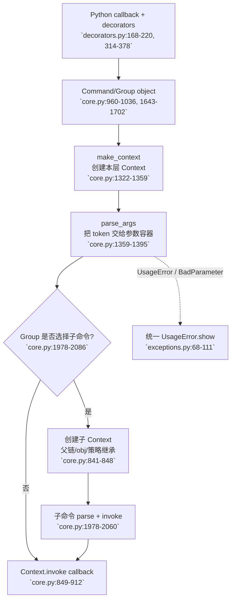

# Click `command-model` 模块分析

> 叙事衔接：前一段已经说明 Click 不把自己约束在 `argparse` / `docopt` 的单一解析器模型上，因为它要保留可嵌套、可组合的运行时语义。本模块回答“声明出来的命令如何变成一棵可执行命令树”，并把参数处理前的上下文边界固定下来。

## 1. 在项目中的角色与去掉后的后果

`command-model` 是 Click 的运行时骨架。`Command` 描述一个可执行节点，`Group` 把节点组织成命令树，`Context` 则把一次调用的父子关系、参数结果、默认配置、终端策略和资源清理绑定在一起（`src/click/core.py:208-338`）。装饰器把普通 Python 函数转换为这些对象（`src/click/decorators.py:168-220`），线程局部上下文让终端 helper 和显式 `pass_context` API 能访问当前调用（`src/click/globals.py:20-67`）。

去掉这一层，Click 仍可以把 token 解析成字典，却失去三个决定组合性的契约：谁负责选择子命令、父命令如何把状态传给子命令、不同层级如何共享一致的帮助和错误出口。结果会退化为每个命令自行解析、手工调用和手工拼接错误；新增一个子命令就可能重新实现一套边界行为。

这个模块贯彻 Click 的整体哲学：命令组合是显式的，调用上下文是稳定的，用户体验由统一的元数据和错误类型约束，而不是由每个 callback 自由发挥。

## 2. 业务问题

一个 CLI 从单个函数成长为 `tool admin user create` 时，真正困难的不是读取 `sys.argv`，而是保持每一层的责任可预测：根命令只消费自己的选项，Group 决定下一节点，子命令获得父层共享状态但不污染父层参数，帮助/错误能指向完整命令路径。

Click 将一次调用拆成两种状态：`Command` 是可复用的声明对象；`Context` 是每次调用、每个层级独有的运行实例。`Context.parent` 形成调用链，`obj` 默认从父级继承，`default_map`、终端宽度、颜色和 `show_default` 也按父级提供默认值（`src/click/core.py:340-503`）。这使“同一命令对象被重复调用”与“本次调用的可变状态”分离。

## 3. 设计思路和架构模式

### 3.1 声明对象与调用状态分离

`Command` / `Group` 更像命令树中的持久描述；`Context` 像一次解释器 activation record。Context 中 `params` 保存已暴露的参数值，`args` 保存剩余 token，`_protected_args` 用于嵌套解析的临时保护，`_parameter_source` 记录值的来源（`src/click/core.py:312-338`）。这不是把所有信息放进一个 Namespace，而是把“命令是什么”和“本次如何调用”分成两个生命周期。

### 3.2 Context 链是组合协议

子 Context 继承父 Context 的 `obj` 和部分策略，但拥有自己的 `command`、`params`、`args`、默认映射和关闭栈。`default_map` 可按子命令名向下切分，`auto_envvar_prefix` 也从父路径派生（`src/click/core.py:378-491`）。因此父命令可以发布共享对象，子命令只通过显式 Context API 或 decorator 取用；它不需要知道父命令的 Python 调用栈。

### 3.3 统一错误上下文

`augment_usage_errors` 在参数或命令边界捕获 `UsageError`，补上缺失的 Context 和 Parameter，再继续抛出（`src/click/core.py:123-140`）。异常层按 `ClickException -> UsageError -> BadParameter/MissingParameter` 分层，`UsageError.show` 负责使用当前命令路径、帮助选项和 usage 组织用户可读输出（`src/click/exceptions.py:35-111`）。callback 无需各自知道如何打印 usage；异常在统一出口获得语境。

## 4. 关键数据结构

以下是理解设计所需的最小结构，而非完整 API：

```python
class Context:
    parent: Context | None
    command: Command
    params: dict[str, Any]
    args: list[str]
    obj: Any
    default_map: MutableMapping[str, Any] | None
    invoked_subcommand: str | None
    _parameter_source: dict[str, ParameterSource]
    _exit_stack: ExitStack

class Command:
    name: str | None
    callback: Callable[..., Any] | None
    params: list[Parameter]

class ParameterSource(IntEnum):
    PROMPT, COMMANDLINE, ENVIRONMENT, DEFAULT_MAP, DEFAULT
```

`ParameterSource` 按“更显式到更隐式”排序，使调用方可以用比较判断参数是否由用户明确提供（`src/click/core.py:169-206`）。这比只保留最终值更重要：配置诊断、feature switch 和帮助展示都需要区分命令行输入、环境变量和默认值。

## 5. 核心调用流程



流程的关键不是“先 parse 再 call”这么简单，而是 Group 在自己的 Context 中完成 callback 与子命令选择的编排，子 Context 只承接下一层的剩余 token。这个边界为后续 parser/types 模块留下明确输入：Context 已经拥有参数容器和调用策略，但仍需要 parser/types 把 token 转换成可用值。

## 6. 与其他模块的依赖和数据流

### 6.1 从装饰器到对象图

`@option` / `@argument` 不立即构造命令，而是把 `Parameter` 追加到函数的 `__click_params__`；`@command` 再反向取出并逆序恢复声明顺序，按函数名推导命令名，最终实例化 `Command`（`src/click/decorators.py:217-250`、`314-377`）。`@group` 只是选择 `Group` 作为命令类；`Group.command` / `Group.group` 还会在创建后立即 `add_command`（`src/click/core.py:1793-1832`、`1842-1884`）。

这种两阶段转换让 Python 装饰器的书写顺序不必等同于最终参数对象的处理顺序，同时允许传入自定义 `cls`。代价是 callback 在装饰完成前带有隐藏元数据，调用方若绕过 `@command` 直接调用普通函数，看不到 Click 参数对象；这是“声明 API”与“运行对象”分界处的可接受复杂度。

### 6.2 Context、全局栈与 callback

`Context.__enter__` 把当前 Context 推入线程局部栈，`__exit__` 在最外层退出时关闭 `ExitStack`，随后弹栈（`src/click/core.py:549-566`；`src/click/globals.py:20-51`）。`pass_context` 通过全局栈注入当前 Context，`pass_obj` 注入 `ctx.obj`；`make_pass_decorator` 则从父链寻找最近匹配类型，必要时用 `ensure_object` 创建（`src/click/decorators.py:28-97`）。

这里有两个互补的访问面：显式参数注入便于读者理解 callback 依赖；线程局部栈便于深层 helper、异常对象和终端工具在不污染每个函数签名的情况下获得调用策略。跨模块调用约束为【待主 agent 验证】：`utils` / `termui` 通过 `get_current_context` 读取颜色、输出流或资源策略，当前模块只提供这个上下文契约。

### 6.3 Group dispatch 与 lazy boundary

`Group.commands` 是导出名到 `Command` 的映射；`get_command` 与 `list_commands` 是懒加载的最小接口（`src/click/core.py:1696-1723`、`1931-1939`）。Group 默认只保存注册表，不要求所有实现类在根命令构造时被导入，因此自定义 Group 可以覆盖这两个方法，在需要时从 entry point、配置或模块路径加载命令【待主 agent 验证】。

非 chain 模式的顺序是：解析 Group 自身参数 → 将第一个剩余 token 标记为 `invoked_subcommand` → 执行 Group callback → 创建子 Context → 执行子 callback → 运行 result callback（`src/click/core.py:1992-2026`）。chain 模式则把剩余 token 拆成多个命令上下文，父 callback 先执行，子 callback 按序执行，返回值组成列表后再交给 result callback（`src/click/core.py:2028-2058`）。

`CommandCollection` 把多个 Group 的命令视图展平：本地命令优先，然后按 source 顺序查找，并合并列表（`src/click/core.py:2113-2168`）。它复用 Group 的 dispatch 契约，但不运行 source Group 的 callback；这适合把多个命令域组合成一个入口，也说明 Click 将“命令发现”作为可替换边界，而非强制一棵静态树。

### 6.4 参数值进入 callback 的顺序

`Command.make_context` 将 `context_settings` 合并到 Context，调用 `parse_args` 后返回已建立的上下文；它本身不调用 callback（`src/click/core.py:1322-1357`）。`parse_args` 让 parser 得到 `opts`、剩余 args 和 `param_order`，再按“eager 优先、其次按实际调用顺序”的规则调用每个参数的 `handle_parse_result`（`src/click/core.py:142-166`、`1359-1393`）。

参数的来源仲裁顺序是 command line → envvar → `default_map` → parameter default；`consume_value` 同时返回来源枚举（`src/click/core.py:2470-2516`）。随后 `process_value` 进行类型转换、required 检查和参数 callback；callback 收到 `(ctx, param, value)`，包括 prompt 产生的值（`src/click/core.py:2592-2656`）。这将“来源判断”“转换”“业务校验”分成可观察阶段，避免 callback 自己重新猜测一个值来自哪里。

## 7. 关键设计决策及权衡

### 决策一：每层独立 Context，而不是全树共享一个 Namespace

这样做把参数边界和资源生命周期绑定到命令层级：子命令可以通过 `parent` 找到共享对象，却不会把自己的参数直接写进父命令。若使用一个全局 Namespace，嵌套命令的同名参数、默认值和帮助路径会相互覆盖；代价是 Context 链、进入/退出和 `obj` 查找需要学习，但换来可组合性和可测试的生命周期。

### 决策二：Group 负责 dispatch 与 callback 顺序，而不是只做 subparser 容器

`Group.invoke` 明确规定父 callback、子 callback、result callback 的顺序，并为 chain 模式定义返回值列表（`src/click/core.py:1992-2058`）。若只复用 `argparse` 的 subparsers，解析结果可以得到子命令名，却仍要由应用自行约定父 callback 是否运行、如何传递状态和如何处理多个子命令。Click 把这些行为固化为统一体验，代价是某些自由组合被拒绝，例如 chain Group 不能嵌套 Group（`src/click/core.py:82-99`）。

### 决策三：用稳定元数据和受控行为换取一致体验

帮助选项是缓存的 eager Parameter，且使用保留存储名避免与用户参数 `help` 冲突（`src/click/core.py:1186-1218`）；`main` 对 `ClickException`、`Abort`、`Exit`、EPIPE 分别处理（`src/click/core.py:1543-1589`）。这比让 callback 自己打印错误更受约束，但保证不同来源的命令共享 usage、help hint、颜色和退出码。Click 官方对“限制可配置性”的说明与此设计一致：灵活性让组合后的行为难以预测，稳定的约束反而是框架价值。

## 8. 深度研究洞察、业界对比与重设计建议

### 8.1 Click 的真正抽象不是 parser，而是 invocation runtime

`argparse` 的核心抽象是 `ArgumentParser -> Namespace`；Click 的核心抽象是 `Command -> Context -> callback`。前者适合一个 parser 独立拥有参数，后者适合多个命令实例在一次调用中共同工作。Click 官方 Why 文档把差异归结为：`argparse` 的参数/位置猜测和不能禁用 interspersed args 会让未知完整命令行时的子解析变得不稳定；当前代码中的 Group 默认 `allow_interspersed_args=False`、`_protected_args` 和 `resolve_command` 正是在运行时兑现这个边界（`src/click/core.py:1673-1674`、`1982-2026`、`2060-2084`）。

`docopt` 的优势是帮助文本即语法，适合手工设计界面；Click 选择强元数据对象，是为了让帮助、类型转换、参数 callback、错误和 completion 可以复用同一份事实。代价是帮助格式不再完全自由，但新命令接入时能够自动获得相同的 usage 和错误约定。

Typer 则把 Python 类型提示和函数签名作为主要声明入口，降低初始样板；Click 把 decorator、`Parameter`、自定义 `Command` / `Group` 作为显式边界，牺牲一些“零配置”体验换取对命令树、懒加载、Context 链和参数来源的精细控制。两者不是简单替代关系：从当前源码看，Typer 的高层声明仍需要落到 Click 的 Command/Parameter 运行时【待主 agent 验证】。

### 8.2 亮点：参数来源是可观测的语义，而非实现细节

很多 CLI 只把解析结果写入 Namespace，导致业务逻辑无法区分“用户明确指定了默认值”和“环境变量恰好提供了相同值”。Click 用 `ParameterSource` 加上参数槽位仲裁解决了这个问题：来源不仅用于错误显示，还参与同名 feature-switch 参数的胜负判断（`src/click/core.py:2733-2805`）。这是一个值得迁移到配置系统的设计：配置值应携带 provenance，覆盖策略才可解释。

### 8.3 亮点：resilient parsing 把“发现”与“执行”分离

Context 的 `resilient_parsing` 允许 completion/help 相关流程解析命令行但不交互、不调用 callback，Option 在该模式下会把类型错误降为 `UNSET`（`src/click/core.py:247-251`、`2719-2774`、`3507-3567`）。这让 shell completion 能复用同一套命令模型而不触发副作用。相反，如果 completion 重新实现一份轻量 parser，它很快会与真实执行路径的别名、eager 参数和多值规则漂移。

### 8.4 问题：Context 的共享状态契约容易被滥用

`obj` 默认继承，`meta` 在所有嵌套 Context 之间共享，`get_current_context` 又提供了隐式全局入口（`src/click/core.py:378-383`、`606-632`；`src/click/globals.py:20-51`）。这对小型 CLI 很顺手，但大型应用可能把 `obj` 变成无类型的服务定位器，把 `meta` 变成隐形全局变量；测试时也需要额外关注 context stack 是否正确退出。它不是当前设计的错误，而是“显式组合”与“低样板 helper”之间的张力。

如果重新设计，我会保留 `parent` 和 `obj` 的兼容语义，同时增加一个可选的类型化 state contract：由根命令声明 state 类型，子命令通过 `ctx.state[T]` 或显式 provider 获取；`meta` 继续只给 Click 内部扩展使用，并提供命名空间检查。这样不会破坏现有 decorator，却能减少隐式共享状态的演进成本。

### 8.5 问题：命令发现接口足够小，但失败反馈依赖运行时约定

覆盖 `Group.get_command` / `list_commands` 就能实现动态加载；`CommandCollection` 也展示了可组合发现源（`src/click/core.py:1931-1939`、`2113-2168`）。但发现失败只能在运行时转成 `NoSuchCommand`，而动态命令的帮助、completion、entry point 加载失败属于不同故障类别。若重新设计，可把 discovery 结果建模为 `CommandDescriptor`，包含名称、短帮助、加载器和加载错误策略；帮助和 completion 只读取 descriptor，真正执行时才加载实现。这会更明确地区分“命令不存在”和“命令存在但加载失败”，代价是增加一层 descriptor API。

## 9. 扩展点、亮点与问题

### 扩展点

- 通过 `Command.context_class` 替换 Context 实现，通过 `Group.command_class` / `group_class` 让整棵子树使用自定义命令类（`src/click/core.py:1008-1012`、`1676-1693`）。
- 覆盖 `Group.get_command` 和 `list_commands` 实现动态命令发现；覆盖 `Command.shell_complete` 或 `Parameter.shell_complete` 提供自定义 completion（`src/click/core.py:1931-1939`、`2823-2844`）。
- 用 `result_callback` 在父/子 callback 之后集中处理结果，chain 模式接收结果列表（`src/click/core.py:1886-1929`、`1992-2058`）。
- 用 `make_pass_decorator`、`pass_meta_key` 形成领域对象注入器，不必让每个 callback 手动遍历 Context 父链（`src/click/decorators.py:51-130`）。
- 用 `Context.with_resource` / `call_on_close` 把资源清理注册到 Context 生命周期；异常和 `ctx.exit` 都能经过同一 ExitStack（`src/click/core.py:648-712`）。

### 亮点

1. Context 把参数、父链、资源和终端策略放在一次调用的生命周期内，避免命令对象承载可变请求状态。
2. Group 的 dispatch 契约明确、可读，尤其是父 callback、子 callback、结果 callback 的顺序和 chain 返回值。
3. `main`、`UsageError`、`ClickException`、`Abort`、`Exit` 把用户错误、主动退出、Ctrl-C 和管道关闭分成可预测的出口。
4. 装饰器只是声明层，真正执行仍回到对象模型，因而自定义类和懒加载不会被装饰器语法锁死。

### 问题与影响

- `obj` / `meta` / 线程局部 current context 的并存，会让依赖关系从函数签名中消失；影响深层 helper、插件和测试隔离【待主 agent 验证】。
- `Group` 同时负责注册、帮助枚举、命令解析、链式调用和结果处理；这些能力共享同一命令树契约是优点，但也使自定义 Group 的替换边界较宽。
- `UNSET`、`FLAG_NEEDS_VALUE` 和同名参数仲裁是为了兼容复杂参数语义而存在的内部状态；扩展 `Parameter` 时若只实现 happy path，容易在 resilient parsing 或默认来源上出现偏差。
- `__getattr__` 保留 `BaseCommand` / `MultiCommand` 的兼容别名，降低迁移成本，但也延长了旧概念的认知周期（`src/click/core.py:3702-3723`）。

## 10. 涉及文件

- `src/click/core.py`：Context、Command、Group、CommandCollection、Parameter、Option、Argument、入口和错误增强。
- `src/click/decorators.py`：Context/obj/meta 注入器、Command/Group/Option/Argument 声明转换、help/version 等 eager option。
- `src/click/globals.py`：线程局部 current context 栈和颜色默认值读取。
- `src/click/exceptions.py`：ClickException、UsageError、参数/命令错误、Abort、Exit 的统一显示语义。

跨模块数据流（`parser`、`types`、`termui`、`utils`、`shell_completion`）只根据本模块的 import、调用点和既有 03/05 草稿推断，未读取其源码，均以【待主 agent 验证】标记。

## 覆盖率明细

覆盖率按本轮通过 `nl -ba ... | sed -n '起止行p'` 实际请求的行范围并集估算；重叠范围只计一次。四个分配文件均覆盖完整行范围，标准核心模块最低目标为 60%。

| 文件名 | 总行数 | 已读行数 | 覆盖率% | 未读原因 |
|---|---:|---:|---:|---|
| `src/click/core.py` | 3723 | 3723 | 100.0% | 无 |
| `src/click/decorators.py` | 627 | 627 | 100.0% | 无 |
| `src/click/globals.py` | 67 | 67 | 100.0% | 无 |
| `src/click/exceptions.py` | 378 | 378 | 100.0% | 无 |
| **合计** | **4795** | **4795** | **100.0%** | **标准核心模块达标✅** |
