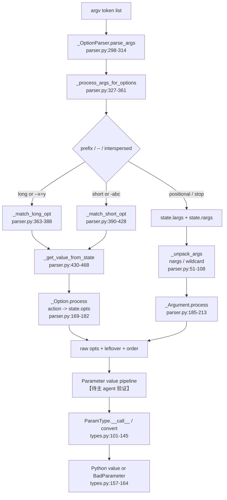

# parse-types：把 argv 变成可执行参数

本模块承接上一模块建立的命令树、`Context` 和参数容器：上游已经知道“有哪些参数”，这里决定“命令行 token 如何归属、如何聚合、如何变成 Python 值”。它的输出不是终端文本，而是参数名到已解析原始值的映射，以及仍需上层处理的剩余参数。下一阶段必须把这些值的转换失败、未知选项和资源错误稳定地呈现给终端用户。

## 1. 在项目中的角色与去掉后的后果

`parser.py` 是 argv 的语法边界，`types.py` 是值语义边界。前者只处理选项/位置参数的形状、顺序和剩余项；后者把字符串或已有 Python 值转成整数、路径、文件、Choice、日期和复合元组，并统一生成 `BadParameter`。两者共同把“不可靠的命令行文本”收敛成上层回调可以信任的输入。

去掉 parser，命令对象只能收到未分组的 `sys.argv`，短选项组合、`--name=value`、`--`、固定 `nargs` 和未知选项转发都要由每个命令重复实现。去掉 ParamType，命令回调会自己处理编码、布尔词、路径权限、文件生命周期和错误格式，Click 的一致体验会退化成应用级约定。

## 2. 业务问题

一个 CLI 调用同时包含两类不确定性：token 到参数的归属不确定，文本到领域值的转换也不确定。例如 `tool -vv --port=8080 input.txt -- forwarded` 要支持短选项计数、附着值、位置参数、显式终止选项扫描和剩余参数；`PATHS` 环境变量又要求按路径分隔符拆成多个值，而不是按空格拆坏路径。这些情况必须在命令回调之前被规范化。

Click 选择把语法和语义拆成两层：parser 返回结构化但仍偏原始的值，ParamType 再执行类型转换、校验、帮助元变量和 shell completion。这样错误能带着参数和 Context 进入统一异常管线，而不是在业务函数里散落字符串判断。

## 3. 设计思路和架构模式

### 3.1 受约束的两阶段管线

`_OptionParser` 维护短选项表、长选项表和声明顺序；`parse_args` 先消费 options，再用 `_unpack_args` 按每个 argument 的 `nargs` 取值（`parser.py:224-325`）。解析结果为 `(opts, largs, order)`：`opts` 是按 dest 聚合的值，`largs` 是剩余参数，`order` 保留发生顺序以支持后续参数来源/回调语义。

ParamType 把“类型”设计成可调用策略：`__call__` 对 `None` 保持缺失语义，其余交给 `convert`；失败统一调用 `fail` 抛出带 `param`/`ctx` 的 `BadParameter`（`types.py:101-164`）。因此 parser 不知道 Path 或 Choice 的细节，类型也不需要知道 token 如何分组。

### 3.2 小型、显式、面向 Click 的 parser

文件头明确说明它源自 `optparse`，但只保留 Click 需要的部分；类型、默认值和帮助格式放在更高层，避免直接暴露 `optparse`/`argparse` 的完整扩展面（`parser.py:1-18`、`224-239`）。这是“自建最小内核 + 上层组合”的架构，而不是试图做通用语法框架。

## 4. 关键数据结构

```text
_ParsingState
  opts: dict[dest, value]   # 已识别并按 action 聚合
  largs: list[str]          # 已转为位置/剩余语义的 token
  rargs: list[str]          # 尚未消费的 token
  order: list[CoreParameter]# 命令行出现顺序

_Option
  short_opts / long_opts, dest, action, nargs, const, obj
  takes_value := action in {store, append}

ParamType
  name, arity, is_composite, envvar_list_splitter
  convert(value, param, ctx) -> converted value
  split_envvar_value(raw) -> sequence[str]

CompositeParamType
  is_composite = True
  arity -> int

Tuple
  types -> [ParamType]
  convert(sequence) -> tuple[converted items]
```

`parser.py:127-182` 用 action 把“同一选项重复出现”的业务语义压缩进状态转移：`store` 覆盖、`append` 累积、`count` 计数。`types.py:1196-1246` 则把固定 arity 和逐项类型转换组合起来；它不是简单的 `nargs` 别名，因为 `(int, Path)` 需要不同的转换器。

## 5. Mermaid 核心流程



长选项优先于短选项：`_process_opts` 先拆 `=`，再尝试长表；失败后只有在前缀允许时才进入短选项扫描（`parser.py:470-500`）。短选项遇到一个需要值的字符，会把同一 token 的剩余字符重新放回 `rargs`，于是 `-p8080` 可以被解释成 `-p 8080`（`390-421`）。

`--` 立即终止 option 扫描；`allow_interspersed_args=False` 则在第一个非 option 后把剩余输入交给位置参数，这正是嵌套命令需要的边界（`parser.py:327-341`）。未知长选项默认抛 `NoSuchOption`；启用 `ignore_unknown_options` 时转成 leftover。未知短选项会收集并重组前缀，保留基本组合能力（`390-428`）。

## 6. 与其他模块的依赖和数据流

- `CoreOption`/`CoreArgument` 提供 parser 需要的对象、dest、action 和 `nargs`；这些契约来自上层参数声明，跨文件关系【待主 agent 验证】。
- `Context` 传入 `allow_interspersed_args`、`ignore_unknown_options`、`resilient_parsing` 和 token 归一化函数（`parser.py:120-124`、`241-258`）。这让 parser 受调用上下文控制，但仍保持内部状态简单。
- `ParamType.convert` 依赖 `Parameter` 和 `Context` 生成带参数名的错误、读取 token normalization、注册 shell completion。该消费路径在本轮未读取的参数模块中完成，标记【待主 agent 验证】。
- `File` 依赖 `Context.call_on_close`、`open_stream`、`LazyFile` 和 `safecall` 管理资源（`types.py:857-969`）。这里已经把终端输入/输出从“值转换”延伸到流生命周期，终端 I/O 层必须提供稳定的 stream 语义【待主 agent 验证】。
- Choice、Path、File 向 shell completion 返回 `CompletionItem`，说明类型系统同时服务运行时转换和交互式补全（`types.py:437-457`、`971-985`、`1173-1189`）。

环境变量是另一条入口：`ParamType.split_envvar_value` 使用类型自己的 splitter，Path/File 默认使用 `os.path.pathsep`，普通类型默认按空白分割（`types.py:66-78`、`147-155`、`887-888`、`1034-1035`）。具体由 Parameter 何时调用该方法未在分配文件内验证【待主 agent 验证】。

## 7. 关键设计决策及权衡

1. **自建最小 parser，而不是直接使用 argparse。** 代码只保留 token 分派和聚合，把类型、默认值、帮助等放到 Click 高层（`parser.py:224-233`）。代价是 Click 要维护一套边界行为；收益是错误消息、嵌套命令和未知选项转发不被标准库默认行为绑架。Python 官方文档也承认 argparse 在需要完全禁用 option/positional 交错、或允许以 `-` 开头的参数值时控制力有限。Click 的选择服务于一致体验，但当前类已标记 8.2 deprecated、计划在 9.0 移除（`237-239`），说明该边界仍在演进。

2. **解析时保留 `order`，而不是只返回字典。** 字典足以调用回调，但会丢失重复参数的出现顺序。`order` 让上层可以实现按命令行顺序执行/回调的语义，代价是额外状态和跨层契约；这与 Click “显式组合、稳定上下文”的哲学一致。

3. **ParamType 同时承担转换、帮助元数据、环境变量拆分和补全。** 这把用户可见的参数语义集中在可扩展对象上：`Choice` 统一规范化与错误文案，`Path` 统一权限校验，`Tuple` 统一逐项转换。代价是抽象变宽，一个自定义类型需要理解运行时、文档和 completion 的多重契约；但这比在 option、prompt、envvar、completion 四条路径重复逻辑更一致。

## 8. 深度研究洞察、业界对比、重设计建议

官方 Click 文档将 options 与 arguments 明确分成两种原则性参数，并说明 options 适合被帮助、prompt 和环境变量完整支持；这与本模块的“声明驱动 + 统一 pipeline”相吻合。官方 advanced 文档还把 `ignore_unknown_options` 定义为转发场景的显式开关，印证了“默认严格、特殊场景 opt-in”的边界策略。

与 `argparse` 对比：argparse 以 `ArgumentParser` 容器和 `Namespace` 为中心，内建帮助和错误退出；Click 的 parser 更薄，故意把类型、上下文和终端体验拆到别处。argparse 的 `allow_abbrev`、`exit_on_error` 等开关说明通用 parser 也在吸收行为差异，但 Click 更早把“上下文链、回调、资源关闭、统一错误”作为整体 API。Typer 则把 Click 的声明模型叠加 Python 类型标注，降低声明成本，但核心 token 规则仍继承 Click 的取舍。

如果重设计，我会保留两层边界，但把 parser 的输出改成显式不可变的 `ParseResult`：其中分别放 `known_values`、`leftovers`、`occurrences` 和每项 token span。这样错误诊断、调试和 shell completion 可以引用原始位置，避免仅凭 `state.order` 反推输入；同时用策略对象替代 `action` 字符串，减少动作与状态字典的隐式耦合。迁移成本是现有 `Context`/`Parameter` 的兼容层和更大的内部 API，但能降低 unknown/partial parse 场景的歧义。

另一个改进方向是把“类型语义”和“终端资源语义”分成 `ValueType` 与 `ResourceType`。当前 `File` 既转换路径又注册 close/flush，功能很实用，却让 ParamType 依赖 Context 生命周期。拆分后可测试性更强，代价是用户自定义类型需要理解两个扩展点；在 Click 这种 CLI 框架里，我会优先保持现有 API，内部增加小的资源适配接口而不是公开新层。

## 9. 扩展点、亮点与问题

**扩展点**：继承 `ParamType` 实现 `convert`、`name`、可选的 `split_envvar_value`、`get_metavar` 和 `shell_complete`；用 `Tuple` 或 Python tuple literal 获得固定 arity 复合类型；用 Context 的 token normalization 统一选项和 Choice；用 `ignore_unknown_options` + leftover argument 构造下游命令包装器。

**亮点**：解析器把“语法严格性”做成 Context 开关；类型对象让字符串、环境变量、prompt、completion 共享同一套语义；`File` 对标准流、lazy open、atomic 写入和 Context teardown 的处理，展示了 CLI 参数不是纯字符串而是资源契约。

**问题**：`_OptionParser` 已 deprecated，说明内部 parser API 的演进成本真实存在；`ignore_unknown_options` 把未知 option 重新当 argument，调用方必须理解 leftover 与 `allow_extra_args` 的组合，错误配置容易延迟到更高层才暴露【待主 agent 验证】；`convert_type` 依据 default 推断 tuple 类型很方便，但空列表退回 STRING（`types.py:1259-1281`），意味着默认值形状会影响类型契约，复杂 CLI 需要显式声明 type。

本模块的自然出口是终端 I/O：解析和转换已经给出“值”或“带参数上下文的错误”，下一层必须负责 stdin/stdout/stderr、文件流、错误格式、帮助排版与退出码，才能把内部一致性兑现为用户可感知的一致体验。

## 10. 涉及文件列表与覆盖率

涉及文件：

- `src/click/parser.py`：token 分派、短/长选项、`nargs`、剩余参数和 parser 兼容层。
- `src/click/types.py`：`ParamType`、Choice、数值范围、Bool、File、Path、Tuple、类型推断和内建实例。

实际读取命令与范围：

- `rg -n "^(class |def |    def )|ParamType|OptionParser|type_cast|split_envvar_value|process_value|parse_args|_get_value|_parse_opts|Composite" .../parser.py .../types.py`（定位定义）。
- `nl -ba .../parser.py | sed -n '1,200p'`、`'201,400p'`、`'401,533p'`。
- `nl -ba .../types.py | sed -n '1,220p'`、`'221,460p'`、`'461,700p'`、`'701,940p'`、`'941,1180p'`、`'1181,1375p'`。

| 文件名 | 总行数 | 已读行数 | 覆盖率% | 未读原因 |
|---|---:|---:|---:|---|
| `src/click/parser.py` | 533 | 533 | 100% | 无；按三段 `nl` 范围读取 |
| `src/click/types.py` | 1375 | 1375 | 100% | 无；按六段 `nl` 范围读取 |
| **合计** | **1908** | **1908** | **100%** | **达标✅** |
