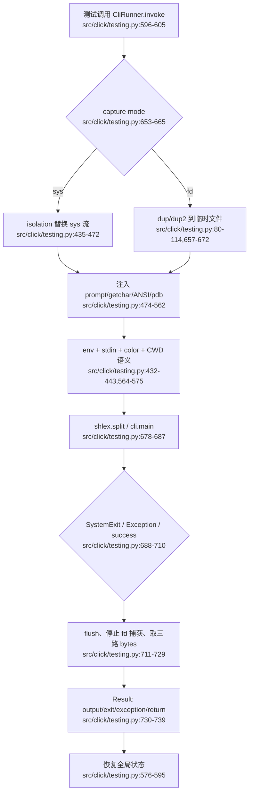

# Click secondary：测试运行时与公共 API 边界

前面的模块已经把命令声明、解析、执行、终端交互和 completion 串成一条运行时链。本模块负责把这条链变成可重复验证的行为，并把多个内部模块收敛成稳定的 `click.*` 公共入口。

## 1. 在项目中的角色与去掉后的后果

`testing.py` 不是业务命令执行器，而是一个“测试时的 CLI 宿主”：它临时接管 stdin/stdout/stderr、环境变量、ANSI 判断、prompt hook 和终端宽度，让测试可以像用户一样调用命令，又能以结构化 `Result` 断言行为（`src/click/testing.py:317-595`）。`__init__.py` 则是公共边界，把 `Command`、装饰器、异常、类型和终端 helper 重新导出为 `click.X`，并通过惰性兼容分支承接旧名称（`src/click/__init__.py:10-75,78-127`）。空的 `py.typed` 是包级类型分发标记。

去掉 `testing.py` 后，应用仍可启动，但测试会退化为子进程或手工替换全局流：提示输入、exit code、stderr、ANSI、CWD 和异常 traceback 的断言会分散在每个项目里，难以保持一致。去掉 `__init__.py` 的重导出后，内部目录布局会泄漏到用户代码，`import click` 的稳定性和迁移能力都会下降；去掉兼容分支则会把历史 API 的迁移成本直接转嫁给下游。

## 2. 业务问题

CLI 的测试难点不是“调用一个函数”，而是验证一次完整的命令行会话：参数来自 argv，prompt 从 stdin 读取，输出同时经过 stdout/stderr，错误要映射到进程 exit code，文件操作要在干净 CWD 中发生。Click 选择在单线程测试中短暂改变解释器全局状态，把“真实 CLI 交互”压缩成同步、可观测的调用边界（`src/click/testing.py:317-352`）。

这套模型解决了三个现实问题：

1. 测试不应依赖宿主终端。`isolation` 用内存流和固定宽度模拟 stdin/stdout/stderr，并在退出时恢复原值（`src/click/testing.py:435-443,564-595`）。
2. 输出必须可按语义断言。`Result` 同时保留 stdout、stderr、用户看到的混合 output、字节原文、返回值和异常信息（`src/click/testing.py:231-314`）。
3. 测试边界必须可组合。`invoke` 接受字符串或 argv 序列、输入、环境变量、颜色和传给 `Command.main` 的额外上下文参数（`src/click/testing.py:596-687`）。

## 3. 设计思路和架构模式

### 3.1 可恢复的解释器级隔离

`CliRunner.isolation` 是一个 context manager，而不是永久替换全局对象。进入时保存旧流、旧宽度、旧 prompt/ANSI/pdb 行为；退出时按保存值恢复。这个“保存—替换—执行—恢复”模式让测试 API 很小，同时把 Click 终端层的约定集中起来（`src/click/testing.py:435-562,564-595`）。代价是明确的：类文档声明它只适合单线程、无并发场景（`src/click/testing.py:317-321`）。

### 3.2 双层捕获：Python stream 与 OS file descriptor

默认 `capture="sys"` 只替换 Python 层的 `sys.stdout`/`sys.stderr`；`capture="fd"` 额外用 `os.dup`/`os.dup2` 把 fd 1、2 导向临时文件，再将字节合并回内存流（`src/click/testing.py:80-114,653-729`）。这是一个按成本分层的策略：大多数 Click 代码用 `sys` 足够，C 扩展、子进程和缓存旧 stream 的库才需要 `fd`。

### 3.3 结果对象作为测试协议

`Result` 把一次 CLI 调用的多种观察面固定下来，而不是只返回字符串：

```python
class Result:
    runner: CliRunner
    stdout_bytes: bytes
    stderr_bytes: bytes
    output_bytes: bytes
    return_value: t.Any
    exit_code: int
    exception: BaseException | None
    exc_info: ExceptionInfo | None
```

（`src/click/testing.py:253-280`）文本属性在读取时按 runner charset 解码、替换 CRLF，并对坏字节使用 `replace`；这使断言默认面向用户可见文本，同时仍保留 bytes 级证据（`src/click/testing.py:282-310`）。

## 4. 关键数据结构

- `StreamMixer` 持有三个 BytesIO：独立的 stdout、stderr，以及由两个 `BytesIOCopy` 同步写入的混合 output（`src/click/testing.py:117-154`）。
- `_NamedTextIOWrapper` 给内存流补上 `<stdin>`、`<stdout>`、`<stderr>` 的 name/mode，并让 `close()` 不关闭所属 buffer；fd 捕获时 `fileno()` 返回被保存的原始 fd（`src/click/testing.py:156-208`）。
- `CliRunner` 的配置字段是 charset、环境变量覆盖、stdin 回显、异常捕获和 capture mode（`src/click/testing.py:354-380`）。构造时拒绝非法模式，并在 Windows 拒绝 `fd`（`src/click/testing.py:360-375`）。
- `make_input_stream` 接受字符串、字节、已有 stream 或空输入；已有 stream 通过 `_find_binary_reader` 转为二进制读取器，字符串按 charset 编码（`src/click/testing.py:211-228`）。

## 5. Mermaid 核心流程图



流程的关键不是捕获字符串，而是把“执行前环境”和“执行后证据”同时标准化：在 `cli.main` 前完成替换，在所有正常异常路径的 `finally` 中 flush、停止 fd 捕获，再退出 isolation 恢复全局状态。

## 6. 隔离、输入输出与 filesystem isolation

`isolation` 首先把输入统一为二进制流，再包装成文本输入；`echo_stdin=True` 时，`EchoingStdin` 会把读取到的字节复制到 stdout，但可见/隐藏 prompt 用 `_pause_echo` 暂停复制，避免同一输入被回显两次（`src/click/testing.py:32-78,445-503`）。这解释了为什么普通 prompt 的测试结果会包含输入，而 hidden input 不会。

环境变量采用两级覆盖：runner 初始化的 `self.env` 先复制，单次 invoke 的 `env` 再更新；值为 `None` 表示在隔离期间删除该变量（`src/click/testing.py:389-396,441,564-584`）。它是 override 语义，不是完整环境快照：代码只保存并恢复被覆盖的 key，测试主体若自行修改其他 key，仍可能泄漏到宿主进程，这是需要测试框架纪律配合的边界。

`isolated_filesystem` 是独立的 CWD 隔离 context manager：创建临时目录、`chdir`、yield 路径，退出时恢复旧 CWD；未指定 parent 时删除目录，指定 `temp_dir` 时保留目录供 pytest 等外部 fixture 管理（`src/click/testing.py:741-772`）。它不与 `invoke` 自动嵌套，应用测试需要显式使用。

## 7. 异常、exit code 与数据流

`invoke` 把 `SystemExit` 和普通 `Exception` 分成两条测试语义：

- 正常返回：`return_value` 保存 `cli.main` 返回值，`exit_code=0`，`exception=None`。
- `SystemExit(None)` 或 `SystemExit(0)`：视为成功；非零整数保留异常对象并将其作为失败证据；非整数 code 被写到 stdout 并归一为 exit code 1（`src/click/testing.py:674-703`）。
- 普通异常：默认捕获，`exit_code=1`、`exception=e`、`exc_info=sys.exc_info()`；若 `catch_exceptions=False` 则重新抛出，便于调试（`src/click/testing.py:705-710`）。

这不是把所有失败都“吞掉”：`SystemExit` 是 CLI 的正常退出协议，普通异常是否转成 `Result` 则由 runner 配置决定；`KeyboardInterrupt` 等非 `Exception` 的 BaseException 不在该捕获分支中。无论命令是否成功，`finally` 都先 flush，再收集输出，保证异常断言不会丢掉已经写出的内容（`src/click/testing.py:711-739`）。

## 8. 与其他模块的依赖和数据流

```text
测试输入/argv/env
    -> CliRunner.isolation
    -> 【待主 agent 验证】formatting.FORCED_WIDTH、termui prompt/getchar hook、utils/_compat ANSI hook
    -> 【待主 agent 验证】Command.main(args, prog_name, **extra)
    -> Result(stdout/stderr/output/return/exit/exception)
```

可直接从分配文件确认的依赖是：`testing.py` 导入 `_compat`、`formatting`、`termui`、`utils`，并只在类型检查时引用 `core.Command`（`src/click/testing.py:14-24`）。它对这些模块的协作方式不是继承，而是测试期间替换少量模块级 hook；这延续了 Click“显式组合、稳定上下文”的哲学，但也意味着 hook 名称是隐式契约，必须由主 agent 回到其他模块验证。

`__init__.py` 的数据流相反：它不运行命令，而是把核心模型、装饰器、异常、格式化器、全局上下文、终端 helper、参数类型和文件/流工具逐组 re-export（`src/click/__init__.py:10-75`）。这些目标模块未在本次分配范围内读取，故其具体 API 一律以【待主 agent 验证】处理。

## 9. 关键设计决策及权衡

### 决策一：用全局替换换取真实 CLI 语义

如果只调用 callback，测试会绕过 argv 解析、prompt、stderr 和 exit protocol；如果每次都启动子进程，则隔离真实但慢、难以直接拿到 Python 返回值和 traceback。Click 选择同步替换解释器全局对象，换来低开销和与用户会话相近的语义，代价是不可并发且对全局状态恢复高度敏感（`src/click/testing.py:317-321,435-595`）。

### 决策二：`sys` 默认、`fd` 可选

单纯 fd 捕获覆盖面更大，却需要 dup/临时文件并承担平台约束；单纯 sys 捕获又抓不到子进程和 C 层写入。双模式把成本暴露成显式配置，默认路径简单，极端路径可升级（`src/click/testing.py:331-345,657-724`）。代价是用户必须理解“旧 stream 引用”和“fd 写入”的差别；此外 fd 模式分别读取 stdout/stderr 临时文件，再按 stdout 后 stderr 写入混合流，因此对直接 fd 写入的跨 fd 时间顺序不如单一终端流精确（`src/click/testing.py:715-728`）。

### 决策三：公共 API 显式 re-export，兼容 API 惰性解析

显式 `from .x import Name as Name` 让 `click.Name` 可发现、类型工具可识别，并避免启动时加载所有兼容路径；`__getattr__` 只在访问旧名时导入私有实现并发出弃用警告（`src/click/__init__.py:78-127`）。相比完全删除旧名，这保护了生态迁移；相比永远保留旧别名，这把兼容成本限制在访问路径。代价是 public surface 仍包含一组隐式的动态属性，静态枚举和打包检查需要额外关注。

## 10. 深度研究洞察、业界对比与重设计建议

### 洞察

Click 的测试设计把“可测试性”当作运行时契约，而不是测试套件的外挂。`Result` 的多视图证据对应 CLI 的真实边界：用户看到什么、程序分别写了什么、命令返回了什么、进程为何退出。尤其是 `return_value` 与 `exit_code` 并存，避免把 Python callback 的返回值误当成进程成功状态。

### 业界对比

- pytest 的 `capsys`/`capfd` 是测试框架级捕获 fixture：`capsys` 偏 Python stream，`capfd` 偏 OS fd；Click 将同类选择内置到 runner，并额外绑定 prompt、颜色、终端宽度和 Click 自己的异常协议。pytest 的优势是与测试生命周期、失败报告和 fixture 组合更深；Click 的优势是调用者不必理解 Click 内部的 prompt hook。
- Typer 官方测试示例直接复用 `CliRunner.invoke`、`Result.exit_code`、`Result.output`、`input`，说明 Click 的测试边界已经成为上层 Python CLI 框架的事实接口；这也提高了 Click 对兼容性和回归的责任。
- Rust `trycmd` 选择文件驱动的端到端快照，适合批量 CLI 场景，强调 stdin、stdout、stderr、CWD 和 exit status 的可复现样例。Click runner 更适合 Python 内部对象级测试，能保留 callback 返回值和 traceback，但不天然提供“案例文件即文档”的批量快照模型。

上述对比依据：Click testing/API 文档、pytest capture 文档、Typer testing 文档和 `trycmd` docs.rs 页面；未读取其他模块源码，因此不把外部工具的内部实现与 Click 直接等同。

### 如果重新设计

1. 保留当前 `sys`/`fd` 双模式，但把 capture 的“交错顺序是否保证”作为显式 Result 能力或文档契约；若必须保留严格终端顺序，可设计带统一时间序列的单 fd capture，代价是 stdout/stderr 独立断言更复杂。
2. 增加可选的完整环境快照模式，或在 isolation 退出时检测并报告非声明 key 的环境变更，减少测试污染；默认 override 语义仍可保留以兼容现有使用方式。
3. 将全局替换收敛到一个可注入的 `TestRuntime` 对象，生产代码通过稳定的终端/上下文抽象读取状态。这样可以支持并发测试，但会扩大 Click 运行时的注入面和 API 复杂度，未必符合当前“小而直接”的哲学。

## 11. 扩展点、亮点与问题

### 扩展点

- `CliRunner` 可通过 `charset`、`env`、`echo_stdin`、`catch_exceptions`、`capture` 配置测试宿主。
- `invoke` 的 `extra` 把额外 keyword 传给 `Command.main`，允许测试固定程序名、终端宽度等 Context 级行为（`src/click/testing.py:606-625,681-687`）。【待主 agent 验证】
- `isolated_filesystem(temp_dir=...)` 可与外部临时目录 fixture 组合，控制清理责任（`src/click/testing.py:741-772`）。

### 亮点

- 输入、输出、环境、颜色、prompt 和 pdb 都在同一个可恢复边界中处理。
- `Result` 同时提供文本与 bytes、分流与混合流、返回值与异常，适合从用户体验断言深入到协议断言。
- `__init__.__getattr__` 用懒加载和 warning 保持旧 API 可用，兼容逻辑不污染正常导入路径。

### 问题与影响

- 全局解释器替换天然不适合并发；文档已明确限制，但测试框架若默认并行收集，必须在更上层串行化此类测试（`src/click/testing.py:317-321`）。
- `fd` 捕获失败时，`invoke` 的 `except OSError` 将两个 capture 变量同时置空；若第一个 fd 已启动而第二个启动失败，代码表面上没有再调用 stop 的路径，存在需要单独测试的资源/恢复风险（`src/click/testing.py:657-665`）。这里是基于当前代码的边界推断，不代表该异常在所有平台都可触发。
- `__init__.py` 没有显式 `__all__`，公共边界主要由重导出约定和动态 `__getattr__` 构成；若未来新增模块级名字，静态 API 审计需要额外规则（`src/click/__init__.py:10-127`）。

## 12. 涉及文件列表与证据边界

- `src/click/testing.py`：完整读取 `1-772`；本模块主要实现。
- `src/click/__init__.py`：完整读取 `1-127`；公共重导出与弃用兼容。
- `src/click/py.typed`：实际 0 行，检查为空文件；包级类型标记。
- 外部参考：Click testing/API/home、pytest capture、Typer testing、Rust trycmd/clap 公开文档。其他 Click 源码未读，跨模块关系均已标注【待主 agent 验证】。

## 覆盖率明细

| 文件名 | 总行数 | 已读行数 | 覆盖率% | 未读原因 |
|---|---:|---:|---:|---|
| `src/click/testing.py` | 772 | 772 | 100% | 无 |
| `src/click/__init__.py` | 127 | 127 | 100% | 无 |
| `src/click/py.typed` | 0 | 0 | N/A | 空标记文件，实际无可读行 |
| 合计 | 899 | 899 | 100% | 达标✅ |
