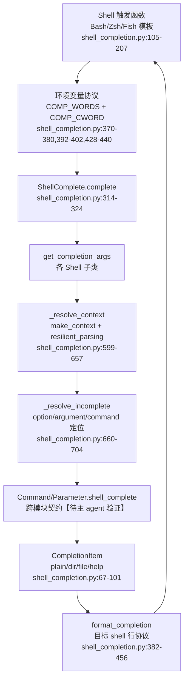

# Click Shell Completion 模块分析

> 分析模式：standard；固定源码 HEAD：`b67832c2167e5b0ff6764a8c04a0a9087e697b5a`。
> 本稿只依据允许读取的 `src/click/shell_completion.py`，跨模块结论均显式标记。

## 叙事衔接与模块角色

上一模块已经说明 Click 如何在执行时把命令、上下文、参数和终端 I/O 组织成一致体验；但用户输入命令时还没有形成完整 argv，系统仍要快速回答“当前位置可以输入什么”。Shell completion 是这条执行链的“预演层”：它复用命令元数据和参数类型的候选能力，却必须避免调用真实 callback。

`shell_completion.py` 把 shell 侧协议和 Click 侧候选计算隔离开来。顶层 `shell_complete` 接收命令对象、上下文参数、程序名和环境变量指令，按 `instruction_shell` 选择注册的适配器，再输出脚本源代码或当前候选（1-55）。去掉它的直接后果不是命令不能执行，而是命令作者必须为 Bash、Zsh、Fish 分别维护解析状态、环境变量协议和文件/目录候选行为；更严重的是，completion 将与 `Command`/`Parameter` 元数据失去同一真源，帮助文本、执行解析和交互候选容易漂移。

## 1. 业务问题

现代 CLI 的成本不只在 callback 执行，而在用户尚未写完命令时的发现成本：多级 Group 的子命令、选项值、动态资源名、路径候选和说明文字都需要在“不完整 token”上工作。completion 因此面对四个约束：

1. shell 有不同的词法状态和返回协议；
2. Click 只能依据当前部分 argv 推断命令/参数位置；
3. 动态候选可能来自应用代码，但不能触发真实业务 callback；
4. 文件、目录和普通字符串候选需要交给 shell 的原生 UI 继续处理。

本文件选择“shell 脚本薄适配 + Python 统一候选引擎”：脚本只收集 shell 状态、调用同一入口并解释少量元数据；Python 负责命令上下文恢复、参数定位和候选生成。

## 2. 设计思路与架构模式

### 2.1 双阶段生命周期

`instruction` 先被拆成 shell 名称和动作（38-44）。`source` 阶段实例化适配器并渲染静态脚本；`complete` 阶段实例化同一个适配器并依据环境变量完成一次查询（46-55）。这是一种“安装时生成胶水、交互时回调引擎”的两阶段协议：shell 只需注册一次函数，之后每次按当前输入调用 CLI。

### 2.2 统一候选模型

`CompletionItem` 用 `value`、`type`、`help` 和任意 `_info` 元数据承载候选（67-101）。内建 `type` 只有 `plain`、`dir`、`file` 三类：普通值由适配器直接返回，路径候选转给 shell 原生文件系统补全，避免 Python 重做 shell 的路径语义。`help` 为 Zsh 这类能展示描述的 shell 保留说明通道；任意附加属性则为自定义 shell/type 留出协议空间（68-83）。

### 2.3 Shell 脚本是协议适配层

Bash 模板用 `COMP_WORDS`/`COMP_CWORD` 把词列表和光标索引放进环境变量，并以 `bash_complete` 指令调用程序（105-111）；Zsh 用 `words`/`CURRENT` 做索引换算（143-153）；Fish 用 `commandline -cp` 和 `commandline -t` 分别提供完整命令行与当前 token（187-190）。Python 端输出逗号分隔记录，脚本再解释 `type,value[,help]`（Bash 113-125；Zsh 155-175；Fish 192-206）。

这里的关键边界是：shell 负责“我在哪个词、如何注册、怎样显示”；Click 负责“这个词在当前命令图中是什么”。因此新增 shell 主要需要实现 source 模板、输入环境协议和格式化输出，而不必复制命令解析规则。

## 3. 关键数据结构

```python
class CompletionItem(Generic[_ValueT_co]):
    __slots__ = ("value", "type", "help", "_info")

    def __init__(self, value, type="plain", help=None, **kwargs): ...

class ShellComplete:
    name: ClassVar[str]
    source_template: ClassVar[str]

    def source(self) -> str: ...
    def get_completion_args(self) -> tuple[list[str], str]: ...
    def get_completions(self, args, incomplete): ...
    def format_completion(self, item): ...
    def complete(self) -> str: ...
```

前者是跨 shell 的最小候选协议；后者是适配器生命周期的抽象接口。静态类变量用于注册和 source 渲染，实例状态保存一次 completion 请求所需的 CLI、上下文参数、程序名和环境变量名（216-240）。

## 4. Shell 适配的第一层权衡

- **Bash**：使用 `compopt -o dirnames/default` 把目录/文件交回 Bash（116-124），并设置 `nosort`（130-134），保持 Click 返回顺序。优点是实现小、沿用 Bash 行为；代价是逗号分隔协议要求候选值和元数据不能无条件包含未转义逗号。
- **Zsh**：把普通候选拆成带描述和不带描述两组，分别调用 `_describe` 与 `compadd`（155-175），路径则使用 `_path_files`（162-166）。这是更丰富的显示契约，但也迫使 Python 格式化器严格处理冒号和 `_describe` 的脆弱输入；源码注释明确要求冻结该模板（137-142）。
- **Fish**：通过 `string split` 拆分记录，再调用 `__fish_complete_directories`、`__fish_complete_path` 或直接 `echo`（192-206）。结构清晰，但它的元数据通道比 Zsh 更窄，新增 type 需要同步脚本分支。

三种实现共同体现 Click 的“受约束的一致体验”：不追求把每个 shell 的全部能力抽象成同构 API，而是只统一最小候选语义，把 shell 原生能力保留下来。

## 5. `ShellComplete` 生命周期与核心流程

基类把一次 completion 查询压成五步：读取 shell 环境、恢复已完成参数对应的 Context、找到真正负责不完整 token 的对象、调用该对象的 `shell_complete`、再编码成目标 shell 协议（285-324）。其中 `source()` 只做模板渲染（265-283），不访问命令树；`complete()` 才进入上下文和参数推断。这种分离使安装 completion 与运行 completion 的失败面不同：source 生成可以是静态的，而实时候选才需要读取环境、解析 argv 和访问动态命令发现。



`_resolve_context` 的设计尤其重要：它通过 `cli.make_context` 解析已完成 token，但主动把 `resilient_parsing=True` 写入 `ctx_args`（613-615），并在 Group 上只沿命令边界创建父子 Context（617-657）。源码 docstring 明确说明不会触发 prompt 或 callback（605-607）。因此 completion 能借用正式解析器的命令发现和参数状态，却把执行副作用挡在外面。

## 6. 当前参数、不完整 token 与动态候选

### 6.1 词法恢复优先容错

shell 传来的 `COMP_WORDS` 仍是一段 shell 风格字符串。`split_arg_string` 使用 `shlex` 的 POSIX 词法，但关闭注释识别；遇到未闭合引号或未完成转义时捕获 `ValueError`，把部分 token 保留下来（506-539）。这不是通用 shell parser，而是“足以定位候选对象”的容错解析器。若强制完整词法，用户在输入引号或反斜杠的中间时就无法完成；若完全按字符串切分，又会把带空格的路径/值误判成多个参数。

### 6.2 Option 与 Argument 的状态判定

`_resolve_incomplete` 先统一不同 shell 对 `--name=value` 的拆分差异：单独的 `=` 被丢弃，带 `=` 的 option 被拆为 option 名和待补值（671-680）。若尚未遇到 `--` 且当前 token 看起来像 option，就由当前 Command 提供 option 名候选（681-687）。否则，它先检查某个 Option 是否刚刚消费了 option 名但仍缺 value（688-694），再查找第一个尚未完成的 Argument（696-700），最后才把当前 Command 作为候选提供者（702-704）。

`_is_incomplete_option` 排除 flag 和 count option，因为它们不需要值（574-596）；它只向后检查不超过 `param.nargs` 个 token，识别最近的 option 前缀是否属于该参数。`_is_incomplete_argument` 则结合 `Argument.nargs`、`ctx.params` 和 `ParameterSource.COMMANDLINE` 判断是否仍可接收值（542-562）。这说明 completion 不是简单的前缀过滤，而是在复用参数元数据进行“当前槽位”推断。

### 6.3 动态候选的边界

`get_completions` 只负责把 `ctx` 与 `incomplete` 转交给被定位对象的 `shell_complete`（292-304）。真正的动态候选由 Command/Parameter 对象产生，具体实现位于未分配的跨模块源码，因此这里仅记录契约为【待主 agent 验证】：对象必须接受一个 resilient 的 Context 和部分 token，并返回 `CompletionItem` 序列。该边界让自定义参数类型可以基于上下文、外部资源或当前 token 动态返回值，同时把 shell 协议细节留在本文件。

## 7. Group 命令发现与懒加载

`_resolve_context` 对普通 Group 逐级调用 `resolve_command`，然后以父 Context 创建子 Context（620-631）；对 chain Group 则循环解析多个命令，并显式设置 `allow_extra_args=True`、`allow_interspersed_args=False`（633-653）。如果命令名尚未解析成功，函数返回当前 Context，而不是报错或执行 callback（624-626、637-640）。因此不完整的子命令名可以继续由当前 Group 提供候选；已解析的懒加载命令则只需在 Group 的命令发现契约中可见即可，具体是否调用 `get_command`/如何 lazy load 属于跨模块推断【待主 agent 验证】。

这个选择的价值在于 completion 与执行路径共享“命令对象图”的发现规则，避免维护第二套命令索引。代价是每次补全都可能创建多个 Context 并触发命令发现逻辑；如果 Group 的动态发现访问网络或执行昂贵初始化，completion 延迟会直接暴露给交互用户。Click 在这里选择一致性优先，要求命令发现本身保持轻量和无副作用。

## 8. 与其他模块的依赖和数据流

### 已由本文件确认的依赖

- 输入依赖 `os.environ` 的 shell 协议变量（370-440）。
- 解析依赖 `Command`、`Group`、`Context`、`Option`、`Argument`、`ParameterSource` 的运行时类型和方法（9-16；542-657）。
- 候选输出依赖 `utils.echo` 写字节，避免 Windows 文本 stdout 把 LF 转换为 CRLF（16、46-49）。
- 扩展依赖 `_available_shells` 注册表，`add_completion_class` 写入、`get_completion_class` 读取（459-503）。

### 跨模块契约（待主 agent 验证）

- `Command.make_context` 必须尊重 `resilient_parsing`，并将已解析/受保护参数保存在 `_protected_args` 与 `args`，供 `_resolve_context` 继续沿命令链推进（614-653）。
- `Group.resolve_command` 是 completion 复用懒加载/子命令发现的入口（620-639）。
- `Command.get_params`、`Parameter.shell_complete` 和参数类型的候选实现共同决定 option、argument 和 command 的候选内容（688-704、302-304）。
- runner/公共导出应当通过测试稳定 `shell_complete` 环境变量协议与扩展注册面；本模块没有测试 runner 实现，具体测试位置留给后续交叉验证。

从系统设计哲学看，这种依赖是“显式组合 + 稳定上下文”的直接延伸：completion 不另建一棵命令树，而是把 Context 当作执行前的只读近似状态；不把 shell 差异泄漏到 Command/Parameter，而是把它收敛在适配器和 `CompletionItem` 协议。

## 9. 关键设计决策及权衡

### 决策一：复用正式 Context 解析，但强制 resilient parsing

这是正确性与副作用之间的折中。单独实现 completion parser 会更快、更容易隔离，但会逐渐偏离 Click 的 option、Group、chain 和参数来源语义；直接调用正式执行路径又会触发 callback、prompt 或外部副作用。`resilient_parsing` 加上 Context 层级遍历保留了命令语义，同时明确切断执行阶段。代价是 completion 路径受 `make_context` 和命令发现性能影响，且跨模块契约较隐式。

### 决策二：候选使用最小类型协议，把文件系统交给 shell

`plain/dir/file` 只表达 Click 真正需要控制的部分，Bash/Zsh/Fish 再调用自己的目录/文件补全（105-125、155-166、195-200）。相比 Python 端统一实现路径扫描，这避免了平台差异和 shell 行为不一致；代价是三种脚本必须各自维护 type 分支，新 type 的扩展成本是“注册类 + 输出编码 + 每个目标 shell 脚本分支”，并非纯 Python 插件。

### 决策三：冻结已部署的 shell 模板，用格式化器吸收兼容包袱

Zsh 模板注释说明 `_describe` 对格式敏感，且脚本已广泛部署，因此把冒号转义放进 `ZshComplete.format_completion`（137-142、404-419）。这体现了成熟基础设施的现实权衡：修改模板可能破坏用户缓存或自动加载路径，局部增加编码逻辑更安全；代价是协议的历史限制被固化，未来演进需要同时考虑旧脚本和新 formatter。

## 10. 深度研究洞察与业界对比

### 10.1 Click 的 completion 不是第二个 parser

`argparse` 的 completion 通常依赖 parser 结构或外部补全框架，`docopt` 则更偏向从使用说明推导语法；Click 在这里采取第三条路线：执行 parser 仍是语义真源，completion 只把已完成部分交给 `make_context`，再让命令/参数对象生成候选。相较完全独立的 completion DSL，这降低了声明重复；相较把 shell 逻辑塞进参数 parser，这又保留了 Bash/Zsh/Fish 的原生显示能力。代价是 `resilient_parsing`、`_protected_args`、父子 Context 等内部状态成为隐式协作面【待主 agent 验证】。

Typer 以类型注解降低命令声明样板，但其 completion 最终仍需要 Click 这一类命令/参数元数据模型才能回答“当前槽位是谁”。Click 的显式 API 更啰嗦，却让自定义 `ParamType`、动态 `shell_complete` 和 Group 子类拥有清晰的扩展落点【待主 agent 验证】。这与 Click 的总体选择一致：牺牲一点声明便捷，换取组合命令的可预测边界。

### 10.2 最有价值的抽象是“候选来源”和“候选渲染”分离

`get_completions` 不知道 Bash/Zsh/Fish 如何显示；`format_completion` 不知道候选从哪个参数产生。这个分离让同一动态候选可被三种 shell 消费，也让新 shell 不需要复制 Context 恢复算法。它比把候选直接返回 shell 字符串更健壮，因为 `CompletionItem` 仍保留语义字段 `type/help`。

但当前协议并非完全结构化：Bash/Fish 通过逗号分隔，Zsh 用三行记录（382-419），Fish 的 help 又使用制表符（442-456）。如果候选值包含逗号、换行或 shell 特殊字符，适配器需要额外转义，而源码只明确处理了 Zsh 的冒号和 Fish help 的换行/制表符。对于本地路径和动态资源名，这是一项真实的演进风险，而非纯实现细节。

### 10.3 “懒加载命令发现”把交互延迟风险推给命令作者

沿着 Group 解析命令的好处是 completion 和执行的命令发现规则天然一致；坏处是每次按键都可能重新走动态发现。若命令发现读取 entry point、扫描文件系统或访问网络，用户会感知到 completion 卡顿。重设计时可以给 `Command`/`Group` 引入只读的 completion metadata cache，或让命令发现接口显式声明“可在 completion 热路径执行”；但缓存会引入失效和上下文一致性问题，且可能破坏 Click 一贯的显式组合哲学。更保守的建议是要求 lazy loader 保持纯本地、低延迟，并通过 runner 对调用次数和副作用做契约测试【待主 agent 验证】。

## 11. 扩展点、亮点与问题

### 扩展点与代价

1. **新增 shell**：继承 `ShellComplete`，提供 `name`、`source_template`、`get_completion_args`、`format_completion`，再用 `add_completion_class` 注册（216-237、285-312、468-485）。复用 Context 恢复和候选生成，成本集中在 shell 脚本协议、引用/转义和安装方式。
2. **新增候选元数据/type**：`CompletionItem` 接受任意 kwargs（88-101），但内建脚本只识别 `plain/dir/file`（113-124、155-166、195-201）。因此只扩展 Python 字段不会自动生效；必须修改每个目标 shell 的 source 模板和 formatter，兼容成本随 shell 数量线性增长。
3. **动态参数候选**：由被定位的 Command/Parameter 提供 `shell_complete`，可以依赖 `ctx` 与 `incomplete`（292-304）。这适合上下文相关资源，但需要保证候选函数不会把执行 callback、副作用或慢 I/O 带入按键热路径【待主 agent 验证】。

### 亮点

- 用正式 Context 解析器的近似执行状态支撑 completion，同时显式开启 `resilient_parsing`，在一致性和安全副作用之间找到合理边界（599-657）。
- 对 shell 的索引差异做了局部适配：Bash/Zsh 使用词位索引，Fish 单独处理“当前词同时出现在完整词串和 partial 环境变量”的重复（370-440）。
- `CompletionItem` 把路径处理交给 shell 原生机制，并保留 Zsh help、Fish help 等能力，避免把三个 shell 过度压成最低公分母。
- 用注册表和类型重载提供稳定扩展入口；未知 shell 明确返回失败状态（38-43、488-503），失败不会静默生成错误脚本。

### 问题与重设计建议

- **协议编码不统一**：逗号/换行/制表符分隔使候选值的可表达范围依赖 shell。可考虑版本化的逐行 JSON/长度前缀协议，并由脚本统一解码；代价是脚本更复杂、安装脚本兼容性更难维护。
- **版本检查语义偏弱**：Bash 版本低于 4.4 或无法探测时只通过 `echo(..., err=True)` 报告（333-364），`source()` 随后仍继续生成脚本（366-368）。如果目标是明确拒绝不兼容环境，应该返回状态或抛出专用错误；如果目标是尽力生成，则应把“警告但继续”写入协议文档和测试。
- **上下文契约较隐式**：completion 依赖 `ctx._protected_args`、`ctx.args` 和 `ctx._opt_prefixes` 等内部状态（571、614-653）。它们适合内部模块协作，但会提高替换 parser 或实现第三方 Context 的成本。可以增加一个面向 completion 的只读 Context snapshot API，减少对内部字段的直接依赖；代价是新增稳定 API 和同步维护负担。
- **缺少本文件内的协议校验**：未知 `CompletionItem.type` 会被脚本静默忽略，候选包含分隔符也没有统一错误。可以在 formatter 层做类型白名单与编码校验，或引入协议版本；代价是自定义 shell/type 的自由度下降。

## 12. 与测试 runner/公共导出的衔接

本模块的核心契约不是“某个函数返回某个字符串”，而是：给定 `complete_var`、shell 环境变量和命令元数据，系统在 resilient parsing 下返回稳定候选。下一模块应由测试 runner 构造 `COMP_WORDS`/`COMP_CWORD`、验证未触发 callback、覆盖 Group/lazy discovery 和特殊 token；公共导出则需要确认 `CompletionItem`、`add_completion_class`、`get_completion_class` 是否以稳定 API 方式暴露【待主 agent 验证】。这正是 Click 将交互体验固化为基础设施契约的最后一环。

## 13. 涉及文件与实际读取范围

### 涉及文件

- `/Users/chuzu/projests/stark-repo-analyzer-reference-sources/click/src/click/shell_completion.py`（唯一实际读取的分配源码文件）
- `drafts/03-research.md`、`drafts/03-plan.md`、`drafts/05-modules-plan.md`（工作目录中按用户许可读取的上下文草稿）

### 实际源码读取命令

- `rg -n '^(class |def |    def |    [A-Za-z_].*=|[A-Z][A-Z0-9_]+ =)|^__all__|^_[A-Z_]+|shell_complete|complete_' /Users/chuzu/projests/stark-repo-analyzer-reference-sources/click/src/click/shell_completion.py`
- `nl -ba .../shell_completion.py | sed -n '1,120p'`
- `nl -ba .../shell_completion.py | sed -n '121,240p'`
- `nl -ba .../shell_completion.py | sed -n '241,360p'`
- `nl -ba .../shell_completion.py | sed -n '361,480p'`
- `nl -ba .../shell_completion.py | sed -n '481,600p'`
- `nl -ba .../shell_completion.py | sed -n '601,704p'`

覆盖率以六个 `nl | sed` 行范围并集计算；`rg` 仅用于定位结构，不额外计入行数。未读取其他模块源码，因此跨模块结论保留【待主 agent 验证】。

| 文件名 | 总行数 | 已读行数 | 覆盖率% | 未读原因 |
|---|---:|---:|---:|---|
| `src/click/shell_completion.py` | 704 | 704 | 100.0% | 无；六段行范围均已读取 |
| **合计** | **704** | **704** | **100.0%** | **核心模块最低 60%，达标✅** |
