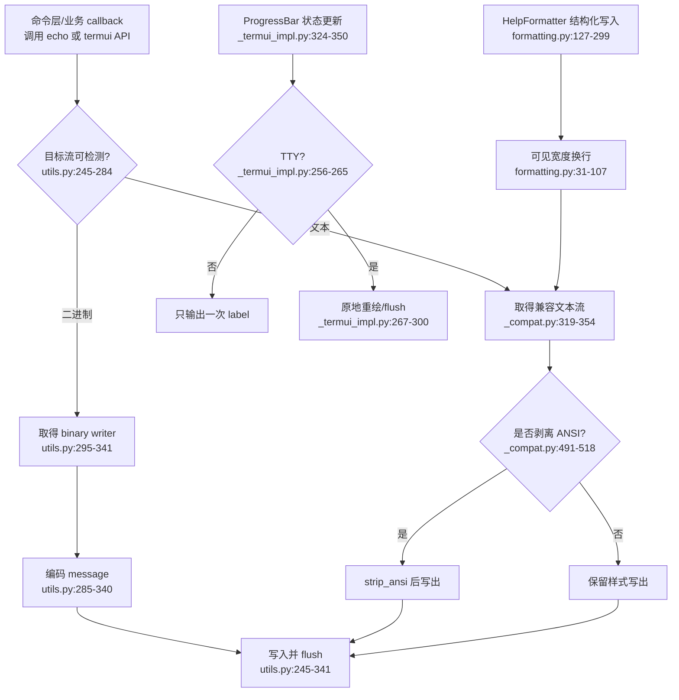

# Click `terminal-io` 模块分析

> 分析模式：standard；固定源码 HEAD：`b67832c2167e5b0ff6764a8c04a0a9087e697b5a`。本稿只依据分配的 8 个源码文件、允许参考的阶段草稿和已记录的外部资料。

## 叙事衔接

上一模块已经把命令行 token 变成带类型和来源的参数值，但 CLI 的可用性并不止于“解析成功”。终端层要把这些值放回真实运行环境：选择正确的 stdin/stdout/stderr、维持编码和颜色语义、在交互式与管道式场景下给出一致行为，并在文件和分页器退出时不破坏调用者拥有的资源。它的下一站是 completion：同样的命令元数据还要支持一次“不执行 callback”的交互。

## 1. 在项目中的角色与去掉后的后果

`terminal-io` 是 Click 的运行时边界层。`termui.py` 保持面向应用作者的交互 API，`utils.py` 统一文件和标准流，`formatting.py` 把命令元数据变成可重排帮助文本，`_termui_impl.py` 延迟加载分页器、编辑器、进度条和原始键盘输入，`_compat.py`/`_winconsole.py` 把 Python 流模型和操作系统控制台差异隔离起来。公开层因此可以围绕“命令组合 + 稳定上下文”工作，而不必让每个命令自己判断终端能力。

移除它并不只是失去彩色输出。命令仍可能解析参数，但会在以下边界失去一致性：Unicode 在 Windows 控制台上写失败；颜色泄漏到重定向文件；`-` 关闭了借用的标准流；延迟写文件在 callback 失败前就产生空文件；帮助在窄终端中错位；进度条在管道中反复输出回车控制符。结果是“同一个 Command 对象”不再提供稳定的用户体验，违背 Click 把多个 CLI 组合起来仍保持一致的承诺（`utils.py:245-341`、`_compat.py:319-455`、`formatting.py:127-299`）。

## 2. 业务问题

CLI 同时服务三类输出目的：给人看的交互终端、给另一个程序消费的管道、以及需要关闭/替换/测试的应用流。Python 的 `sys.stdout` 不是一个足够稳定的契约：它可能是文本包装器、二进制流、`StringIO`、错误配置的编码流，Windows 控制台还可能要求专用 API。Click 选择把这些差异收敛在 `get_*_stream`、`echo`、ANSI 判定和兼容层里，而不是把平台分支散落在 Command 和业务 callback 中（`utils.py:245-373`、`_compat.py:22-354`）。

另一个问题是“输出是否应该呈现”。帮助和进度必须按可见宽度而非 ANSI 序列的字节长度换行；分页只适合 TTY，重定向时应直接写出；进度条在非 TTY 中只保留一次标签；prompt 的输入函数又绕过 `echo`，所以必须手动同步 stderr、颜色剥离和异常语义（`termui.py:84-243`、`_termui_impl.py:256-300`）。这些都是运行时决策，不是简单的字符串格式化。

## 3. 设计思路和架构模式

### 3.1 公共薄层 + 延迟实现层

`termui.py` 是稳定的门面：prompt/confirm、pager、progressbar、style/secho、编辑器、启动外部程序和原始输入都从这里暴露。高成本或低频路径由 `_termui_impl.py` 承担，并在调用点按需导入（`termui.py:304-359`；`_termui_impl.py:1-5`）。这是一种 facade + lazy implementation 的组合：减少普通 CLI 的导入成本，同时保留公共 API 的统一入口。

### 3.2 能力判定而不是环境假设

输出路径先判断目标流是否为 TTY，再决定颜色、分页和进度渲染；ANSI 的可见长度由 `term_len`/`strip_ansi` 计算，帮助排版通过 `shutil.get_terminal_size` 和 `FORCED_WIDTH` 确定宽度（`formatting.py:10-21`、`formatting.py:127-145`）。这让“终端”成为一种可检测能力，而不是 `sys.platform` 的单一分支。平台差异仍被下沉到 `_compat.py` 和 Windows 专用 raw stream，公共代码只消费稳定函数。

### 3.3 借用流与拥有流分离

`LazyFile` 延迟打开普通路径，但对读模式提前做一次可失败检查；`open_stream` 返回 `should_close`，`KeepOpenFile` 则把借用的 stdin/stdout 包装成不会在 `with` 结束时关闭的代理（`utils.py:112-243`）。这个边界把资源所有权显式化：Click 可以关闭自己打开的文件，却不能因为参数值是 `-` 就关闭进程级标准流。

## 4. 关键数据结构

```python
class LazyFile:
    name: str
    mode: str
    _f: t.IO[t.Any] | None
    should_close: bool

    def open(self) -> t.IO[t.Any]: ...
    def close_intelligently(self) -> None: ...
```

`_f is None` 表示普通文件尚未真正打开；`should_close` 记录底层流是否由 Click 拥有。`KeepOpenFile` 只持有 `_file`，`__exit__` 不做关闭，显式 `close` 仍通过属性代理传递（`utils.py:206-243`）。

```python
class ProgressBar(t.Generic[V]):
    iter: cabc.Iterable[V]
    length: int | None
    pos: int
    avg: list[float]
    eta_known: bool
    finished: bool
    _is_atty: bool
    _last_line: str | None
```

进度条把“数据迭代”与“渲染状态”合并在一个上下文对象中：进入 with 才允许迭代，非 TTY 时降级为一次性标签，TTY 时用 `_last_line` 抑制无变化重绘（`_termui_impl.py:57-128`、`_termui_impl.py:142-160`、`_termui_impl.py:256-300`）。

```python
class HelpFormatter:
    width: int
    current_indent: int
    buffer: list[str]

    def write_dl(...): ...
    def section(...): ...
```

帮助格式化器是内存中的结构化 writer，而不是直接向终端写入。Command 层可以先按 section、usage、definition list 组织内容，最后一次性取值；这为窄终端重排、测试中的强制宽度和公共输出捕获提供稳定边界（`formatting.py:110-299`）。

## 5. 核心流程图



流程的核心不是“写字符串”，而是先确定资源和能力，再决定表现形式。后续源码段落会补充 pager、editor、Windows console 以及 `File` 的完整生命周期。

## 6. 与其他模块的依赖和数据流

### 6.1 参数值到终端资源

上一模块的 `File`/`Path` 类型最终需要把用户给出的文件名交给 `open_file`；从本分配文件能确认，`open_file` 的运行时实现会把 `-` 映射到标准流、把 `lazy=True` 映射到 `LazyFile`，并把借用流包装为 `KeepOpenFile`（`utils.py:375-421`）。`File.convert` 如何调用它属于其他模块，故该跨模块调用关系标为【待主 agent 验证】。本模块内部的契约已经清楚：文件名语义在 `open_stream`，资源所有权在返回的 `should_close`，显示安全在 `format_filename`。

### 6.2 输出流数据流

`echo` 的调用者可以传入文本、bytes、bytearray 或任意对象。它先补换行，再尝试从文本流找到 binary writer；bytes 直接写入二进制缓冲区，文本则根据 `should_strip_ansi` 决定是否删除 CSI ANSI 序列，最后无条件 flush（`utils.py:245-340`）。`_compat` 提供三层兜底：先复用已经兼容的文本流；否则找到 `.buffer`；仍不能找到时保留原流并接受可能的替换字符（`_compat.py:241-316`）。这把“错误配置也尽量能输出”作为稳定性优先级，而不是让每个命令处理编码异常。

### 6.3 Context/Command 到帮助输出

`HelpFormatter` 只接收已经组织好的 usage、heading、definition-list 行，按当前终端宽度和可见字符数写入内存 buffer（`formatting.py:146-299`）。命令模型负责提供这些行的语义和排序，具体调用关系来自其他文件，故标记为【待主 agent 验证】。formatter 与 `_textwrap.TextWrapper` 的协作是本模块内部可证实的：`wrap_text` 负责段落拆分和 `\b` 原样段落，`TextWrapper` 负责把 ANSI 序列排除在宽度预算外（`formatting.py:31-107`、`_textwrap.py:38-162`）。

### 6.4 执行式交互到非执行式交互

prompt、pager 和 progress 都依赖当前调用是否真的拥有交互式终端；completion 则需要在不执行 callback 的前提下复用命令/参数元数据。completion 的具体实现不在本次分配范围，因此这里只能提出边界结论【待主 agent 验证】：终端层的 `should_strip_ansi`、帮助排版和 `_default_text_*` 缓存应被视为“输出能力”，而不是 completion 的命令发现逻辑。终端层最后引出的关键问题是：同一份声明既要用于执行期渲染，也要用于 resilient parsing 下的补全提示，任何会触发外部 I/O 的 callback 都必须保持在执行路径之外。

## 7. 关键设计决策及权衡

### 决策一：以 `echo` 作为统一输出出口

Click 没有要求应用直接使用 `print`，而是让 `echo` 同时解决文本/二进制、stdout/stderr、颜色剥离、Unicode 和 flush（`utils.py:245-340`）。替代方案是让应用自己调用 `sys.stdout.write`，实现更小，却会把 Windows 控制台、重定向和管道行为暴露给每个命令。代价是 Click 需要维护一套兼容流与二进制探测，且自定义流必须尽量满足 `.buffer`、`isatty` 和 `flush` 等隐式能力。对可组合 CLI 而言，这个代价换来的是跨命令一致的错误和输出体验，符合“显式组合、受约束一致”的总设计。

### 决策二：用 TTY 能力切换表现，而不是强制终端 UI

进度条在非 TTY 中只写一次 label，pager 在 stdin 或 stdout 任一不是 TTY 时退化为普通输出，`pause` 甚至直接成为 no-op（`_termui_impl.py:400-428`、`_termui_impl.py:256-265`、`termui.py:929-960`）。替代方案是总是输出控制序列，交互终端看起来更“丰富”，但管道、日志和 CI 会被回车/ANSI 污染，且下游程序无法可靠解析。Click 牺牲了非交互环境下的视觉反馈，换取脚本可组合性；这也是 CLI 库区别于纯终端 UI 框架的边界。

### 决策三：延迟导入和延迟打开，把成本推到真正需要的路径

`termui.py` 只在使用 progress、pager、editor、launch、getchar 时导入 `_termui_impl`；`LazyFile` 对写文件不立即创建目标文件，并在读文件构造时做一次早期可失败检查（`termui.py:304-320`、`termui.py:535-555`、`utils.py:112-176`）。替代方案是初始化时打开所有文件、导入所有 subprocess/平台模块，代码直观但会产生无用启动成本和副作用。延迟策略更适合大量短命 CLI，但增加了“错误在构造时还是首次使用时发生”的时序复杂度，也要求调用者正确使用上下文管理器。

## 8. 深度研究洞察、业界对比和重设计建议

### 8.1 研究洞察

Click 官方 Why 文档把“可嵌套、可组合、统一帮助/类型/错误”和“限制过度可配置性”放在同一组承诺中；这与本模块的硬编码行为一致：`PAGER` 的策略、ANSI 剥离、最小帮助宽度和 TTY 降级都不交给每个命令自行发明。官方 Utilities 文档还把 `echo` 定位为跨终端的 `print` 替代物，并明确强调 Unicode、二进制和标准流的统一。

与 `argparse` 相比，标准库 parser 主要提供参数容器、解析、帮助和错误；Click 把终端流、prompt、文件、pager 和进度纳入同一运行时契约。与 `docopt` 相比，Click 放弃完全手工控制帮助排版，换取可重排、可翻译和跨命令组合。Typer 则把 Python 类型提示作为主要声明入口，降低应用作者的样板；Click 的终端层仍是其底层运行时价值，且 Typer 的复杂命令树最终仍要面对同样的流、TTY 和生命周期边界。来源和时间见 `drafts/03-research.md`。

### 8.2 亮点

1. `_pager_contextmanager` 先判能力再选实现，Unix 用 pipe、Windows 用临时文件、无 pager 时回退到 borrowed stdout；`get_pager_file` 还用 `detach` 保护底层 buffer，不把包装器的垃圾回收误变成关闭调用者资源（`_termui_impl.py:400-466`）。这是“适配外部进程 + 不泄露资源所有权”的成熟边界。
2. `MaybeStripAnsi` 与 `_textwrap.TextWrapper` 同时解决输出和排版的 ANSI 语义：样式既能保留给 TTY，也不会把不可见控制字节算进宽度（`_termui_impl.py:389-397`、`_textwrap.py:11-35`）。
3. Windows 路径不是简单改编码名，而是用 `ReadConsoleW`/`WriteConsoleW` 的 UTF-16-LE raw stream，再用 `ConsoleStream` 同时保留文本和 binary buffer（`_winconsole.py:119-254`）。这将平台专用性限制在小边界内。

### 8.3 问题与重设计建议

1. `term_len` 只做 `len(strip_ansi(x))`，表示 Unicode code point 数，不是终端 cell 宽度；CJK、全角符号和部分 emoji 的帮助/进度可能仍错位（`_compat.py:536-538`、`_textwrap.py:103-120`）。若重新设计，可引入可选的 wcwidth 能力或明确的 `DisplayWidth` 策略，同时保留无依赖 fallback，避免把轻量 CLI 强制绑定重型终端库。
2. ANSI 识别覆盖 CSI，但不处理 OSC 超链接等其他终端控制序列；`style` 的能力检测也主要是 TTY/显式 color，而非终端能力协商（`_compat.py:15-19`、`termui.py:572-721`）。可以把“样式 token → 渲染器”抽象出来，提供 plain/ANSI/Windows API 三种后端，并让 `term_len` 与渲染器共享 token 化结果，减少重复解析。
3. `_AtomicFile.close(delete: bool)` 接收异常路径参数，却始终执行 `os.replace`，`delete` 没有参与行为（`_compat.py:455-485`）。直接使用 `_AtomicFile` 的 `with` 在异常退出时仍可能替换目标；经 `LazyFile` 使用时，`close_intelligently` 也不会传递异常上下文。这是比“代码风格”更实际的资源/数据完整性风险。重设计应让 close 明确区分 commit 与 rollback，并由 `__exit__` 在异常时删除临时文件而不是替换目标。
4. `_termui_impl.py` 直接调用 `subprocess`, `os.startfile`, `termios` 和编辑器命令，测试主要依靠可替换的 prompt/getchar 和流对象；外部进程的可观测性、超时和取消协议仍较弱（`_termui_impl.py:470-633`、`_termui_impl.py:772-839`）。可增加 `PagerBackend`/`EditorBackend` 注入点和明确的异常/超时模型，但需要谨慎，避免破坏 Click 当前低配置 API。

## 9. 扩展点、亮点与问题

可扩展边界主要是：替换 `visible_prompt_func`/`_getchar` 做测试或定制输入（`termui.py:31-34`、`termui.py:888-920`）；传入自定义 file、color、pager/editor 环境；继承/调用公开 `HelpFormatter`；通过自定义 `ParamType` 为 prompt 提供转换器。平台实现则刻意保持内部化，应用不应直接依赖 `_winconsole` 或 `_termui_impl` 的私有类型。

应特别避免把内部适配层当作稳定 API：`_compat` 的流探测会处理关闭流、Jupyter、错误编码和弱接口对象，但这些都是为公共 `echo`/`open_file` 服务的实现细节。对外暴露越多，Click 越难在不破坏生态的情况下替换 Windows API、pager 策略或编码默认值。

本模块最值得复用的模式是“公共门面定义语义，私有适配层承受环境差异，资源对象明确借用/拥有关系，非 TTY 场景主动降级”。它将一次命令调用的体验约束在统一上下文周围，也为下一模块的 completion 铺路：completion 可以复用描述信息和宽度/颜色规则，但必须保持非执行式，不能把终端层的外部副作用带入补全请求。

## 10. 涉及文件列表

| 文件 | 在模块中的职责 |
|---|---|
| `src/click/termui.py` | prompt/confirm、pager/progress 门面、ANSI style、editor/launch/getchar/pause |
| `src/click/utils.py` | `echo`、标准流访问、`LazyFile`/`KeepOpenFile`、文件打开、文件名/应用目录和安全 flush |
| `src/click/formatting.py` | 帮助 usage、段落、definition list、section 和选项连接格式 |
| `src/click/_termui_impl.py` | 进度状态、pager 后端、编辑器、外部 URL、Unix/Windows 原始输入 |
| `src/click/_compat.py` | 编码/文本流修复、ANSI/Tty 判定、原子文件和默认流缓存 |
| `src/click/_textwrap.py` | 忽略 ANSI 宽度的 TextWrapper 与段落缩进 |
| `src/click/_winconsole.py` | Windows Console API 的 UTF-16-LE raw reader/writer |
| `src/click/_utils.py` | 参数解析内部使用的稳定 sentinel 值；与 terminal-io 的边界仅是共享基础设施 |

## 本轮执行记录与限制

- 工作目录：`/tmp/stark-repo-analyzer-click-run-c3`；源码树：`/Users/chuzu/projests/stark-repo-analyzer-reference-sources/click`。
- 开始时间：`2026-07-12T18:06:09+08:00`；结束时间：`2026-07-12T18:12:45+08:00`；时区：Asia/Shanghai。
- 固定 HEAD 命令：`git -C /Users/chuzu/projests/stark-repo-analyzer-reference-sources/click rev-parse HEAD`，exit 0，结果为 `b67832c2167e5b0ff6764a8c04a0a9087e697b5a`。
- 行数命令：`wc -l` 读取 8 个分配文件，exit 0，总计 3982 行。
- 符号定位命令：对 8 个分配文件执行 `rg -n "^(class |def |... )"`，exit 0；只用于定位，不计入覆盖率。
- 实际源码读取工具：`nl -ba FILE | sed -n 'START,ENDp'`，所有分配文件均覆盖 `1-END`；关键抽查再次读取 `utils.py:245-341`、`_termui_impl.py:400-466`、`_compat.py:374-485`、`_textwrap.py:38-162`，均 exit 0。
- 读取范围明细：`termui.py:1-220,220-520,520-960`；`utils.py:1-250,245-470,375-646`；`formatting.py:1-320`；`_termui_impl.py:1-370,370-580,580-760,760-945`；`_compat.py:1-360,360-590`；`_textwrap.py:1-188`；`_winconsole.py:1-297`；`_utils.py:1-36`。
- 外部研究工具：`agent-reach doctor --json` exit 0；5 次 `mcporter call 'exa.web_search_exa(...)'` 均 exit 1，原因是 `Unknown MCP server 'exa'`；5 次 `curl -sS --max-time 30 -L 'https://r.jina.ai/URL' | sed -n '1,180p'` 均 exit 0，读取 Click `why`/`utils`/`handling-files`、Python `argparse` 和 Typer 首页。
- 研究来源：`https://click.palletsprojects.com/en/stable/why/`、`https://click.palletsprojects.com/en/stable/utils/`、`https://click.palletsprojects.com/en/stable/handling-files/`、`https://docs.python.org/3/library/argparse.html`、`https://typer.tiangolo.com/`。网页内容用于设计对比，固定源码结论以本地行号为准。
- 未执行：没有使用 Git history；没有修改源码树；没有运行测试或 Windows 实机验证。阶段 6 实际使用 5 个并行 Agent 分析模块；本草稿由 terminal-io Agent 写入，主 agent 在全部 Agent 完成后执行了跨模块抽查。
- 边界限制：源码 `git status --short` 观察到已有未跟踪 `graphify-out/`，本轮未触碰；当前目录已有其他模块的 `metadata.json`、`execution-log.md`、`checks.md`、`07/08` 草稿，因“不要覆盖其他文件”而保持原样，terminal-io 本轮记录收录在本稿。

## 覆盖率明细

覆盖率按实际执行的 `nl -ba FILE | sed -n 'START,ENDp'` 行范围并集计算。本次每个分配文件均从第 1 行读到文件末行；`rg` 仅用于符号地图，不把符号定位行单独计入覆盖率。

| 文件名 | 总行数 | 已读行数 | 覆盖率% | 未读原因 |
|---|---:|---:|---:|---|
| `src/click/termui.py` | 960 | 960 | 100% | 无 |
| `src/click/utils.py` | 646 | 646 | 100% | 无 |
| `src/click/formatting.py` | 320 | 320 | 100% | 无 |
| `src/click/_termui_impl.py` | 945 | 945 | 100% | 无 |
| `src/click/_compat.py` | 590 | 590 | 100% | 无 |
| `src/click/_textwrap.py` | 188 | 188 | 100% | 无 |
| `src/click/_winconsole.py` | 297 | 297 | 100% | 无 |
| `src/click/_utils.py` | 36 | 36 | 100% | 无 |
| **合计** | **3982** | **3982** | **100%** | **全部分配文件已读取；达标✅** |
