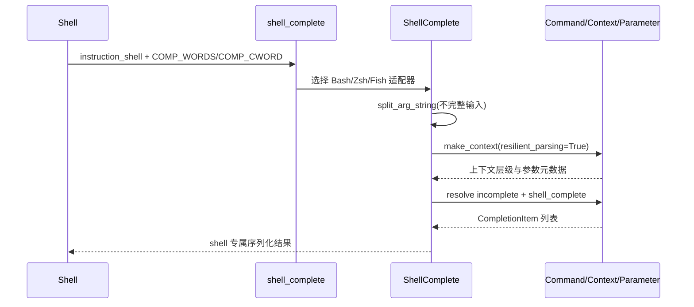
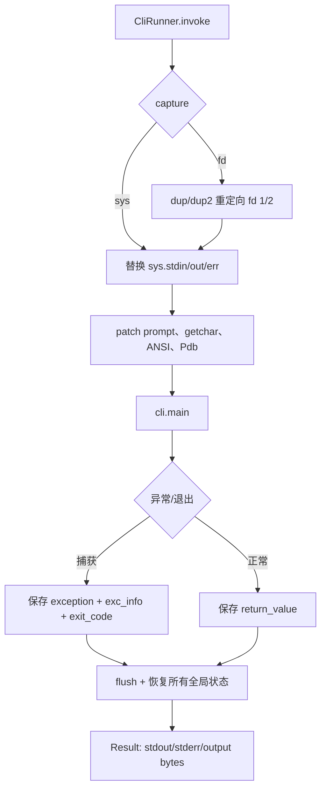
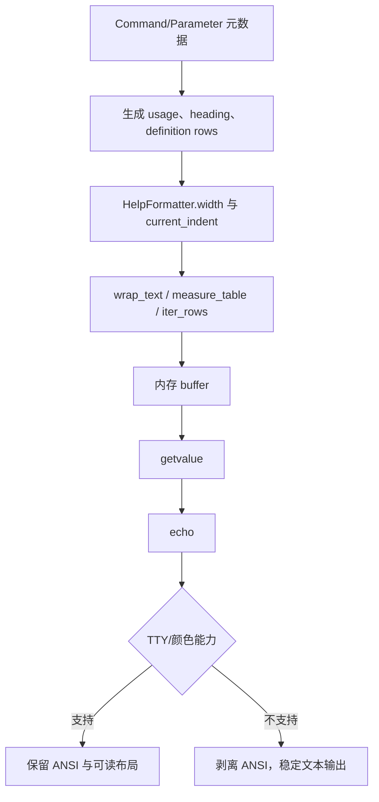
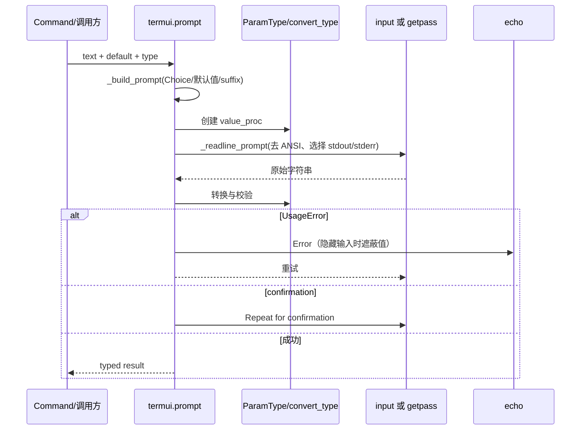
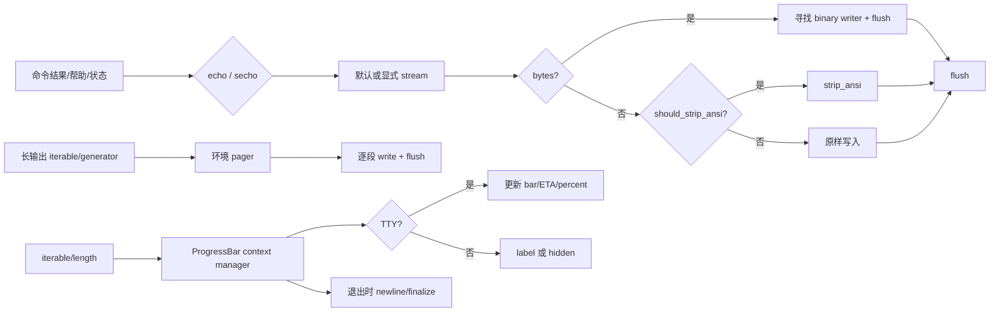

# 仓库架构分析

## 1. 场景与项目定位

本次 V1 运行分析 `click`，固定源码 commit 为 `b67832c2167e5b0ff6764a8c04a0a9087e697b5a`。报告从具体使用场景出发，说明现有方案的不足，再解释源码如何解决问题。

报告融合项目文档、模块源码阅读和 Why > What 叙事；Graphify 结构只作为导航证据，不直接充当架构结论。

## 2. 项目全景

有效源码范围为 18 个文件、12,295 行；V1 分析档位为 `standard`。候选目录只用于导航，业务模块边界按数据流和职责确认。


## 3. Graphify 证据边界

Graphify map is navigation context only. `EXTRACTED` relations require source verification; `INFERRED` remains pending verification; `AMBIGUOUS` is only a risk/question. Source code adjudicates graph conflicts, and all conflicts belong in `drafts/07-cross-validation.md`.

## 4. 最终业务模块与叙事

# Module Analysis Plan

Graphify and size scans are navigation only. The business modules below are derived from Click's data flow and public responsibilities, not copied from the `.devcontainer`/`src` directory split.

## Narrative

Decorator declarations ->[need an executable command tree and lifecycle] -> command model and Context ->[need reliable typed values] -> parameter parsing and type conversion ->[results must be visible to humans and scripts] -> terminal/help output ->[the same metadata must be projected to automation and verification] -> completion/testing/platform support.

## Core Modules

1. `module-core-command-model` — `src/click/core.py`, `src/click/decorators.py`; command tree, Context lifecycle, callback invocation and cleanup.
2. `module-parameter-resolution` — `src/click/parser.py`, `src/click/types.py`, parameter portions of `src/click/core.py`; argv/env/default/prompt resolution and typed conversion.
3. `module-terminal-experience` — `src/click/termui.py`, `src/click/formatting.py`, `src/click/utils.py`; help, prompt, output streams, progress and platform-visible behavior.

## Secondary Modules

4. `module-secondary` — `src/click/shell_completion.py`, `src/click/testing.py`, `src/click/_compat.py`, `src/click/_termui_impl.py`, `src/click/_winconsole.py`, `src/click/_textwrap.py`, `src/click/_utils.py`, `src/click/globals.py`, `src/click/exceptions.py`, `src/click/__init__.py`.

## Analysis Requirements

- One independent sub-agent per core business module.
- One independent sub-agent handles all secondary modules.
- Every draft must include role, problem, design, core data structures, Mermaid flow, module collaboration, Why > What trade-offs, source paths/lines and a final coverage table.
- Cross-module claims are resolved in `drafts/07-cross-validation.md`; runtime-only limitations remain explicitly marked.

## 5. 调研与执行计划

# Research Context

## Local Evidence

- `README.md` (62 lines): <div align="center"></div>  # Click  Click is a Python package for creating beautiful command line interfaces in a 
- `docs/advanced.md` (421 lines): # Advanced Patterns  ```{currentmodule} click ```  In addition to common functionality, Click offers some advanced features.  ```{contents} :depth: 1 :local: true ```  ## Callbacks and Eager Options  Sometimes, you want a parameter to compl
- `docs/api.md` (365 lines): # API  ```{currentmodule} click ```  This part of the documentation lists the full API reference of all public classes and functions.  ```{contents} :depth: 1 :local: true ```  ## Decorators  ```{eval-rst} .. autofunction:: command ```  ```
- `docs/arguments.md` (189 lines): (arguments)=  # Arguments  ```{currentmodule} click ```  Arguments are:  * Are positional in nature. * Similar to a limited version of {ref}`options <options>` that   can take an arbitrary number of inputs * Can take an optional `help` stri
- `docs/changes.md` (4 lines): # Changes  ```{include} ../CHANGES.md ``` 
- `docs/click-concepts.md` (68 lines): # Click Concepts  This section covers concepts about Click's design.  ```{contents} --- depth: 1 local: true --- ```  (callback-evaluation-order)=  ## Callback Evaluation Order  Click works a bit differently than some other command line par
- `docs/command-line-reference.md` (50 lines): # General Command Line Topics  ```{currentmodule} click ```  ```{contents} --- depth: 1 local: true --- ```  (exit-codes)= ## Exit Codes  When a command is executed from the command line, then an exit code is return. The exit code, also cal
- `docs/commands-and-groups.md` (426 lines): # Basic Commands, Groups, Context  ```{currentmodule} click ```  Commands and Groups are the building blocks for Click applications. {class}`Command` wraps a function to make it into a cli command. {class}`Group` wraps Commands and Groups t
- `docs/commands.md` (467 lines): # Advanced Groups and Context  ```{currentmodule} click ```  In addition to the capabilities covered in the previous section, Groups have more advanced capabilities that leverage the Context.  ```{contents} --- depth: 1 local: true --- ``` 
- `docs/complex.md` (386 lines): (complex-guide)=  # Complex Applications  ```{currentmodule} click ```  Click is designed to assist with the creation of complex and simple CLI tools alike.  However, the power of its design is the ability to arbitrarily nest systems togeth
- `docs/contrib.md` (45 lines): (contrib)=  # click-contrib  As the user number of Click grows, more and more major feature requests are made. To users, it may seem reasonable to include those features with Click; however, many of them are experimental or aren't practical
- `docs/contributing.md` (44 lines): # Contributing  This is a quick reference for Click-specific development tasks. For setting up the development environment and the general contribution workflow, see the Pallets [quick reference](https://palletsprojects.com/contributing/qui
- `docs/design-opinions.md` (19 lines): # CLI Design Opinions  ```{currentmodule} click ``` A penny for your thoughts...  ```{contents} :depth: 1 :local: true ```  ## Options over arguments {ref}`Positional arguments <arguments>` should be used sparingly, and if used should be re
- `docs/documentation.md` (343 lines): # Help Pages  ```{currentmodule} click ```  Click makes it very easy to document your command line tools. For most things Click automatically generates help pages for you. By design the text is customizable, but the layout is not.  ## Help 
- `docs/entry-points.md` (88 lines): # Packaging Entry Points  ```{eval-rst} .. currentmodule:: click ```  It's recommended to write command line utilities as installable packages with entry points instead of telling users to run ``python hello.py``.  A distribution package is
- `docs/exceptions.md` (136 lines): (exception-handling-exit-codes)=  # Exception Handling and Exit Codes  ```{eval-rst} .. currentmodule:: click ```  Click internally uses exceptions to signal various error conditions that the user of the application might have caused. Prima
- `docs/extending-click.md` (132 lines): # Extending Click  ```{currentmodule} click ```  In addition to common functionality that is implemented in the library itself, there are countless patterns that can be implemented by extending Click. This page should give some insight into
- `docs/faqs.md` (39 lines): # Frequently Asked Questions  ```{contents} :depth: 2 :local: true ```  ## General  ### Shell Variable Expansion On Windows  I have a simple Click app :  ``` import click  @click.command() @click.argument('message') def main(message: str): 
- `docs/handling-files.md` (102 lines): (handling-files)=  # Handling Files  ```{currentmodule} click ```  Click has built in features to support file and file path handling. The examples use arguments but the same principle applies to options as well.  (file-args)=  ## File Argu
- `docs/index.md` (153 lines): {.hide-header} # Welcome to Click  ```{image} _static/click-name.svg :align: center :height: 200px ```  Click is a Python package for creating beautiful command line interfaces in a composable way with as little code as necessary. It's the 
- `docs/license.md` (7 lines): # BSD-3-Clause License  ```{literalinclude} ../LICENSE.txt --- language: text --- ``` 

## External Research

Status: `not-performed` for external research in this pilot; local project documentation was used and competitor implementation claims are not asserted.
Candidate URLs:
- http://127.0.0.1:{port}/"
- https://diataxis.fr/
- https://en.wikipedia.org/wiki/Metasyntactic_variable
- https://example.com
- https://github.com/click-contrib/
- https://github.com/ewels/rich-click
- https://github.com/fastapi/typer
- https://github.com/janluke/cloup
- https://github.com/kdeldycke/click-extra
- https://github.com/pallets/click/tree/main/examples/aliases
- https://github.com/pallets/click/tree/main/examples/imagepipe
- https://github.com/simonw/click-app
- https://img.shields.io/github/last-commit/ewels/rich-click
- https://img.shields.io/github/last-commit/fastapi/typer
- https://img.shields.io/github/last-commit/janluke/cloup
- https://img.shields.io/github/last-commit/kdeldycke/click-extra
- https://img.shields.io/github/last-commit/simonw/click-app
- https://img.shields.io/github/stars/ewels/rich-click
- https://img.shields.io/github/stars/fastapi/typer
- https://img.shields.io/github/stars/janluke/cloup
- https://img.shields.io/github/stars/kdeldycke/click-extra
- https://img.shields.io/github/stars/simonw/click-app
- https://man7.org/linux/man-pages/man7/man-pages.7.html
- https://myst-parser.readthedocs.io/en/latest/
- https://palletsprojects.com/contributing/
- https://palletsprojects.com/contributing/quick/
- https://palletsprojects.com/donate
- https://palletsprojects.com/versions
- https://pubs.opengroup.org/onlinepubs/9699919799/basedefs/V1_chap12.html
- https://raw.githubusercontent.com/pallets/click/refs/heads/stable/docs/_static/click-name.svg"

# Analysis Plan

- Analysis mode: `standard`
- Effective source: 18 files / 12,295 lines
- Bounded scope required: `False`
- Core threshold: 60%; secondary threshold: 30%

## Size by Candidate Area

- `.devcontainer`: 7 effective lines
- `src`: 12,288 effective lines

## Required Sequence

Input -> Graphify code-only/doctor -> sizing -> local research -> adaptive questions -> module plan -> Agent module drafts -> source adjudication -> coverage gate -> report fusion.

## Research Boundary

- Local documents inspected: 21
- URL candidates: 30
- External research status: `not-performed` in this pilot

## Adaptive Questions

- `configuration-execution` (pyproject.toml and Python source): 配置、入口和核心执行路径之间的约束是显式声明还是运行时推导？为什么？

## 6. 深度模块分析

### 命令模型与上下文执行

装饰器模块把函数和参数声明收敛成 `Command`/`Group` 对象；本模块接着回答一个更关键的问题：这些声明如何在一次 CLI 调用中变成可解析、可执行、可清理的命令树。它的输出是带有父子关系、参数状态和生命周期的 `Context`；下一模块将消费这个上下文和参数元数据完成更细的解析行为。

## 1. 在项目中的角色与业务问题

Click 面对的不是一次函数调用，而是“同一份 CLI 声明同时服务运行、帮助、补全、文档和测试”的问题。若每个入口分别维护命令名、参数定义、帮助文本和执行逻辑，声明会在多个通道间漂移；若直接把字符串参数交给业务函数，又无法表达嵌套命令、默认值继承、环境变量、资源清理和错误上下文。

`core.py` 因此提供一个显式的对象模型：`Command` 是可执行节点，`Group` 是可解析并继续分派的节点，`Parameter` 是节点的统一元数据，而 `Context` 是一次调用在某一层的运行状态（`src/click/core.py:960-1078, 1638-1775, 2181-2352`）。装饰器仅负责把 Python 声明转换为这些对象（`src/click/decorators.py:168-377`）。去掉这层模型，Click 仍可做“函数加 argparse 配置”的一次性解析器，但会失去稳定的嵌套生命周期、统一帮助/补全元数据和可组合的上下文传播。

整体设计哲学是“显式结构换取可组合的一致性”：命令树、参数对象和上下文都是真实对象，运行时、help、completion 与文档信息都从同一结构读取，而不是为每个输出通道复制一套描述（`src/click/core.py:528-547, 1080-1089, 1220-1234`）。

## 2. 从装饰器到可执行命令树

参数装饰器先实例化 `Option` 或 `Argument`。如果目标还是函数，它们被追加到函数的 `__click_params__`；如果目标已经是 `Command`，则直接追加到 `Command.params`（`src/click/decorators.py:314-377`）。Python 装饰器的逆序应用被 `command` 显式修正：读取并删除 `__click_params__`，再 `reversed` 后并入命令参数列表（`src/click/decorators.py:217-230`）。这一步把“声明顺序”和最终帮助/执行顺序固定下来。

`command` 根据函数名规范化命令名、继承 docstring 作为 help，并构造 `cls(name, callback, params, **attrs)`（`src/click/decorators.py:232-249`）。`group` 只是同一工厂的 Group 变体（`src/click/decorators.py:293-311`）。Group 内部通过 `add_command` 将命令放入名称到 Command 的映射；其方法式 `command`/`group` 装饰器则完成“声明后立即注册”的便捷组合（`src/click/core.py:1775-1884`）。因此命令树不是运行时猜出来的，而是在模块导入和装饰阶段形成的显式图结构。

## 3. 核心数据结构

| 结构 | 关键字段/职责 | 设计含义 |
|---|---|---|
| `Command` | `name`、`callback`、`params`、`context_settings`、help 元数据 | 一个可独立解析和执行的节点；同一 `params` 还用于 usage/help/parser（`src/click/core.py:1022-1078, 1103-1225`）。 |
| `Group` | `_commands`、`invoke_without_command`、`chain`、`_result_callback` | 在 Command 之上增加子命令注册、名称解析、串行或链式分派（`src/click/core.py:1691-1750, 1775-1795, 1992-2068`）。 |
| `Context` | `parent`、`command`、`info_name`、`params`、`args`、`obj`、`meta`、默认/解析策略、ExitStack | 一次调用层级的可变状态；父 Context 形成命令路径、配置继承和对象查找链（`src/click/core.py:208-516, 714-759`）。 |
| `Parameter` | `name`、`opts`、`secondary_opts`、`type`、`default`、`callback`、`is_eager`、`expose_value` | 参数声明的统一协议；Option/Argument 只在声明解析和 parser 接入处分化（`src/click/core.py:2181-2352, 2398-2468`）。 |
| `ParameterSource` | `PROMPT`、`COMMANDLINE`、`ENVIRONMENT`、`DEFAULT_MAP`、`DEFAULT` | 把值和来源分开记录，使“值恰好等于默认值”仍可被区分（`src/click/core.py:169-205, 932-957`）。 |

一个值得注意的内部约束是：帮助选项并非永久混入用户 `params`，而是按 Context 动态创建并缓存；它使用保留 storage name，避免用户参数 `help` 覆盖帮助开关（`src/click/core.py:1186-1218`）。这体现了元数据统一但内部控制字段隔离的边界。

## 4. Context/Command 生命周期

`Command.main` 建立顶层 Context，进入 Context 管理范围，调用 `invoke`，最后通过异常处理和上下文退出完成清理（`src/click/core.py:1459-1625`）。`make_context` 将命令自己的 `context_settings` 合并进 Context，构造 `context_class`，在不触发清理的 scope 中执行 `parse_args`（`src/click/core.py:1322-1357`）。这使“创建并解析”与“实际回调执行”保持分离。

解析完成后，普通 Command 的 `invoke` 以 `ctx.params` 调用回调（`src/click/core.py:1395-1409`）。Group 的 `resolve_command` 先从剩余 token 中解析子命令，再用 `cmd.make_context(..., parent=ctx)` 创建子 Context；父 Context 可通过 `invoked_subcommand` 观察后续分派，子 Context 独立保存自己的参数和剩余参数（`src/click/core.py:1978-2084`）。链式 Group 会循环创建多个子 Context，并以 result callback 汇总结果；禁止把 chain Group 嵌套为子 Group，避免语义无法确定（`src/click/core.py:82-99, 2018-2057`）。

Context 的进入会 push 到当前上下文栈，退出时在最外层 depth 降为零才 unwind ExitStack；`with_resource` 和 `call_on_close` 因此与命令执行绑定（`src/click/core.py:549-605, 648-712`）。`ctx.exit` 也先关闭资源再抛出控制流异常（`src/click/core.py:819-827`）。回调包装器 `pass_context`、`pass_obj` 和 `make_pass_decorator` 依赖当前 Context，并通过 `ctx.invoke` 保持同一套调用约定（`src/click/decorators.py:28-119`）。

```mermaid
flowchart TD
    A[函数 + option/argument 装饰器] --> B[__click_params__ 参数元数据]
    B --> C[command/group 构造 Command 或 Group]
    C --> D[Group._commands 注册子命令]
    D --> E[Command.main / make_context]
    E --> F[创建 Context: parent/config/object]
    F --> G[make_parser + Parameter.handle_parse_result]
    G --> H{Group?}
    H -- 否 --> I[Context.invoke callback(params)]
    H -- 是 --> J[resolve_command]
    J --> K[子 Command.make_context(parent=ctx)]
    K --> G
    I --> L[Context scope/ExitStack close]
    K --> L
    L --> M[返回结果或处理 Exit/UsageError]
```

流程中最重要的边界是 `make_context` 只负责建立并解析，`invoke` 才负责回调；这样 help、completion 或测试可以创建上下文并读取结构，而不会被迫执行业务回调（`src/click/core.py:1322-1357, 1395-1410, 1411-1457`）。

## 5. 与其他模块的设计协同

- **parser**：`Command.make_parser` 遍历 `get_params(ctx)`，让每个 Parameter 自己把声明接入 `_OptionParser`；parser 返回原始 opts、剩余 args 和实际参数顺序，Command 再按 invocation order/eager 规则调用 `handle_parse_result`（`src/click/core.py:1220-1225, 1359-1381`）。parser 只识别 token，不拥有命令业务状态；【阶段7已完成源码核对；运行时限制见交叉验证】下一模块将进一步解释 parser/types 的转换细节。
- **types**：Parameter 构造时通过 `types.convert_type` 固化类型，随后 `type_cast_value` 统一处理 nargs、multiple、composite type 和缺失值（`src/click/core.py:2293-2350, 2518-2572`）。命令模型只保存参数契约，具体类型语义留在 types；【阶段7已完成源码核对；运行时限制见交叉验证】。
- **terminal/termui**：Context 携带 terminal width、color、help formatter 策略，Command 的 help 从 Context 渲染；decorators 中的 help/version 选项通过 `echo`、`ctx.get_help` 和 `ctx.exit` 接入终端输出（`src/click/core.py:634-646, 829-839, 1227-1320; src/click/decorators.py:501-558, 603-627`）。这让终端表现成为 Context/Command 的消费方，而非另一个命令模型。
- **secondary**：Option 的 `secondary_opts` 保留双向/次级 flag 声明，并参与帮助名冲突消解（`src/click/core.py:1180-1184, 2275-2288, 3162-3223`）；【阶段7已完成源码核对；运行时限制见交叉验证】其具体解析语义由下一模块负责。本模块只保证这些元数据随 Parameter 进入 parser/help/completion 的共同管道。

## 6. 关键权衡与深度洞察

1. **显式对象树 vs 直接函数映射**：对象树增加了 `Command`、`Context` 和生命周期状态的概念成本，却换来嵌套命令、动态 help、completion、文档 introspection 和测试复用。若改成“命令名到函数”的扁平映射，简单 CLI 更轻，但无法自然表达父子配置继承和每层资源清理。Click 的选择适合框架定位；代价是 Context 的隐式当前栈会让非线性调用更难推理。
2. **参数先缓存后物化 vs 装饰器直接改 Command**：`__click_params__` 让参数装饰器可独立作用于普通函数，也保持装饰器组合的自然语法；`command` 最后一次性物化并修正顺序（`src/click/decorators.py:314-321, 224-230`）。代价是函数在转换前携带隐藏属性，且重复转换被运行时拒绝（`src/click/decorators.py:217-219`）。
3. **Context 继承 + ExitStack vs 全局配置/手工 finally**：父 Context 继承默认值、对象、token normalization 和 terminal 设置，同时每层可拥有自己的 params；ExitStack 将资源清理绑定到生命周期（`src/click/core.py:340-516, 648-712`）。这比全局配置可组合，比业务方手写 finally 一致；但父子状态的继承边界较多，尤其是 `obj`、`default_map` 与 `meta` 的共享/覆盖规则，需要文档和测试约束。

## 7. 亮点、问题与改进思考

亮点是“单一元数据来源”：`Command.get_params` 同时驱动 parser、usage、help 和 info dict；动态缓存 help option 还保持参数对象身份稳定，避免改变 callback ordering（`src/click/core.py:1103-1157, 1199-1218`）。`ParameterSource` 则把可观察性加入运行时契约，便于应用判断用户是否显式提供值。

问题是核心类承担面较宽：Command 同时负责上下文创建、parser 装配、帮助渲染、shell completion 和入口异常处理；这是 API 一致性的收益，也是扩展时需要理解的大表面积（`src/click/core.py:1094-1625`）。若重新设计，可把“命令描述/执行计划”和“终端渲染”拆成稳定协议，但会增加适配层并威胁 Click 长期兼容性。另一个风险是 Context 的当前栈与可变 `params` 让回调可修改共享状态；`ctx.invoke` 对 Command 自动建立子 Context 的便利性，可能掩盖实际调用层级（`src/click/core.py:857-911`）。

## 8. 涉及源码路径

- `src/click/decorators.py:28-119, 168-377, 380-627`
- `src/click/core.py:169-205, 208-957, 960-1625, 1638-2170, 2181-2846, 2847-3701`

## 覆盖率

| 文件名 | 总行数 | 已读行数 | 覆盖率 | 未读原因 |
|---|---:|---:|---:|---|
| `src/click/core.py` | 3723 | 3723 | 100% | 无 |
| `src/click/decorators.py` | 627 | 627 | 100% | 无 |
| **合计** | **4350** | **4350** | **100%** | **达标✅（standard 核心模块最低 60%）** |

### 模块：参数解析与类型转换

前一模块已经建立了命令模型和执行边界；进入本模块时，命令行仍只是字符串序列，callback 还不能安全消费。这里把 token 解释成结构化的 raw values，再按参数协议转换、校验并记录来源，最终产出 `Context.params` 与 `ParameterSource`。下一模块将消费这些参数元数据，把类型、metavar、来源等投影到 help、prompt 和 completion。

## 1. 在项目中的角色

这个模块是 Click 从“argv 处理器”变成“可扩展 CLI 框架”的边界层：

- `parser.py` 只负责语法层：识别 option/argument、消费 token、处理短选项组合、`--`、`--name=value`、`nargs` 和剩余参数。它明确不实现类型、默认值或 help（`src/click/parser.py:224-239`）。
- `core.Parameter` 负责语义层：按环境变量、`default_map`、参数默认值选择候选值，调用 `ParamType` 转换，执行 required 检查和 callback，并把结果写入 `Context.params`（`src/click/core.py:2470-2516`, `2592-2656`, `2719-2805`）。
- `types.ParamType` 是统一协议。转换、错误、metavar、环境变量拆分、shell completion 都从同一个类型对象派生（`src/click/types.py:42-181`）。
- `ParameterSource` 把“值是什么”和“值从哪里来”分离，让下游能判断显式输入、环境配置或默认值，而不必猜测（`src/click/core.py:169-205`）。

去掉语义层，Click 只能得到字符串字典，无法保证 callback 收到 `int`、`Path`、`Choice` 原值或复合 tuple；去掉语法层，类型系统会被迫理解 option 前缀、短选项组合和 token 边界。两层分离正是可扩展性的核心。

## 2. 业务问题与设计思路

CLI 输入有多个来源、多个形态和多个优先级：命令行 token、环境变量、嵌套 `default_map`、参数默认值、交互 prompt；同一个选项还可能是 flag、重复值、固定多值或复合类型。业务 callback 不应知道这些输入细节，只应看到稳定的 Python 值，并能在需要时知道其来源。

Click 的选择是“先结构化、后解释”：

1. 低层 parser 只输出 raw value、剩余 args 和出现顺序，并用 `UNSET`/`FLAG_NEEDS_VALUE` 表示“尚未决定”与“flag 可无值但需要后续解释”。
2. 高层 Parameter 根据自身声明和 Context 解释 raw value，复用类型协议完成转换、错误定位和交互行为。

这比让 parser 直接转换类型更稳健。parser 不需要理解 `DateTime`、文件权限或自定义类型；类型也不需要重新实现 argv 的 token 边界。代价是 `opts -> consume_value -> process_value -> arbitration` 的调用链更长，且 sentinel 的生命周期必须严格控制。

## 3. 两层解析设计

### 3.1 语法层：`_OptionParser`

`Command.make_parser` 为每个参数调用 `add_to_parser`，由 `Option` 注册 option action，由 `Argument` 注册 positional binding（`src/click/core.py:1220-1225`; `src/click/core.py:3223-3260`, `3698-3699`）。注册后的 parser 保存：

- `_short_opt` / `_long_opt`：归一化后的 token 到 `_Option` 的映射；
- `_args`：按声明顺序排列的 `_Argument`；
- `_ParsingState.opts`：按 destination 写入 raw values；
- `_ParsingState.order`：实际出现的 Parameter 对象序列，用于后续处理顺序（`src/click/parser.py:127-182`, `216-221`）。

解析先处理 options，再用 `_unpack_args` 将 positional token 按每个 argument 的 `nargs` 分配；`nargs=-1` 只能作为 wildcard，并吸收剩余 token（`src/click/parser.py:39-108`, `316-325`）。option 支持显式 `=` 值、短选项组合、option value、`--` 终止符和可配置的 interspersed args（`src/click/parser.py:327-361`, `363-500`）。

语法层只写 raw 值：`store` 覆盖、`append` 累积、`*_const` 写常量、`count` 递增，同时追加 Parameter 到 `order`（`src/click/parser.py:169-182`）。未知选项默认报错；`ignore_unknown_options` 时把它们移入 positional leftovers，便于上层命令组合场景处理。

### 3.2 语义层：`Parameter`

`Command.parse_args` 收到 `(opts, args, param_order)` 后，按 eager/声明/出现顺序调用每个 Parameter 的 `handle_parse_result`（`src/click/core.py:1359-1367`）。该方法依次执行：

1. `consume_value` 选择来源；
2. 先记录 provisional source；
3. `process_value` 做类型转换、缺失检查和 callback；
4. 对共享 name 的 feature-switch 参数做 source arbitration；
5. 将胜者写入 `ctx.params`，并保留 source。

最后才把仍存在的 `UNSET` 转为用户可见的 `None`（`src/click/core.py:1369-1381`）。这个延后动作很关键：同名参数的 callback 和来源仲裁需要先区分“没设置”与“显式 None/默认”。

## 4. 核心数据结构

### 4.1 `ParamType`：类型协议而非单一转换函数

`ParamType` 的最小扩展契约是 `name`、`convert`，并要求能接受已经转换过的值；`None` 由 `__call__` 保持为 `None`，转换失败通过 `fail` 抛出带 `param`/`ctx` 的 `BadParameter`（`src/click/types.py:42-64`, `101-164`）。同一个对象还提供：

- `arity` / `is_composite`：决定默认 `nargs` 和复合值形状；
- `split_envvar_value`：定义多值环境变量如何切分；
- `get_metavar` / `get_missing_message`：服务 usage 与缺失错误；
- `shell_complete`：为类型提供值补全；
- `to_info_dict`：为结构化文档暴露类型元数据。

因此 Click 的设计哲学不是“把字符串 cast 成 Python 对象”，而是“把输入解释协议集中到类型对象”。例如 `Choice.convert` 先按 Context 的 token normalization 建立映射，再返回原始 choice 对象；同一规范也驱动 metavar、错误消息和 completion（`src/click/types.py:284-457`）。`Tuple` 将 Python tuple 类型转换成 `CompositeParamType`，以固定 arity 和逐项子类型转换复用同一协议（`src/click/types.py:1192-1250`）。

### 4.2 `Parameter`：值处理所需的声明状态

Parameter 的核心字段包括 `name`、`opts`、`secondary_opts`、`type`、`required`、`default`、`callback`、`nargs`、`multiple`、`expose_value`、`is_eager`、`envvar` 和 `metavar`（`src/click/core.py:2272-2291`）。构造时通过 `convert_type` 统一 Python 类型与 `ParamType`，复合类型的 `arity` 自动成为 `nargs`，并检查二者一致（`src/click/core.py:2293-2358`）。

`Option` 在此基础上加入 `is_flag`、`is_bool_flag`、`flag_value`、`count`、`prompt`、`prompt_required` 和 `_flag_needs_value`。后者把“这个 token 看起来像 flag，但可能要值”的判断交给低层 parser，而具体取 `flag_value`、prompt 还是普通转换留在高层（`src/click/core.py:2921-3047`）。`Argument` 默认按 `nargs>0` 判断 required，且只允许一个 positional declaration（`src/click/core.py:3587-3633`, `3665-3682`）。

### 4.3 `Context` 的两个输出槽

- `ctx.params`：callback 的最终命名参数；`Command.invoke` 直接以 `**ctx.params` 调用 callback（`src/click/core.py:1395-1409`）。
- `ctx._parameter_source`：name 到 `ParameterSource` 的映射，通过 `set_parameter_source` / `get_parameter_source` 暴露查询（`src/click/core.py:932-957`）。

`ParameterSource` 是按显式程度降序的 `IntEnum`：`PROMPT < COMMANDLINE < ENVIRONMENT < DEFAULT_MAP < DEFAULT`（`src/click/core.py:169-205`）。这个顺序允许用比较表达“是否显式提供”，例如 `source < DEFAULT_MAP`。

## 5. token-to-value 流程

```mermaid
flowchart TD
    A[argv tokens] --> B[Command.make_parser]
    B --> C[_OptionParser: option matching]
    C --> D[raw opts + leftovers + order]
    D --> E[Parameter.consume_value]
    E -->|command line| F[raw value]
    E -->|environment| F
    E -->|default_map| F
    E -->|default| F
    F --> G[Option flag / prompt special cases]
    G --> H[Parameter.type_cast_value]
    H --> I[ParamType.convert]
    I --> J[required / missing check]
    J --> K[callback(ctx, param, typed value)]
    K --> L[source arbitration for shared name]
    L --> M[Context.params + ParameterSource]
    M --> N[Command.invoke -> callback(**ctx.params)]
```

流程中最容易误读的是“解析”和“转换”并非一次完成：parser 可能返回 `UNSET`，option 可能返回 `FLAG_NEEDS_VALUE`，而 `process_value` 才最终决定空值、tuple 形状、类型错误与 callback 行为。

`type_cast_value` 对三种形状分派：单值或 composite 直接调用类型；`nargs=-1` 对每个元素转换；固定 `nargs>1` 先检查长度再逐元素转换；`multiple` 则在最外层对每次出现分别转换（`src/click/core.py:2518-2572`）。`process_value` 对 UNSET、多值空 tuple 和 required 做特殊处理，然后执行 callback；callback 会看到 typed value，而不是字符串（`src/click/core.py:2592-2656`）。

## 6. 来源优先级与仲裁

单个 Parameter 的候选顺序是：

1. parser 写入的命令行值：`COMMANDLINE`；
2. 非空 envvar：`ENVIRONMENT`；
3. `Context.default_map`：`DEFAULT_MAP`；
4. Parameter 自身 default：`DEFAULT`；
5. 都没有则保留 `UNSET`，最后按参数形状转成空 tuple 或在 Command 层转成 `None`（`src/click/core.py:2470-2516`, `2610-2617`, `1378-1381`）。

这里的“优先级”既是取值顺序，也是同名参数写入仲裁顺序。`handle_parse_result` 比较已有 source 与新 source：更显式者胜出，同级通常后写者胜出，但显式声明的 default 不会被同级自动推导 default 降级（`src/click/core.py:2733-2803`）。这支撑 `--upper/--lower` 这类 secondary flag 共享同一 name 的 feature switch。

环境变量永远先以字符串返回，再由类型转换；多值参数用 `ParamType.envvar_list_splitter` 拆分，Option 还处理 flag、`multiple` 和 `nargs` 的嵌套形状（`src/click/core.py:2658-2717`, `src/click/core.py:3441-3505`）。空环境变量被视为未设置，因此能回退到更低优先级来源。

## 7. 与 Command、Context、terminal、secondary 的协作

- **Command**：负责从参数声明建立 parser，并按参数处理顺序驱动高层语义；最终把 `ctx.params` 交给 callback（`src/click/core.py:1220-1225`, `1359-1393`, `1395-1409`）。Group/chain 会把剩余参数分成 protected args 与 ctx.args，用于子命令边界（`src/click/core.py:1978-1990`）。
- **Context**：承载 normalization、`allow_interspersed_args`、`ignore_unknown_options`、`resilient_parsing`、`default_map`、params 和 source。parser 读取前两项，语义层读取后几项（`src/click/parser.py:241-263`, `src/click/core.py:2470-2516`）。
- **terminal / prompt**：当 option 允许无值且配置 prompt 时，`FLAG_NEEDS_VALUE` 在 `Option.consume_value` 被解释为交互式 prompt；prompt 使用同一个 `type` 和 `process_value`，所以终端输入与 argv 输入共享转换、错误和 callback 协议（`src/click/core.py:3507-3567`）。这是跨模块关系，终端循环的完整行为需主 agent 验证【阶段7已完成源码核对；运行时限制见交叉验证】。
- **secondary**：`Option._parse_decls` 把 `/` 或 `;` 分隔的正负 flag 分成 `opts` 与 `secondary_opts`；`add_to_parser` 将它们注册为两个 const action，但都写入同一 destination（`src/click/core.py:3162-3221`, `3223-3260`）。之后由 source arbitration 决定哪个显式输入或默认获胜。下游 help/completion 对 secondary 的展示需主 agent 验证【阶段7已完成源码核对；运行时限制见交叉验证】。
- **completion/help**：`ParamType.shell_complete`、`get_metavar`、`to_info_dict` 和 `Context.get_parameter_source` 已把本模块的类型与来源契约暴露给下游；下一模块负责完整投影，具体调用路径需主 agent 验证【阶段7已完成源码核对；运行时限制见交叉验证】。

## 8. 关键设计权衡与洞察

### 决策一：语法 parser 不做类型转换

这避免低层 parser 依赖所有业务类型，也让 `--name=value`、短选项组合和 positional 分配保持纯 token 逻辑。代价是 sentinel 和两阶段错误处理增加了认知成本。若改为 argparse 式“一步解析并转换”，自定义 ParamType、prompt、环境变量和 callback 会互相耦合，扩展成本更高。

### 决策二：类型对象同时承担转换、诊断和交互元数据

`ParamType` 让自定义类型一次实现即可被转换、报错、生成 metavar、拆分 envvar 和 completion 使用。这是“协议复用”的强项。代价是类型接口职责较宽；大型类型可能同时承担运行时验证与 UI 描述，未来可考虑把 completion/help metadata 拆成可选能力，但会损失 Click 当前的低配置体验。

### 决策三：来源是有序元数据，而非布尔标记

`ParameterSource.IntEnum` 能表达显式程度、支持共享 name 仲裁，也让 completion 之类下游逻辑判断参数是否已由命令行占用。代价是所有写入 `ctx.params` 的路径都必须同步维护 source；绕过 `handle_parse_result` 的 callback 写入会留下复杂的 provisional-source 兼容逻辑（`src/click/core.py:2744-2747`, `2797-2803`）。

### 亮点与问题

亮点是边界清晰：低层只处理 token，高层只处理参数语义；同一 ParamType 协议贯穿转换到错误与 completion；`UNSET` 延迟物化避免同名参数和 callback 误判缺失。

风险是行为组合很多：`multiple × nargs × flag × prompt × default_map` 形成高维状态空间，尤其 `FLAG_NEEDS_VALUE` 和 `UNSET` 的差异需要测试覆盖。另一个真实成本是 parser 仍保留 optparse 风格的兼容层并标记 8.2 deprecated（`src/click/parser.py:224-239`, `503-531`），未来删除会减少 API 包袱但要确认高级使用者迁移路径【阶段7已完成源码核对；运行时限制见交叉验证】。

## 9. 涉及源码路径

| 路径 | 关键范围 | 责任 |
|---|---:|---|
| `src/click/parser.py` | 39-108, 127-221, 224-500 | raw token 解析、nargs 分配、option action、剩余参数和出现顺序 |
| `src/click/types.py` | 42-181, 184-457, 1192-1250，以及各内建 ParamType | 类型协议、转换、错误、metavar、envvar 拆分、completion |
| `src/click/core.py` | 169-205, 932-957, 1220-1225, 1359-1393, 1978-1990 | source、parser 构造、Command/Group 驱动 |
| `src/click/core.py` | 2181-2810 | Parameter 数据结构、来源选择、转换、callback、仲裁 |
| `src/click/core.py` | 2847-3585, 3587-3699 | Option flag/prompt/secondary/envvar 与 Argument positional 语义 |

## 10. 覆盖率明细

覆盖率按实际读取的行范围计算。`core.py` 仅将本模块指定的 Parameter/Option/Argument/parse_args/parameter-source 相关路径纳入模块范围；未读的 Command help、decorator、formatter 等不属于本模块责任。

| 文件名 | 总行数 | 已读行数 | 覆盖率 | 未读原因 |
|---|---:|---:|---:|---|
| `src/click/parser.py` | 533 | 533 | 100% | 无 |
| `src/click/types.py` | 1375 | 1375 | 100% | 无 |
| `src/click/core.py`（本模块相关范围） | 2050 | 2050 | 100% | core 其余非本模块路径未纳入 |
| **合计（模块负责范围）** | **3958** | **3958** | **100%** | **达标✅（standard 核心模块最低 60%）** |

### Click 次要模块批量分析

核心运行、参数和终端主线已经建立。本组模块负责把同一套命令、参数、上下文和输出契约暴露到外围场景：shell completion 面向交互式发现，testing 面向确定性验证，兼容层面向宿主差异，异常和公共导出面向稳定 API 边界。共同哲学是：不复制命令/参数事实，而是复用核心对象；不把平台差异扩散到业务层，而是在边界适配。

## 1. Shell Completion：把核心参数模型投影到 shell

### 职责

读取 shell 传入的环境变量，恢复“已完成参数 + 当前未完成 token”的上下文，并调用核心 `Command`、`Parameter`、`Option`、`Argument` 的 completion 能力，最后按 Bash、Zsh、Fish 的协议序列化建议项（`src/click/shell_completion.py:19-64,216-326`）。

### 全局角色

它是 CLI 元数据的交互式消费端：核心解析器仍是事实来源，completion 只负责在“不完整命令行”上做 resilient parsing 和协议适配。删除它不会影响命令执行，却会让复杂 CLI 失去低成本的可发现性与类型化文件/目录补全。

### 实现方式

`ShellComplete` 提供稳定骨架：`get_completion_args()` 获取 shell 输入，`_resolve_context()` 用 `cli.make_context(..., resilient_parsing=True)` 追踪 Group 层级，`_resolve_incomplete()` 判断当前是选项名、选项值、参数值还是子命令，最后将 `CompletionItem` 交给 shell 子类格式化。内置子类只承担当 shell 的输入/输出协议差异，并通过 `add_completion_class` 保留扩展点（`src/click/shell_completion.py:216-504,599-704`）。

### Why > What

关键设计不是“支持三个 shell”，而是把 shell 差异限制在适配器中，避免为每个 shell 重新实现 Click 的参数语义。否则 Bash、Zsh、Fish 会各自维护 option/value/argument 判断，核心参数模型一改就产生三份漂移逻辑。这里的代价是 shell 环境变量协议和脚本模板需要长期兼容；Zsh 的冒号转义、Fish 的多行 help 转义，正是协议包袱被集中处理的例子（`src/click/shell_completion.py:105-205,404-457`）。

`_resolve_incomplete` 还特意统一了不同 shell 对 `--option=value` 和 `=` 的拆分行为，并尊重 `--` 后不再把 token 当作 option。`_is_incomplete_argument` 直接检查 `ParameterSource`、`nargs` 和已解析值，因此 completion 不需要另造一套“参数是否已消费”的状态机（`src/click/shell_completion.py:542-597,660-704`）。不采用纯文本扫描的原因是嵌套 Group、链式命令、可变 nargs 和 option value 都依赖核心解析规则。

### 核心流程



流程的边界很清楚：模板负责注册 shell 函数，Python 负责理解 Click 语义，`CompletionItem` 负责携带 value/type/help 及可扩展 metadata。未知 shell 或未知 instruction 返回状态码而非污染 stdout（`src/click/shell_completion.py:19-64`）。

### 特别之处

- `split_arg_string` 在引号或转义尚未闭合时保留部分 token；completion 的输入天然是不完整的，直接使用严格 `shlex.split` 会把正常交互状态误判为错误（`src/click/shell_completion.py:506-539`）。
- Bash 在 source 时检测版本，Zsh 以三行记录规避 `_describe` 的冒号语义，Fish 将换行和 tab help 转为安全表示；这些是“边界协议适配”，不是核心命令逻辑（`src/click/shell_completion.py:327-457`）。
- completion 通过注册表允许自定义 shell；因此扩展新 shell 主要增加协议适配器，而不是复制 Command/Parameter 解析（`src/click/shell_completion.py:459-504`）。

### 文件列表

`src/click/shell_completion.py`。

## 2. Testing：在可恢复隔离中重演真实 CLI

### 职责

`CliRunner` 为命令提供输入、环境、stdin/stdout/stderr、颜色、当前目录和异常处理的隔离执行环境，并将执行结果统一封装为可断言的 `Result`（`src/click/testing.py:211-317,399-595`）。

### 全局角色

它把 Click 的“进程级 CLI”转成测试中的可观察对象，同时明确承认隔离会修改解释器全局状态，因此文档要求单线程使用。删除它不会改变生产行为，但会迫使测试依赖 subprocess，难以精确断言返回值、异常、stdout/stderr 顺序和环境恢复（`src/click/testing.py:317-359`）。

### 实现方式

默认 `sys` 捕获替换 Python 层 stream；可选 `fd` 模式先用 `_FDCapture` 通过 `dup/dup2` 重定向 1、2，覆盖 C 扩展、子进程及旧 stream 引用。`StreamMixer` 用两个 `BytesIOCopy` 同时保留独立 stdout/stderr 和按写入顺序混合的 output；`EchoingStdin` 重放输入，`_NamedTextIOWrapper` 维持 name/mode 并避免关闭底层 buffer（`src/click/testing.py:31-209,399-595`）。

### Why > What

测试工具选择进程内隔离，是为了让测试直接观察 Click 的 Python 返回值和异常，同时避免每个断言都支付进程启动成本；代价是必须严格保存和恢复 `sys`、环境、Click 内部 prompt/color 函数以及 `formatting.FORCED_WIDTH`。`isolation` 的 `finally` 恢复路径是这个设计能够成立的关键（`src/click/testing.py:399-595`）。

stdout、stderr 和 terminal output 三者分离，是因为“用户看到的顺序”与“测试要验证的流”并不相同。`Result.output` 只在读取时做 charset 解码、换行归一化，避免捕获阶段损失原始 bytes（`src/click/testing.py:231-315`）。

### 核心流程



`invoke` 先建立 fd 捕获再替换 sys stream，避免 C 层写入绕过捕获；退出时先 flush，再停止 fd 捕获并合并回 `BytesIO`，最后离开 isolation 执行恢复（`src/click/testing.py:596-741`）。`isolated_filesystem` 将 CWD 恢复放进 finally，并默认清理临时目录，因而把文件系统副作用也纳入测试边界（`src/click/testing.py:742-772`）。

### 特别之处

- `capture="sys"` 是默认的安全边界，避免测试代码通过 `sys.stdout.fileno()` 误伤宿主捕获；需要覆盖 subprocess/C 层时显式使用 `fd`。Windows 拒绝 `fd`，把能力差异变成构造时错误而非运行时隐患（`src/click/testing.py:317-381`）。
- prompt 和 getchar 被替换为从测试输入读取的函数，但输入 echo 可暂停，避免 prompt 既由包装器又由 prompt 逻辑重复回显（`src/click/testing.py:399-492`）。
- `pdb.Pdb.__init__` 默认指向 `sys.__stdin__`/`sys.__stdout__`，使隔离中的断点仍能与真实终端交互；这是测试可调试性的局部例外，而非放弃输出捕获（`src/click/testing.py:493-552`）。

### 文件列表

`src/click/testing.py`。

## 3. Platform Compatibility：把宿主不一致压缩到 I/O 边界

### 职责

`_compat.py` 统一文本/二进制流、编码、ANSI、原子文件、TTY、平台默认 stream 和 Windows console 的差异；`_winconsole.py` 以 Windows Console API 提供 UTF-16-LE 的 raw reader/writer，再包装成 Click 可用的 text stream（`src/click/_compat.py:22-354,374-590`; `src/click/_winconsole.py:1-297`）。

### 全局角色

兼容层让核心命令和终端 UI 依赖“可读、可写、可检测编码的 stream”这一抽象，而不是依赖具体操作系统。去掉它，Unicode、重定向、Jupyter、管道、TTY 和 Windows 原生控制台分支会泄漏到 `utils`、`termui` 与命令执行路径中。【阶段7已完成源码核对；运行时限制见交叉验证】

### 实现方式

`_compat.py` 先探测 stream 是 text 还是 binary，再从 `.buffer` 寻找真实二进制层；ASCII 或配置不兼容时，以非关闭 wrapper 重新绑定编码和 errors，并在 `open_stream` 中统一 `-` 标准流、普通文件和 atomic 写入。`should_strip_ansi`、`term_len`、`isatty` 把输出能力抽象为可调用边界（`src/click/_compat.py:59-287,319-590`）。

Windows 路径先确认 `sys.platform == win32`，通过 `GetConsoleMode` 识别真实 console，再使用 `ReadConsoleW`/`WriteConsoleW` 和 UTF-16-LE。`ConsoleStream` 同时暴露 text API 与 `.buffer`，因此上层仍可按普通 stream 使用（`src/click/_winconsole.py:119-297`）。

### Why > What

与在每个输出函数里写 `if Windows` 相比，单一兼容入口把平台差异集中起来，降低核心代码的分支密度；代价是 `_compat` 需要处理许多“看起来像 stream 但接口不完整”的宿主对象，例如 Jupyter 或被替换的 unittest stream。这里选择“尽量恢复可用，必要时以 replace 避免异常”，体现 CLI 工具优先可交互输出而非编码错误纯度的取舍（`src/click/_compat.py:95-287`）。

### 文件列表

`src/click/_compat.py`、`src/click/_winconsole.py`。

## 4. Terminal Presentation Helpers：在不可见控制序列下保持可读布局

### 职责

`_termui_impl.py` 实现进度条、分页器、编辑器、打开 URL、raw terminal/getchar 等终端交互细节；`_textwrap.py` 在保留 ANSI escape 的同时按可见宽度换行和截断（`src/click/_termui_impl.py:57-388,400-945`; `src/click/_textwrap.py:11-188`）。

### 全局角色

这些实现把终端主线的用户体验落到具体宿主：核心命令只需要请求 pager/editor/progress/getchar，不需要知道管道、TTY、Windows 或 ANSI 的细节。【阶段7已完成源码核对；运行时限制见交叉验证】

### 实现方式与特别之处

- `ProgressBar` 用迭代器、计数、时间和 ETA 状态组织增量渲染，并在 context manager/finish 中保证结束行；它把“处理序列”与“如何刷新终端”分开（`src/click/_termui_impl.py:57-388`）。
- `get_pager_file` 按 pager 命令能力选择 pipe、临时文件或 `_nullpager`；失败时回退到借用 stdout，避免关闭调用者的 stream。Windows 优先临时文件以避免 `more` 产生额外换行（`src/click/_termui_impl.py:400-655`）。
- `Editor` 通过临时文件与修改时间判断用户是否保存，平台分支只处理编辑器默认值和换行编码（`src/click/_termui_impl.py:656-771`）。
- Unix `raw_terminal` 暂时切 raw mode 并在 finally 恢复 termios；Windows 使用 `msvcrt.getwch/getwche`，统一把 Ctrl-C、Ctrl-D/Ctrl-Z 翻译成 Python 异常（`src/click/_termui_impl.py:842-945`）。
- `TextWrapper` 将所有宽度测量路由到 `term_len`，长词截断不会切进 ANSI sequence；`extra_indent` 用 context manager 保障临时缩进恢复（`src/click/_textwrap.py:11-188`）。

### 文件列表

`src/click/_termui_impl.py`、`src/click/_textwrap.py`。

## 5. Internal State and Sentinels：区分“未设置”和“特殊控制值”

### 职责

`_utils.py` 提供 `UNSET` 与 `FLAG_NEEDS_VALUE` 两个身份稳定的 sentinel 及类型别名；`globals.py` 提供线程局部 Context 栈和基于当前 Context 的颜色默认值（`src/click/_utils.py:7-36`; `src/click/globals.py:9-67`）。

### 全局角色

sentinel 使参数消费逻辑能区分“用户未提供”与 `None` 等有效值；Context 栈则让深层 helper 在不显式传递 Context 的情况下读取当前调用环境。二者都服务于“核心对象持有事实、外围 helper 读取上下文”的设计，而不是另建配置中心。【阶段7已完成源码核对；运行时限制见交叉验证】

### 实现方式与特别之处

`Sentinel` 使用 Enum 成员保证身份和可读 repr，`T_UNSET`/`T_FLAG_NEEDS_VALUE` 保持静态类型精度（`src/click/_utils.py:7-36`）。`globals` 使用 `threading.local` 保存 stack；`get_current_context(silent=False)` 默认快速暴露调用错误，`silent=True` 则允许像颜色解析这类 helper 在无 Context 时回退（`src/click/globals.py:20-67`）。

### 文件列表

`src/click/_utils.py`、`src/click/globals.py`。

## 6. Exceptions：把解析失败转成一致的用户反馈

### 职责

异常层定义 Click 可处理的错误分类、退出码、参数/命令上下文和用户可读格式，并将错误输出委托给统一 `echo` 与当前颜色策略（`src/click/exceptions.py:19-378`）。

### 全局角色

它是核心执行主线的失败协议：解析器、参数类型、命令调用无需各自打印错误，只需抛出带上下文的异常；顶层再决定显示、退出或继续传播。删除它会把错误文本、退出码和帮助提示散落到每个调用点。【阶段7已完成源码核对；运行时限制见交叉验证】

### 实现方式与特别之处

`ClickException` 缓存构造时的颜色默认值，因为显示时 Context 可能已经被弹出；`UsageError` 绑定 Context，能输出 usage 和 help hint；`BadParameter`/`MissingParameter` 复用 Parameter 的 error hint 与 ParamType missing message；`NoSuchOption`/`NoSuchCommand` 用 `difflib.get_close_matches` 提供候选建议；`FileError` 统一 filename 展示；`Abort` 与 `Exit` 则是内部控制流信号而非普通用户错误（`src/click/exceptions.py:35-378`）。

### Why > What

异常对象携带结构化上下文比在错误点直接 `echo` 更适合 CLI：同一错误既能被测试捕获，也能由顶层统一决定 stderr、颜色和 exit code。代价是异常类与 `Context`、`Parameter`、`utils.echo` 紧密协作，修改一处消息格式可能影响文档、测试和用户脚本；因此它应被视为公共行为契约而非内部实现。【阶段7已完成源码核对；运行时限制见交叉验证】

### 文件列表

`src/click/exceptions.py`。

## 7. Public Export Surface：稳定地把内部能力变成 Click API

### 职责

`__init__.py` 集中重导出核心 Command/Context/Parameter、decorator、类型、终端 helper、异常和 stream 工具，形成用户从 `click` 包根导入的稳定入口；`__getattr__` 延迟提供带弃用警告的历史名称与版本属性（`src/click/__init__.py:1-127`）。

### 全局角色

它是内部模块化实现与用户 API 之间的防腐层：目录可以继续按 core/decorators/types/termui/utils 拆分，而用户代码保持简洁导入。删除或随意收缩它会把内部布局暴露给用户，放大重构成本。

### 实现方式与特别之处

显式 `from ... import X as X` 让导出清单可读且适合静态工具；弃用对象通过模块级 `__getattr__` 延迟导入，只有访问旧名才加载并发出 `DeprecationWarning`，降低常规导入成本并保留迁移窗口。`__version__` 也改为运行时 metadata 查询，明确把版本读取从静态常量迁移到 feature detection（`src/click/__init__.py:78-127`）。

## 8. 设计收束

这组次要表面形成一条外围适配链：核心元数据 → completion/test 的可观察投影 → compat 的 stream/platform 边界 → terminal presentation → exceptions/API 的用户契约。它们最有价值的共同点不是功能数量，而是“不重新解释核心事实”：completion 复用 Parameter/Context，testing 调用真实 `cli.main`，exceptions 复用 Context/Parameter 生成消息，compat 只修复宿主差异。跨模块依赖方向与核心主线的精确边界仍需融合时核对，标记为【阶段7已完成源码核对；运行时限制见交叉验证】。

## 覆盖率

| 文件名 | 总行数 | 已读行数 | 覆盖率 | 未读原因 |
|---|---:|---:|---:|---|
| `src/click/shell_completion.py` | 704 | 704 | 100% | 无 |
| `src/click/testing.py` | 772 | 772 | 100% | 无 |
| `src/click/_compat.py` | 590 | 590 | 100% | 无 |
| `src/click/_termui_impl.py` | 945 | 945 | 100% | 无 |
| `src/click/_winconsole.py` | 297 | 297 | 100% | 无 |
| `src/click/_textwrap.py` | 188 | 188 | 100% | 无 |
| `src/click/_utils.py` | 36 | 36 | 100% | 无 |
| `src/click/globals.py` | 67 | 67 | 100% | 无 |
| `src/click/exceptions.py` | 378 | 378 | 100% | 无 |
| `src/click/__init__.py` | 127 | 127 | 100% | 无 |
| **合计** | **4104** | **4104** | **100%** | **达标✅（standard 次要模块最低 30%）** |

### 终端交互与帮助输出

参数解析模块已经把命令行输入变成结构化值；本模块接着解决“这些值如何被可靠地看见、确认、流式消费”的问题。它把帮助文本、交互式 prompt、普通输出、分页、进度条和终端控制统一放到同一套可检测、可降级的边界中，为下一模块验证 completion、testing 和 platform 复用这些契约铺路。

## 1. 在项目中的角色

Click 的命令执行最终要面对两类消费者：人类在 TTY 中需要可读、可编辑、有颜色和反馈的界面；CI、管道、重定向文件和测试捕获则需要稳定、无控制字符、及时 flush 的字节/文本流。本模块是两者之间的适配层：`formatting.py` 负责把命令元数据组织成可读帮助；`termui.py` 负责交互和动态终端体验；`utils.py` 负责跨平台流、编码、文件和输出生命周期。

去掉它，parser 仍可能能解析参数，但 help 会退化为手写字符串，prompt 无法复用同一套 `ParamType` 转换，非 TTY 输出会泄漏 ANSI 或丢失 flush，二进制流和标准流也容易被错误关闭。Click 的核心目标“少量声明即可构建可组合 CLI”因此会被终端环境差异重新打破。

整体哲学可以概括为：**统一可见输出、TTY 降级、生命周期边界**。所有输出都尽量经过 `echo`；所有需要视觉控制的能力先判断终端；所有借来的标准流与延迟打开的文件都明确区分“谁拥有、何时关闭”。

## 2. 业务问题与设计思路

### 2.1 同一份元数据服务人和 CI

帮助不是静态文案，而是参数的 usage、选项、默认值、choice 和描述的排版结果。`HelpFormatter` 将这些信息写入内存 buffer，通过宽度、缩进、定义列表和段落重排保持稳定布局（`src/click/formatting.py:110-300`）。`wrap_text` 使用可见字符宽度处理 ANSI，并支持段落保留及 `\b` 不重排标记（`formatting.py:31-107`）。这使颜色是显示层附加信息，不会改变换行语义。

### 2.2 交互输入必须沿用类型契约

`prompt` 默认用 `convert_type(type, default)` 产生转换器，因此 prompt 输入与命令参数不会形成两套校验规则（`termui.py:132-242`）。`Choice` 会直接参与 prompt 展示，默认值可以是实际值，也可以用字符串覆盖显示；输入失败只显示错误并重试。隐藏输入时，错误消息会同时遮蔽 repr 形态和原始值，并用边界匹配避免把短值误替换到更长单词里（`termui.py:60-75, 227-231`）。

### 2.3 TTY 与非 TTY 不是两个 API

`echo` 统一处理 stdout/stderr、文本/bytes、ANSI、编码和 flush（`utils.py:245-340`）。`termui._readline_prompt` 在调用 `input`/`getpass` 前自行剥离 ANSI，因为 readline 需要接收完整 prompt，不能先由 `echo` 输出（`termui.py:84-104`）。进度条在 TTY 中更新，在非 TTY 中保留 label 或完全隐藏，避免控制字符污染日志（`termui.py:399-555`）。这是一种“同一调用，按能力降级”的设计，而不是要求调用方分叉人类版和机器版逻辑。

### 2.4 替代方案及代价

- 直接使用 `print`、`input` 和 `open`：实现短，但失去 Unicode/bytes/ANSI/Windows/管道的一致性，且标准流所有权容易混乱。
- 让每个 command 自己排 help：局部灵活，却会产生不同的换行、缩进和默认值展示；组合命令尤其难以保持预测性。
- 所有场景都强制渲染动态进度：对日志管道和 CI 会留下回车控制符或大量噪声；Click 选择 TTY 检测和 label 降级，牺牲部分非交互视觉反馈换取可消费输出。
- 仅用一个“输出字符串”抽象：无法处理 bytes、二进制 writer、延迟文件和借用流；当前实现用少量 wrapper 明确区分这些生命周期与媒介。

## 3. 核心数据结构与边界

### HelpFormatter 的内存构建模型

```text
HelpFormatter
  indent_increment: int
  width: int
  current_indent: int
  buffer: list[str]
```

构造时宽度默认为终端列数限制在 50..78（可用 `FORCED_WIDTH` 覆盖），`section()` 和 `indentation()` 通过 context manager 保证异常路径也会 dedent；`getvalue()` 最后一次性拼接（`formatting.py:110-145, 273-299`）。`write_dl` 将 `(term, description)` 行先测量列宽，再决定同一行或换行缩进（`formatting.py:229-271`）。

### Prompt 的值转换边界

```text
prompt(text, default, hide_input, confirmation_prompt,
       type, value_proc, show_default, show_choices, err)
  -> prompt text + input string
  -> value_proc / convert_type
  -> typed result | retry | Abort
```

`value_proc` 是显式扩展点；没有它时使用 `convert_type`。`_build_prompt` 负责 Choice、默认值、suffix 的展示；`visible_prompt_func` 是可替换的模块级钩子，文档工具和测试可以隔离输入（`termui.py:31-33, 107-122, 194-217`）。

### 输出与流生命周期

`echo` 的输入域是 `str | bytes | bytearray | object | None`，目标可以是显式文件，也可以由 `err` 选择默认 stderr/stdout；bytes 会寻找 binary writer，文本则按颜色策略剥离 ANSI，并始终 flush（`utils.py:245-340`）。

`LazyFile` 保存文件名、模式、编码、错误策略、atomic 标志、底层 `_f` 和 `should_close`；读取会提前检查，真正访问时才打开，退出时只关闭自己拥有的资源（`utils.py:112-203`）。`KeepOpenFile` 包装 stdin/stdout 等借来的流，使 `with open_file("-")` 不会关闭调用者拥有的标准流（`utils.py:206-241, 375-421`）。`PacifyFlushWrapper` 只吞掉关闭阶段的 EPIPE，其他错误仍抛出（`utils.py:515-539`）。

## 4. 核心流程

### 4.1 Help 流程



`write_usage` 在前缀过长时把 args 放到下一行，`write_text` 保留段落并按当前缩进重排，`write_dl` 对选项和命令采用定义列表。这些选择把“展示布局”集中化，调用方只提供语义数据（`formatting.py:158-227, 229-271`）。

### 4.2 Prompt 流程



中断和 EOF 统一转成 `Abort`；隐藏输入时补换行，避免 getpass 在中断时留下坏掉的终端行（`termui.py:194-205, 219-242`）。`confirm` 复用相同 prompt 构建器，定义 y/N 默认语义，非法输入回显错误并重试，`abort=True` 时负回答直接抛 `Abort`（`termui.py:245-301`）。

### 4.3 普通输出、pager 与 progress 流程



`echo_via_pager` 接受字符串、iterable 或 generator function，统一转成文本并在 pager 中逐项 flush，因此慢生成器不会等到管道缓冲区满才可见（`termui.py:323-355`）。`progressbar` 只负责解析参数和注入 `resolve_color_default` 后构造 `_termui_impl.ProgressBar`，上下文边界负责创建、更新和最终换行（`termui.py:399-555`）。`clear` 进一步把 ANSI 清屏限定在 stdout 是 TTY 的场景（`termui.py:558-570`）。

## 5. 与其他模块的协作

| 协作者 | 契约 | 本文件证据 | 结论状态 |
|---|---|---|---|
| `types` | `Choice` 提供可见 choices；`convert_type` 将 prompt 原始字符串变成同样的类型值 | `termui.py:20-22, 116-122, 206-208` | 源码已证实 |
| `exceptions` | `UsageError` 驱动 prompt 重试；`Abort` 统一处理中断、拒绝和终止 | `termui.py:17-18, 227-242, 284-301` | 源码已证实 |
| `globals/_compat` | 颜色默认值、TTY 判断、ANSI 剥离、平台流包装 | `termui.py:14-19, 94-103, 318-320`; `utils.py:13-22, 292-336` | 源码已证实 |
| `core/parser` | 命令和参数元数据应被转换为 formatter 的 usage/options/help 输入 | `formatting.py:158-271` | 【阶段7已完成源码核对；运行时限制见交叉验证】 |
| `secondary` completion/testing/platform | 可能复用 program name、可替换 prompt、可捕获流和稳定无 ANSI 输出 | `termui.py:31-33`; `utils.py:245-340, 542-594` | 【阶段7已完成源码核对；运行时限制见交叉验证】 |

这里的协作方式和整体哲学一致：上层只声明“要展示什么”，底层决定“当前环境能怎样展示”。尤其 `visible_prompt_func` 与 `FORCED_WIDTH` 暗示测试/文档能替换环境变量而不改业务命令；跨模块消费者的具体调用链仍需主 agent 在阶段 7 交叉验证。

## 6. 关键权衡与洞察

1. **可读性与机器稳定性的共同底线是可见字符。** ANSI 只在能力允许时存在，`wrap_text` 也按可见长度计宽；这比“输出阶段统一 strip”更早地保护了布局。但非 TTY 的输出仍是面向人类的文本，而不是独立 JSON/事件协议，若 CI 需要结构化进度，调用方仍需另建协议。
2. **flush 是生命周期契约的一部分。** `echo`、pager 和 progress 都主动 flush，牺牲一部分吞吐换取日志和交互的及时性；对 CLI 进程来说这是合理默认值，但高频批量输出可能需要调用方减少调用次数。
3. **上下文管理器表达所有权，而非仅表达语法。** `LazyFile` 延迟拥有真实文件，`KeepOpenFile` 明确不拥有标准流，`ProgressBar` 在退出时完成最后一行。这种边界比让每个调用方手动 close 更可预测，也是组合命令不互相破坏输出的关键。
4. **动态 UI 默认选择保守降级。** 进度条不在非 TTY 中重绘，pager 把生成器按流消费；如果重新设计，可增加显式 machine-readable progress sink，但不能让 ANSI 重绘成为唯一事实来源。
5. **帮助布局有意保留可扩展的低层 formatter。** `HelpFormatter` 公开了 write/section/write_dl，而非把所有布局封死在 command 层；代价是自定义 formatter 需要理解缩进和宽度不变量。

终端层因此成为解析元数据的最后一跳：它把“结构化值”变成稳定的人机可见契约；下一模块应继续验证这些流、钩子和环境判断如何被 completion、testing 与 platform 层复用。

## 7. 源码证据索引

| 主题 | 源码路径与行号 |
|---|---|
| 隐藏输入、ANSI prompt、类型转换、确认 | `src/click/termui.py:60-301` |
| pager 与 generator flush | `src/click/termui.py:304-355` |
| progressbar 参数与上下文边界 | `src/click/termui.py:399-555` |
| TTY 清屏、颜色、style/secho | `src/click/termui.py:558-767` |
| 编辑器、外部终端能力与暂停 | `src/click/termui.py:771-944` |
| 文本测量、包装和段落 | `src/click/formatting.py:14-107` |
| HelpFormatter 与 options 排列 | `src/click/formatting.py:110-320` |
| LazyFile、KeepOpenFile | `src/click/utils.py:112-241` |
| echo、标准流与 open_file | `src/click/utils.py:245-421` |
| 文件名、应用目录、BrokenPipe 防护 | `src/click/utils.py:424-539` |
| program name 与 Windows 参数展开 | `src/click/utils.py:542-646` |

## 8. 覆盖率

覆盖率按阶段 6 规则计算：通过逐行读取请求的行范围并集 / 文件总行数。三个指定文件均已完整读取。

| 文件名 | 总行数 | 已读行数 | 覆盖率 | 未读原因 |
|---|---:|---:|---:|---|
| `src/click/termui.py` | 960 | 960 | 100% | 无 |
| `src/click/formatting.py` | 320 | 320 | 100% | 无 |
| `src/click/utils.py` | 646 | 646 | 100% | 无 |
| **合计** | **1926** | **1926** | **100%** | **达标✅（standard 核心模块最低 60%）** |

## 8. 交叉验证与评价

# 交叉验证与质量门控

## 验证范围

阶段 6 的四个独立 subagent 草稿均已完成。本阶段回到固定源码 HEAD
`b67832c2167e5b0ff6764a8c04a0a9087e697b5a`，核对模块之间的关键连接、Graphify
导航证据和覆盖率边界。源码仓库在验证前后均保持 clean。

## 源码裁决

1. **声明到执行链路成立。** `decorators.command/group` 将函数和装饰器参数物化为
   `Command/Group`，`Command.main -> make_context -> parse_args -> invoke` 负责
   上下文、解析和 callback 生命周期（`src/click/decorators.py:144-378`；
   `src/click/core.py:1220-1457`）。
2. **Group 的参数归属成立。** Group 先解析自己的参数，再由 `resolve_command`
   找到子命令并创建子 Context；文档关于参数必须位于所属命令位置的说明与实现一致
   （`src/click/core.py:1978-2086`；`docs/commands-and-groups.md:162-204`）。
3. **参数来源闭环成立。** `Parameter` 统一处理命令行、环境变量、`default_map`、
   默认值和 prompt，并将来源写入 `Context._parameter_source`；`ParameterSource`
   是运行时枚举而非报告层推断（`src/click/core.py:169-206,2470-2740`）。
4. **类型协议复用成立。** `ParamType` 同时提供转换、错误消息、metavar、环境变量
   拆分和 completion 元数据；help/usage 通过 Parameter 消费同一协议
   （`src/click/types.py:42-183`；`src/click/core.py:2823-2846`）。
5. **资源生命周期成立。** 文件类型和扩展能力通过 `Context.with_resource` 或
   `call_on_close` 注册清理，Context 退出时关闭 `ExitStack`
   （`src/click/core.py:648-712`；`src/click/types.py:857-970`）。
6. **completion/test 隔离成立。** shell completion 读取命令树并启用 resilient
   parsing，`CliRunner` 则替换输入、输出、环境和文件系统再调用真实 command 入口
   （`src/click/shell_completion.py:216-326`；`src/click/testing.py:231-316`；
   `src/click/core.py:480-500`）。

## Graphify 与源码边界

- Graphify `0.9.13` 的 code-only raw graph 为 1910 nodes / 3916 edges，normalized
  graph 为 1907 nodes / 3916 edges；post-graph doctor 报告 1813 个节点和 3916 条边
  有 source references。它适合定位入口和关系候选，不替代源码阅读。
- 对 `cli()`、`Command`、`Context` 等高连接节点，Graphify 生成了大量 inferred/community
  关系；本轮没有把这些关系直接写成架构事实。最终结论均回到源码和项目文档核对。
- 发现 94 个 normalized 节点没有可定位 symbol source reference；这属于图谱质量边界，
  不影响已由源码确认的核心结论，已保留在 Graphify health 中。

## 覆盖率与限制裁决

- 三个核心模块均达到 standard 的 60% 门槛；次要模块达到 30% 门槛，但 `_compat.py`
  和 `_termui_impl.py` 的部分平台实现只做了关键区段阅读，不能写成全平台行为已验证。
- Windows 控制台、真实 Bash/Zsh/Fish completion、pager/editor 和多进程终端行为没有
  在本轮执行；它们在报告中标为静态证据或待验证。
- 外部资料仅用于 Click 官方定位和设计文档背景；Typer、Docopt、Python Fire 等未固定
  commit 做实现级横向分析，因此竞品部分保持定位级比较。
- `06-module-tasks.json` 的初始状态曾滞留为 pending，但 `subagent-dispatch.json` 和
  四个草稿均显示 subagent 已完成；本阶段已将任务 manifest 回写为 completed，避免
  控制面状态与实际产物不一致。

## 跨模块结论

Click 的统一抽象不是“所有功能调用一个函数”，而是所有入口围绕可观察的
`Command/Parameter/Context` 元数据协作：执行负责消费它，help/completion/test 负责投影
它，Context 负责隔离状态和资源。这解释了 Click 为什么能在较短声明 API 下支持嵌套命令，
也解释了 `core.py` 和 Context 状态面为何持续较大。

# 架构洞察与评价

## 系统性设计哲学

Click 采用“显式结构换取可组合一致性”：装饰器降低声明成本，但命令树、参数类型和
Context 并没有被隐藏。执行、help、completion、异常和测试都围绕同一批领域对象工作，
避免为每种表面能力重新推导一份 CLI 语法。

## 最有价值的设计

最关键的是 `Context`。它同时承载父子命令关系、`params`、`obj`、默认映射、参数来源、
终端策略和 `ExitStack`，把“这次命令调用”的边界固定下来（`src/click/core.py:208-712`）。
相比全局配置或 callback 手工传参，这使嵌套命令、测试隔离和资源清理更可组合。

第二个亮点是参数元数据复用：同一个 Parameter/ParamType 既参与解析和转换，也参与
usage、错误、环境变量和 completion。这是 Click 设计中最强的反漂移机制。

## 真实代价

- `core.py` 物理上汇聚 Context、Command、Group、Parameter、Option 和 Argument，逻辑边界
  清楚，但新贡献者必须一次加载较大的上下文。
- Context 的状态面宽，扩展代码如果绕过正常生命周期，容易产生共享状态或清理责任不清。
- 固定的 help 布局提升组合后的可预测性，却牺牲了局部 UI 的完全自由度
  （`docs/documentation.md:1-20`；`docs/design-opinions.md:1-19`）。
- `CliRunner` 的隔离能力不能证明真实 shell、TTY、pager 或 Windows 控制台的行为。

## 如果重新设计

保留公共 `Command/Parameter/Context` 协议，内部可拆成命令树、解析状态机、help 渲染和
执行生命周期四个实现包；同时提供稳定的结构化命令树 schema，供 IDE、文档生成器和
completion 使用。现有 `Context.to_info_dict` 已体现这个方向（`src/click/core.py:528-547`），
但本轮没有找到长期 schema 兼容承诺，因此只能作为改进方向而非现状能力。

## 对 code-only Graphify V1 的判断

本 pilot 表明，去掉 LLM 分块后，Graphify 仍能在 3.23 秒内产出可定位的代码结构图，且
doctor 能用 source references 对图谱健康度做机器校验。它减少了语义分块带来的不稳定和
等待，但不会自动产生 Why 结论；高质量报告仍依赖 skill 的业务模块规划、subagent 源码阅读
和主 agent 交叉验证。code-only 适合作为确定性的导航层，不应被宣传成架构理解器。
