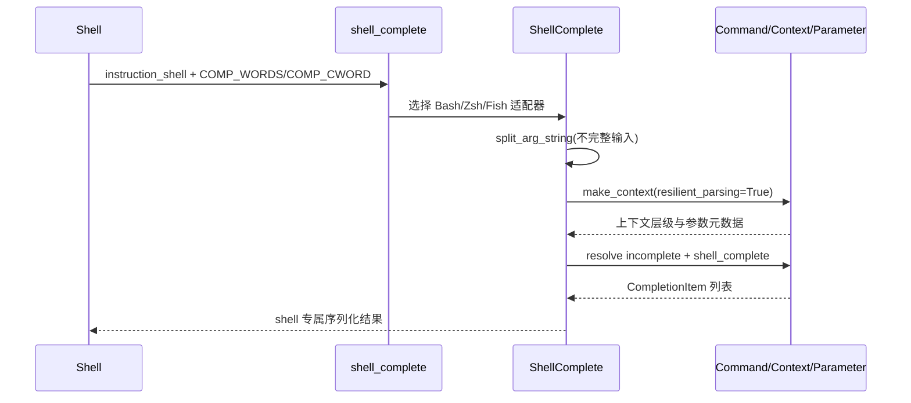
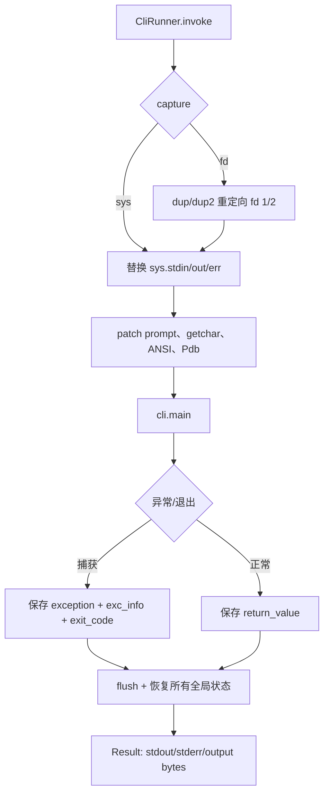

# Click 次要模块批量分析

核心运行、参数和终端主线已经建立。本组模块负责把同一套命令、参数、上下文和输出契约暴露到外围场景：shell completion 面向交互式发现，testing 面向确定性验证，兼容层面向宿主差异，异常和公共导出面向稳定 API 边界。共同哲学是：不复制命令/参数事实，而是复用核心对象；不把平台差异扩散到业务层，而是在边界适配。

## 1. Shell Completion：把核心参数模型投影到 shell

### 职责

读取 shell 传入的环境变量，恢复“已完成参数 + 当前未完成 token”的上下文，并调用核心 `Command`、`Parameter`、`Option`、`Argument` 的 completion 能力，最后按 Bash、Zsh、Fish 的协议序列化建议项（`src/click/shell_completion.py:19-64,216-326`）。

### 全局角色

它是 CLI 元数据的交互式消费端：核心解析器仍是事实来源，completion 只负责在“不完整命令行”上做 resilient parsing 和协议适配。删除它不会影响命令执行，却会让复杂 CLI 失去低成本的可发现性与类型化文件/目录补全。

### 实现方式

`ShellComplete` 提供稳定骨架：`get_completion_args()` 获取 shell 输入，`_resolve_context()` 用 `cli.make_context(..., resilient_parsing=True)` 追踪 Group 层级，`_resolve_incomplete()` 判断当前是选项名、选项值、参数值还是子命令，最后将 `CompletionItem` 交给 shell 子类格式化。内置子类只承担当 shell 的输入/输出协议差异，并通过 `add_completion_class` 保留扩展点（`src/click/shell_completion.py:216-504,599-704`）。

### Why > What

关键设计不是“支持三个 shell”，而是把 shell 差异限制在适配器中，避免为每个 shell 重新实现 Click 的参数语义。否则 Bash、Zsh、Fish 会各自维护 option/value/argument 判断，核心参数模型一改就产生三份漂移逻辑。这里的代价是 shell 环境变量协议和脚本模板需要长期兼容；Zsh 的冒号转义、Fish 的多行 help 转义，正是协议包袱被集中处理的例子（`src/click/shell_completion.py:105-205,404-457`）。

`_resolve_incomplete` 还特意统一了不同 shell 对 `--option=value` 和 `=` 的拆分行为，并尊重 `--` 后不再把 token 当作 option。`_is_incomplete_argument` 直接检查 `ParameterSource`、`nargs` 和已解析值，因此 completion 不需要另造一套“参数是否已消费”的状态机（`src/click/shell_completion.py:542-597,660-704`）。不采用纯文本扫描的原因是嵌套 Group、链式命令、可变 nargs 和 option value 都依赖核心解析规则。

### 核心流程

流程的边界很清楚：模板负责注册 shell 函数，Python 负责理解 Click 语义，`CompletionItem` 负责携带 value/type/help 及可扩展 metadata。未知 shell 或未知 instruction 返回状态码而非污染 stdout（`src/click/shell_completion.py:19-64`）。

### 特别之处

- `split_arg_string` 在引号或转义尚未闭合时保留部分 token；completion 的输入天然是不完整的，直接使用严格 `shlex.split` 会把正常交互状态误判为错误（`src/click/shell_completion.py:506-539`）。
- Bash 在 source 时检测版本，Zsh 以三行记录规避 `_describe` 的冒号语义，Fish 将换行和 tab help 转为安全表示；这些是“边界协议适配”，不是核心命令逻辑（`src/click/shell_completion.py:327-457`）。
- completion 通过注册表允许自定义 shell；因此扩展新 shell 主要增加协议适配器，而不是复制 Command/Parameter 解析（`src/click/shell_completion.py:459-504`）。

### 文件列表

`src/click/shell_completion.py`。

## 2. Testing：在可恢复隔离中重演真实 CLI

### 职责

`CliRunner` 为命令提供输入、环境、stdin/stdout/stderr、颜色、当前目录和异常处理的隔离执行环境，并将执行结果统一封装为可断言的 `Result`（`src/click/testing.py:211-317,399-595`）。

### 全局角色

它把 Click 的“进程级 CLI”转成测试中的可观察对象，同时明确承认隔离会修改解释器全局状态，因此文档要求单线程使用。删除它不会改变生产行为，但会迫使测试依赖 subprocess，难以精确断言返回值、异常、stdout/stderr 顺序和环境恢复（`src/click/testing.py:317-359`）。

### 实现方式

默认 `sys` 捕获替换 Python 层 stream；可选 `fd` 模式先用 `_FDCapture` 通过 `dup/dup2` 重定向 1、2，覆盖 C 扩展、子进程及旧 stream 引用。`StreamMixer` 用两个 `BytesIOCopy` 同时保留独立 stdout/stderr 和按写入顺序混合的 output；`EchoingStdin` 重放输入，`_NamedTextIOWrapper` 维持 name/mode 并避免关闭底层 buffer（`src/click/testing.py:31-209,399-595`）。

### Why > What

测试工具选择进程内隔离，是为了让测试直接观察 Click 的 Python 返回值和异常，同时避免每个断言都支付进程启动成本；代价是必须严格保存和恢复 `sys`、环境、Click 内部 prompt/color 函数以及 `formatting.FORCED_WIDTH`。`isolation` 的 `finally` 恢复路径是这个设计能够成立的关键（`src/click/testing.py:399-595`）。

stdout、stderr 和 terminal output 三者分离，是因为“用户看到的顺序”与“测试要验证的流”并不相同。`Result.output` 只在读取时做 charset 解码、换行归一化，避免捕获阶段损失原始 bytes（`src/click/testing.py:231-315`）。

### 核心流程

`invoke` 先建立 fd 捕获再替换 sys stream，避免 C 层写入绕过捕获；退出时先 flush，再停止 fd 捕获并合并回 `BytesIO`，最后离开 isolation 执行恢复（`src/click/testing.py:596-741`）。`isolated_filesystem` 将 CWD 恢复放进 finally，并默认清理临时目录，因而把文件系统副作用也纳入测试边界（`src/click/testing.py:742-772`）。

### 特别之处

- `capture="sys"` 是默认的安全边界，避免测试代码通过 `sys.stdout.fileno()` 误伤宿主捕获；需要覆盖 subprocess/C 层时显式使用 `fd`。Windows 拒绝 `fd`，把能力差异变成构造时错误而非运行时隐患（`src/click/testing.py:317-381`）。
- prompt 和 getchar 被替换为从测试输入读取的函数，但输入 echo 可暂停，避免 prompt 既由包装器又由 prompt 逻辑重复回显（`src/click/testing.py:399-492`）。
- `pdb.Pdb.__init__` 默认指向 `sys.__stdin__`/`sys.__stdout__`，使隔离中的断点仍能与真实终端交互；这是测试可调试性的局部例外，而非放弃输出捕获（`src/click/testing.py:493-552`）。

### 文件列表

`src/click/testing.py`。

## 3. Platform Compatibility：把宿主不一致压缩到 I/O 边界

### 职责

`_compat.py` 统一文本/二进制流、编码、ANSI、原子文件、TTY、平台默认 stream 和 Windows console 的差异；`_winconsole.py` 以 Windows Console API 提供 UTF-16-LE 的 raw reader/writer，再包装成 Click 可用的 text stream（`src/click/_compat.py:22-354,374-590`; `src/click/_winconsole.py:1-297`）。

### 全局角色

兼容层让核心命令和终端 UI 依赖“可读、可写、可检测编码的 stream”这一抽象，而不是依赖具体操作系统。去掉它，Unicode、重定向、Jupyter、管道、TTY 和 Windows 原生控制台分支会泄漏到 `utils`、`termui` 与命令执行路径中。【阶段7已完成源码核对；运行时限制见交叉验证】

### 实现方式

`_compat.py` 先探测 stream 是 text 还是 binary，再从 `.buffer` 寻找真实二进制层；ASCII 或配置不兼容时，以非关闭 wrapper 重新绑定编码和 errors，并在 `open_stream` 中统一 `-` 标准流、普通文件和 atomic 写入。`should_strip_ansi`、`term_len`、`isatty` 把输出能力抽象为可调用边界（`src/click/_compat.py:59-287,319-590`）。

Windows 路径先确认 `sys.platform == win32`，通过 `GetConsoleMode` 识别真实 console，再使用 `ReadConsoleW`/`WriteConsoleW` 和 UTF-16-LE。`ConsoleStream` 同时暴露 text API 与 `.buffer`，因此上层仍可按普通 stream 使用（`src/click/_winconsole.py:119-297`）。

### Why > What

与在每个输出函数里写 `if Windows` 相比，单一兼容入口把平台差异集中起来，降低核心代码的分支密度；代价是 `_compat` 需要处理许多“看起来像 stream 但接口不完整”的宿主对象，例如 Jupyter 或被替换的 unittest stream。这里选择“尽量恢复可用，必要时以 replace 避免异常”，体现 CLI 工具优先可交互输出而非编码错误纯度的取舍（`src/click/_compat.py:95-287`）。

### 文件列表

`src/click/_compat.py`、`src/click/_winconsole.py`。

## 4. Terminal Presentation Helpers：在不可见控制序列下保持可读布局

### 职责

`_termui_impl.py` 实现进度条、分页器、编辑器、打开 URL、raw terminal/getchar 等终端交互细节；`_textwrap.py` 在保留 ANSI escape 的同时按可见宽度换行和截断（`src/click/_termui_impl.py:57-388,400-945`; `src/click/_textwrap.py:11-188`）。

### 全局角色

这些实现把终端主线的用户体验落到具体宿主：核心命令只需要请求 pager/editor/progress/getchar，不需要知道管道、TTY、Windows 或 ANSI 的细节。【阶段7已完成源码核对；运行时限制见交叉验证】

### 实现方式与特别之处

- `ProgressBar` 用迭代器、计数、时间和 ETA 状态组织增量渲染，并在 context manager/finish 中保证结束行；它把“处理序列”与“如何刷新终端”分开（`src/click/_termui_impl.py:57-388`）。
- `get_pager_file` 按 pager 命令能力选择 pipe、临时文件或 `_nullpager`；失败时回退到借用 stdout，避免关闭调用者的 stream。Windows 优先临时文件以避免 `more` 产生额外换行（`src/click/_termui_impl.py:400-655`）。
- `Editor` 通过临时文件与修改时间判断用户是否保存，平台分支只处理编辑器默认值和换行编码（`src/click/_termui_impl.py:656-771`）。
- Unix `raw_terminal` 暂时切 raw mode 并在 finally 恢复 termios；Windows 使用 `msvcrt.getwch/getwche`，统一把 Ctrl-C、Ctrl-D/Ctrl-Z 翻译成 Python 异常（`src/click/_termui_impl.py:842-945`）。
- `TextWrapper` 将所有宽度测量路由到 `term_len`，长词截断不会切进 ANSI sequence；`extra_indent` 用 context manager 保障临时缩进恢复（`src/click/_textwrap.py:11-188`）。

### 文件列表

`src/click/_termui_impl.py`、`src/click/_textwrap.py`。

## 5. Internal State and Sentinels：区分“未设置”和“特殊控制值”

### 职责

`_utils.py` 提供 `UNSET` 与 `FLAG_NEEDS_VALUE` 两个身份稳定的 sentinel 及类型别名；`globals.py` 提供线程局部 Context 栈和基于当前 Context 的颜色默认值（`src/click/_utils.py:7-36`; `src/click/globals.py:9-67`）。

### 全局角色

sentinel 使参数消费逻辑能区分“用户未提供”与 `None` 等有效值；Context 栈则让深层 helper 在不显式传递 Context 的情况下读取当前调用环境。二者都服务于“核心对象持有事实、外围 helper 读取上下文”的设计，而不是另建配置中心。【阶段7已完成源码核对；运行时限制见交叉验证】

### 实现方式与特别之处

`Sentinel` 使用 Enum 成员保证身份和可读 repr，`T_UNSET`/`T_FLAG_NEEDS_VALUE` 保持静态类型精度（`src/click/_utils.py:7-36`）。`globals` 使用 `threading.local` 保存 stack；`get_current_context(silent=False)` 默认快速暴露调用错误，`silent=True` 则允许像颜色解析这类 helper 在无 Context 时回退（`src/click/globals.py:20-67`）。

### 文件列表

`src/click/_utils.py`、`src/click/globals.py`。

## 6. Exceptions：把解析失败转成一致的用户反馈

### 职责

异常层定义 Click 可处理的错误分类、退出码、参数/命令上下文和用户可读格式，并将错误输出委托给统一 `echo` 与当前颜色策略（`src/click/exceptions.py:19-378`）。

### 全局角色

它是核心执行主线的失败协议：解析器、参数类型、命令调用无需各自打印错误，只需抛出带上下文的异常；顶层再决定显示、退出或继续传播。删除它会把错误文本、退出码和帮助提示散落到每个调用点。【阶段7已完成源码核对；运行时限制见交叉验证】

### 实现方式与特别之处

`ClickException` 缓存构造时的颜色默认值，因为显示时 Context 可能已经被弹出；`UsageError` 绑定 Context，能输出 usage 和 help hint；`BadParameter`/`MissingParameter` 复用 Parameter 的 error hint 与 ParamType missing message；`NoSuchOption`/`NoSuchCommand` 用 `difflib.get_close_matches` 提供候选建议；`FileError` 统一 filename 展示；`Abort` 与 `Exit` 则是内部控制流信号而非普通用户错误（`src/click/exceptions.py:35-378`）。

### Why > What

异常对象携带结构化上下文比在错误点直接 `echo` 更适合 CLI：同一错误既能被测试捕获，也能由顶层统一决定 stderr、颜色和 exit code。代价是异常类与 `Context`、`Parameter`、`utils.echo` 紧密协作，修改一处消息格式可能影响文档、测试和用户脚本；因此它应被视为公共行为契约而非内部实现。【阶段7已完成源码核对；运行时限制见交叉验证】

### 文件列表

`src/click/exceptions.py`。

## 7. Public Export Surface：稳定地把内部能力变成 Click API

### 职责

`__init__.py` 集中重导出核心 Command/Context/Parameter、decorator、类型、终端 helper、异常和 stream 工具，形成用户从 `click` 包根导入的稳定入口；`__getattr__` 延迟提供带弃用警告的历史名称与版本属性（`src/click/__init__.py:1-127`）。

### 全局角色

它是内部模块化实现与用户 API 之间的防腐层：目录可以继续按 core/decorators/types/termui/utils 拆分，而用户代码保持简洁导入。删除或随意收缩它会把内部布局暴露给用户，放大重构成本。

### 实现方式与特别之处

显式 `from ... import X as X` 让导出清单可读且适合静态工具；弃用对象通过模块级 `__getattr__` 延迟导入，只有访问旧名才加载并发出 `DeprecationWarning`，降低常规导入成本并保留迁移窗口。`__version__` 也改为运行时 metadata 查询，明确把版本读取从静态常量迁移到 feature detection（`src/click/__init__.py:78-127`）。

## 8. 设计收束

这组次要表面形成一条外围适配链：核心元数据 → completion/test 的可观察投影 → compat 的 stream/platform 边界 → terminal presentation → exceptions/API 的用户契约。它们最有价值的共同点不是功能数量，而是“不重新解释核心事实”：completion 复用 Parameter/Context，testing 调用真实 `cli.main`，exceptions 复用 Context/Parameter 生成消息，compat 只修复宿主差异。跨模块依赖方向与核心主线的精确边界仍需融合时核对，标记为【阶段7已完成源码核对；运行时限制见交叉验证】。

## 覆盖率

| 文件名 | 总行数 | 已读行数 | 覆盖率 | 未读原因 |
|---|---:|---:|---:|---|
| `src/click/shell_completion.py` | 704 | 704 | 100% | 无 |
| `src/click/testing.py` | 772 | 772 | 100% | 无 |
| `src/click/_compat.py` | 590 | 590 | 100% | 无 |
| `src/click/_termui_impl.py` | 945 | 945 | 100% | 无 |
| `src/click/_winconsole.py` | 297 | 297 | 100% | 无 |
| `src/click/_textwrap.py` | 188 | 188 | 100% | 无 |
| `src/click/_utils.py` | 36 | 36 | 100% | 无 |
| `src/click/globals.py` | 67 | 67 | 100% | 无 |
| `src/click/exceptions.py` | 378 | 378 | 100% | 无 |
| `src/click/__init__.py` | 127 | 127 | 100% | 无 |
| **合计** | **4104** | **4104** | **100%** | **达标✅（standard 次要模块最低 30%）** |
