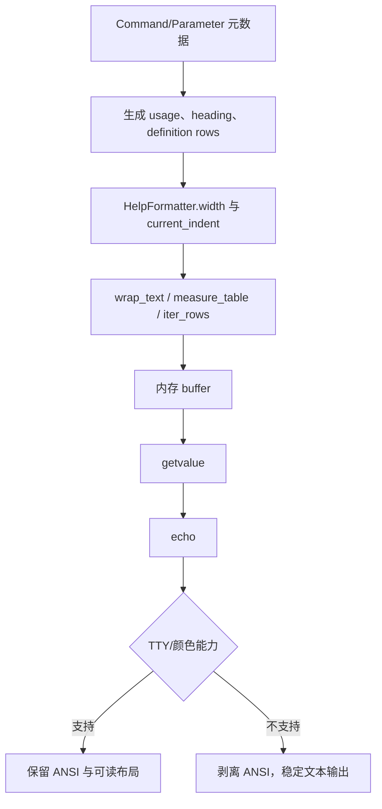
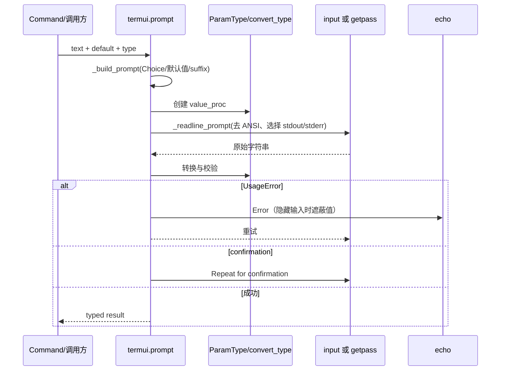
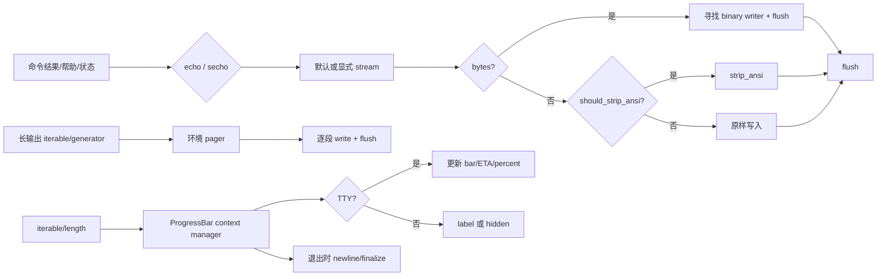

# 终端交互与帮助输出

参数解析模块已经把命令行输入变成结构化值；本模块接着解决“这些值如何被可靠地看见、确认、流式消费”的问题。它把帮助文本、交互式 prompt、普通输出、分页、进度条和终端控制统一放到同一套可检测、可降级的边界中，为下一模块验证 completion、testing 和 platform 复用这些契约铺路。

## 1. 在项目中的角色

Click 的命令执行最终要面对两类消费者：人类在 TTY 中需要可读、可编辑、有颜色和反馈的界面；CI、管道、重定向文件和测试捕获则需要稳定、无控制字符、及时 flush 的字节/文本流。本模块是两者之间的适配层：`formatting.py` 负责把命令元数据组织成可读帮助；`termui.py` 负责交互和动态终端体验；`utils.py` 负责跨平台流、编码、文件和输出生命周期。

去掉它，parser 仍可能能解析参数，但 help 会退化为手写字符串，prompt 无法复用同一套 `ParamType` 转换，非 TTY 输出会泄漏 ANSI 或丢失 flush，二进制流和标准流也容易被错误关闭。Click 的核心目标“少量声明即可构建可组合 CLI”因此会被终端环境差异重新打破。

整体哲学可以概括为：**统一可见输出、TTY 降级、生命周期边界**。所有输出都尽量经过 `echo`；所有需要视觉控制的能力先判断终端；所有借来的标准流与延迟打开的文件都明确区分“谁拥有、何时关闭”。

## 2. 业务问题与设计思路

### 2.1 同一份元数据服务人和 CI

帮助不是静态文案，而是参数的 usage、选项、默认值、choice 和描述的排版结果。`HelpFormatter` 将这些信息写入内存 buffer，通过宽度、缩进、定义列表和段落重排保持稳定布局（`src/click/formatting.py:110-300`）。`wrap_text` 使用可见字符宽度处理 ANSI，并支持段落保留及 `\b` 不重排标记（`formatting.py:31-107`）。这使颜色是显示层附加信息，不会改变换行语义。

### 2.2 交互输入必须沿用类型契约

`prompt` 默认用 `convert_type(type, default)` 产生转换器，因此 prompt 输入与命令参数不会形成两套校验规则（`termui.py:132-242`）。`Choice` 会直接参与 prompt 展示，默认值可以是实际值，也可以用字符串覆盖显示；输入失败只显示错误并重试。隐藏输入时，错误消息会同时遮蔽 repr 形态和原始值，并用边界匹配避免把短值误替换到更长单词里（`termui.py:60-75, 227-231`）。

### 2.3 TTY 与非 TTY 不是两个 API

`echo` 统一处理 stdout/stderr、文本/bytes、ANSI、编码和 flush（`utils.py:245-340`）。`termui._readline_prompt` 在调用 `input`/`getpass` 前自行剥离 ANSI，因为 readline 需要接收完整 prompt，不能先由 `echo` 输出（`termui.py:84-104`）。进度条在 TTY 中更新，在非 TTY 中保留 label 或完全隐藏，避免控制字符污染日志（`termui.py:399-555`）。这是一种“同一调用，按能力降级”的设计，而不是要求调用方分叉人类版和机器版逻辑。

### 2.4 替代方案及代价

- 直接使用 `print`、`input` 和 `open`：实现短，但失去 Unicode/bytes/ANSI/Windows/管道的一致性，且标准流所有权容易混乱。
- 让每个 command 自己排 help：局部灵活，却会产生不同的换行、缩进和默认值展示；组合命令尤其难以保持预测性。
- 所有场景都强制渲染动态进度：对日志管道和 CI 会留下回车控制符或大量噪声；Click 选择 TTY 检测和 label 降级，牺牲部分非交互视觉反馈换取可消费输出。
- 仅用一个“输出字符串”抽象：无法处理 bytes、二进制 writer、延迟文件和借用流；当前实现用少量 wrapper 明确区分这些生命周期与媒介。

## 3. 核心数据结构与边界

### HelpFormatter 的内存构建模型

```text
HelpFormatter
  indent_increment: int
  width: int
  current_indent: int
  buffer: list[str]
```

构造时宽度默认为终端列数限制在 50..78（可用 `FORCED_WIDTH` 覆盖），`section()` 和 `indentation()` 通过 context manager 保证异常路径也会 dedent；`getvalue()` 最后一次性拼接（`formatting.py:110-145, 273-299`）。`write_dl` 将 `(term, description)` 行先测量列宽，再决定同一行或换行缩进（`formatting.py:229-271`）。

### Prompt 的值转换边界

```text
prompt(text, default, hide_input, confirmation_prompt,
       type, value_proc, show_default, show_choices, err)
  -> prompt text + input string
  -> value_proc / convert_type
  -> typed result | retry | Abort
```

`value_proc` 是显式扩展点；没有它时使用 `convert_type`。`_build_prompt` 负责 Choice、默认值、suffix 的展示；`visible_prompt_func` 是可替换的模块级钩子，文档工具和测试可以隔离输入（`termui.py:31-33, 107-122, 194-217`）。

### 输出与流生命周期

`echo` 的输入域是 `str | bytes | bytearray | object | None`，目标可以是显式文件，也可以由 `err` 选择默认 stderr/stdout；bytes 会寻找 binary writer，文本则按颜色策略剥离 ANSI，并始终 flush（`utils.py:245-340`）。

`LazyFile` 保存文件名、模式、编码、错误策略、atomic 标志、底层 `_f` 和 `should_close`；读取会提前检查，真正访问时才打开，退出时只关闭自己拥有的资源（`utils.py:112-203`）。`KeepOpenFile` 包装 stdin/stdout 等借来的流，使 `with open_file("-")` 不会关闭调用者拥有的标准流（`utils.py:206-241, 375-421`）。`PacifyFlushWrapper` 只吞掉关闭阶段的 EPIPE，其他错误仍抛出（`utils.py:515-539`）。

## 4. 核心流程

### 4.1 Help 流程



`write_usage` 在前缀过长时把 args 放到下一行，`write_text` 保留段落并按当前缩进重排，`write_dl` 对选项和命令采用定义列表。这些选择把“展示布局”集中化，调用方只提供语义数据（`formatting.py:158-227, 229-271`）。

### 4.2 Prompt 流程



中断和 EOF 统一转成 `Abort`；隐藏输入时补换行，避免 getpass 在中断时留下坏掉的终端行（`termui.py:194-205, 219-242`）。`confirm` 复用相同 prompt 构建器，定义 y/N 默认语义，非法输入回显错误并重试，`abort=True` 时负回答直接抛 `Abort`（`termui.py:245-301`）。

### 4.3 普通输出、pager 与 progress 流程



`echo_via_pager` 接受字符串、iterable 或 generator function，统一转成文本并在 pager 中逐项 flush，因此慢生成器不会等到管道缓冲区满才可见（`termui.py:323-355`）。`progressbar` 只负责解析参数和注入 `resolve_color_default` 后构造 `_termui_impl.ProgressBar`，上下文边界负责创建、更新和最终换行（`termui.py:399-555`）。`clear` 进一步把 ANSI 清屏限定在 stdout 是 TTY 的场景（`termui.py:558-570`）。

## 5. 与其他模块的协作

| 协作者 | 契约 | 本文件证据 | 结论状态 |
|---|---|---|---|
| `types` | `Choice` 提供可见 choices；`convert_type` 将 prompt 原始字符串变成同样的类型值 | `termui.py:20-22, 116-122, 206-208` | 源码已证实 |
| `exceptions` | `UsageError` 驱动 prompt 重试；`Abort` 统一处理中断、拒绝和终止 | `termui.py:17-18, 227-242, 284-301` | 源码已证实 |
| `globals/_compat` | 颜色默认值、TTY 判断、ANSI 剥离、平台流包装 | `termui.py:14-19, 94-103, 318-320`; `utils.py:13-22, 292-336` | 源码已证实 |
| `core/parser` | 命令和参数元数据应被转换为 formatter 的 usage/options/help 输入 | `formatting.py:158-271` | 【阶段7已完成源码核对；运行时限制见交叉验证】 |
| `secondary` completion/testing/platform | 可能复用 program name、可替换 prompt、可捕获流和稳定无 ANSI 输出 | `termui.py:31-33`; `utils.py:245-340, 542-594` | 【阶段7已完成源码核对；运行时限制见交叉验证】 |

这里的协作方式和整体哲学一致：上层只声明“要展示什么”，底层决定“当前环境能怎样展示”。尤其 `visible_prompt_func` 与 `FORCED_WIDTH` 暗示测试/文档能替换环境变量而不改业务命令；跨模块消费者的具体调用链仍需主 agent 在阶段 7 交叉验证。

## 6. 关键权衡与洞察

1. **可读性与机器稳定性的共同底线是可见字符。** ANSI 只在能力允许时存在，`wrap_text` 也按可见长度计宽；这比“输出阶段统一 strip”更早地保护了布局。但非 TTY 的输出仍是面向人类的文本，而不是独立 JSON/事件协议，若 CI 需要结构化进度，调用方仍需另建协议。
2. **flush 是生命周期契约的一部分。** `echo`、pager 和 progress 都主动 flush，牺牲一部分吞吐换取日志和交互的及时性；对 CLI 进程来说这是合理默认值，但高频批量输出可能需要调用方减少调用次数。
3. **上下文管理器表达所有权，而非仅表达语法。** `LazyFile` 延迟拥有真实文件，`KeepOpenFile` 明确不拥有标准流，`ProgressBar` 在退出时完成最后一行。这种边界比让每个调用方手动 close 更可预测，也是组合命令不互相破坏输出的关键。
4. **动态 UI 默认选择保守降级。** 进度条不在非 TTY 中重绘，pager 把生成器按流消费；如果重新设计，可增加显式 machine-readable progress sink，但不能让 ANSI 重绘成为唯一事实来源。
5. **帮助布局有意保留可扩展的低层 formatter。** `HelpFormatter` 公开了 write/section/write_dl，而非把所有布局封死在 command 层；代价是自定义 formatter 需要理解缩进和宽度不变量。

终端层因此成为解析元数据的最后一跳：它把“结构化值”变成稳定的人机可见契约；下一模块应继续验证这些流、钩子和环境判断如何被 completion、testing 与 platform 层复用。

## 7. 源码证据索引

| 主题 | 源码路径与行号 |
|---|---|
| 隐藏输入、ANSI prompt、类型转换、确认 | `src/click/termui.py:60-301` |
| pager 与 generator flush | `src/click/termui.py:304-355` |
| progressbar 参数与上下文边界 | `src/click/termui.py:399-555` |
| TTY 清屏、颜色、style/secho | `src/click/termui.py:558-767` |
| 编辑器、外部终端能力与暂停 | `src/click/termui.py:771-944` |
| 文本测量、包装和段落 | `src/click/formatting.py:14-107` |
| HelpFormatter 与 options 排列 | `src/click/formatting.py:110-320` |
| LazyFile、KeepOpenFile | `src/click/utils.py:112-241` |
| echo、标准流与 open_file | `src/click/utils.py:245-421` |
| 文件名、应用目录、BrokenPipe 防护 | `src/click/utils.py:424-539` |
| program name 与 Windows 参数展开 | `src/click/utils.py:542-646` |

## 8. 覆盖率

覆盖率按阶段 6 规则计算：通过逐行读取请求的行范围并集 / 文件总行数。三个指定文件均已完整读取。

| 文件名 | 总行数 | 已读行数 | 覆盖率 | 未读原因 |
|---|---:|---:|---:|---|
| `src/click/termui.py` | 960 | 960 | 100% | 无 |
| `src/click/formatting.py` | 320 | 320 | 100% | 无 |
| `src/click/utils.py` | 646 | 646 | 100% | 无 |
| **合计** | **1926** | **1926** | **100%** | **达标✅（standard 核心模块最低 60%）** |
