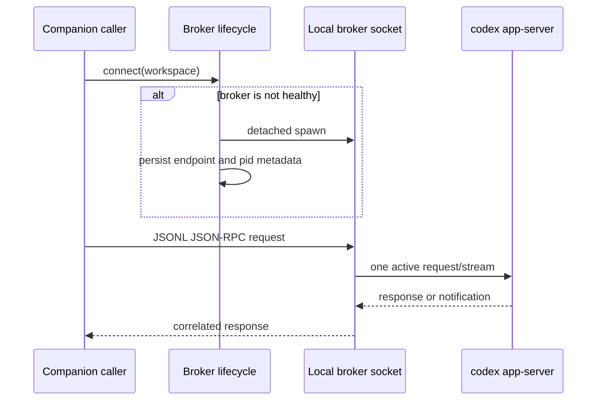
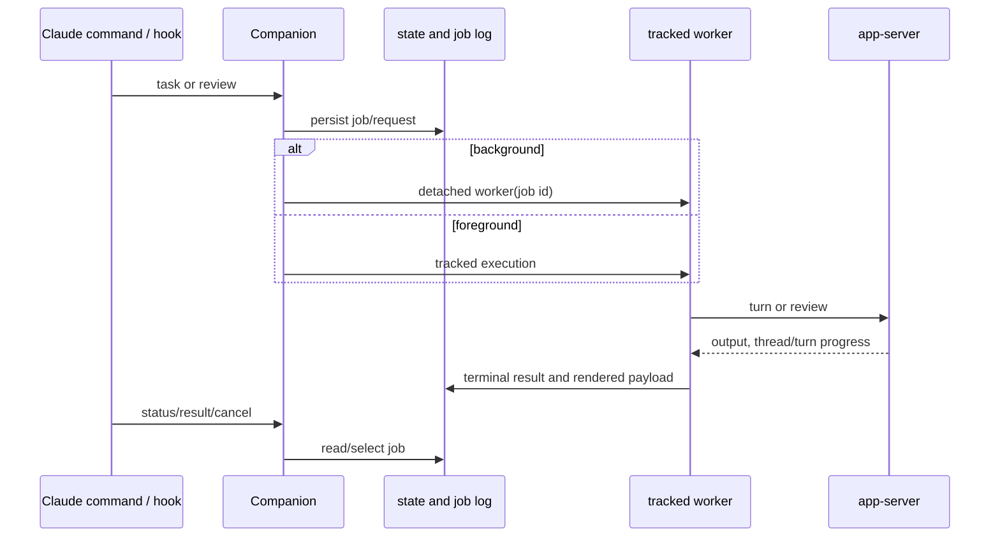

# codex-plugin-cc Architecture Analysis

> Snapshot: `db52e28f4d9ded852ab3942cea316258ae4ef346`
> Mode: reference `repo-analyzer` standard workflow
> Scope: local source snapshot only; no Git history was analyzed.

## The Problem It Actually Solves

`codex-plugin-cc` is not another coding agent. It is a bridge for a developer already working inside Claude Code who wants Codex to review work or take a task without giving up the host's slash commands, hooks, session context, and familiar job controls. The README makes the boundary direct: the plugin uses the local `codex` binary and Codex app server, preserving the user's authentication, checkout, and configuration (`README.md:267-320`).

The alternative is manual context switching: run Codex elsewhere, remember which task is still running, manually reconnect a session, and decide what happens at Claude session end. This project turns that into a controlled local workflow: `/codex:review`, `/codex:adversarial-review`, `/codex:rescue`, `/codex:transfer`, `/codex:status`, `/codex:result`, and `/codex:cancel` are the user-facing pieces (`README.md:7-18`, `126-217`).

External context supports this positioning rather than substituting for code evidence. Official Codex material describes CLI and app-server-compatible local usage with variable task/model usage cost; Claude Code's official overview describes an extensible multi-surface host. The bridge is therefore valuable precisely where teams use both ecosystems but do not want a new remote orchestration platform. The public repository was reported as Apache-2.0 with 27,828 stars and 1,817 forks at retrieval; those volatile figures are not quality evidence.

## Positioning: A Local Control Plane, Not a Model Router

| Option | Optimizes for | What this plugin adds or gives up |
|---|---|---|
| Run Codex CLI independently | direct access, few layers | No Claude command/hook integration or common job view. |
| Multi-agent review plugin | review breadth inside one host | May provide specialist auditors, but does not necessarily delegate to the user's local Codex runtime. |
| Large orchestration/desktop product | cross-agent workspace governance | Broader coordination, but more infrastructure and a different operational boundary. |
| `codex-plugin-cc` | local cross-runtime continuity | Uses filesystem state and a broker, avoiding a service/database at the cost of local lifecycle complexity. |

The source's consistent philosophy is **explicit boundaries over implicit agent handoff**. A command becomes an input contract; an app-server process gets a discoverable endpoint; an asynchronous run becomes a job record; output becomes either a structured schema or a renderer payload. That coherence matters more than any individual helper function.

## System Overview

```mermaid
flowchart LR
  U[Claude Code user] --> CMD[/codex commands]
  H[SessionStart / SessionEnd / Stop hooks] --> CMD
  CMD --> C[Codex companion orchestrator]
  C --> J[Workspace state: jobs, logs, config]
  C --> B[Shared local broker]
  B --> A[Local codex app-server]
  A --> B --> C
  C --> R[Rendered output or JSON]
  R --> U
```

The public declaration layer defines the command/hook contracts; the command orchestrator normalizes those into jobs and app-server calls; the broker owns the actual stateful protocol process; persistent state makes background work visible to `status`, `result`, and `cancel`.

## 1. Public Contract: Separate Permission Tracks

The plugin's Markdown command contracts are not cosmetic. `review` and `adversarial-review` explicitly say they are review-only, prohibit patches, and return Codex output verbatim (`plugins/codex/commands/review.md:13-16,42-49`; `adversarial-review.md:15-18`). Both accept foreground/background dispatch and select a Git target; adversarial review additionally accepts a focus statement (`adversarial-review.md:22-45`). Their structured result schema requires verdict, summary, findings with file/line/confidence, and next steps (`schemas/review-output.schema.json:1-87`).

`rescue` is intentionally different. It invokes the dedicated `codex-rescue` subagent and can carry an explicit write request (`commands/rescue.md:7-20`; `agents/codex-rescue.md:11-42`). This is a sound boundary: a code review should not silently become a fix, while delegated implementation needs a clearly separate permission track.

The tradeoff is enforcement location. Markdown `allowed-tools` and natural-language constraints depend on Claude Code honoring the host contract. Runtime code reinforces review behavior with review-specific paths, but a Markdown policy is not equivalent to an operating-system sandbox. The design is defensible as a host plugin, provided the project continues to keep the runtime checks narrow.

Hooks complete that public contract: SessionStart and SessionEnd use five-second command hooks, while Stop permits a 900-second review-gate check (`plugins/codex/hooks/hooks.json:1-38`). The README candidly warns that an enabled review gate can form long Claude/Codex loops and consume limits (`README.md:225-237`), an example of making an operational cost visible rather than hiding it behind automation.

## 2. Runtime Broker: One Stateful Protocol Owner

The central architecture choice is to share a dedicated local `codex app-server` through a broker rather than spawn a new server for every call. `CodexAppServerClient.connect` chooses an explicit endpoint, environment endpoint, live broker session, or only then direct spawn (`plugins/codex/scripts/lib/app-server.mjs:335-353`). The lifecycle layer records endpoint, PID/log paths, and session directory so later commands can probe/reuse or tear down a stale session (`lib/broker-lifecycle.mjs:76-170`).



This solves a subtle problem that a simple child-process wrapper would defer: app-server turns and notifications are stateful, and several Claude actions may target one working directory. The broker uses request IDs and a pending map to reconnect JSONL responses to promises (`lib/app-server.mjs:57-176`). More importantly, it explicitly allows only one active normal request or stream and returns a busy error (`-32001`) rather than silently queueing; `turn/interrupt` is the deliberate exception, and `turn/completed` releases the stream lock (`scripts/app-server-broker.mjs:12-22,84-100,170-205`).

Choosing rejection rather than a broker-side queue is a good interaction design for an agent tool. A hidden queue would obscure when a costly Codex run begins and make cancellation semantics harder to explain. The price is that caller experience depends on clear busy-error rendering or retry policy; no explicit queue was found in the reviewed command paths. A useful evolution would return retry metadata or offer an observable queue without surrendering interruption priority.

## 3. Jobs and Lifecycle: From a One-shot Command to a Recoverable Work Unit

The companion script is the translation layer between human command intent and durable execution. It parses options, finds the workspace, selects model/reasoning/sandbox policy, creates jobs, and delegates execution to app-server helpers (`scripts/codex-companion.mjs:9-65,762-880`). Its state root hashes the real workspace path and stores a compact index plus individual job JSON/log files (`lib/state.mjs:29-43,80-115,166-190`).



For `task --background`, the worker reloads the request by job ID, so the originating CLI can exit without losing the definition of work (`codex-companion.mjs:604-613,671-710,838-880`). The same state plane makes result lookup and cancellation meaningful. Cancellation first asks the app server to interrupt a thread/turn, then terminates the local process tree and marks persisted state cancelled (`codex-companion.mjs:963-1021`). That two-layer protocol is better than killing only a local PID, because it attempts to stop the remote logical turn as well.

The state implementation is intentionally lightweight, closer to an IDE task runner than a durable queue service. `upsertJob` maintains an index while job files hold detailed requests/results. This gains inspectability and zero services but creates the project’s clearest architectural risk: direct JSON updates have no visible lock or atomic replacement protocol (`lib/state.mjs:92-115,166-170`). It is accurate to call this a concurrency risk, not an observed corruption bug. If this plugin grows more parallel, atomic temp-write/rename plus a lock, or SQLite, should be a first-class investment.

Session lifecycle defines ownership sharply. SessionStart records the Claude session/transcript context; SessionEnd tries to shut down the broker, kill queued/running jobs for that session, remove records, and tear down endpoint/PID/log material (`session-lifecycle-hook.mjs:20-40,42-114`). This prevents invisible local processes from surviving a user session, but it means in-flight work is not portable across sessions even where the resulting Codex thread can later be resumed. An explicit detach/adopt command would make that tradeoff user-controlled.

## 4. Optional Stop Gate: Quality Automation With a Visible Cost

The Stop hook is not ordinary review dispatch. When configured, it runs a marked task that examines only the prior Claude turn's direct edits; malformed/empty/unknown gate output is fail-closed, while disabled configuration or unavailable Codex allows the stop with a note (`stop-review-gate-hook.mjs:40-175`; `codex-companion.mjs:540-554`). This is a sensible distinction: a quality gate should not quietly treat invalid review output as approval.

The product has deliberately chosen a mixed availability model. Gate enabled and functioning means conservative blocking; unavailable Codex means the user can still end the session. That is more usable than treating Codex availability as a hard dependency, but it prevents calling the gate a universal assurance mechanism. Status should make the distinction highly visible: disabled, unavailable, timed out, blocked, or allowed.

## Evaluation

### What is unusually good

- The architecture draws clear boundaries between declaration, orchestration, protocol ownership, and user-visible state.
- Background work is a first-class object with IDs, logs, progress, result rendering, and cancellation rather than an abandoned shell process.
- Review and implementation delegation have distinct contracts, lowering accidental mutation risk.
- The broker makes concurrency a visible policy decision rather than an accidental consequence of multiple child processes.

### Where it will feel pressure

- **State write integrity:** index/job double writes and no lock are exposed to concurrent writers.
- **Startup contention:** broker discovery, spawn, and save form a likely first-use race without a cross-process single-flight lock (`lib/broker-lifecycle.mjs:76-170`).
- **Spawn durability window:** the job lifecycle has a narrow ordering concern around detached worker creation and persisted queued state (`codex-companion.mjs:684-698`).
- **Release narrative drift:** `npm run check-version` verifies manifests at 1.0.6, but `plugins/codex/CHANGELOG.md:1-5` only lists 1.0.0. Machine-readable release consistency is good; human-readable release history lags.

None of these invalidate the design. They are the predictable debt incurred by choosing a simple, local, service-free control plane. The design should retain that simplicity until concurrency and operational scale make the debt expensive, then evolve persistence and broker startup before adding more cross-agent features.

## Verification and Limits

- `npm test`: passed 27 subtests.
- JavaScript syntax check: passed when limited to `.mjs` files.
- JSON parse check: passed when JSON was parsed separately.
- `npm run check-version`: passed; manifests match `1.0.6`.
- The source HEAD remained the required fixed value and source `git status --porcelain=v1` was empty before/after; selected source-file hashes were unchanged.
- Build was not run because its prebuild writes generated types under the fixed source tree, prohibited by this baseline contract.
- No Git history was read. Runtime code itself contains Git commands for its product behavior; that is code analysis, not execution of history analysis.
- Detailed module coverage is recorded outside this report in `drafts/08-coverage.md`: both core modules and the secondary public surface reached 100% of their allocated effective scope.

## Sources

External sources used only for product context: GitHub repository metadata (`https://github.com/openai/codex-plugin-cc`), OpenAI Codex pricing (`https://developers.openai.com/codex/pricing`), and Claude Code overview (`https://docs.anthropic.com/en/docs/claude-code/overview`). Search and retrieval limitations are documented in `drafts/03-research.md`.
