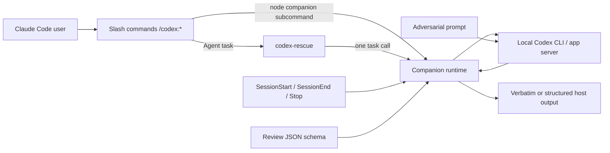

# 模块分析：插件声明面与用户契约

> 范围：仅分析发布清单、用户文档、命令/提示词/技能/agent/hook/schema，以及版本同步脚本。未读取或评价其引用的 companion runtime 实现；测试按任务约束排除。源码快照：`db52e28f4d9ded852ab3942cea316258ae4ef346`。

## 角色与叙事位置

该模块不是另一套 Codex 执行器，而是把本机 Codex CLI/app server 投影进 Claude Code 的**声明式控制平面**。README 把产品界定为在既有 Claude 工作流中发起审查或委派（`README.md:1-6`），并明确复用相同本机安装、认证、checkout 和配置（`README.md:267-285`, `302-320`）。市场清单只发布一个 `codex` 插件（`.claude-plugin/marketplace.json:1-21`），插件清单也只承担身份与版本（`plugins/codex/.claude-plugin/plugin.json:1-8`）。

这服务于贯穿项目的哲学：**Claude 负责可见的交互编排，Codex companion 是唯一的运行时边界，结果尽量原样回传**。去掉此层，底层脚本即使仍可调用，也失去 slash-command、子代理、生命周期钩子和安全语义这些 Claude Code 原生入口。它为后续的 runtime/state 模块提供命令参数、hook 事件和 JSON 输出契约；这些跨模块实现关系待主 agent 对 runtime 源码验证。

## 公共接口：命令族而非通用聊天入口

| 接口 | 输入/调度契约 | 输出与副作用边界 | 证据 |
|---|---|---|---|
| `review` | `--wait`/`--background`、`--base`、`--scope auto|working-tree|branch`；无显式模式时先用 git 规模判断并只问一次 | 明确只读；前台 stdout 原样返回，后台不轮询 | `commands/review.md:1-61` |
| `adversarial-review` | 同一目标选择，但可追加 focus；拒绝 staged/unstaged scope | 同样只读，目标是挑战设计前提而非更严格的普通 review | `commands/adversarial-review.md:1-66` |
| `rescue` | 任务文本及 resume/fresh/model/effort；无选择时检查可续接线程 | 通过受限子代理将结果原样返回；实现/诊断可交给 Codex | `commands/rescue.md:1-49` |
| `setup` | 可切换 review gate；当 Codex 缺失且 npm 可用时才征询安装 | 唯一显式允许全局 npm 安装的用户确认路径 | `commands/setup.md:1-37` |
| `status` / `result` / `cancel` / `transfer` | job id、等待参数或导入源 | 查询、回收、取消、跨工具会话迁移；`result` 和指定 job 的 `status` 禁止摘要 | `commands/status.md:1-17`, `result.md:1-15`, `cancel.md:1-8`, `transfer.md:1-10` |

两个 review 命令的共同点是把风险控制前移到宿主交互：工具权限仅限读取、git 和 node，且文本反复禁止修复（`commands/review.md:13-17`, `adversarial-review.md:15-19`）。这是比“让模型自行保持只读”更稳的声明层约束。代价是规则散落于 Markdown 并依赖 Claude Code 正确解释；实际 runtime 是否再次强制只读，不能从本模块证明。【待主 agent 验证】

`rescue` 反过来是有意窄化的写入入口。命令不自己执行任务，而规定调用 `codex:codex-rescue`，并从自然语言中剥离 Claude 调度标记（`commands/rescue.md:7-20`）。子代理进一步限定为“一次 Bash 调用”、不检查仓库、不轮询，并默认给写请求加 `--write`（`agents/codex-rescue.md:11-42`）。这将“委派”与“审查”分成不同权限轨道；代价是子代理自身不具备失败恢复或解释能力，Bash 失败时甚至要求返回空输出（`agents/codex-rescue.md:41-42`），会降低可诊断性。

## 结构化审查与 stop gate

对抗审查 prompt 采用怀疑优先的失败面清单，并要求每项 finding 有定位、置信度和可执行建议（`prompts/adversarial-review.md:1-80`）。其 JSON schema 固定 verdict、summary、findings、next_steps，禁用未知字段，finding 强制严重度、路径、行区间、置信度与建议（`schemas/review-output.schema.json:1-87`）。这比自由文本便于 runtime 可靠解析和 UI 呈现，且与结果处理技能“保留证据边界、按严重度排序、审查后停止”一致（`skills/codex-result-handling/SKILL.md:7-21`）。

Stop prompt 将 gate 限制为**仅上一 Claude turn 的直接编辑**，非编辑则立即 `ALLOW`；只有有可证实 blocking issue 才 `BLOCK`（`prompts/stop-review-gate.md:1-36`）。hook 同时登记 SessionStart、SessionEnd（5 秒）和 Stop（900 秒）（`hooks/hooks.json:1-38`）。这种事件划分避免把每次状态回复变成昂贵审查，但 15 分钟 Stop timeout 与 README 警告的“长循环和快速消耗额度”相符（`README.md:220-237`）：它是一项需主动监控的可选控制，而非安全默认值。是否由 setup 在持久状态中真正启停，需查 runtime。【待主 agent 验证】

## 内部规则与版本发布契约

`codex-cli-runtime` 将 rescue 严格约束为对 `task` 的一次转发，规定 model/effort、resume/fresh 与 `--write` 的映射（`skills/codex-cli-runtime/SKILL.md:7-43`）。`gpt-5-4-prompting` 则定义 XML 分块、结果契约、验证与 grounding 的提示词方法（`skills/gpt-5-4-prompting/SKILL.md:7-54`）。前者限制权限扩散，后者让交给 Codex 的复杂请求可复用且可验证；两者共同体现“契约胜过临场解释”。

发布面有四个版本来源：根 package、lockfile、插件 manifest、marketplace metadata/entry。`bump-version.mjs` 以 semver-like 校验、JSON 读写和 `--check` 逐项比对来保持它们一致（`scripts/bump-version.mjs:6-73`, `122-220`）；`package.json` 将该检查、类型构建和测试暴露为 scripts（`package.json:1-22`）。当前源码的 package、marketplace 和插件 manifest 都声明 `1.0.6`（`package.json:1-22`, `.claude-plugin/marketplace.json:1-21`, `plugins/codex/.claude-plugin/plugin.json:1-8`），但插件 changelog 仅列 `1.0.0`（`plugins/codex/CHANGELOG.md:1-5`）。这不是运行时版本不一致，却是发布可追溯性缺口：消费者无法仅从 changelog 理解 1.0.1-1.0.6 的变化。

## 关键权衡与风险

1. **原样回传 vs 宿主友好体验。** review、result、transfer 和 rescue 多处要求 stdout 不改写（如 `commands/review.md:42-49`, `commands/transfer.md:7-10`），最大化证据保真、避免 Claude 误释义；但输出格式、错误可读性和界面一致性全依赖 companion。`status` 的无 job-id 表格化是有价值的例外（`commands/status.md:10-17`）。
2. **声明式权限 vs 可执行强制。** Markdown `allowed-tools` 以及“禁止修复”的自然语言契约可降低误操作，尤其适合审查；但它不是替代 runtime 侧参数验证和权限收敛的安全边界。重点验证 review subcommand 是否拒绝写操作与未支持 scope。【待主 agent 验证】
3. **会话连续性 vs 意外上下文复用。** rescue 默认先发现最新可恢复线程并按用户选择追加 `--resume`（`commands/rescue.md:21-37`），有利于长任务；但“latest for repo/session”的归属与隔离策略不在声明层可见，需检查 state 及 broker 模块。【待主 agent 验证】
4. **同步自动化 vs 发布说明漂移。** 版本脚本能同步 machine-readable manifests，却未包含 CHANGELOG；将 changelog 纳入 release checklist 或脚本的显式验证会使发布语义与版本号保持一致。

## 覆盖率明细

“已读”按本次实际逐行 `nl -ba`/`sed` 读取的范围计算。Markdown/JSON 清单是本模块有效代码与配置契约；测试明确排除。参考工作流的标准模式对次要模块最低覆盖率为 30%。

| 文件组 | 文件数 | 总行数 | 已读行数 | 覆盖率 | 未读原因 |
|---|---:|---:|---:|---:|---|
| 根 README、package、marketplace | 3 | 363 | 363 | 100% | 无 |
| plugin manifest、CHANGELOG | 2 | 13 | 13 | 100% | 无 |
| commands | 8 | 263 | 263 | 100% | 无 |
| prompts | 2 | 120 | 120 | 100% | 无 |
| skills `*/SKILL.md` | 3 | 118 | 118 | 100% | 无；linked references 不属于分配范围 |
| agent、hooks、schema | 3 | 171 | 171 | 100% | 无 |
| `scripts/bump-version.mjs` | 1 | 227 | 227 | 100% | 无 |
| **合计（次要模块）** | **22** | **1,275** | **1,275** | **100%** | **✅ 达标（要求 >=30%）** |

限制：未使用 Git history；未修改源树；未执行写入型 version bump、npm install、插件命令或 external research。未运行测试，且测试按任务要求不计入有效代码/覆盖率。所有跨越到 companion runtime、state、broker 的结论均标为待主 agent 验证。
