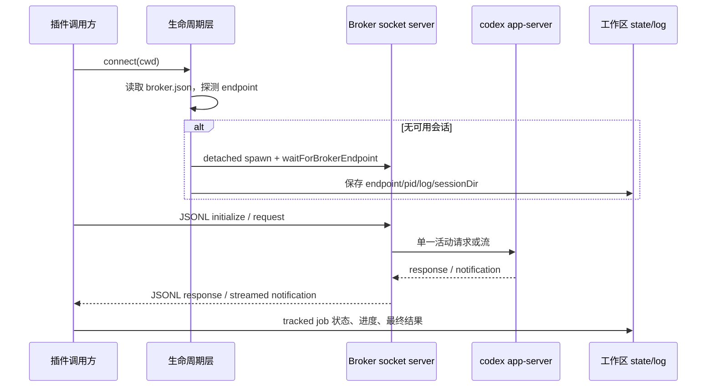

# 模块：共享 App-Server Broker 与受控作业运行时

> 叙事衔接：插件表面把 Claude Code 的命令翻译为 Codex 调用；真正进入命令工作流之前，必须先解决一个更底层的问题：多个调用者如何安全地共用一个有状态的 `codex app-server`。本模块建立这条隔离的控制平面，并把长任务从一次命令执行变成可查询、可取消的本地记录。下一个模块应继续说明这些记录如何被命令编排层创建、消费和收束。

## 角色与问题

这个核心模块是 Node 插件的**本地控制面**：它在工作区旁保存一个可复用的 broker 会话，broker 自己独占一个 `codex app-server` 子进程；其他插件调用方通过 Unix socket 或 Windows named pipe 使用 JSONL/JSON-RPC 接入。它还为后台 Codex 任务写入状态、进度和日志，使交互式命令可在稍后读取结果或定位取消目标。

去掉 broker，调用方必须各自生成 app-server，既失去线程/流式通知的连续性，也更容易并发争用 CLI。去掉 tracked jobs，后台工作在调用进程退出后就只剩不可索引的输出。两者共同体现项目的设计哲学：**跨 CLI/协议边界显式化，跨进程状态落到可恢复的本地文件，而不是依赖内存中的隐式协调。**

## 设计：一个受串行约束的协议桥，而不是共享 SDK

`CodexAppServerClient.connect` 先按显式 endpoint、环境变量、已有会话、按需启动 broker 的顺序选择传输；没有 broker 时才直接 spawn `codex app-server`（`lib/app-server.mjs:335-353`）。客户端基类以递增 id 和 `pending` Map 将 JSONL 应答重新关联到 Promise，统一处理通知、协议错误和连接退出（`lib/app-server.mjs:57-176`）。

broker 是独立进程而非调用方内嵌单例：生命周期层在临时目录创建 endpoint、pid/log 文件，detach 启动脚本并探测就绪后，将会话 JSON 存入工作区 state 目录（`lib/broker-lifecycle.mjs:113-170`）。这把“谁拥有 Codex 子进程”收束到一个可探测、可清理的实体。

broker 进一步明确了共享的代价：常规请求只能有一个活动 socket；流式 `turn/start`、`review/start`、`thread/compact/start` 完成前也锁定所有者，只有另一连接发出的 `turn/interrupt` 被特许穿透（`app-server-broker.mjs:12-22,170-205`）。通知优先路由给短请求所有者，否则路由给流所有者，并以 `turn/completed` 的 thread id 释放流锁（`app-server-broker.mjs:84-100`）。

## 关键数据与持久状态

| 数据 | 形状/位置 | 用途与证据 |
|---|---|---|
| `pending` | `Map<requestId, {resolve,reject,method}>` | 将多路 JSONL response 收敛为 Promise；退出时逐一 reject，避免调用方悬挂（`lib/app-server.mjs:57-74,86-98,136-176`）。 |
| broker session | `{ endpoint, pidFile, logFile, sessionDir, pid }`，`broker.json` | 重用本地 broker，失活时拆除文件与 socket 后重建（`lib/broker-lifecycle.mjs:13,76-100,113-170`）。 |
| socket ownership | `activeRequestSocket`、`activeStreamSocket`、`activeStreamThreadIds` | 用显式所有权而非队列实现共享互斥和流完成判定（`app-server-broker.mjs:68-100,197-220`）。 |
| tracked job | 运行记录含 `status`、时间、`pid`、`phase`、thread/turn id、log 文件、结果 | 启动即写 `running`，完成时落终态和 rendered payload，异常时保留失败信息（`lib/tracked-jobs.mjs:142-203`）。 |
| status snapshot | running/latest/recent job 加 elapsed、phase、progress preview | 将底层文件记录转成命令可呈现的状态视图（`lib/job-control.mjs:161-180,213-240`）。 |

## 文件职责与依赖

| 文件 | 职责 | 直接依赖 |
|---|---|---|
| `scripts/app-server-broker.mjs` | socket server、JSON-RPC 初始化/关闭、独占与流通知路由 | `app-server`、`broker-endpoint`、Node `net/fs`（`3-10,48-247`） |
| `lib/app-server.mjs` | JSONL 客户端抽象，direct/broker transport 选择 | lifecycle、endpoint、process helper（`10-17,183-353`） |
| `lib/broker-endpoint.mjs` | 将会话目录编码/解析为 Unix socket 或 pipe | Node `path/process`（`1-41`） |
| `lib/broker-lifecycle.mjs` | 会话创建、保存、健康检查、detached spawn 与 teardown | endpoint、state（未在本轮范围内读取）（`8-9,59-208`） |
| `lib/process.mjs` | 同步命令包装与跨平台进程树终止 | Node child process/process（`1-134`） |
| `lib/tracked-jobs.mjs` | job 日志、进度去重、状态迁移与异常落盘 | state（未在本轮范围内读取）（`1-4,70-203`） |
| `lib/job-control.mjs` | session 过滤、状态/结果/取消目标解析、展示增强 | codex/state/workspace（未在本轮范围内读取）（`1-6,213-308`） |

## 关键决策与权衡

1. **每工作区一个可探测 broker，而非每请求 spawn。** `ensureBrokerSession` 先验证记录的 endpoint，失效才 teardown 后重启（`lib/broker-lifecycle.mjs:102-170`）。这以临时目录、状态文件和清理责任换取 app-server 重用与稳定的连接边界；直接 spawn 更简单，却会让并发客户端各自拥有不协调的会话。

2. **拒绝并行请求，而非在 broker 中排队。** 忙时返回专用 `-32001`，只有 interrupt 可以越过流锁（`app-server-broker.mjs:170-194`；错误码定义于 `lib/app-server.mjs:22-23`）。显式失败把重试或用户决策交还上层，避免一个隐式队列令“何时开始”的语义不可见；代价是并发调用方需要处理 busy。

3. **作业状态双写为明细文件与索引。** 进度 updater 先 upsert 索引，再在明细仍存在时合并重写；终态也分别写两处（`lib/tracked-jobs.mjs:70-115,151-202`）。它优化了 status 扫描和单 job 完整性，但不是事务：进程在两次写之间死亡时两份视图可能短暂不一致。

## 与业界方案的对比

这更接近 Language Server Protocol 的本地 JSON-RPC transport 加一个单执行者 actor，而不是 HTTP 服务池：换来无端口暴露、与 CLI 进程自然同机的边界，放弃了跨机器扩容和多并发吞吐。与由 supervisor（systemd/launchd）管理的 daemon 相比，这里用临时目录、pid、日志和 socket 自行完成最小生命周期管理（`lib/broker-lifecycle.mjs:15-17,59-70,173-208`）；部署零依赖，但崩溃恢复、锁竞争和诊断能力较弱。

## 风险、限制与待验证边界

- **启动竞争。** `load -> probe -> spawn -> save` 没有跨进程锁（`lib/broker-lifecycle.mjs:76-170`）；同一工作区首次并发连接可能各建 broker，最终 state 指向最后写入者。可用原子锁文件或一次性 compare-and-swap 改进。
- **清理是尽力而为。** teardown 忽略不存在进程、socket、非空目录等错误（`lib/broker-lifecycle.mjs:173-208`），提高幂等性但会掩盖残留；broker 的 shutdown 也直接 `process.exit(0)`（`app-server-broker.mjs:160-164`）。
- **流解锁依赖通知形状。** 仅匹配 `turn/completed` 和初始化时收集的 thread id（`app-server-broker.mjs:84-100,203-205`）；若下游协议遗漏/改变完成通知，broker 会持续 busy。
- 【待主 agent 验证】`state.mjs` 的 `upsertJob`、文件路径和原子性决定双写不一致的实际可见性；本模块只验证了调用契约，未读取其实现。
- 【待主 agent 验证】命令编排层是否会在 `-32001` 时重试、提示或序列化，决定“busy”是否为可接受的用户体验。
- 【待主 agent 验证】取消命令实际如何调用 `resolveCancelableJob` 与进程/turn interrupt；本轮范围只证明选择规则，不证明执行路径。

## 覆盖率

读取方法：对下列限定源码文件逐行读取（`nl -ba`）；未读取导入的 `state.mjs`、`codex.mjs`、`workspace.mjs` 等范围外依赖，且未运行 broker，以遵守只分析指定文件、不得修改源码的约束。

| 文件名 | 总行数 | 已读行数 | 覆盖率% | 未读原因 |
|---|---:|---:|---:|---|
| `scripts/app-server-broker.mjs` | 252 | 252 | 100% | 无 |
| `scripts/lib/app-server.mjs` | 354 | 354 | 100% | 无 |
| `scripts/lib/broker-endpoint.mjs` | 41 | 41 | 100% | 无 |
| `scripts/lib/broker-lifecycle.mjs` | 209 | 209 | 100% | 无 |
| `scripts/lib/process.mjs` | 135 | 135 | 100% | 无 |
| `scripts/lib/tracked-jobs.mjs` | 204 | 204 | 100% | 无 |
| `scripts/lib/job-control.mjs` | 308 | 308 | 100% | 无 |
| **合计** | **1503** | **1503** | **100%** | **✅ 达到 standard 核心模块最低 60%** |
