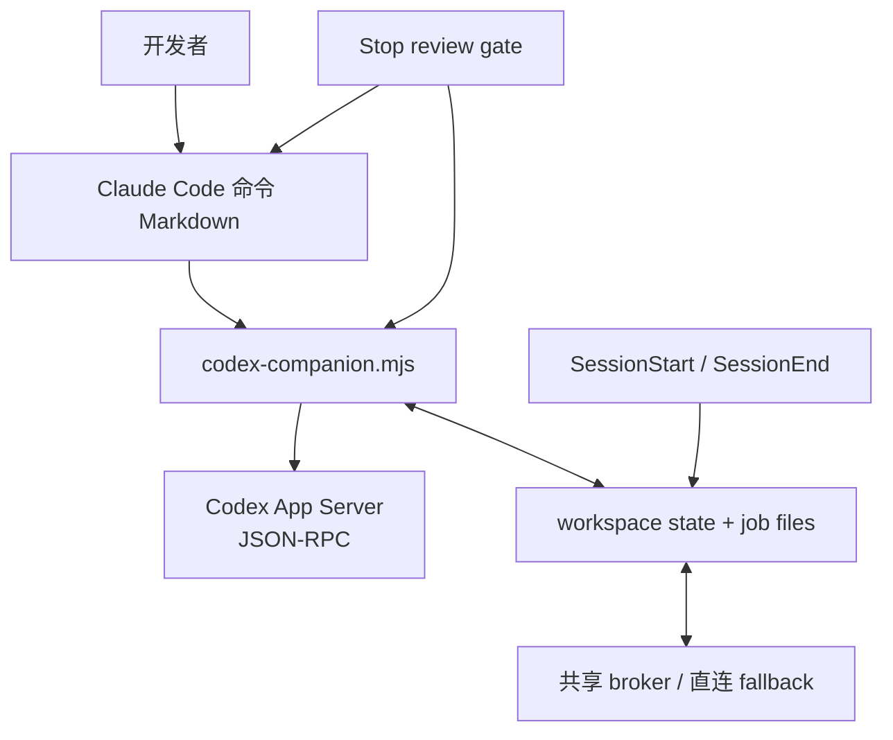
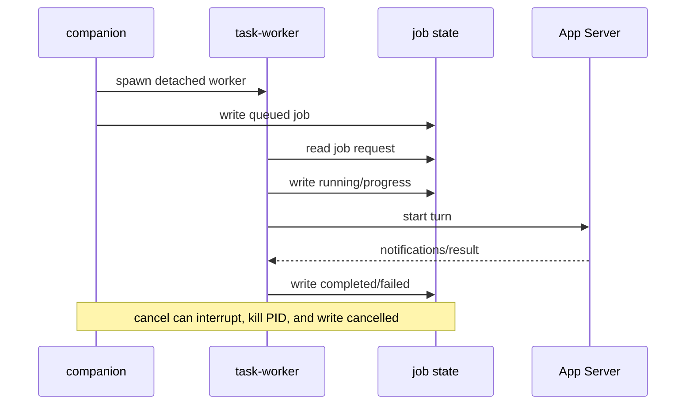

# codex-plugin-cc 架构分析

> 物理基线：固定源码 HEAD `db52e28f4d9ded852ab3942cea316258ae4ef346`。本报告仅依据该本地快照与其内置文档；未使用 Git 历史或外部研究。

## 它解决的不是“再包一层 CLI”

Claude Code 用户已经处于一个代理式开发流程中，却可能希望让 Codex 做独立的只读 review、对抗性设计质询、可写入的 rescue，或接管一段可恢复的会话。直接让 Claude 运行一条 `codex` 命令不够：用户还需要前后台选择、任务身份、结果检索、取消和会话边界。README 对此给出的产品面是 `/codex:review`、`/codex:adversarial-review`、`/codex:rescue`、`/codex:status`、`/codex:result`、`/codex:cancel` 和 `/codex:transfer`（`README.md:8-18`）。

项目的定位很克制：它复用本机已经安装、认证和配置好的 Codex CLI/App Server，而不是复制一个 Codex runtime（`README.md:261-320`）。因此最值得分析的不是 AI 提示本身，而是两套宿主运行时之间的责任划分。

外部竞品/官网调研没有执行，因为本次调用明确限制为固定本地源码树；这意味着下文的生态定位只来自项目自述。

## 全景：四层，而非一个万能脚本

1. **命令层**把交互语义放在最接近 Claude 的地方：询问是否后台、规定 review 只读、控制何时转交 rescue。它不把这些宿主决策偷偷塞进 Node（如 `plugins/codex/commands/review.md:18-61`）。
2. **companion 层**把参数、review target、task request 和呈现统一为可执行协议，主分派表在 `codex-companion.mjs:1024-1073`。
3. **App Server 层**用 JSON-RPC 处理 thread、turn、通知和原生 review，而不是从 CLI 文本中猜状态（`lib/app-server.mjs:57-176`）。
4. **状态/Hook 层**让长任务跨进程可见，并在会话开始、结束和 Stop 时施加最小生命周期规则（`lib/state.mjs:19-27`; `hooks/hooks.json:1-38`）。

贯穿的设计哲学是“**边界显式、所有权单一**”：Claude 负责宿主体验，Codex 负责模型回合，本地状态负责恢复与取消，Hook 负责政策。这个分离是项目最强的可维护性来源，也暴露了它最弱的一环：多进程状态写入。

## 命令编排：把一次调用升级为可呈现的回合

普通 review 与 adversarial review 没有假装相同。前者将未提交变更或 base branch 映射为原生 `review/start`；后者先收集 Git 上下文、用只读 sandbox 和 `review-output.schema.json` 发起普通 turn（`codex-companion.mjs:358-417`）。代价是两条代码路径，但换来原生审查的标准行为与定制质询的表达能力都不被削平。

参数解析刻意保守：只识别每个子命令声明过的 option，`--` 后和未知内容保持为自由文本；单字符串输入才经过轻量 tokenizer（`lib/args.mjs:1-128`）。这比通用“全局 flags”更不容易让新参数意外改变 prompt，但未闭合引号不会被诊断，是合理但可改进的简化。

App Server client 与 turn capture 的分界尤其值得借鉴。前者维护 request id、pending promises 与 JSONL framing；后者缓冲可能早于 `turn/start` 响应到达的通知，并等协作子任务结束才判断回合完成（`lib/codex.mjs:303-610`）。如果把这两件事混进一个 stdout loop，就很难正确处理多 thread 和乱序事件。

共享 broker 也没有成为功能前提：明确的 busy 或连接失败才回退直连，鉴权/协议错误不会被吞掉（`lib/codex.mjs:613-642`）。这是对本机开发工具最务实的可用性选择。

## 后台作业：可追踪承诺与一致性缺口

前台和后台 task 最终收敛到相同的执行函数，所以 `threadId`、`turnId`、渲染结果与进度具有同一语义；后台仅额外持久化 job 并由 detached worker 接续。broker、job index 与单独 job 文件分别承担共享 App Server、列表查询和完整结果载荷（详见 `drafts/06-module-job-lifecycle.md` 的逐行证据）。

这个设计解决了“前台 Claude turn 消失后，任务如何继续存在”的问题，但目前把关键不变量托付给无锁 JSON 文件。

**已确认的高优先级竞态。** `enqueueBackgroundTask` 先启动 worker（`codex-companion.mjs:684-688`），再落盘 queued record（`:689-698`）；worker 立即读取 job，不存在即失败（`:847-857`）。先写入并原子发布 job、再 spawn，才能让“queued”真正成为可观察的承诺。

**已确认的终态竞争。** cancel 无条件写 `cancelled`（`codex-companion.mjs:963-1011`），而 worker 无条件写 `completed` 或 `failed`（`lib/tracked-jobs.mjs:142-203`）。没有 revision/CAS/单写者，最后写入者决定真相。随着取消、自然完成和 SessionEnd 同时发生，`/status` 与 `/result` 可能相互矛盾。更可靠的重设计是由 broker 串行化状态迁移，或用原子 compare-and-set 让终态成为单调状态机。

状态实现还直接 `writeFileSync` state、job 与 broker session（`lib/state.mjs:92-115,166-170`; `lib/broker-lifecycle.mjs:89-93`）。它对单进程 CLI 足够简单，但对 detached worker + canceler 并不具备原子读改写保证。临时文件、`fsync`、rename 和 workspace 锁是这里比“再加几个重试”更正确的演进方向。

## 审查门控：小协议换取低耦合

停止门控默认关闭（`lib/state.mjs:19-27`）。关闭时它只提醒仍在运行的当前 session job；启用且 Codex 不可用时也只提示 `/codex:setup`，不阻断（`stop-review-gate-hook.mjs:154-164`）。所以这是 best-effort 开发质量工具，不应被误解为合规强制。

一旦进入可用审查路径，行为更严格：hook 同步运行 `task --json`，对 timeout、非零退出、无输出、非 JSON 和未知首行都产生 block；仅 `ALLOW:` 放行、`BLOCK:` 给出阻断理由（`stop-review-gate-hook.mjs:69-139,166-172`）。这与对抗审查的 JSON schema 是刻意隔离的协议：gate 只需一个稳定决策，不应再承担全 finding 的解析与渲染。

这种“入口只读、修复另起显式 rescue”的设计避免了审查与写入在一个 agent turn 中混权。代价是 policy 与宿主生命周期仍有一个无法从固定源码解决的开放问题：Claude 在 Stop 被 block 后是否/何时调用 SessionEnd，决定了清理逻辑是否会抢先处理运行任务。

## 工程评价与建议

优点在于边界清晰、回合捕获严谨、broker 可降级、对抗审查输出合同可机读、版本元数据有统一检查脚本。测试和文档也明确表达了“review 不修复、rescue 另行委派”的产品边界。

最优先的修复顺序应是：

1. 将 job 创建变成“原子落盘后 spawn”。
2. 为 job 加 revision 与终态转换规则，或让 broker 成为唯一状态写者。
3. 把 state/job/broker 文件改为原子替换并加 workspace 锁。
4. 为 background startup、cancel-vs-completion、broker fallback、Hook timeout/malformed payload 添加协议级 fixture 测试。
5. 将命令 Markdown 中可机械验证的 flag/行为抽为 manifest，减少双源事实。

该插件已经具备成为可靠跨代理工作流桥梁的结构；它下一步需要强化的不是功能数量，而是让“可恢复、可取消、可追踪”在并发条件下仍然真实。

## 覆盖与限制

实现脚本阅读覆盖为 5,349 / 5,349 行（100%），超过 standard 模式核心模块 60% 的目标。详细表在 `drafts/08-coverage.md`；模块原始草稿保留在 `drafts/06-module-*.md`。

未运行全量 `npm test`、真实 Codex App Server、外部检索或官网遍历，原因均记录在 `execution-log.md` 与 `checks.md`。静态 `node --check` 已通过 companion、broker、Stop hook 和版本脚本。没有使用 Git 历史，也没有修改源树。
