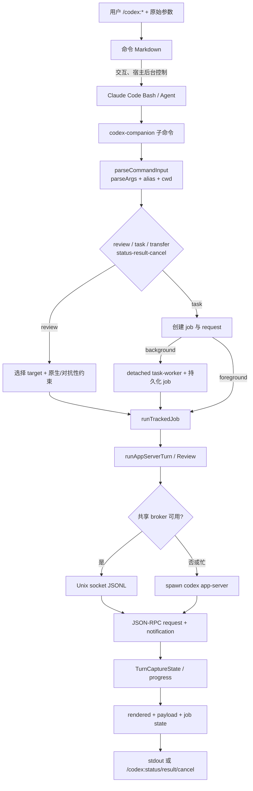

# 模块：用户命令解析与 Codex 调用编排

上一模块若已说明插件如何被 Claude Code 发现，这一章接住的就是用户输入：`/codex:*` 并不直接等于一次模型调用，而是先由命令 Markdown 规定 Claude Code 的交互与后台任务行为，再由 `codex-companion.mjs` 把稳定的 CLI 请求编排成可追踪的 Codex App Server 回合。它为后续的作业状态、结果检索与停止门禁提供 `jobId`、`threadId`、`turnId` 和可渲染结果。

## 角色与要解决的业务问题

该插件面对的不是“调用一个 CLI”这么简单。用户可能要求只读审查、带对抗性视角的结构化审查、允许写入的救援任务、续接旧对话、异步运行、取消运行，或把 Claude 会话转给 Codex。若把它们都做成一条 `spawn('codex', ...)`，会丢失四种业务保证：

1. **宿主边界**：何时询问用户、何时真的后台运行，是 Claude Code 命令层的职责；`--background` 仅由伴随脚本记录并启动其自己的 worker，不能替代宿主的 `Bash(...run_in_background)`。`review.md` 明说这一点（`plugins/codex/commands/review.md:18-40`），且所有审查命令禁止修复并要求原样返回（`:13-16`）。
2. **能力边界**：普通 review 只能映射 Codex 内建 reviewer 支持的未提交变更或基准分支；自定义焦点转入 adversarial-review，而不是悄悄退化为另一种调用（`plugins/codex/scripts/codex-companion.mjs:259-283`）。
3. **持续性边界**：短暂 review 用 ephemeral thread；可恢复 task 则命名、持久化 thread，并优先从当前 Claude session 的已完成任务恢复（`plugins/codex/scripts/lib/codex.mjs:62-82`, `1095-1158`; `codex-companion.mjs:336-355`）。
4. **可观测与可取消性**：App Server 的 JSON-RPC 通知被归并为进度、日志、文件变更和最终回答；后台任务则携带 job 文件、PID、thread/turn ID 供 status/result/cancel 消费【待主 agent 验证】（`codex.mjs:303-610`; `codex-companion.mjs:567-710`, `838-1021`）。

这体现了项目的整体取向：把 Claude Code 当作“受控入口”，把 Codex 当作“可恢复的执行引擎”，而不是让两个 agent 同时解释和改写同一请求。`rescue.md` 甚至要求中间 subagent 是只执行一次 Bash 的 thin forwarder（`plugins/codex/commands/rescue.md:39-47`）。

## 分层与数据结构

| 层 | 主要输入/输出 | 关键结构与不变量 |
| --- | --- | --- |
| Slash command | `$ARGUMENTS`、宿主工具调用 | review/adversarial-review 先估计规模、一次 AskUserQuestion，再在前台或 Claude 后台执行；status/result/cancel/transfer 是确定性入口（`commands/review.md:18-61`; `commands/status.md:8-16`; `commands/transfer.md:7-10`）。 |
| 参数适配 | `argv -> { options, positionals }` | `parseArgs` 只把已声明的 value/boolean 选项结构化；`--` 后和未知选项保留为位置参数，允许审查焦点文本继续传递（`scripts/lib/args.mjs:1-74`）。单一原始参数串由轻量引号/反斜杠 tokenizer 还原（`:76-128`）。 |
| 伴随脚本编排 | command request -> job/run payload/rendered | 子命令路由在 `main`；task request 含 `cwd/model/effort/prompt/write/resumeLast/jobId`，review/task 统一封装为 tracked job（`codex-companion.mjs:604-614`, `712-823`, `1024-1073`）。 |
| App Server 传输 | JSON-RPC request/notification | `pending: Map<id,{resolve,reject,method}>` 管理在途请求；JSONL 按行解析；notification handler 接收无 id 的事件（`scripts/lib/app-server.mjs:57-176`）。client 可连接共享 broker，也可启动 `codex app-server`（`:183-354`）。 |
| 回合捕获 | App Server event stream -> `TurnCaptureState` | 状态保存 root/current thread、thread-to-turn 映射、buffered notifications、final answer、review text、reasoning、文件和命令记录（`scripts/lib/codex.mjs:10-35`, `303-610`）。 |
| 展示与退出 | payload -> Markdown/JSON | 对抗审查解析 JSON 后校验 `verdict/summary/findings/next_steps`，按严重性排序；格式失配则保留 raw output，而不是伪造结果（`scripts/lib/render.mjs:24-82`, `211-285`）。task 则优先原样返回最终消息（`:315-323`）。 |

`TurnCaptureState` 是这里真正的领域对象，而非普通 SDK 回调缓存。它把多 thread/多 subagent 的异步通知归到一次“用户可感知的回合”：`threadIds` 和 `threadTurnIds` 判定归属，`pendingCollaborations` 与 `activeSubagentTurns` 阻止主回合过早完成，`reasoningSummary` 通过规范化去重，`fileChanges` 用于最后导出 touched files（`codex.mjs:126-135`, `174-184`, `396-557`）。

## 主路径

### 1. 命令层先控制“谁在等”

`review.md` 和 `adversarial-review.md` 的共同策略是：显式 `--wait/--background` 不再提问；否则先用 Git 短统计量估计规模，只有 1--2 个文件的明确小审查建议等待，其余建议后台（分别见 `plugins/codex/commands/review.md:18-38`、`adversarial-review.md:21-45`）。这是把用户等待成本放在离用户最近的层，而非 Node 进程自己猜测。

两者不是同一个 prompt 的不同语气。native review 不接收焦点文本，转成 `{type:'uncommittedChanges'}` 或 `{type:'baseBranch', branch}` 后调用 `review/start`；对抗审查收集 Git 上下文、插值模板、强制 `read-only` sandbox、附 output schema，再用普通 `turn/start`（`codex-companion.mjs:358-457`; `codex.mjs:1002-1055`）。前者选择平台能力以得到内建 reviewer 行为，后者牺牲一点标准化换取问题设定和结构化结果。

### 2. 参数解析宁可保守，也不把自由文本误当 flag

`normalizeArgv` 只在宿主把整个命令作为单一字符串传来时调用 `splitRawArgumentString`（`codex-companion.mjs:130-149`）。随后各 handler 显式声明自己认可的选项，例如 task 的 `model/effort/cwd/prompt-file` 与 `write/resume/fresh/background`（`:762-781`）。这避免一个新增 flag 无意改变别的命令语义，且 `--` 后内容总归入 prompt。

模型别名 `spark -> gpt-5.3-codex-spark`，reasoning effort 白名单拒绝未知值（`codex-companion.mjs:103-128`）；这比把任意字符串递交给远端、等到回合启动后失败更早反馈。命令文档也明确未指定 model/effort 时让 Codex 自选（`commands/rescue.md:45-47`）。

### 3. task 的同步与异步收敛到同一执行函数

无论前台或 worker，最终都进入 `executeTaskRun`：可选续接 thread、选择 `workspace-write`/`read-only`、持久化新 task thread 名称，最后产出 raw output、touchedFiles、reasoning 和可显示摘要（`codex-companion.mjs:461-529`）。前台用 `runTrackedJob` 再输出 JSON 或 rendered；后台先生成 request 与 job、启动 detached `task-worker`，worker 反读 job request 后也调用 `executeTaskRun`（`:658-710`, `762-823`, `838-880`）。

该收敛点很重要：后台不是另一个 Codex 运行协议，因而取消和结果展示能以相同的 thread/turn 身份工作【待主 agent 验证】。同时，恢复优先限制在当前 Claude session；有 session ID 时找不到本 session 的历史便不回退全局 Codex thread，避免不同用户会话串线（`:294-355`, `928-960`）。

### 4. RPC client 与回合捕获分别处理“传输正确性”和“语义完整性”

`AppServerClientBase` 的 request id、pending promise、JSONL 分帧与连接关闭时 reject pending，是通用传输职责；server 反向请求统一返回 JSON-RPC `-32601`，避免客户端假装支持未实现能力（`app-server.mjs:86-176`）。直连 transport 用 stdin/stdout；broker transport 用 Unix socket；`CodexAppServerClient.connect` 先尊重环境端点，随后复用/确保 broker，否则直连（`:183-354`）。

`withAppServer` 再补一个务实的可用性策略：共享 broker 返回 busy RPC code，或端点 ENOENT/ECONNREFUSED，就关闭原 client 并直连重试一次；其他业务错误不吞（`codex.mjs:613-642`）。这说明共享运行时是性能优化，不是功能前提。

真正棘手的竞态发生在 `captureTurn`。`turn/start` response 可能晚于通知，所以先缓冲；拿到 turn ID 后重放并按 thread/turn 过滤。完成也不能仅看 final answer，因为协作 agent 或 collaboration tool 仍可能运行；代码以短暂的推断完成计时器等待这些集合清空（`codex.mjs:346-406`, `559-610`）。这是比“等最后一条 stdout”稳健得多的会话语义。

### 5. 结果格式化保留事实，不替用户补结论

对抗审查首先仅尝试 `JSON.parse`，再校验最小 schema；任何层级失败都展示 parse/shape error 和 raw final message（`codex.mjs:1188-1217`; `render.mjs:211-248`）。成功时才排序 findings 并渲染 recommendation/next steps（`:250-285`）。相反，task 输出刻意原样透传（`:315-323`），与 rescue 命令“不得改写 Codex 输出”的宿主合同一致（`commands/rescue.md:41-44`）。

状态页是反向导航界面：运行项给 status/cancel，完成项给 result，写入型 task 还给 review/adversarial-review（`render.mjs:109-164`, `325-388`）；result 优先取已渲染的结构化审查，再取 raw output，并总是附 `codex resume <threadId>`（`:390-445`）。

## 协作边界

| 相邻模块 | 本模块给出 | 本模块依赖 | 评价 |
| --- | --- | --- | --- |
| 命令 Markdown/Claude Code | 精确 CLI、前后台语义、原样输出合同 | 宿主是否以 `run_in_background` 真正脱离 | 以文档作行为规范而非把交互硬编码进 Node，适合插件宿主；见 `commands/review.md:34-61`。 |
| Git 审查上下文 | `base/scope/focus` 请求 | `resolveReviewTarget`、`collectReviewContext`、repo 校验【待主 agent 验证】 | 编排层不重做 Git 逻辑，native/对抗审查共享 target 选择。 |
| tracked-jobs/state/job-control | job、进度、pid、thread/turn、payload【待主 agent 验证】 | 作业持久化、索引、状态解析和更新【待主 agent 验证】 | 让 CLI 进程退出后仍可 status/result/cancel，但跨进程一致性也因此成为风险。 |
| broker lifecycle | `CodexAppServerClient.connect` | endpoint 发现/启动与生命周期【待主 agent 验证】 | 传输接口隐藏共享与直连差异；busy 时直接回退保留可用性。 |
| 进程工具 | child PID、终止请求 | Windows `taskkill`/POSIX process group | `terminateProcessTree` 优先杀进程组，Windows 无进程视为幂等停止（`process.mjs:57-118`）；测试覆盖 Windows 两种结果（`tests/process.test.mjs:6-55`）。 |

## 关键权衡、替代方案与重设计建议

**Markdown 命令 + Node companion，而非单一 Node CLI。** 单一 CLI 更容易测试，但无法代表 Claude Code 的 AskUserQuestion、前台/宿主后台与“禁止 Claude 自行修复”这些产品语义。当前分层代价是命令文档与 handler flag 必须同步；`tests/commands.test.mjs:14-225` 用文本断言防回归，仍无法证明真实宿主行为。若重设计，可把命令契约写成机器可读 manifest，再生成 Markdown 的 flag/行为段落，减少双份事实来源。

**App Server JSON-RPC，而非 `codex exec` 文本抓取。** 前者能获得 thread/turn 取消、review 生命周期、reasoning/file change 事件和会话导入；代价是事件乱序、多 agent 归属与兼容性都落在插件身上。`captureTurn` 已处理最危险的早到通知；若重设计，应为每个关键 notification 序列加入协议 fixture 测试，而不是只依赖渲染与 process 的窄测试（`tests/render.test.mjs:6-58`）。

**共享 broker 优先、直连兜底。** 这降低多次调用启动成本，但引入 endpoint 不可达和 busy 两类故障。当前只对明确的 broker busy/连接失败降级（`codex.mjs:621-640`），这是正确的保守策略：不应把鉴权、协议或模型错误误当可重试。可改进之处是把最终使用 transport 写进 job/result，帮助用户理解取消是否命中同一运行时。【待主 agent 验证：job schema 是否已有该字段】

## 问题与风险

1. **后台启动存在 job 可见性竞态（高）。** `enqueueBackgroundTask` 先 `spawnDetachedTaskWorker`（`codex-companion.mjs:684-688`），再写 `queuedRecord` 到 job 文件（`:689-698`）；子进程足够快时，`handleTaskWorker` 的 `readStoredJob` 可能在记录落盘前返回空并失败（`:847-857`）。应先原子写入 queued record，再 spawn；若 spawn 失败，再把状态置 failed。这是可由局部源码直接证明的时序问题。
2. **取消与 worker 完成可能竞争（中）。** cancel 先尝试 `turn/interrupt`，再杀 PID，最后无条件写 cancelled（`:963-1011`）；worker 侧的完成状态更新在 tracked-jobs 模块，故无法在本模块确认是否使用 terminal-state CAS。【待主 agent 验证】若没有 compare-and-set，刚完成的 worker 可以覆盖 cancelled，或反之造成结果与状态不一致。
3. **轻量 tokenizer 不报告未闭合引号（中低）。** `splitRawArgumentString` 结束时只保留 `current`，并未在 `quote` 非空时报错（`args.mjs:76-128`）。这会把用户输入错误变成不同 prompt/flag，而不是立即提示。建议返回带诊断的 parse result，至少在 command 模式下拒绝未闭合引号。
4. **普通 RPC 没有调用级超时（中低）。** session transfer 有两分钟 completion timeout（`codex.mjs:701-729`），但 `initialize`、`thread/start`、`turn/start` 和 review 完全依赖远端关闭/通知。长时间静默会使前台 CLI 与后台 job 看似一直运行。建议在 client request 层支持可配置 deadline，并将 timeout 写入 job 的 failureMessage。
5. **测试覆盖偏向文案和渲染，缺少核心编排集成（中）。** 现有命令测试为字符串契约，render 测试只覆盖 shape 降级与 stored result 优先级，process 测试只覆盖 Windows 终止（`tests/commands.test.mjs:14-225`; `tests/render.test.mjs:6-58`; `tests/process.test.mjs:6-55`）。没有 mock App Server 的乱序通知、broker 兜底、background race、cancel race 或 resume session-isolation 测试。

至此，用户意图已经变成一个具身份、可恢复、可取消且可呈现的 Codex 回合；下一模块应沿 `jobId/threadId/turnId` 继续解释作业持久化、状态快照和停止门禁如何把这条执行链交还给用户。

## 阅读覆盖率

实现文件的全部行均以分段源码读取；命令 Markdown（263 行）与限定测试（339 行）作为辅助证据亦已读取，但不计入“实现文件”总计。

| 文件 | 总行数 | 已读行数 | 覆盖率% | 未读原因 |
| --- | ---: | ---: | ---: | --- |
| `plugins/codex/scripts/codex-companion.mjs` | 1073 | 1073 | 100% | 无 |
| `plugins/codex/scripts/lib/args.mjs` | 128 | 128 | 100% | 无 |
| `plugins/codex/scripts/lib/codex.mjs` | 1219 | 1219 | 100% | 无 |
| `plugins/codex/scripts/lib/app-server.mjs` | 354 | 354 | 100% | 无 |
| `plugins/codex/scripts/lib/process.mjs` | 135 | 135 | 100% | 无 |
| `plugins/codex/scripts/lib/render.mjs` | 465 | 465 | 100% | 无 |
| `plugins/codex/scripts/lib/workspace.mjs` | 9 | 9 | 100% | 无 |
| `plugins/codex/scripts/lib/prompts.mjs` | 13 | 13 | 100% | 无 |
| **合计（核心实现）** | **3396** | **3396** | **100%** | **达标（标准模式 >=60%）** |
