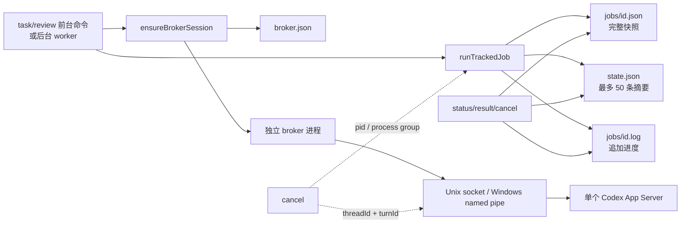
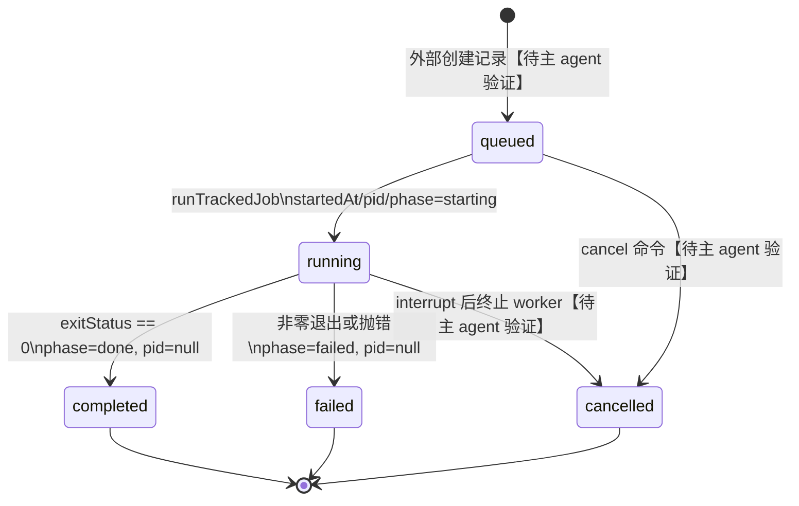
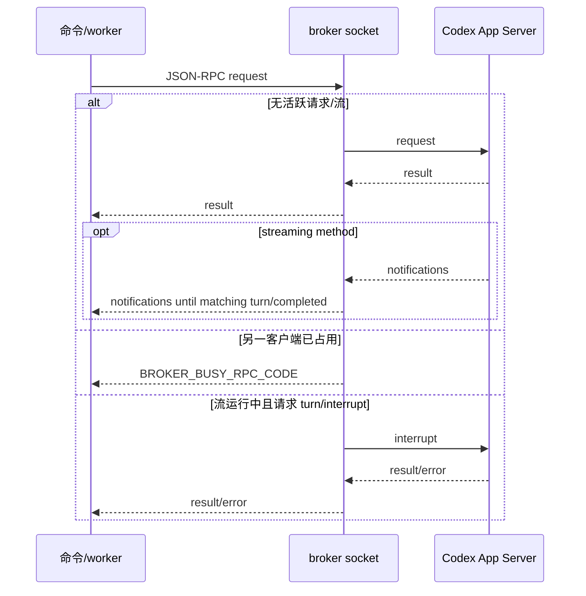

# 06. 后台任务、共享 Broker 与可取消的状态生命周期

上一模块把一次 `task` 或 `review` 还原为对 Codex App Server 的一次业务调用；但对于用户而言，真正难的是调用结束之前：命令行退出后任务在哪里、进度如何显示、另一条命令会不会重复启动昂贵的 App Server、取消会不会只留下一个“已取消”的假象。本章分析的模块以**工作区为边界，用文件建立一个可恢复的任务控制面，用本地 socket 建立一个可复用但串行的 App Server 数据面**。它不是通用队列：没有调度器、重试器或多个 worker；它优先解决 Claude/Codex 插件进程短命、任务可能后台运行且会话需隔离的问题。

> 叙事衔接：前一章的调用一旦需要脱离前台存活，必须被赋予稳定 ID、可读进度和终态。本章产出的 `status/result/cancel` 可观察、可控制契约，会为后续命令、hook 和会话清理模块提供落点【待主 agent 验证】。

## 1. 一眼看懂：两个平面、四种文件

| 平面/对象 | 存放或通信位置 | 关键字段/协议 | 职责 |
|---|---|---|---|
| 工作区状态索引 | `state.json` | `version`、`config.stopReviewGate`、最多 50 条 `jobs` | 列表、排序、会话过滤与轻量状态查询 |
| 任务明细 | `jobs/<id>.json` | `status`、`pid`、`threadId`、`turnId`、`result`、`rendered` | 保存完整最终产物，避免索引膨胀 |
| 任务日志 | `jobs/<id>.log` | ISO 时间戳行及命名输出块 | 供状态页截取近期进度 |
| Broker 会话 | `broker.json` + 临时目录 | `endpoint`、`pidFile`、`logFile`、`sessionDir`、`pid` | 工作区复用同一个 App Server broker |

状态根目录由工作区 basename 和 canonical realpath 的 SHA-256 前 16 位共同构成，落在 `CLAUDE_PLUGIN_DATA/state`，未提供时退回系统临时目录；这样可读的目录名和稳定的碰撞隔离并存（`plugins/codex/scripts/lib/state.mjs:29-44`）。端点在 Unix 是会话临时目录内的 socket，Windows 则是清洗过的 named pipe 名（`plugins/codex/scripts/lib/broker-endpoint.mjs:4-17`）；测试覆盖了两种编码和解析结果（`tests/broker-endpoint.test.mjs:6-22`）。

这张图刻意把“任务”与“broker”分开：前者可并存、各自有 worker PID 和持久化记录；后者只允许一个 App Server 请求或流处于占用状态。把二者混为“队列”会错误推断出 broker 会顺序执行所有后台任务。

## 2. 任务记录：双写是为了分别服务恢复与展示

### 2.1 生命周期与状态模型

`createJobRecord` 在创建时注入 `createdAt`，并在环境变量存在时写入 Claude 会话 ID（`CODEX_COMPANION_SESSION_ID`）（`plugins/codex/scripts/lib/tracked-jobs.mjs:60-68`）。执行器 `runTrackedJob` 随即写入 `running` 快照：`startedAt`、`phase: starting`、运行 worker 的 `pid` 与日志路径；它同时更新明细和索引（`plugins/codex/scripts/lib/tracked-jobs.mjs:142-152`）。这给出了可由其他进程读取的有限状态机：

runner 正常返回后，`exitStatus === 0` 映射为 `completed`，否则 `failed`；明细保存完整 `payload`/`rendered`，索引只保留 `summary` 和定位会话所需的 `threadId`、`turnId`（`plugins/codex/scripts/lib/tracked-jobs.mjs:154-180`）。抛错路径先读取可能被进度更新过的最新明细，再将其覆盖为失败态，因而不会丢失已发现的 thread/turn ID（`plugins/codex/scripts/lib/tracked-jobs.mjs:181-203`）。

这是合理的 CQRS 式轻分层，而非冗余失误：`state.json` 让 `status` 只需一次小文件读取，`<id>.json` 则让 `result` 能取回大文本。其代价是非原子双写：在两次同步写之间崩溃时，索引与明细可以暂时不同步；代码没有版本戳、临时文件 rename 或启动修复机制。对 CLI 插件，这是一笔可接受的简单性债务，但若任务承载不可重算的产物，应采用原子写入、事务日志，或以单一数据库为真源。

### 2.2 进度不是轮询 App Server，而是写入可消费的事件痕迹

进度事件被统一规范为 `message/phase/threadId/turnId/stderrMessage/logTitle/logBody`，字符串输入兼容为 stderr 文本（`plugins/codex/scripts/lib/tracked-jobs.mjs:12-34`）。报告器可独立启用 stderr、日志和回调三种投递通道（`plugins/codex/scripts/lib/tracked-jobs.mjs:117-132`）。`createJobProgressUpdater` 只在 phase、threadId、turnId 真正变更时才双写索引和明细，避免每条工具输出都重写 JSON（`plugins/codex/scripts/lib/tracked-jobs.mjs:70-114`）。

日志采用同步 append 的时间戳行和带标题的输出块（`plugins/codex/scripts/lib/tracked-jobs.mjs:36-57`）。状态展示只提取 `[` 开头的行、剥离时间戳、排除 Final output 等大块标题，返回最后四条（`plugins/codex/scripts/lib/job-control.mjs:49-76`）。于是日志既可保留最终完整输出，也不会把结果正文误当成“正在进行”的提示。

`job-control` 对老记录保留了基于日志文本推断 phase 的兼容层，例如 `running command` 再按命令是否含 test/lint/build 判为 `verifying` 或 `investigating`（`plugins/codex/scripts/lib/job-control.mjs:103-159`）。这适合状态 schema 演进初期，但它是启发式而不是协议：用户 prompt 中的命令文字可误导分类。更成熟的重设计会把 phase 限为枚举，由运行时事件显式上报；保留日志推断仅作为旧版本迁移的只读 fallback。

### 2.3 有界持久化、会话可见性与取消选择

`saveState` 将 job 按 `updatedAt` 倒序裁剪到 50 条，并删除被淘汰 job 的 JSON 和日志（`plugins/codex/scripts/lib/state.mjs:80-115`）；测试以 51 条记录验证留下最新 50 条且同步清理两类附件（`tests/state.test.mjs:43-105`）。`loadState` 对缺失/坏 JSON 返回默认配置，而不是让状态命令失效（`plugins/codex/scripts/lib/state.mjs:19-27,58-78`）。这种“可丢历史、不中断交互”的取舍很贴近插件，但坏 JSON 被静默重置也会掩盖磁盘错误；至少应记录诊断信息，并考虑保留损坏副本。

任务列表按 `updatedAt` 倒序；若存在当前 Claude session，默认只保留同 `sessionId` 的任务（`plugins/codex/scripts/lib/job-control.mjs:11-25,213-240`）。不带 ID 的取消也只在当前会话恰有一个活跃任务时成立；多个任务要求明确 ID，而显式 ID 可以越过会话边界（`plugins/codex/scripts/lib/job-control.mjs:281-308`）。端到端测试证明了“默认不误杀其他会话”和“显式 ID 可跨会话取消”这两个安全/运维折中（`tests/runtime.test.mjs:1637-1738`）。

这里的隐含原则值得保留：**默认动作遵循最小意外，显式引用才授予跨会话影响力**。相比“永远只能取消自己”的方案，它有管理员救援能力；相比“自动取消最新任务”，它不把多窗口场景变成赌博。风险是 job ID 前缀匹配在多个候选时只报歧义，并没有对 ID 格式或权限做额外验证（`plugins/codex/scripts/lib/job-control.mjs:191-211`）。

## 3. Broker：复用进程，但把并发冲突变成显式 busy

### 3.1 创建、探活、复用和清理

`ensureBrokerSession` 先读取工作区 `broker.json` 并用 150ms socket 探活；存活即复用（`plugins/codex/scripts/lib/broker-lifecycle.mjs:102-117`）。旧会话失效则删除残留，再创建临时目录、端点、pid/log 文件，spawn 一个 detached Node broker；2 秒内探活失败会 teardown 而不写入会话（`plugins/codex/scripts/lib/broker-lifecycle.mjs:119-170`）。子进程 stdout/stderr 重定向到 broker log，`unref()` 使调用 CLI 退出不牵连服务（`plugins/codex/scripts/lib/broker-lifecycle.mjs:59-70`）。

会话 JSON 是独立于任务状态索引的轻量 runtime lease：加载损坏 JSON 返回 null，保存时确保 state dir，清理则删索引文件（`plugins/codex/scripts/lib/broker-lifecycle.mjs:72-100`）。teardown 可选杀 PID，随后删 pid/log/socket，并尝试删除空会话目录（`plugins/codex/scripts/lib/broker-lifecycle.mjs:173-208`）。它没有 PID ownership 校验、锁文件或代际 token：理论上过期 `pid` 被 OS 重用时，外部传入的 kill 函数可能波及无关进程。重新设计时，应在会话记录中加入随机 token，broker probe 要求回显 token，并仅在 PID、启动时间和 token 同时匹配时终止。

运行时测试从用户视角确认复用：首次 `review` 后再运行 `adversarial-review`，假 App Server 的启动次数为 1（`tests/runtime.test.mjs:2119-2162`）；`setup` 同样不会再起一个（`tests/runtime.test.mjs:2164-2207`）。这些测试允许环境不支持 broker 时提前返回，因此它们是正向行为证据，不是所有平台的强制断言。

### 3.2 JSON-RPC 转发与流所有权

broker 进程启动时解析端点、创建 pid 文件，并以 `disableBroker: true` 直连真正 App Server，防止递归接入自己（`plugins/codex/scripts/app-server-broker.mjs:48-72`）。每个 socket 以换行分帧 JSON-RPC，坏 JSON 返回标准 `-32700`；`initialize/initialized` 在 broker 本地完成，`broker/shutdown` 先响应再清理并退出（`plugins/codex/scripts/app-server-broker.mjs:118-166`）。SIGTERM/SIGINT 也走同一 shutdown，关闭客户端、App Server、net server、Unix socket 和 pid 文件（`plugins/codex/scripts/app-server-broker.mjs:102-114,236-246`）。

核心并发策略有意保守：`activeRequestSocket` 占住普通 RPC，`activeStreamSocket` 持有 `turn/start`、`review/start`、`thread/compact/start` 的后续通知；第三方 socket 收到自定义 `BROKER_BUSY_RPC_CODE`，而非静默排队（`plugins/codex/scripts/app-server-broker.mjs:12-23,170-182`）。通知优先路由到正在请求的 socket，否则给流 socket；只有 `turn/completed` 的 threadId 属于当前流集合时才释放流所有权。review 还额外登记 `reviewThreadId`，覆盖一个请求派生两个 thread 的情况（`plugins/codex/scripts/app-server-broker.mjs:84-100,197-220`）。

为何不在 broker 内做 FIFO？因为 App Server 的流式通知天然只对应一个活跃对话；把未定义的多流语义排队会制造取消、断连、超时和优先级问题。现在的 fast-fail 使调用者决定重试策略，故障面小。代价是后台任务可并发启动却会竞争一个 broker，且没有退避/公平性；如果产品确实承诺多任务并行，应改成每 thread 独立 App Server 或一个带取消传播、队列长度上限、deadline 的调度层。

### 3.3 取消是“双轨尽力而为”，不是原子事务

本章允许直接证实的是为取消准备的事实：进度更新尽早持久化 `threadId` 和 `turnId`（`plugins/codex/scripts/lib/tracked-jobs.mjs:86-114`）；broker 唯一放行的并发例外就是另一个 socket 对活跃流发送 `turn/interrupt`（`plugins/codex/scripts/app-server-broker.mjs:170-195`）；任务运行记录同时保存 worker `pid`（`plugins/codex/scripts/lib/tracked-jobs.mjs:142-152`）。端到端测试还观察到取消 brokered task 时先成功发送 interrupt，并以相同 `threadId/turnId` 断言假服务收到它（`tests/runtime.test.mjs:1740-1802`）；普通后台任务取消后，索引和明细都变 `cancelled`、PID 置空、日志追加 `Cancelled by user`（`tests/runtime.test.mjs:1542-1635`）。

因此可把实际协议概括为：

1. 选择活跃 job（默认受 session 限制，显式 ID 可跨会话）。
2. 若已有 Codex thread/turn，向共享 broker 发协作式 `turn/interrupt`【待主 agent 验证：命令层的具体实现顺序】。
3. 终止后台 worker/进程组，并把任务双写为 `cancelled`【待主 agent 验证：信号策略与竞争处理】。

这是正确的防御性顺序：先让远端推理自行停下，再回收本地 worker，减少孤儿 turn。但测试也暴露其不能成为原子承诺：interrupt 成功不代表 worker 已退出；kill 成功也不代表远端请求已无副作用。`runTrackedJob` 的异常处理本身会写 `failed`，所以若取消与 runner rejection 竞争，最终 `cancelled` 是否会被覆盖需要检查命令层协调代码【待主 agent 验证】。理想重设计是引入单调的 `cancellationRequestedAt` 与 terminal-state compare-and-set：一旦取消请求写入，普通失败完成不能覆盖 `cancelled`；并将 remote interrupt 的结果作为审计字段，而非等同于取消完成。

## 4. 周边协作：Git 上下文与 Claude 会话转移

虽然 `git.mjs` 不直接控制 worker，它决定 review 型 job 交给 Codex 的上下文尺寸和安全边界：所有 repository 派生参数使用无 shell 的 `git` 调用（`plugins/codex/scripts/lib/git.mjs:11-18`），脏工作区优先 review working tree、干净时转向默认分支差异（`plugins/codex/scripts/lib/git.mjs:135-190`）。小 diff 内联，大 diff 只交摘要并要求 agent 自行只读收集（`plugins/codex/scripts/lib/git.mjs:300-346`）；测试验证大变更切到 `self-collect`，且 untracked 文本在轻量上下文仍被纳入（`tests/git.test.mjs:151-212`）。这控制了存入任务结果/发送模型的输入膨胀，但从 Git 上下文到具体 tracked job 的组装属于相邻模块责任【待主 agent 验证】。

`claude-session-transfer.mjs` 则为跨产品会话输入设了严格来源边界：路径支持 `~`/相对路径正规化，必须是 `.jsonl`，`realpath` 后仍需位于 `~/.claude/projects` 内（`plugins/codex/scripts/lib/claude-session-transfer.mjs:10-43`）。这不是 job persistence，却和 `sessionId` 过滤形成同一产品立场：会话可迁移、可追溯，但不应把任意本地文件当成可信 transcript。

## 5. 评价、风险与下一步

这套实现最好的地方是没有为了“后台”而引入重量级服务：同步 JSON/日志适合 CLI 异常退出后的人工检查，单 broker 又把 App Server 启动成本和流式通知归属封装在本地进程内。它的设计哲学是**宁可显式 busy 与有限历史，也不要隐式并发和无限驻留资源**。

需要正视的风险包括：

- 双写无原子性，状态索引和明细可分叉；损坏 `state.json` 静默回退会隐藏事故（`plugins/codex/scripts/lib/state.mjs:58-78,92-115`）。
- broker 端点探活只验证“能连接”，不验证实例身份；过期会话的 PID 回收依赖外部 kill 策略（`plugins/codex/scripts/lib/broker-lifecycle.mjs:102-129,173-208`）。
- 一个活跃流阻塞其他非 interrupt 请求，调用者必须自行重试；socket 意外关闭会释放所有权，却不等同于远端 turn 停止（`plugins/codex/scripts/app-server-broker.mjs:225-233`）。
- 日志 phase 推断依赖英文自然语言，升级 prompt 或工具文案可能降低状态准确度（`plugins/codex/scripts/lib/job-control.mjs:103-159`）。

若重做，我会维持“每工作区一个 broker”的低运维边界，但补三件小而关键的机制：原子状态写入/恢复扫描、broker 代际 token 的受控 teardown、带 cancellationRequested 状态的 compare-and-set 终态。它们不会把插件变成消息队列，却能堵住最容易发生的崩溃与竞态缝隙。

> 叙事过渡：本章已经给出任务可追踪、可展示、可中断的基础。下一模块应从这些持久化事实出发，解释 CLI 命令和会话 hook 如何创建、等待、展示、清理任务，并验证本章标记的跨边界调用链【待主 agent 验证】。

## 覆盖率明细

覆盖率按实际逐行读取范围的并集计算；`runtime.test.mjs` 仅阅读与 broker、后台任务、状态展示、结果和取消直接相关的片段，未把搜索结果计入逐行覆盖。

| 文件 | 总行数 | 已读行数 | 覆盖率% | 未读原因 |
|---|---:|---:|---:|---|
| `plugins/codex/scripts/app-server-broker.mjs` | 252 | 252 | 100.0 | 无 |
| `plugins/codex/scripts/lib/tracked-jobs.mjs` | 204 | 204 | 100.0 | 无 |
| `plugins/codex/scripts/lib/broker-lifecycle.mjs` | 209 | 209 | 100.0 | 无 |
| `plugins/codex/scripts/lib/job-control.mjs` | 308 | 308 | 100.0 | 无 |
| `plugins/codex/scripts/lib/state.mjs` | 191 | 191 | 100.0 | 无 |
| `plugins/codex/scripts/lib/broker-endpoint.mjs` | 41 | 41 | 100.0 | 无 |
| `plugins/codex/scripts/lib/fs.mjs` | 40 | 40 | 100.0 | 无 |
| `plugins/codex/scripts/lib/git.mjs` | 347 | 347 | 100.0 | 无 |
| `plugins/codex/scripts/lib/claude-session-transfer.mjs` | 44 | 44 | 100.0 | 无 |
| `tests/broker-endpoint.test.mjs` | 22 | 22 | 100.0 | 无 |
| `tests/state.test.mjs` | 105 | 105 | 100.0 | 无 |
| `tests/git.test.mjs` | 212 | 212 | 100.0 | 无 |
| `tests/helpers.mjs` | 32 | 32 | 100.0 | 无 |
| `tests/runtime.test.mjs` | 2259 | 931 | 41.2 | 未读与本章无直接关系的 transfer、review prompt、stop-hook 等场景；已覆盖本章直接 E2E 场景 |
| **合计** | **4266** | **2938** | **68.9** | 核心实现 1636/1636（100.0%） |

**达标状态：✅ 标准分析目标达标。**核心实现文件覆盖率 100.0%，高于 60% 目标；全部指定文件按行数加权覆盖率 68.9%。
