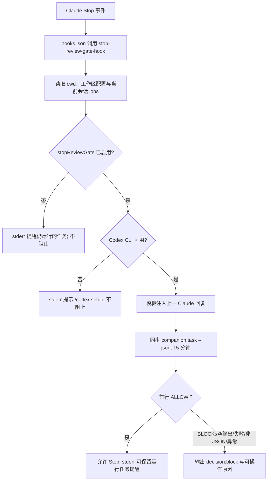

# 模块六：Review Gate、对抗审查与外围封装

## 定位与叙事衔接

前序模块已经把共享运行时、作业台账和会话边界作为插件的执行底座。本模块关注其质量门：它把“让 Codex 看一次”拆成常规 `review`、更怀疑的 `adversarial-review` 与 Stop 时的短格式 gate；三者共享 companion runtime，但分别改变输入范围、提示词姿态和阻断后果。这样做的全局意义，是在不把 Claude 主线程改造成审查器的前提下，让审查结果保持可追踪、可呈现、可选地成为退出条件【待主 agent 验证】。

## 入口与职责边界

| 表面能力 | 入口 | 核心约束 | 目的 |
|---|---|---|---|
| 常规审查 | `commands/review.md:8-61` | 只审查、不改代码；仅 native-review；原样回传 | 给本地 Git 改动一个默认质量检查 |
| 对抗审查 | `commands/adversarial-review.md:8-66` | 同样只读，但保留用户 focus、挑战设计/假设 | 把“实现有没有错”扩展为“方案是否站得住” |
| Stop gate | `hooks/hooks.json:26-35`、`scripts/stop-review-gate-hook.mjs:142-176` | 配置启用后，只有 `BLOCK:` 才输出 hook `decision:block` | 将未解决的重大问题变成会话结束前的同步门槛 |
| 救援委派 | `commands/rescue.md:7-49`、`agents/codex-rescue.md:11-46` | 子 agent 只做一次 `task` 转发 | 将“修复/调查”与只读审查严格分离 |

普通和对抗命令都先由 Claude 依据改动规模选择前台或后台；若用户未显式指定，只有约 1--2 个文件的明确小改动才建议等待，其他情况建议后台（`commands/review.md:18-32`、`commands/adversarial-review.md:21-35`）。这不是 runtime 的排程策略，而是命令层对交互等待成本的处理；实际脱离仍取决于 Claude 的 `Bash(...run_in_background:true)`（两文件分别见 `:34-41`）。

常规审查刻意拒绝 focus text、staged/unstaged scope，而对抗审查保留 focus text；两者都只允许 `auto|working-tree|branch` 或 `--base`（`commands/review.md:34-40`，`commands/adversarial-review.md:37-45`）。相应的集成测试覆盖 native-review 的拒绝路径和两个入口对 staged scope 的一致拒绝（`tests/runtime.test.mjs:972-1032`）。这是一个清晰的产品分层：标准入口保持可预测的内建审查语义，风险导向的入口才接收额外评价视角。

## Stop Gate 的控制流

hook 先按 `session_id`（输入优先、环境变量兜底）过滤作业，故停止提示不会混入其他 Claude 会话的任务（`stop-review-gate-hook.mjs:40-46,148-152`）。若 gate 关闭，则仅将当前会话仍在 queued/running 的任务写入 stderr 并返回（`:154-157`）；测试验证 stdout 为空且提示携带 status/cancel 指引（`tests/runtime.test.mjs:1982-2037`）。这是“提醒不劫持”的默认模式。

启用后，hook 先做可用性检查；CLI 不可用仅提示 `/codex:setup`，不会拦截退出（`stop-review-gate-hook.mjs:59-67,159-164`；`tests/runtime.test.mjs:2064-2089`）。这是一项明确取舍：防止工具安装/认证故障把用户困在会话中，但也意味着该 gate 不是强制合规控制，而是最佳努力的本地质量门。若组织语义要求“审查服务不可用即不允许交付”，需要新增 fail-closed 配置，而不能把当前行为误读为强制阻断【待主 agent 验证】。

实际审查走 `codex-companion.mjs task --json <prompt>`，以 15 分钟 `spawnSync` 超时同步等待（`stop-review-gate-hook.mjs:16,98-110`）；注册的 Stop hook 超时是 900 秒（`hooks/hooks.json:26-33`），两处数值对齐，减少外层先杀掉内层后产生不透明结果的概率。超时、非零退出、无输出、非 JSON 和未知首行一律转为 `ok:false`，从而发出 `decision:block`（`stop-review-gate-hook.mjs:69-95,112-139,166-172`）。该 fail-closed 仅覆盖“已经进入可用审查流程但未得可识别许可”的失败。

提示词把评审范围缩到“上一 Claude turn 的直接代码编辑”，排除状态、setup、报告、已有 review 结果，并要求从仓库状态验证，而非相信自然语言回覆（`prompts/stop-review-gate.md:1-12,22-35`）。输出协议则把 runtime 对接简化为首行 `ALLOW:`/`BLOCK:`（`:14-20`）。实现只看首行（`stop-review-gate-hook.mjs:79-95`），因而模型偶尔附加解释不会破坏 gate；但也使 gate 无法消费常规结构化 review JSON，这是有意的接口隔离。

覆盖证据足够具体：启用后发现问题会 block 并确认注入了上一消息（`tests/runtime.test.mjs:1926-1980`）；clean 回答允许结束（`:2039-2062`）；认证状态可能陈旧时仍实际运行任务而非提前当作不可用（`:2091-2117`）。尚未在已读段发现针对“hook 输入为畸形 JSON”“companion 返回合法 JSON 但缺少 `rawOutput`”“15 分钟 timeout”的直接测试；这些分支已有实现，测试缺口降低了未来重构时的回归可见性。

## 对抗审查的提示与输出合同

`prompts/adversarial-review.md` 不是把 severity 阈值抬高，而是先改变认识论：默认怀疑、主动证伪、优先高代价/隐蔽失效面（权限、数据不可逆、重试、竞态、降级、版本漂移、可观测性，`:1-35`）。随后要求仅提交有证据的实质问题，并让每个 finding 回答故障、脆弱路径、影响和修复建议（`:38-46`）。

它强制 JSON 结构，`needs-attention` 对应任一值得阻塞的实质风险，且每项都要有文件、行区间、置信度和建议（`prompts/adversarial-review.md:48-59`）。`schemas/review-output.schema.json:1-87` 将此合同外化为 Draft 2020-12 JSON Schema：禁额外字段、限制 verdict 与 severity 枚举、要求位置/置信度/建议。提示层的“只报材料性问题”和 schema 层的“字段完整、可枚举”相互补足：前者控制噪声，后者控制消费者可解析性。schema 是否由所有 companion 输出路径实际强制校验，需回到 runtime 模块确认【待主 agent 验证】。

集成测试表明：对抗审查能经 app-server turn/start 呈现结构化 finding（`tests/runtime.test.mjs:369-387`），继承 base-branch 选目标规则（`:389-408`），大 diff 时只给模型轻量摘要并要求其自行用只读 Git 收集，避免把全部 diff 塞进 prompt（`:410-435`）。这是 token 成本与审查上下文完整性的务实折中，但依赖模型确实执行自收集；在权限受限或 Git 状态异常时，结果应由输出中的证据边界校准。

共享提示技能为这种合同化写法提供了设计语言：审查应组合 grounding、structured output 和 dig-deeper blocks（`skills/gpt-5-4-prompting/SKILL.md:20-31`），其中后者明确追查二阶失败、空状态、重试、陈旧状态和回滚（`references/prompt-blocks.md:153-160`）。反模式文档禁止把 review、修复、文档与路线图混进一次运行（`references/codex-prompt-antipatterns.md:72-83`），正好解释 commands 为什么反复强调 review-only。

## 会话生命周期与协作边界

SessionStart 将 session id、transcript path、插件数据目录写入 Claude 环境文件（`session-lifecycle-hook.mjs:23-40,77-81`），为后续作业归属和 transfer 提供跨命令上下文；对应测试验证全部三项导出（`tests/runtime.test.mjs:672-699`）。SessionEnd 找回 broker 会话，尝试发送 shutdown，再终止并从台账剔除当前会话的 queued/running jobs，最后清除 broker 会话（`session-lifecycle-hook.mjs:83-114`）。测试确认当前会话作业/进程被清理、其他会话记录和文件被保留（`tests/runtime.test.mjs:1804-1924`）。

这解释 Stop hook 的协作方式：它不是作业调度器，也不取消未完工任务；它只显示当前 session 的提醒，并独立运行 stop-review task。生命周期 hook 才承担结束时的收尾。二者以同一 session id 协作，但作用时序由 host 的 Stop/SessionEnd 事件顺序决定；该顺序及其对“Stop 被 block 后是否触发 SessionEnd”的约束未在本模块已读源码中定义【待主 agent 验证】。

rescue 则故意不进入这一审查闭环。命令把用户请求交给 `codex:codex-rescue`，防止把 subagent 当作 skill 而造成重入（`commands/rescue.md:7-9`）；agent 和 `codex-cli-runtime` skill 都要求一次 `task` 调用、原样返回、不得自行检查 repo 或调用 review/status/cancel（`agents/codex-rescue.md:20-42`，`skills/codex-cli-runtime/SKILL.md:14-20,38-43`）。这保持所有权清晰：review 发现问题后，由用户选择是否发起写入性 rescue，而不是由审查自动修复。结果呈现规则同样要求 review finding 后停止并询问用户（`skills/codex-result-handling/SKILL.md:9-21`）。

## 次要封装：命令、版本与发布一致性

`setup` 是 gate 的人机入口：调用 `setup --json` 并支持 `--enable-review-gate|--disable-review-gate`，在 Codex 不可用且 npm 可用时才询问全局安装（`commands/setup.md:1-37`）。`status` 在无 id 时以本 session 的紧凑表展示作业，描述也显式包括 review-gate 状态（`commands/status.md:1-17`）；`result` 保留完整 verdict/findings/路径/解析错误，避免在呈现层损失审查证据（`commands/result.md:8-15`）。`cancel`、`transfer` 仅是 companion 的薄入口（`commands/cancel.md:1-8`、`commands/transfer.md:1-10`）。

发布元数据采用四份清单同版本的显式策略：根 `package.json` 定义 `bump-version`、`check-version` 和全量 Node test（`package.json:1-22`）；插件自身清单和 marketplace 当前均为 `1.0.6`（`plugins/codex/.claude-plugin/plugin.json:1-8`、`.claude-plugin/marketplace.json:1-21`）。`scripts/bump-version.mjs` 将 package、lockfile、插件 manifest 和 marketplace 两处字段登记为 targets（`:8-73`），以 semver-like 正则验证（`:6,122-126`），并能仅检查差异或统一写回（`:159-219`）。测试覆盖更新全量清单与检查模式指出插件/marketplace 漂移（`tests/bump-version.test.mjs:58-88`）。这避免“npm 包版本正确、Claude marketplace 显示旧版”的分发错配；代价是新增任一发布清单必须同步更新 `TARGETS`，否则工具不会替它守恒。

## 设计评价、风险与后续交接

优点是边界极清楚：审查入口不可写、对抗 prompt 可审计、gate 有可机读的最小协议、救援写入必须经另一次显式委派。尤其将模型输出协议缩小到 Stop 所需的 ALLOW/BLOCK，避免把复杂 JSON 解析置入退出钩子，是降低关键路径脆弱性的合理选择。

需要主流程留意的风险：

1. gate 的 fail-open 可用性策略使“启用”不等同于“审查必达”；是否接受必须由产品/安全要求裁决【待主 agent 验证】。
2. Stop hook 的成功标准是首行前缀，而非 schema；这对轻量 gate 合理，但应明确它不会自动继承对抗审查 JSON 的字段级保证【待主 agent 验证】。
3. 已读测试对主路径较强，却缺少 hook 输入解析异常、timeout 与 malformed companion payload 的直接断言；建议补三项行为测试，特别是验证非零退出在 host hook 协议下不会意外绕过 gate【待主 agent 验证】。
4. `SessionEnd` 的清理与 Stop gate 的事件先后关系由 Claude host 决定；若 host 会在 block 后仍执行结束清理，可能使用户无法继续未完成的任务。这是跨模块/宿主协议问题，必须从 hooks 运行语义或端到端测试核实【待主 agent 验证】。

交接给主 agent：将本模块作为“质量控制面”接入总图；其上游是 shared runtime/状态台账，其下游是 Claude host 的 Stop、SessionEnd 和用户显式 rescue。跨模块验证时优先检查 `codex-companion` 对 `review-output.schema.json` 的实际绑定、state 的 `stopReviewGate` 默认与持久化方式、以及 host 对 hook 失败/阻断/SessionEnd 的顺序。

## 覆盖率明细

覆盖率按本 agent 实际逐行读取的行区间并集计算；`runtime.test.mjs` 只读与 review/gate/lifecycle 直接相关的 1--750、900--1060、1780--2150 段。核心判定文件均完整阅读，满足标准分析核心目标（>=60%）；次要大文件 `runtime.test.mjs` 达到 >=30%。

| 文件 | 总行数 | 已读行数 | 覆盖率% | 未读原因 |
|---|---:|---:|---:|---|
| `plugins/codex/scripts/stop-review-gate-hook.mjs` | 184 | 184 | 100.0 | 无 |
| `plugins/codex/prompts/stop-review-gate.md` | 36 | 36 | 100.0 | 无 |
| `plugins/codex/hooks/hooks.json` | 38 | 38 | 100.0 | 无 |
| `plugins/codex/schemas/review-output.schema.json` | 87 | 87 | 100.0 | 无 |
| `plugins/codex/scripts/session-lifecycle-hook.mjs` | 133 | 133 | 100.0 | 无 |
| `plugins/codex/commands/*.md`（8 个） | 263 | 263 | 100.0 | 无 |
| `plugins/codex/prompts/adversarial-review.md` | 84 | 84 | 100.0 | 无 |
| `plugins/codex/agents/codex-rescue.md` | 46 | 46 | 100.0 | 无 |
| `plugins/codex/skills/**`（3 SKILL + 3 references） | 540 | 540 | 100.0 | 无 |
| `plugins/codex/.claude-plugin/plugin.json` | 8 | 8 | 100.0 | 无 |
| `.claude-plugin/marketplace.json` | 21 | 21 | 100.0 | 无 |
| `package.json` | 22 | 22 | 100.0 | 无 |
| `scripts/bump-version.mjs` | 227 | 227 | 100.0 | 无 |
| `tests/bump-version.test.mjs` | 88 | 88 | 100.0 | 无 |
| `tests/runtime.test.mjs` | 2259 | 1282 | 56.8 | 未读为与本模块无直接关系的 task、transfer、broker、status/cancel 等测试 |
| **合计** | **4036** | **3059** | **75.8** | **核心 gate 文件 100.0%，次要 runtime 测试 56.8%；达标** |
