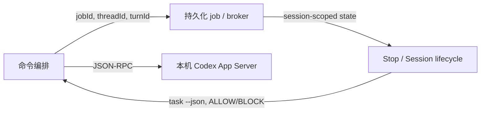

# 阶段 7：交叉验证与质量管控

## 覆盖率门控

| 草稿 | 核心实现覆盖 | 次要/辅助覆盖 | 门控结论 |
|---|---:|---:|---|
| 命令编排 | 3,396 / 3,396（100%） | 限定命令与测试已读 | 达标 |
| 作业生命周期 | 1,636 / 1,636（100%） | 所指定文件加权 68.9% | 达标 |
| 审查门控与次要契约 | 317 / 317（100%） | 所指定文件加权 75.8% | 达标 |

三个核心实现模块合计为 5,349 / 5,349 行，与脚本实现规模统计一致。标准模式的核心目标为 60%，因此达到门控要求；不存在需要补读的低覆盖核心模块。

## 抽查结论

1. **后台启动竞态：确认。** `enqueueBackgroundTask` 在 `codex-companion.mjs:684-698` 先调用 detached worker，再写 job 文件；worker 在 `:847-857` 立刻读取 job 文件且缺失即抛错。调度足够快时存在真实的可见性窗口。
2. **取消/完成终态竞争：确认。** cancel 在 `codex-companion.mjs:963-1011` 无条件写入 `cancelled`；worker 的 `runTrackedJob` 在 `lib/tracked-jobs.mjs:142-203` 无条件写入 completed/failed。两条路径没有版本号、锁、原子 rename 或 terminal-state CAS。最终状态可由后写者决定。
3. **对抗审查 schema 绑定：确认。** `codex-companion.mjs:409-417` 把 `review-output.schema.json` 读入 `outputSchema` 后调用 `runAppServerTurn`；其后仍以 `parseStructuredOutput` 容错呈现（`:418-452`）。这是“生成端约束 + 消费端降级”，不是假定模型永远遵守 schema。
4. **Stop gate 协议隔离：确认。** gate 通过 `task --json` 启动（`stop-review-gate-hook.mjs:98-132`），只检查 payload 的 `rawOutput` 第一行是否为 `ALLOW:`/`BLOCK:`（`:69-95`）。其简化协议与对抗审查 JSON schema 是两条独立路径。
5. **状态配置的默认值：确认。** `state.mjs:19-27` 默认关闭 `stopReviewGate`，Stop Hook 在关闭时仅提示而不阻断（`stop-review-gate-hook.mjs:154-157`）；Codex 不可用时即使开启也只提示并返回（`:159-164`）。所以它是 best-effort 质量门，不是 fail-closed 的交付控制。

## 跨模块模式

项目一贯把宿主交互、传输、持久化和质量政策分开：命令 Markdown 决定 Claude 的产品语义；Node companion 负责协议；状态文件保留跨进程身份；Hook 只在结束点施加最小规则。这个边界使每层可替换，但文件状态并发写入破坏了“可追踪”的基础不变量。

## 未能验证

- Claude Code 对 Stop 被 block 后是否仍触发 SessionEnd 的顺序不在固定源码内，未执行外部文档或端到端宿主测试。
- 未运行真实 Codex App Server，因此 broker busy 降级、实际认证和真实 JSON-RPC 兼容性只能由静态实现与项目测试证据支持。
