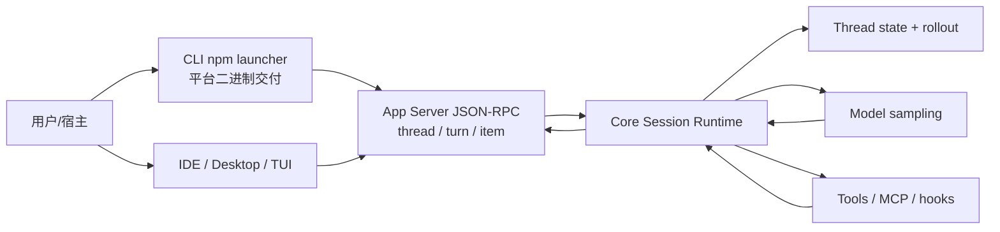
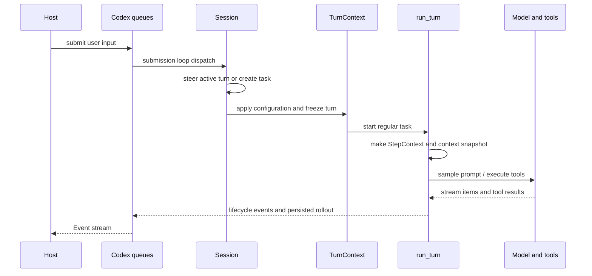
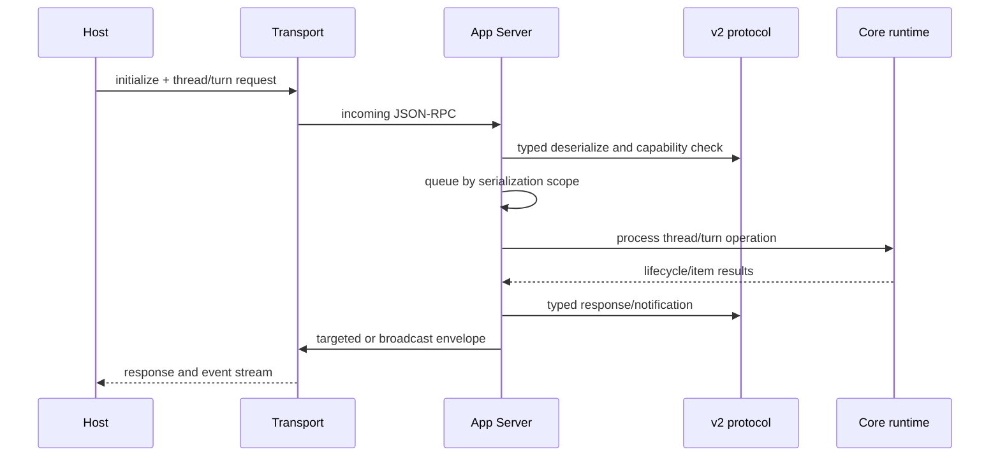

# Codex 有界架构分析

**分析对象**：`/Users/chuzu/projests/stark-repo-analyzer-reference-sources/codex`
**固定版本**：`9e552e9d15ba52bed7077d5357f3e18e330f8f38`
**模式**：standard（有界范围）
**结论范围**：Rust 核心会话/回合编排、App Server JSON-RPC/v2 协议、npm/JS 发行层。全仓约 1,173,445 行实现语言文本、93 个 Cargo manifests；未覆盖的 TUI、沙箱、MCP、SDK、模型提供商、云服务和其余 crate 不应被视为已审计。

## 先给结论

Codex 在这条路径上把“长期运行的编码代理”设计成一个可被多种宿主承载的状态机，而不是一个绑定终端 UI 的聊天循环：

- `core` 用线程保存长期状态，用回合固定模型、环境和权限，再用步骤快照固定一次采样可见的工具面。
- App Server 将这种状态投射成版本化的 `thread/*`、`turn/*` 与 `item/*` JSON-RPC 语义，使 IDE、桌面、CLI 或其他客户端不必复制代理调度。
- npm 包只选择和启动平台原生二进制；它是交付层，不是第二个代理内核。

这个分层的核心取舍很清楚：项目愿意承担 DTO、事件协议、兼容字段和配置快照的复杂度，以换取线程恢复、多宿主一致性和 API 演进空间。

## 场景与定位

一个本地编码代理不是“发 prompt，收文本”就能完成的产品。它要在很长的任务里维护对话上下文、文件和环境认知、工具批准、用户中途追加指令、模型工具调用和任务取消；同时，终端、IDE 和桌面宿主都希望得到同一套生命周期语义。顶层 README 将 Codex CLI 定义为本地运行的 coding agent（`README.md:1-40`）；Rust workspace 的 93 个 manifests 则显示它不是单一 CLI 程序，而是一组 runtime、协议、工具、sandbox 和 UI 组件。

本报告的外部竞品研究未执行：运行环境未提供 WebSearch/WebFetch，且用户禁止 Git history。因此，对 Aider、Claude Code 或 IDE agents 只作类别参照，不作功能、性能或市场结论。

## 架构全景

上图是本次读到的职责边界，而非全仓调用图。`codex-rs/Cargo.toml:1-130` 列出独立的 `core`、`app-server`、`app-server-protocol`、`cli`、`tui`、sandbox、MCP 等 crate。最关键的结构不是 crate 数量本身，而是核心不会把宿主 UI 当成状态 owner：它暴露提交与事件；协议层把它们翻译为主机能理解的资源和通知；发行层只负责启动已构建的 native binary。

## 核心一：会话与回合编排

### 为什么这层必须存在

如果线程状态直接放在 CLI 或 IDE 中，每加一种宿主就要重新实现取消、恢复、权限和工具交错的语义。`Codex` 的公开形状刻意收窄为提交/事件队列对（`codex-rs/core/src/session/mod.rs:387-400`）。`Session` 则声明同一时间最多一个任务、且可由用户输入中断（`core/src/session/session.rs:25-48`）。这把“谁拥有线程”的答案固定在 runtime，而不是留给界面约定。

### 三级快照是这里最有价值的设计

- `SessionConfiguration` 保存线程级、可更新的模型、权限、环境、持久化和动态工具设置（`core/src/session/session.rs:50-111,205-413`）。
- `TurnContext` 固定一个用户意图执行所需的模型、provider、环境快照、权限和扩展信息（`core/src/session/turn_context.rs:102-147,477-580`）。
- `StepContext` 再固定一次采样所看到的环境、能力根、MCP runtime 和工具清单（`core/src/session/step_context.rs:11-48`）。

这比每次采样读取全局可变配置更昂贵，也让“设置立即生效”变得不直观；但对会改本地工作区的代理来说，它避免了 prompt 中广告的工具和真正执行时的权限/环境漂移。删除这层快照会把一致性问题散落在 MCP 刷新、环境切换、审批与恢复逻辑中。

### 回合并发的取舍

新任务总会先取消既有任务（`core/src/tasks/mod.rs:313-323`）。这牺牲了在一个 thread 内并行探索多个模型分支的能力，却免除了 history、审批、token 账本、工具写入和文件差异的多版本合并。对于编码代理，这个偏向是合理的：工具可写本地环境，错误合并比失去线程内并行更危险。

核心路径还把 context budget 做成状态机一部分，而不是 UI 的 prompt 截断：自动压缩与窗口限制在 `core/src/session/context_window.rs:24-91` 和 `core/src/session/turn.rs:798-1030` 处理。它服务于同一原则，即可恢复的运行时必须对“记忆何时太长”拥有确定语义。

### 一处需要持续治理的张力

`Session` 已协调网络代理、MCP、shell、hooks、模型 client、持久化和协作状态（`core/src/session/session.rs:951-1159`）。`SessionServices` 缓冲了一部分复杂度，但这仍是高触达协调器。特别是 legacy sandbox projection 和权限档案并存的配置路径（`session.rs:205-413`）值得演进为更小的不可变 `ResolvedTurnPolicy`。这不是立即重构建议：多种兼容表示并存时，仓促迁移比现状更容易制造权限回归。

## 核心二：可宿主的 App Server 与 v2 协议

Core 已能保证线程内顺序，但它本身不是客户端契约。App Server README 定义了经 JSONL stdio、Unix socket 或实验性 WebSocket 传输的双向 JSON-RPC 边界（`codex-rs/app-server/README.md:22-37`）。这一层让 host 只需了解 `thread/start`、`turn/start`、`turn/steer`、`turn/interrupt` 和通知，而不必持有 Rust 内部状态。

两个细节特别说明其不是简单 RPC wrapper。

第一，协议类型显式承载兼容性。`common.rs` 的宏将方法名、参数、响应和 serialization scope 绑定（`app-server-protocol/src/protocol/common.rs:194-305`），并声明 `turn/started`、`turn/completed`、`item/started`、`item/completed` 等稳定通知名（`common.rs:1613-1641`）。显式 DTO、Serde、Schema 和 TypeScript 生成看起来有模板代码成本，却防止宿主绑定 core 内部 struct，从而允许 runtime 独立演进。

第二，API 层也有自己的并发与背压语义。初始化后，有 serialization scope 的请求会排入队列，否则以异步任务执行（`app-server/src/message_processor.rs:820-859`）。对可断开的远程连接，出站队列满会断开慢连接而非无限积压（`app-server/src/transport.rs:154-170`）。这与 core 的有界提交队列/无界事件队列形成互补：前者治理用户命令堆积，后者治理网络消费者失速。

这里存在一个已经被源码评论点出的设计风险：experimental API 是按连接协商的，但多个客户端可共享 thread，可能看见不同能力面（`app-server/src/request_processors/initialize_processor.rs:63-68`）。更一致的策略是 instance-global capability 或 attach 时拒绝不兼容能力集；代价是减少混合版本客户端的灵活性。这个问题不是样式瑕疵，而是共享状态语义的架构风险。

## 次要模块：发行层为何不应被误认为 runtime

顶层 pnpm 工作区为 CLI、responses proxy npm 包和 TypeScript SDK 提供维护/发布边界（`pnpm-workspace.yaml:1-17`）；根 `package.json` 固定 Node、pnpm 与依赖治理策略（`package.json:2-38`）。`@openai/codex` 元包通过 optional dependencies 找到目标平台 binary；Node 启动器选择 target、继承 stdio、转发信号并镜像退出状态（`codex-cli/bin/codex.js:16-249`）。

这是一种合理的“薄包装”设计：native runtime 的行为仍由其自身定义，npm 仅处理平台分发、安装失败提示和 shell 语义。发布脚本用每平台版本后缀规避 npm 同名版本重发规则，并从明确的 vendor payload 组装包（`codex-cli/scripts/build_npm_package.py:155-173,229-324`）。代价是发行链条包含 optional dependency、artifact 暂存和多平台组合；收益是最终用户无需理解 Rust workspace 或手工选择 binary。

容器脚本还提供受限网络启动辅助，但其 Docker、iptables/ipset、IPv4/DNS 假设与实际 Rust sandbox 的完整关系不在范围内（`codex-cli/scripts/run_in_container.sh:59-95`; `init_firewall.sh:46-115`）。不应把它当作对全产品 sandbox 安全性的验证。

## 综合评价

| 维度 | 有界结论 | 依据 |
|---|---|---|
| 模块边界 | 强：runtime、host API、交付层职责清楚 | queue/event、versioned DTO、thin launcher 三层证据。 |
| 演进能力 | 强但有成本：兼容字段和 protocol generation 使多宿主演进可控 | v2 thread/turn 结构与实验性 gate。 |
| 一致性 | 强调回合/步骤快照和线程内单任务 | Session/Turn/Step context 与 replacement cancellation。 |
| 工程风险 | 配置兼容投影、中心化 Session、跨客户端 experimental capability | 见核心两节的源码注释与结构。 |
| 未评估 | 安全性、性能、端到端可靠性、其余子系统 | 未运行测试，且只读有界范围。 |

## 覆盖、方法与限制

| 模块 | 类型 | 声明行数 | 已读行数 | 覆盖率 | 阈值 |
|---|---|---:|---:|---:|---:|
| Core 会话与回合编排 | 核心 | 11,134 | 8,457 | 76.0% | >=60% |
| App Server JSON-RPC 边界 | 核心 | 3,151 | 3,151 | 100.0% | >=60% |
| CLI 打包与 JS 工作区 | 次要 | 1,084 | 1,084 | 100.0% | >=30% |

完整的逐文件覆盖表在 `drafts/08-coverage.md`，命令和退出状态在 `EXECUTION_LOG.md`，源码抽查在 `drafts/07-cross-validation.md`。

未执行项：外部 WebSearch/WebFetch（工具不可用）、Git history（用户禁止）、构建与测试（静态只读分析范围）。因此本报告只陈述静态源码和项目内文档能够支持的架构结论，不能证明运行时行为、性能或安全属性。
