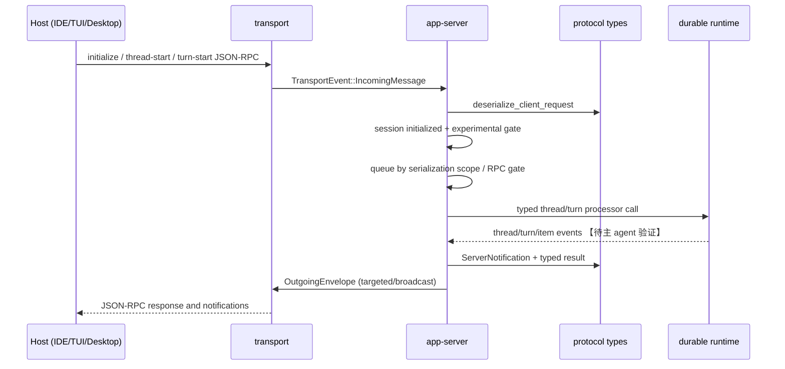

# 06. App Server: Hostable Agent Runtime and v2 JSON-RPC Contract

> Analysis base: fixed source `9e552e9d15ba52bed7077d5357f3e18e330f8f38`. This chapter deliberately treats the durable agent runtime as an upstream concern and examines only its host-facing boundary.

## Role and business problem

The preceding runtime can keep a thread alive, resume history, and run turns, but an IDE, desktop application, TUI, or automation host still needs a stable way to create a thread, submit input, receive incremental output, answer permission prompts, and survive connection changes. `codex-app-server` is that adapter: the README defines bidirectional JSON-RPC 2.0 (with the `jsonrpc` header omitted) over JSONL stdio, Unix socket, or experimental WebSocket transport ([`README.md:22-37`](../../../../Users/chuzu/projests/stark-repo-analyzer-reference-sources/codex/codex-rs/app-server/README.md:22)).

This makes the long-lived runtime independently hostable: a host speaks thread/turn operations rather than embedding agent state or copying event semantics. The public surface remains intentionally host-shaped: `thread/start` opens the conversation, `turn/start` accepts user input and returns immediately, then notifications carry lifecycle, model output, and tool side effects ([`README.md:76-80`](../../../../Users/chuzu/projests/stark-repo-analyzer-reference-sources/codex/codex-rs/app-server/README.md:76)). How a request becomes core execution is outside this module 【待主 agent 验证】.

## Design approach

1. **Transport is replaceable, protocol is not.** `lib.rs` selects stdio, Unix socket, WebSocket, or no local transport ([`src/lib.rs:676-713`](../../../../Users/chuzu/projests/stark-repo-analyzer-reference-sources/codex/codex-rs/app-server/src/lib.rs:676)); all feed `TransportEvent`s into one processor loop ([`src/lib.rs:976-1064`](../../../../Users/chuzu/projests/stark-repo-analyzer-reference-sources/codex/codex-rs/app-server/src/lib.rs:976)).
2. **Handshake establishes a per-connection capability contract.** A `OnceLock` holds initialized state, including experimental opt-in and notification opt-outs ([`src/message_processor.rs:131-201`](../../../../Users/chuzu/projests/stark-repo-analyzer-reference-sources/codex/codex-rs/app-server/src/message_processor.rs:131)). Requests before initialization fail; experimental methods/fields are checked before dispatch ([`src/message_processor.rs:797-812`](../../../../Users/chuzu/projests/stark-repo-analyzer-reference-sources/codex/codex-rs/app-server/src/message_processor.rs:797)).
3. **Wire types own compatibility.** Macro-generated tagged enums pair method names with parameter/response types and declare serialization scopes ([`src/protocol/common.rs:194-305`](../../../../Users/chuzu/projests/stark-repo-analyzer-reference-sources/codex/codex-rs/app-server-protocol/src/protocol/common.rs:194)). v2 specifically gives thread/turn operations explicit wire names (`thread/start`, `turn/start`, `turn/steer`, `turn/interrupt`) ([`src/protocol/common.rs:472-509`](../../../../Users/chuzu/projests/stark-repo-analyzer-reference-sources/codex/codex-rs/app-server-protocol/src/protocol/common.rs:472), [`:805-820`](../../../../Users/chuzu/projests/stark-repo-analyzer-reference-sources/codex/codex-rs/app-server-protocol/src/protocol/common.rs:805)).
4. **Streaming and client callbacks are first-class.** Notifications are a tagged `method`/`params` wire union ([`src/protocol/common.rs:1365-1419`](../../../../Users/chuzu/projests/stark-repo-analyzer-reference-sources/codex/codex-rs/app-server-protocol/src/protocol/common.rs:1365)); lifecycle and item events have stable method names such as `turn/started`, `turn/completed`, `item/started`, and `item/completed` ([`src/protocol/common.rs:1613-1641`](../../../../Users/chuzu/projests/stark-repo-analyzer-reference-sources/codex/codex-rs/app-server-protocol/src/protocol/common.rs:1613)).

## Essential types

| Type | Responsibility |
|---|---|
| `ClientRequest` / `ClientResponsePayload` | Typed method-to-payload mapping; serializes only the response payload into the JSON-RPC result ([`common.rs:212-373`](../../../../Users/chuzu/projests/stark-repo-analyzer-reference-sources/codex/codex-rs/app-server-protocol/src/protocol/common.rs:212)). |
| `ConnectionSessionState` | Per-connection initialization invariant, negotiated capability flags, and an RPC drain gate ([`message_processor.rs:131-201`](../../../../Users/chuzu/projests/stark-repo-analyzer-reference-sources/codex/codex-rs/app-server/src/message_processor.rs:131)). |
| `ThreadStartParams` / `ThreadStartResponse` | Host-supplied model, cwd, permission, environment, and capability-root choices, plus compatibility-facing result fields ([`v2/thread.rs:56-207`](../../../../Users/chuzu/projests/stark-repo-analyzer-reference-sources/codex/codex-rs/app-server-protocol/src/protocol/v2/thread.rs:56)). |
| `TurnStartParams` | A `thread_id`, multimodal `UserInput`, optional overrides, and deliberately marked experimental additions ([`v2/turn.rs:68-158`](../../../../Users/chuzu/projests/stark-repo-analyzer-reference-sources/codex/codex-rs/app-server-protocol/src/protocol/v2/turn.rs:68)). |
| `Thread`, `Turn`, `ThreadItem` | Durable conversation projection: thread identity/status, turn state, and a tagged item union for user messages, agent messages, reasoning, command execution, file changes, and tool calls ([`v2/thread_data.rs:170-220`](../../../../Users/chuzu/projests/stark-repo-analyzer-reference-sources/codex/codex-rs/app-server-protocol/src/protocol/v2/thread_data.rs:170), [`v2/item.rs:222-330`](../../../../Users/chuzu/projests/stark-repo-analyzer-reference-sources/codex/codex-rs/app-server-protocol/src/protocol/v2/item.rs:222)). |

## Core flow

Evidence path: ingress dispatch is [`src/lib.rs:976-1064`](../../../../Users/chuzu/projests/stark-repo-analyzer-reference-sources/codex/codex-rs/app-server/src/lib.rs:976); request deserialization and error conversion occur at [`src/message_processor.rs:516-567`](../../../../Users/chuzu/projests/stark-repo-analyzer-reference-sources/codex/codex-rs/app-server/src/message_processor.rs:516); initialized requests are queued by their declared scope at [`src/message_processor.rs:820-859`](../../../../Users/chuzu/projests/stark-repo-analyzer-reference-sources/codex/codex-rs/app-server/src/message_processor.rs:820); outbound routing filters client capabilities and disconnects a slow remotely controlled peer when its bounded queue fills ([`src/transport.rs:98-236`](../../../../Users/chuzu/projests/stark-repo-analyzer-reference-sources/codex/codex-rs/app-server/src/transport.rs:98)).

## Collaboration and dependencies

`codex-app-server-protocol` exports protocol modules and JSON/TypeScript/schema generation entry points ([`app-server-protocol/src/lib.rs:1-50`](../../../../Users/chuzu/projests/stark-repo-analyzer-reference-sources/codex/codex-rs/app-server-protocol/src/lib.rs:1)). Its manifest depends on `serde`, `schemars`, `ts-rs`, and the experimental API macro, formalizing both runtime validation and generated host artifacts ([`app-server-protocol/Cargo.toml:15-40`](../../../../Users/chuzu/projests/stark-repo-analyzer-reference-sources/codex/codex-rs/app-server-protocol/Cargo.toml:15)). The server depends on that protocol crate and a separate transport crate, alongside core and state capabilities ([`app-server/Cargo.toml:18-76`](../../../../Users/chuzu/projests/stark-repo-analyzer-reference-sources/codex/codex-rs/app-server/Cargo.toml:18)).

The delivery boundary is therefore outside the runtime boundary: CLI packaging invokes `codex app-server generate-ts` or `generate-json-schema`, with artifacts guaranteed to match the installed Codex version ([`README.md:57-67`](../../../../Users/chuzu/projests/stark-repo-analyzer-reference-sources/codex/codex-rs/app-server/README.md:57)). JavaScript/CLI distribution is an outer wrapper around this same wire contract, not a second agent implementation 【待主 agent 验证】.

## Decisions, tradeoffs, and redesign thought

1. **Explicit versioned DTOs over exposing core objects.** Serde/JSON Schema/TS derives make a reviewable contract and allow legacy compatibility fields (for example `sandbox`) beside newer permission profiles ([`v2/thread.rs:170-207`](../../../../Users/chuzu/projests/stark-repo-analyzer-reference-sources/codex/codex-rs/app-server-protocol/src/protocol/v2/thread.rs:170)). Cost: mapping and many long-lived types. Exposing core structs would save code now but bind every host to Rust-internal evolution.
2. **Per-connection experimental negotiation over a global feature switch.** It permits stable and experimental clients to coexist and filters both requests and notifications ([`message_processor.rs:808-812`](../../../../Users/chuzu/projests/stark-repo-analyzer-reference-sources/codex/codex-rs/app-server/src/message_processor.rs:808), [`transport.rs:98-120`](../../../../Users/chuzu/projests/stark-repo-analyzer-reference-sources/codex/codex-rs/app-server/src/transport.rs:98)). Cost: the initializer itself documents odd shared-thread behavior as a known concern and suggests instance-global first-write-wins as an alternative ([`initialize_processor.rs:63-68`](../../../../Users/chuzu/projests/stark-repo-analyzer-reference-sources/codex/codex-rs/app-server/src/request_processors/initialize_processor.rs:63)).
3. **Async notifications plus scoped serialization over synchronous RPC-only turns.** Hosts get immediate turn acknowledgement and incremental UI updates; thread-scoped request serialization prevents conflicting lifecycle/turn mutations ([`common.rs:115-125`](../../../../Users/chuzu/projests/stark-repo-analyzer-reference-sources/codex/codex-rs/app-server-protocol/src/protocol/common.rs:115), [`message_processor.rs:820-859`](../../../../Users/chuzu/projests/stark-repo-analyzer-reference-sources/codex/codex-rs/app-server/src/message_processor.rs:820)). Cost: clients must correlate IDs and render an event stream. This resembles Language Server Protocol’s long-running request/notification split, but Codex adds server-initiated approval requests because an agent must pause for human authority rather than merely publish diagnostics ([`common.rs:1458-1496`](../../../../Users/chuzu/projests/stark-repo-analyzer-reference-sources/codex/codex-rs/app-server-protocol/src/protocol/common.rs:1458)).

## Highlights and issues

- **Highlight:** initialization response precedes outbound readiness; WebSocket bookkeeping then sends connection-specific initialization notices before setting the broadcast-ready flag ([`lib.rs:1016-1040`](../../../../Users/chuzu/projests/stark-repo-analyzer-reference-sources/codex/codex-rs/app-server/src/lib.rs:1016)). This avoids an event arriving before the host has finished the handshake.
- **Highlight:** slow remote peers are disconnected rather than allowed to impose unbounded memory/latency pressure ([`transport.rs:154-170`](../../../../Users/chuzu/projests/stark-repo-analyzer-reference-sources/codex/codex-rs/app-server/src/transport.rs:154)).
- **Issue:** a lagged thread-created broadcast is logged and not resynchronized, so a connection can miss attachment to a newly created thread ([`lib.rs:1099-1104`](../../../../Users/chuzu/projests/stark-repo-analyzer-reference-sources/codex/codex-rs/app-server/src/lib.rs:1099)).
- **Issue:** experimental capability scope is acknowledged in code comments as potentially inconsistent across clients sharing one thread ([`initialize_processor.rs:63-68`](../../../../Users/chuzu/projests/stark-repo-analyzer-reference-sources/codex/codex-rs/app-server/src/request_processors/initialize_processor.rs:63)).

## Files and coverage

Declared module scope: production API-boundary mechanics and v2 thread/turn/notification contracts; excludes unrelated request processors, test code, and agent-runtime internals. For large mixed-responsibility files, `总行数` is the explicitly named boundary region rather than the whole file; every counted line was read.

| 文件名 | 总行数 | 已读行数 | 覆盖率% | 未读原因 |
|---|---:|---:|---:|---|
| `app-server/src/transport.rs` | 241 | 241 | 100.0 | — |
| `app-server/src/request_processors/initialize_processor.rs` | 188 | 188 | 100.0 | — |
| `app-server/src/connection_rpc_gate.rs:1-54` | 54 | 54 | 100.0 | test module excluded |
| `app-server-protocol/src/lib.rs` | 50 | 50 | 100.0 | — |
| `app-server-protocol/src/protocol/v2/mod.rs` | 59 | 59 | 100.0 | — |
| `app-server-protocol/src/protocol/v2/turn.rs` | 452 | 452 | 100.0 | — |
| `app-server-protocol/src/protocol/v2/notification.rs` | 56 | 56 | 100.0 | — |
| `app-server-protocol/src/protocol/v2/thread_data.rs:1-220` | 220 | 220 | 100.0 | non-projection conversion/error tail excluded |
| `app-server-protocol/src/protocol/v2/item.rs:200-330` | 131 | 131 | 100.0 | feature-specific remaining variants excluded |
| `app-server-protocol/src/protocol/v2/thread.rs:1-620,1040-1503` | 1,084 | 1,084 | 100.0 | goal/memory/terminal detail regions excluded |
| `app-server-protocol/src/protocol/common.rs:90-390,470-510,790-830,1365-1529,1608-1675` | 616 | 616 | 100.0 | unrelated endpoint registrations/payloads excluded |
| **Total (declared boundary line regions)** | **3,151** | **3,151** | **100.0** | **达标✅** |

Supplementary integration evidence read but excluded from the narrowly declared mechanics/type scope: `app-server/src/lib.rs` lines 620-1,145, `message_processor.rs` lines 100-870, `outgoing_message.rs` lines 1-720, manifests, and README sections cited above.
