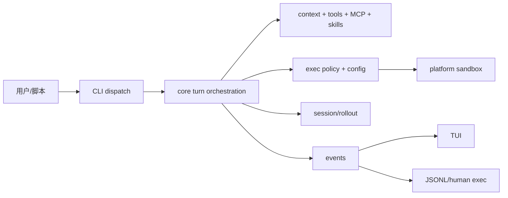
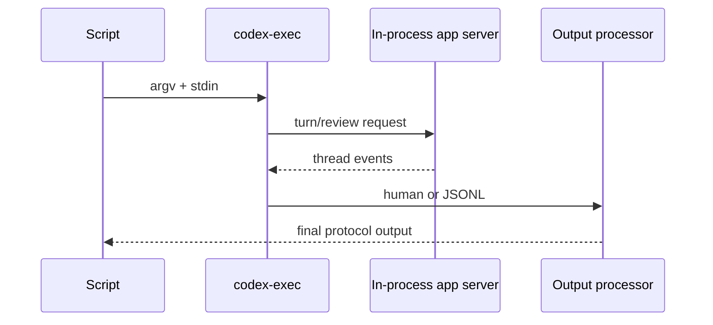
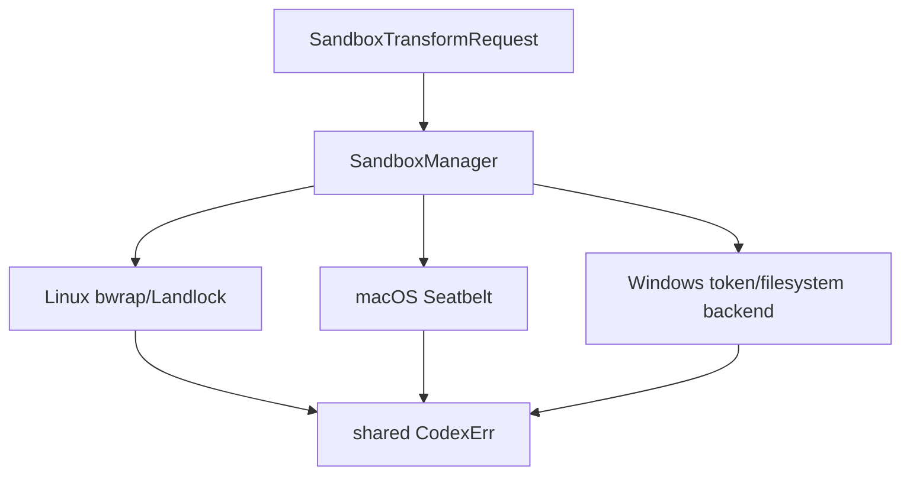

# Codex CLI 架构分析（Physical Baseline）

> 本报告基于固定 HEAD `9e552e9d15ba52bed7077d5357f3e18e330f8f38`，分析对象为 `/Users/chuzu/projests/stark-repo-analyzer-reference-sources/codex`。这是 `standard` 模式的有界基线，不是全仓库完整覆盖。

## 项目全景

Codex CLI 是运行在本地电脑上的 coding agent。它把模型对话、仓库读写、命令执行、审批策略、沙箱、会话持久化和多种输出方式组合成一个可操作的本地工作流。README.md 给出了本地 CLI 的产品定位；Rust workspace 则按集成边界拆分实现。

## 1. CLI 是组合根

`codex-rs/cli/src/main.rs:1-180` 将共享配置、feature toggles、remote/interative options 和子命令组合进 `MultitoolCli`。子命令覆盖 interactive、exec、review、登录、MCP、plugin、app-server、session lifecycle、sandbox 和诊断。

这不是单纯的参数解析，而是产品边界：不同运行模式共享同一套认证、配置、模型和安全约束。代价是中心文件达到 4,087 行，随着功能增加会成为演进热点。更细的 command handler 分层能降低组合根的变化半径。

## 2. Core 把一次 turn 变成受治理的操作

`codex-rs/core/src/lib.rs:1-150` 的模块表包含 thread/session、context、tools、MCP、skills、rollout、exec policy、sandboxing、client 和 retry。它体现出核心设计不是“请求模型并执行 shell”，而是围绕一次可恢复、可审批、可追踪的 turn 建立完整生命周期。

`AGENTS.md` 还明确要求上下文增量构建、有界注入项和缓存稳定性。这些约束把模型质量、成本和可预测性放在同一个架构问题中。

## 3. Exec 为自动化建立协议边界

`codex-rs/exec/src/lib.rs:1-150` 禁止库代码直接写 stdout，并分别提供 human 与 JSONL event processor。`InitialOperation` 区分 user turn/review，`StdinPromptBehavior` 区分 required/forced/optional append。

显式状态增加了实现复杂度，却避免管道输入歧义和 JSON 输出污染，是面向 CI 的合理权衡。

## 4. Configuration 与 policy

`codex-rs/config/src/lib.rs:1-167` 导出 TOML 类型、layer metadata、requirements、profile/thread、MCP/plugin/skill 配置、merge 和 diagnostics。`ConfigLayerSource` 与 requirements 类型让最终运行配置保留来源和限制，而不是把所有值压成无来源 map。

这直接支撑 core 与 sandbox：命令执行的权限不是 CLI 临时决定的，而是经过层叠配置和约束组合得到的。代价是配置类型和 precedence 复杂度较高，需要持续保持诊断可读性。

## 5. Sandbox 是跨平台执行隔离层

`codex-rs/sandboxing/src/lib.rs:1-71` 将 Linux bwrap/Landlock、macOS Seatbelt 和 Windows 后端隐藏在 `SandboxManager`、transform request 和 shared error 类型之后。

这个边界让 core 维持平台中立，同时承认不同平台能力并不完全等价。真正的行为细节仍需阅读各平台实现和测试，本次未覆盖。

## 6. 评价与启发

Codex 的主导设计哲学是：把风险和运行边界显式化。typed CLI、来源可追踪的 config、分离的输出协议、事件化执行和平台 sandbox facade 都服务于这一点。

主要优势是产品工作流一致、自动化边界清楚、安全约束不是后置插件。主要风险是 `codex-core` 与 CLI 组合根的中心化。未来可以保持事件与 policy 契约不变，把 turn engine、产品编排和命令适配进一步拆成更窄的 crate/module，以降低耦合。

## 覆盖与限制

详细覆盖表见 `drafts/08-coverage.md`。本次没有执行外部搜索、网站遍历、用户问答、subagent 并行分析、测试运行或 Git 历史分析。源树只读且 `git diff --quiet` 返回 0。
