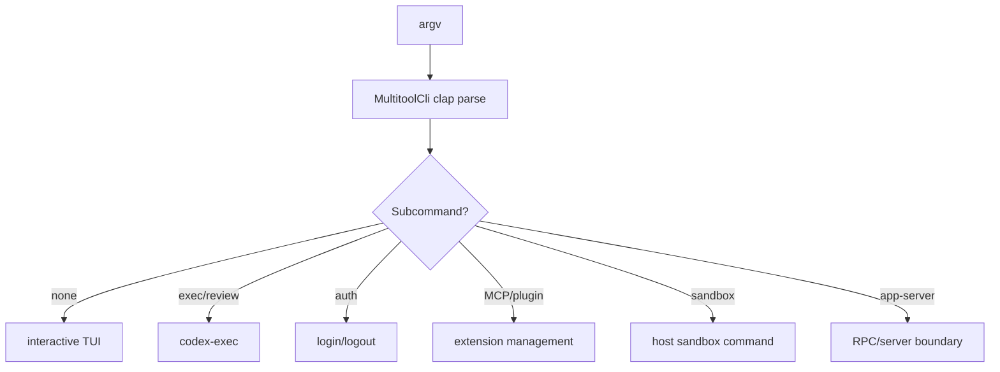

# CLI Dispatch

## Role

The CLI is the product boundary that translates one binary invocation into interactive TUI, non-interactive execution, review, auth, MCP/plugin management, app-server, session lifecycle, and sandbox operations. Removing it would leave the internal crates without a coherent local user contract.

## Core structure and flow

`MultitoolCli` combines shared config/feature/remote/interactive options and an optional `Subcommand`; the enum at `codex-rs/cli/src/main.rs:102-180` is the explicit command vocabulary.

This is a deliberate “one binary, many operational modes” design. A collection of binaries would reduce local dispatch complexity but fragment config, auth, and lifecycle behavior. The cost is a large top-level command surface and a central file of 4,087 lines, which increases change contention.

## Dependencies and tradeoffs

The CLI imports core configuration/builders, auth, model management, TUI, exec, sandbox, rollout, and server crates. This makes the CLI a composition root, consistent with the repository's explicit-boundary philosophy, but it also means platform and feature growth accumulates here.

## Coverage

| File | Total | Read | Coverage | Reason |
|---|---:|---:|---:|---|
| `codex-rs/cli/src/main.rs` | 4087 | 180 | 4.4% | bounded representative entry section |
| **Total** | **4087** | **180** | **4.4%** | **未达标❌** |
