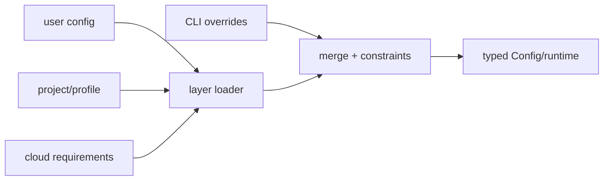

# Configuration Model

The config crate exposes typed TOML, layer metadata, requirements, MCP/plugin/skill settings, profile and thread configuration, diagnostics, and merge operations (`codex-rs/config/src/lib.rs:1-167`). Its role is to turn user, project, cloud, and command-line inputs into constrained runtime state.

Typed exports and `ConfigLayerSource` preserve provenance, while requirements types encode sandbox, network, model, marketplace, and tool constraints. This favors explainability over a loose map of settings. The cost is a large public type surface and complex precedence/diagnostic behavior.

## Coverage

| File | Total | Read | Coverage | Reason |
|---|---:|---:|---:|---|
| `codex-rs/config/src/lib.rs` | 167 | 167 | 100% | full file read |
| **Total** | **167** | **167** | **100%** | **达标✅ for selected facade** |
