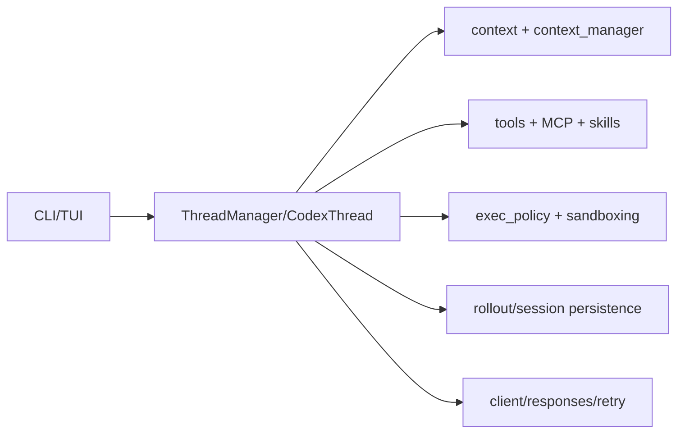

# Core Orchestration

## Role

`codex-core` is the orchestration kernel. Its module declarations expose threads, sessions, context, tools, MCP, skills, rollout, config, exec policy, and sandbox integration (`codex-rs/core/src/lib.rs:1-150`). It exists to make a model turn a governed, persistent product operation rather than a raw API call.

The module list is itself architectural evidence: context, tool exposure, policy, persistence, and provider client are separated behind private modules and selective public re-exports. The design favors a stable orchestration API over direct leaf-crate access. The tradeoff is a broad core crate; `AGENTS.md` explicitly warns that `codex-core` has become bloated.

## Design decisions

Incremental context and bounded injected fragments are called out in `AGENTS.md`, aligning model quality with cache stability and predictable resource use. Rollout/session modules make resumption a first-class behavior. Public re-exports such as `ThreadManager`, `CodexThread`, `McpManager`, and sandbox helpers provide controlled composition points.

## Cross-module contract

CLI selects the operation; core owns stateful turns; exec and TUI consume core events; policy and sandbox constrain tool effects. This is coherent but creates a high-impact dependency hub whose refactoring cost grows with each feature.

## Coverage

| File | Total | Read | Coverage | Reason |
|---|---:|---:|---:|---|
| `codex-rs/core/src/lib.rs` | 150+ | 150 | representative header/module map | entry surface only |
| **Total** | **150+** | **150** | **bounded** | **未达标❌ for full core** |
