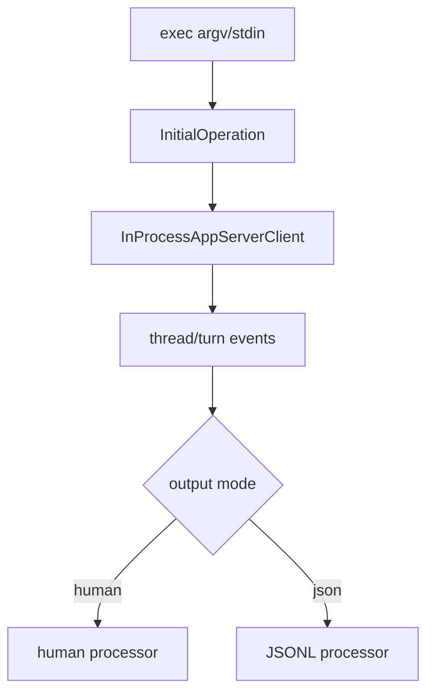

# Non-interactive Execution

`codex-exec` creates the automation boundary for `codex exec` and review. Its root denies direct stdout writes and separates human output from JSONL output (`codex-rs/exec/src/lib.rs:1-20`). This preserves machine-readable contracts while allowing a human-facing renderer.

`InitialOperation` distinguishes a user turn from review, while `StdinPromptBehavior` distinguishes required, forced, and appended stdin. These explicit states avoid ambiguous pipe behavior. The `ExecRunArgs` structure carries config, approvals/sandbox bypass, model/provider, output schema, resume, and diagnostics, making policy visible at the execution boundary.

The tradeoff is more state plumbing, but it prevents stdout protocol corruption and makes automation behavior testable.

## Coverage

| File | Total | Read | Coverage | Reason |
|---|---:|---:|---:|---|
| `codex-rs/exec/src/lib.rs` | 2015 | 150 | 7.4% | representative protocol/setup section |
| **Total** | **2015** | **150** | **7.4%** | **未达标❌** |
