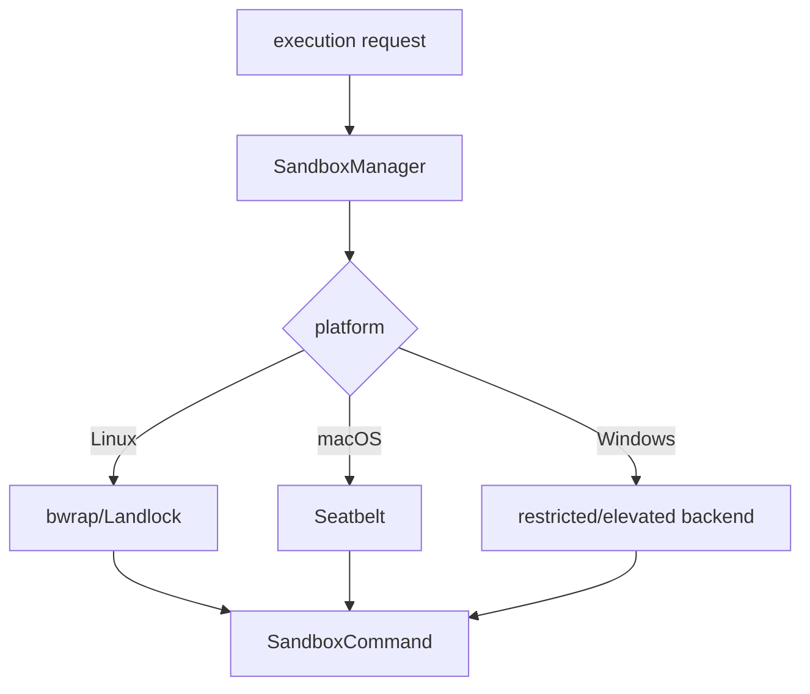

# Sandbox Facade

The sandboxing crate is a platform-neutral facade over Linux bubblewrap/Landlock, macOS Seatbelt, and Windows implementations. `SandboxManager`, request/transform types, policy compatibility, and error conversion are exported from `codex-rs/sandboxing/src/lib.rs:1-71`.

The facade keeps policy decisions above platform details and converts backend failures into shared `CodexErr` categories. This is essential for a cross-platform local agent. The tradeoff is that capability differences must be represented as compatibility checks and platform-specific errors.

## Coverage

| File | Total | Read | Coverage | Reason |
|---|---:|---:|---:|---|
| `codex-rs/sandboxing/src/lib.rs` | 71 | 71 | 100% | full file read |
| **Total** | **71** | **71** | **100%** | **达标✅ for selected facade** |
