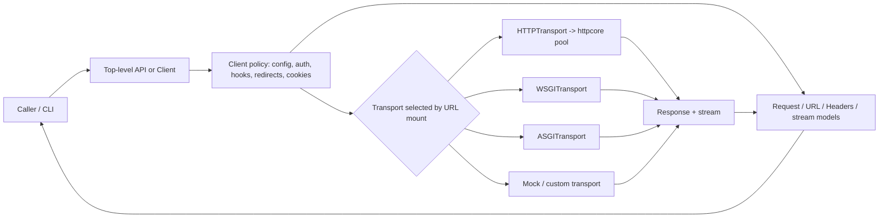
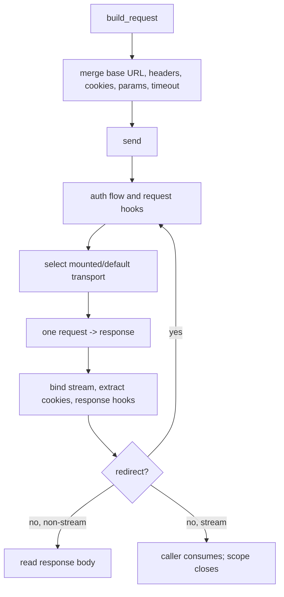
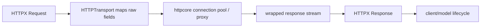

# HTTPX Architecture Analysis

**Scope.** This report analyzes only `/Users/chuzu/projests/stark-repo-analyzer-reference-sources/httpx` at `b5addb64f0161ff6bfe94c124ef76f6a1fba5254`. It is a standard-mode, source-led analysis: 8,600 of 8,827 effective production lines were read (97.43%). No Git history was used. See [coverage](drafts/08-coverage.md), [execution log](execution-log.md), and [requirements check](checks/requirements.md).

## The Problem HTTPX Chooses to Solve

HTTPX is not trying to invent a new HTTP application protocol. Its problem is more practical: Python code needs `requests`-like ergonomics, but modern applications also need connection reuse, HTTP/2, streaming, strict timeouts, asynchronous execution, and testable in-process request paths. The project promises a broadly requests-compatible API, sync and async interfaces, HTTP/1.1/HTTP/2, and a CLI ([README.md](/Users/chuzu/projests/stark-repo-analyzer-reference-sources/httpx/README.md)).

The important distinction is between a one-off helper and a long-lived client. Top-level calls intentionally create a temporary `Client`; a `Client` owns reusable connection state, cookies, and shared policy ([`httpx/_api.py:102-120`](/Users/chuzu/projests/stark-repo-analyzer-reference-sources/httpx/httpx/_api.py:102), [`docs/advanced/clients.md`](/Users/chuzu/projests/stark-repo-analyzer-reference-sources/httpx/docs/advanced/clients.md)). That gives users a low-friction entry point without pretending that repeated ephemeral calls are the high-throughput design.

### Ecosystem position

| Alternative | Architectural emphasis | HTTPX's distinguishing choice |
|---|---|---|
| `requests` | ergonomic synchronous client | Keeps familiar shapes but offers an explicit async peer and HTTP/2 option. |
| `urllib3` | lower-level connection/network utility | HTTPX exposes richer client and message semantics above its network core. |
| `aiohttp` | async-first client/server stack | HTTPX gives sync and async clients parallel public concepts. |
| `httpcore` | HTTPX's declared underlying transport implementation | HTTPX uses it below a model-based transport boundary, rather than exposing it directly. |

This is a necessary project rather than a mere wrapper: mixing unrelated sync and async clients duplicates request construction, cookie/auth rules, error expectations, and streaming lifecycle across an application. HTTPX centralizes those semantics once.

## System Map

The code supports a consistent thesis: **stable HTTP semantics above replaceable execution**. User-facing models carry URL, header, request, response, and stream meaning. The client applies cross-request policy. Transports adapt that prepared request to the network, an in-process Python app, or a mock.

The point of the diagram is boundary ownership. A transport receives exactly one `Request` and returns one `Response`; redirects, authentication, cookie handling, and hooks remain client policy rather than being reimplemented by every backend ([`httpx/_transports/base.py:22-65`](/Users/chuzu/projests/stark-repo-analyzer-reference-sources/httpx/httpx/_transports/base.py:22), [`httpx/_client.py:930-1034`](/Users/chuzu/projests/stark-repo-analyzer-reference-sources/httpx/httpx/_client.py:930)).

## 1. Client Lifecycle: Policy Around a Single Exchange

`BaseClient` holds the durable parts of an HTTP relationship: headers, params, cookies, auth, timeout, base URL, event hooks, and mount configuration. `Client` and `AsyncClient` implement the I/O-specific send loops, while the shared class owns request construction and redirect rewriting ([`httpx/_client.py:188-591`](/Users/chuzu/projests/stark-repo-analyzer-reference-sources/httpx/httpx/_client.py:188)). This is a better boundary than creating a generic “request executor”: sync and async have genuinely different iteration, close, context-manager, and hook protocols.

Three decisions make this layer unusually disciplined.

1. **A sentinel expresses three-state configuration.** `USE_CLIENT_DEFAULT` separates “inherit” from an explicit `None`, which matters for options such as auth and timeout ([`httpx/_client.py:94-114`](/Users/chuzu/projests/stark-repo-analyzer-reference-sources/httpx/httpx/_client.py:94)). The cost is some signature complexity; the gain is that a per-request caller can deliberately disable a client default.
2. **Resources get a visible owner.** Normal sends read the full response and close on error; `stream()` scopes the response with `finally`; client contexts close all owned transports ([`httpx/_client.py:827-928`](/Users/chuzu/projests/stark-repo-analyzer-reference-sources/httpx/httpx/_client.py:827), [`httpx/_client.py:1263-1304`](/Users/chuzu/projests/stark-repo-analyzer-reference-sources/httpx/httpx/_client.py:1263)). This is stricter than hiding lifetime behind a boolean `stream=True`, and the compatibility guide explains why the explicit block is preferred.
3. **Redirects are policy, not an accidental default.** HTTPX does not follow redirects by default because automatic navigation can hide unnecessary calls; when enabled, the client rewrites the next request and guards auth across origins ([`docs/compatibility.md`](/Users/chuzu/projests/stark-repo-analyzer-reference-sources/httpx/docs/compatibility.md), [`httpx/_client.py:475-582`](/Users/chuzu/projests/stark-repo-analyzer-reference-sources/httpx/httpx/_client.py:475)).

The tradeoff is maintainability: sync and async methods mirror significant control flow. That is a real drift risk, but the current shared-policy/explicit-I/O split is more legible than an abstraction that obscures whether iteration or cleanup awaits.

## 2. Message and URL Semantics: The Contract Transports Cannot Change

The client layer only works because its values are not loose strings and byte blobs. `Request` constructs a normalized method, `URL`, `Headers`, extensions, and either encoded content or an explicitly supplied stream ([`httpx/_models.py:382-439`](/Users/chuzu/projests/stark-repo-analyzer-reference-sources/httpx/httpx/_models.py:382)). `Response` similarly keeps raw stream state, decoding policy, response history, associated request, and closure state together ([`httpx/_models.py:515-569`](/Users/chuzu/projests/stark-repo-analyzer-reference-sources/httpx/httpx/_models.py:515)).

URL parsing does the protocol hygiene once: IDNA/ASCII normalization, default-port handling, dot-segment normalization, and a distinction between raw request target and decoded public path ([`httpx/_urlparse.py:293-475`](/Users/chuzu/projests/stark-repo-analyzer-reference-sources/httpx/httpx/_urlparse.py:293), [`httpx/_urls.py:271-314`](/Users/chuzu/projests/stark-repo-analyzer-reference-sources/httpx/httpx/_urls.py:271)). The cost is that user input spelling is not preserved exactly; the benefit is stable origin comparison and transport-ready raw components.

`Headers` makes a revealing compromise. It stores raw name/value pairs plus a lowercase lookup key, preserving order and duplicate fields while offering Mapping-like access ([`httpx/_models.py:149-164`](/Users/chuzu/projests/stark-repo-analyzer-reference-sources/httpx/httpx/_models.py:149)). But ordinary item access combines duplicates with commas. That is convenient for common headers yet hazardous if a reader treats it as a universal representation of multi-value fields. The safer APIs are `get_list()` and `multi_items()`; the API could make that distinction more prominent.

Streaming is a state machine, not just an iterator. A generator cannot be consumed twice; `Response.iter_raw()` detects consumed/closed state and closes at exhaustion, while `Request.read()` may buffer and replace a consumed request stream with replayable `ByteStream` ([`httpx/_content.py:42-64`](/Users/chuzu/projests/stark-repo-analyzer-reference-sources/httpx/httpx/_content.py:42), [`httpx/_models.py:468-494`](/Users/chuzu/projests/stark-repo-analyzer-reference-sources/httpx/httpx/_models.py:468), [`httpx/_models.py:935-972`](/Users/chuzu/projests/stark-repo-analyzer-reference-sources/httpx/httpx/_models.py:935)). That is the right correctness bias for redirect and retry behavior, although buffering moves the cost into memory for large bodies.

## 3. Transports and Runtime Policy: Replace the Mechanism, Keep the Meaning

The transport interface is deliberately small. `BaseTransport.handle_request()` and `AsyncBaseTransport.handle_async_request()` each accept a `Request` and return a `Response`; their docstrings put response-stream consumption or closure on the implementer/caller contract ([`httpx/_transports/base.py:14-86`](/Users/chuzu/projests/stark-repo-analyzer-reference-sources/httpx/httpx/_transports/base.py:14)). That narrow seam is what makes in-process app calls and testing possible without socket emulation.

`HTTPTransport` is an anti-corruption layer, not a duplicate protocol stack. It converts raw URL components, headers, stream, and extensions into `httpcore.Request`, invokes the connection pool, then reconstructs an HTTPX `Response` with a wrapper stream ([`httpx/_transports/default.py:230-262`](/Users/chuzu/projests/stark-repo-analyzer-reference-sources/httpx/httpx/_transports/default.py:230)). The wrapper maps lower-level exceptions during iteration and forwards close, preserving HTTPX's public exception vocabulary while retaining lazy body delivery ([`httpx/_transports/default.py:57-95`](/Users/chuzu/projests/stark-repo-analyzer-reference-sources/httpx/httpx/_transports/default.py:57), [`httpx/_transports/default.py:121-133`](/Users/chuzu/projests/stark-repo-analyzer-reference-sources/httpx/httpx/_transports/default.py:121)).

ASGI and WSGI adapters make the design unusually practical: users can issue client requests directly to an app for tests, development, or staging; `MockTransport` enables deterministic handler responses ([`docs/advanced/transports.md`](/Users/chuzu/projests/stark-repo-analyzer-reference-sources/httpx/docs/advanced/transports.md)). The same seam also permits custom routing by URL mounts. This generalizes proxy routing into a more powerful “which executor serves this origin?” mechanism.

Configuration and auth remain policy objects rather than ad hoc flags. `Timeout`, `Limits`, and `Proxy` centralize finite time budgets, pool bounds, TLS, and proxy material; auth flows use generators so a challenge can produce a follow-up request without embedding protocol-specific retries into every transport (see [`httpx/_config.py`](/Users/chuzu/projests/stark-repo-analyzer-reference-sources/httpx/httpx/_config.py) and [`httpx/_auth.py`](/Users/chuzu/projests/stark-repo-analyzer-reference-sources/httpx/httpx/_auth.py)). The price of this extensibility is responsibility: a custom transport must honor streaming and closing semantics correctly. A dedicated transport compliance test helper would be a useful future addition.

## Supporting Facilities and Engineering Posture

Decoders, multipart encoding, exceptions, utility functions, types, CLI, status codes, and curated package exports complete the public promise. They are not independently architectural, but their placement reinforces the main philosophy: decoding and multipart build model-level streams; exception classes give backend failures a stable public vocabulary; the CLI consumes the same API rather than becoming a separate request engine. The checked repository also documents strict typing and a 100% test coverage target ([`pyproject.toml`](/Users/chuzu/projests/stark-repo-analyzer-reference-sources/httpx/pyproject.toml), [`.github/CONTRIBUTING.md`](/Users/chuzu/projests/stark-repo-analyzer-reference-sources/httpx/.github/CONTRIBUTING.md)).

## Assessment

HTTPX is strongest where many HTTP clients become muddy: it states who owns state and who owns resources. Client state is not global, redirects are opt-in, cookies are client-scoped, URL and body behavior are explicit, and transports receive a real HTTP domain object rather than a private pool API. These are not cosmetic differences from Requests compatibility; they make behavior inspectable in async services, tests, and advanced routing.

The main cost is structural duplication between sync and async orchestration, plus the cognitive cost of a rich model layer. Neither is gratuitous: Python's two execution protocols and HTTP's multi-value/streaming details are real. The practical maintenance concern is semantic drift; shared scenario tests across both client variants are the appropriate guardrail. The practical user concern is stream ownership: using a long-lived `Client` plus scoped streaming is essential when connection reuse and resource safety matter.

## Evidence and Limitations

- Full supporting artifacts: [research](drafts/03-research.md), [module plan](drafts/05-modules-plan.md), [module drafts](drafts), [cross-validation](drafts/07-cross-validation.md), and [insights](drafts/08-insights.md).
- Source HEAD was verified; source was not modified; Git history was not inspected.
- External web searching and official-site crawling were **not performed** because no WebSearch/WebFetch capability was exposed; comparisons are constrained to local project documentation and architectural context.
- Tests were **not performed**. This is a read-only architecture analysis, and running the suite could require environmental/network behavior outside the requested source inspection.
