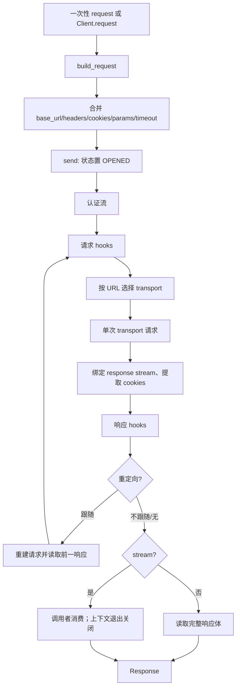

# 模块 06：客户端生命周期与执行编排

## 一句话定位

`httpx/_client.py` 是 HTTPX 的会话编排层：把长期配置归并为 `Request`，在认证、重定向、事件钩子与可替换 transport 之间驱动一次发送，并以显式状态和上下文管理器约束资源生命周期。`httpx/_api.py` 则提供一次性函数入口，每次调用新建、使用并关闭一个同步 `Client`。[`_client.py:L188-L221`](../reference-sources/httpx/httpx/_client.py#L188-L221) [`_api.py:L39-L120`](../reference-sources/httpx/httpx/_api.py#L39-L120)

读者应先理解此层：它决定请求何时被物化、响应体何时被消费、连接何时释放；随后才适合进入 `Request`/`Response`/`URL` 所承载的 HTTP 语义。

## 解决的问题与边界

- **复用会话而不把网络细节暴露给调用者。** `Client` 初始化默认 transport，或接受注入 transport；同时将代理或用户 mounts 变成按 `URLPattern` 排序的路由表。[`_client.py:L639-L716`](../reference-sources/httpx/httpx/_client.py#L639-L716)
- **在客户端级默认值与请求级覆盖之间保持可预测性。** `BaseClient` 保存 auth、params、headers、cookies、timeout、钩子和 `base_url`；`build_request()` 再合并它们并创建 `Request`。[`_client.py:L188-L221`](../reference-sources/httpx/httpx/_client.py#L188-L221) [`_client.py:L340-L389`](../reference-sources/httpx/httpx/_client.py#L340-L389)
- **把资源所有权说清楚。** 一次性 API 与 `stream()` 都以嵌套上下文保证释放；长期 client 则由 `close()`/`aclose()` 或 `with`/`async with` 关闭 transport 与 proxy mounts。[`_api.py:L102-L120`](../reference-sources/httpx/httpx/_api.py#L102-L120) [`_client.py:L827-L877`](../reference-sources/httpx/httpx/_client.py#L827-L877) [`_client.py:L1263-L1304`](../reference-sources/httpx/httpx/_client.py#L1263-L1304)

模块不实现 URL 解析、消息序列化或实际 socket/I/O；它只依赖 `URL`、`Request`、`Response`、流接口与 transport 抽象的既有契约。【待主 agent 验证】从导入和调用可见该分层，但这些对象的内部不在本次阅读范围内。[`_client.py:L20-L40`](../reference-sources/httpx/httpx/_client.py#L20-L40) [`_client.py:L1001-L1023`](../reference-sources/httpx/httpx/_client.py#L1001-L1023)

## 核心结构

| 结构 | 职责 | 生命周期含义 |
| --- | --- | --- |
| `ClientState` | `UNOPENED -> OPENED -> CLOSED` | 禁止已关闭 client 再发送；上下文入口只允许从未打开状态进入。[`_client.py:L125-L136`](../reference-sources/httpx/httpx/_client.py#L125-L136) [`_client.py:L900-L903`](../reference-sources/httpx/httpx/_client.py#L900-L903) |
| `BaseClient` | 公共配置、请求构造、认证选择、重定向重写 | 同步与异步共享 HTTP 语义，减少分叉。[`_client.py:L188-L221`](../reference-sources/httpx/httpx/_client.py#L188-L221) |
| `Client` / `AsyncClient` | 分别调度同步/异步 transport 与流 | 保持相近 API，差别集中在 `await`、流类型和 hooks。[`_client.py:L771-L1034`](../reference-sources/httpx/httpx/_client.py#L771-L1034) [`_client.py:L1485-L1749`](../reference-sources/httpx/httpx/_client.py#L1485-L1749) |
| `BoundSyncStream` / `BoundAsyncStream` | 包装响应流 | 在关闭时写入 `response.elapsed`，再关闭底层流。[`_client.py:L139-L182`](../reference-sources/httpx/httpx/_client.py#L139-L182) |
| `_mounts` | `URLPattern -> transport | None` | 先匹配的 mount 决定 transport，未匹配落回默认 transport。[`_client.py:L760-L769`](../reference-sources/httpx/httpx/_client.py#L760-L769) |

## 主流程

`Client.request()` 本身只是 `build_request()` 加 `send()` 的组合；传入 `cookies` 会发出去弃用警告，因为持久化语义可能含混。[`_client.py:L771-L825`](../reference-sources/httpx/httpx/_client.py#L771-L825) `send()` 拒绝 CLOSED 状态，补齐 timeout，解析默认/请求级 auth；非流式响应立即 `read()`，异常时关闭响应。[`_client.py:L879-L928`](../reference-sources/httpx/httpx/_client.py#L879-L928)

认证层用生成器允许一次响应触发下一次请求，并在 finally 关闭 auth flow。重定向层在每次请求前后运行 hooks，累计 history，达到上限抛错；不自动跟随时把下一请求放进 `response.next_request`。[`_client.py:L930-L999`](../reference-sources/httpx/httpx/_client.py#L930-L999) 单次发送按 URL 选 transport，验证同步流类型，调用 `handle_request()`，再将流替换为计时包装器并抽取 cookies。[`_client.py:L1001-L1034`](../reference-sources/httpx/httpx/_client.py#L1001-L1034)

异步路径保持相同层次：`request()`/`stream()` 分别 `await send()`；`send()` 用 `aread()`；认证、钩子、transport、关闭均为 await 版本。[`_client.py:L1485-L1540`](../reference-sources/httpx/httpx/_client.py#L1485-L1540) [`_client.py:L1542-L1749`](../reference-sources/httpx/httpx/_client.py#L1542-L1749)

## URL 与消息对象如何进入生命周期

1. `build_request()` 将 `base_url`、headers、cookies、params 和 timeout 合并后构造 `Request`；相对 URL 以始终带 `/` 的 base path 追加，避免 URL 拼接歧义。[`_client.py:L340-L411`](../reference-sources/httpx/httpx/_client.py#L340-L411) [`_client.py:L413-L443`](../reference-sources/httpx/httpx/_client.py#L413-L443)
2. 重定向以 `Response` 的 `Location` 产生新 `URL`，处理无 host 的绝对形式、相对地址和 fragment；跨 origin 会移除 `Authorization`（HTTP 直升 HTTPS 例外）、更新 Host，并在 GET 改写时移除 body 相关 headers。[`_client.py:L475-L582`](../reference-sources/httpx/httpx/_client.py#L475-L582)
3. transport 返回 `Response` 后，client 补充其关联 `request`、流包装、cookie 提取和默认文本编码。`Request`/`Response` 的字段语义与关闭行为须由消息模块继续说明。【待主 agent 验证】[`_client.py:L1013-L1023`](../reference-sources/httpx/httpx/_client.py#L1013-L1023)

## 设计决策与取舍

1. **默认值哨兵，而非仅靠 `None`。** `USE_CLIENT_DEFAULT` 区分“继承 client 设置”与“显式传 None 关闭设置”，使 timeout/auth 等可表达三态；代价是公共签名与内部判断更复杂。[`_client.py:L94-L114`](../reference-sources/httpx/httpx/_client.py#L94-L114) [`_client.py:L904-L912`](../reference-sources/httpx/httpx/_client.py#L904-L912)
2. **稳定 HTTP 编排，替换执行机制。** transport 可注入、可按 URL mount，client 只调用抽象接口；这便于测试和代理分流，但 transport 生命周期必须被 client 逐一转发关闭。[`_client.py:L718-L769`](../reference-sources/httpx/httpx/_client.py#L718-L769) [`_client.py:L1263-L1304`](../reference-sources/httpx/httpx/_client.py#L1263-L1304)
3. **流式读取显式拥有资源。** `send(stream=False)` 的易用默认值是读完；`stream()` 用 finally 关闭，因此减少泄漏风险，但调用方若绕过上下文自行 `send(stream=True)`，必须理解并承担关闭响应的责任。这是由 `stream()` 的显式 finally 与 `send()` 的分支直接推出的结论。[`_client.py:L827-L877`](../reference-sources/httpx/httpx/_client.py#L827-L877) [`_client.py:L920-L928`](../reference-sources/httpx/httpx/_client.py#L920-L928)

## 与常见客户端形态的比较与可选重设计

相较“每次调用都创建连接/不暴露会话”的极简客户端，这里将一次性 API 明确实现为临时 `Client`，同时把高频场景引向可复用 `Client`；前者简单且无遗留资源，后者能保留 cookies、配置与底层连接池能力（连接池具体机制【待主 agent 验证】）。[`_api.py:L102-L120`](../reference-sources/httpx/httpx/_api.py#L102-L120) [`_client.py:L594-L605`](../reference-sources/httpx/httpx/_client.py#L594-L605)

若重设计，可将同步/异步的近镜像 `send`、认证和重定向循环提炼为参数化的内部执行内核，以减少维护重复；但 Python 同步迭代器、异步迭代器、关闭协议及 hooks 的 await 差异会让抽象更难读。当前共享 `BaseClient` 的“配置与 HTTP 规则共用、I/O 调度分开”是较保守的折中。[`_client.py:L188-L591`](../reference-sources/httpx/httpx/_client.py#L188-L591) [`_client.py:L930-L1034`](../reference-sources/httpx/httpx/_client.py#L930-L1034) [`_client.py:L1645-L1749`](../reference-sources/httpx/httpx/_client.py#L1645-L1749)

## 优点、风险与阅读下一站

**优点：** 生命周期状态简单而强约束；默认请求路径自动读取且异常关闭；流式路径和临时 API 都以上下文界定所有权；认证/重定向/hook 都在 transport 之外，因此 HTTP 语义不会散落到网络实现。[`_client.py:L125-L136`](../reference-sources/httpx/httpx/_client.py#L125-L136) [`_client.py:L879-L999`](../reference-sources/httpx/httpx/_client.py#L879-L999)

**风险/局限：** `Client` 与 `AsyncClient` 仍存在大段镜像流程，语义修复可能需双改；一次性 `request()` 每次新建 client，不适合追求跨调用会话复用的场景；相对 `base_url` 的拼接采取“始终追加”的规则，熟悉 URI 替换规则的读者可能会意外。[`_api.py:L102-L120`](../reference-sources/httpx/httpx/_api.py#L102-L120) [`_client.py:L396-L410`](../reference-sources/httpx/httpx/_client.py#L396-L410)

下一模块应解释 `URL` 的相对/绝对判断、join 与 origin，及 `Request`/`Response` 的 headers、stream、`read`/`close` 语义；这些对象正是上述生命周期传递与重写的载体。【待主 agent 验证】

## 阅读覆盖

| 文件 | 实际读取的唯一行区间 | 已读/总行数 | 覆盖率 |
| --- | --- | ---: | ---: |
| `httpx/_client.py` | 1-1035，1263-2019 | 1,792 / 2,019 | 88.76% |
| `httpx/_api.py` | 1-438 | 438 / 438 | 100.00% |
| 合计 | — | 2,230 / 2,457 | 90.76% |

未读 `httpx/_client.py:L1036-L1262`，为同步 HTTP 动词便捷包装器；它们的模式已由 `request()` 与异步对应实现覆盖，本文未据此区间形成专属结论。
