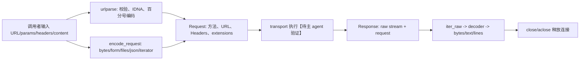

# 模块六：消息与 URL 语义

## 结论

客户端生命周期提出的要求不是“能发出字节”即可，而是调用者在重定向、重试、日志、流式读取前后仍能观察到同一套 HTTP 含义。此组模块把 URL、头、请求/响应、cookie 与 body 的解释固定为独立值和状态机；执行层因而可以替换，而不改写用户面向的语义。`Request` 已把方法、规范 URL、头、扩展和可读流组装好【`httpx/_models.py:382-423`】；随后才应交给 transport 【待主 agent 验证】。

## 职责与结构

| 层 | 核心结构 | 保证 |
|---|---|---|
| URL | `ParseResult` -> `URL` -> `QueryParams` | 内部 ASCII canonical form；公开 Unicode/bytes 视图；重复查询参数保留【`_urlparse.py:315-345`】【`_urls.py:169-215`】【`_urls.py:498-510`】 |
| 消息元数据 | `Headers`、`Cookies` | header 小写索引但保留原始键与重复项；cookie 委托标准 `CookieJar`【`_models.py:149-164`】【`_models.py:231-240`】【`_models.py:1101-1115`】 |
| 消息体 | `ByteStream`、同步/异步 iterator stream、编码器 | 输入先变成 `(默认头, stream)`；一次性 generator 重读报错【`_content.py:31-39`】【`_content.py:42-64`】【`_content.py:107-133`】 |
| 响应状态 | `Response` | 将 raw stream、解码后的 bytes/text、关闭/消费状态和关联 request 连成可检查生命周期【`_models.py:515-569`】【`_models.py:884-959`】 |

## 主流程

`urlparse` 区分缺失 query 与空 query，拒绝超长及不可打印 ASCII，随后将 scheme、host、port、路径等规范成 ASCII【`_urlparse.py:213-229`】【`_urlparse.py:293-345`】；host 分 IPv4、IPv6、ASCII 和 IDNA 验证，默认端口消去，`.`/`..` 路径折叠【`_urlparse.py:348-419`】【`_urlparse.py:422-475`】。这解释了为什么 `URL.raw_path` 是请求目标而 `path` 是解码后的易用视图【`_urls.py:271-314`】。

## 关键决策与取舍

1. **canonical form 优先于保留输入字面量。** `ParseResult` 的所有属性都从 ASCII canonical form 导出【`_urlparse.py:315-345`】，令相等、Host 和请求 target 稳定；代价是用户原始大小写、默认端口和点段不再可逆。
2. **headers 同时提供 HTTP 保真与 Mapping 易用性。** `_list=(raw_key, lowercase_key, value)` 支持大小写无关查找、重复字段和插入顺序【`_models.py:149-164`】【`_models.py:284-326`】；但 `.items()`/`__getitem__()` 以逗号拼接重复值【`_models.py:216-240`】【`_models.py:284-302`】，对语义不可逗号合并的字段，调用方必须用 `multi_items()`/`get_list()`。
3. **自动编码只在高层输入启用。** `content/data/files/json` 会推断 `Content-Length`、chunked 或 content type【`_content.py:186-218`】；显式 `stream` 不补任何头，保留传输 API 接收到的原样消息【`_models.py:424-439`】。这是便利与精确控制的明确分界。
4. **流不能假装可重放。** generator 第二次迭代抛 `StreamConsumed`【`_content.py:50-64`】；`Response.iter_raw()` 先检查 consumed/closed，读尽后关闭【`_models.py:935-972`】。但 `Request.read()` 会把已读流替换为 `ByteStream`，以可预测的内存代价换取后续重放【`_models.py:468-494`】。
5. **响应解释晚绑定。** `Content-Encoding` 决定 decoder 链，`Content-Type charset`、默认值或探测函数决定文本编码【`_models.py:653-722`】；因此 transport 只需供应原始流和 extensions，不必承担呈现语义。

## 与常见实现的比较及改进方向

相较把 URL 当字符串、把 body 全部 eager-buffer 的轻量客户端，这里更适合重定向、上传与大响应：URL 身份、重复 header/query、流消费和关闭都显式建模。相较直接暴露底层 socket/protocol 对象，它多了一层稳定的 `Request/Response` 契约，适合多 transport 复用。

可改进处：

- `Headers` 的逗号合并接口很容易被误用于 `Set-Cookie`；可增加字段感知的安全访问 API，或在文档/API 名上强化 `multi_items()` 的优先级。
- `QueryParams` 宣称 immutable，却以浅拷贝列表构建后继对象【`_urls.py:537-598`】；现有操作不修改旧列表，语义成立，但改成 tuple 值会让不变性成为表示层事实。
- `urlparse(netloc=...)` 使用 `partition(':')`【`_urlparse.py:239-243`】，而 IPv6 的 kwargs 已被方括号处理【`_urlparse.py:257-261`】；可在 API 边界统一以 authority parser 处理，减少特殊路径。

## 强项、风险与下一章

强项是协议细节集中：安全 header 在 `repr` 中脱敏【`_models.py:366-379`】，序列化后换成必然关闭的 `UnattachedStream`【`_models.py:501-512`】【`_content.py:92-104`】，错误状态又保留 request/response 上下文【`_models.py:794-829`】。风险主要在“易用 Mapping”与“线上的多值 HTTP 字段”之间的语义落差，以及缓冲读取的内存成本。

下一章应检查 transport 如何接收 `Request` 的 `URL.raw_*`、headers、stream 与 extensions，并如何构造带 raw stream 的 `Response`【待主 agent 验证】；这里已经定义了执行层必须遵守的稳定边界。

## 覆盖记录

| 文件 | 实读行区间 | 实读/总行 | 覆盖率 |
|---|---:|---:|---:|
| `_models.py` | 1-1277 | 1277/1277 | 100% |
| `_urls.py` | 1-641 | 641/641 | 100% |
| `_urlparse.py` | 1-527 | 527/527 | 100% |
| `_content.py` | 1-240 | 240/240 | 100% |
| 合计 | - | 2685/2685 | 100% |
