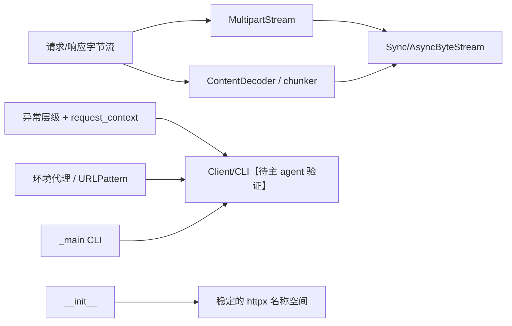

# 模块六补充：编码、表单、异常与公共门面

这些文件不主导请求调度，却决定主路径是否能在不破坏 HTTP 语义的前提下处理字节、失败、环境和人机入口。它们共同遵守同一条界线：数据可以流式变换，失败必须可分类，便利 API 不应吞掉底层语义。

## 支撑设施地图

| 文件群 | 角色 | 关键设计与证据 |
|---|---|---|
| `_decoders.py` | 传输编码、文本、分块的增量变换 | 多编码按应用的逆序解码；分块器保留不足一块的尾部（`httpx/_decoders.py:203-225,228-303`） |
| `_multipart.py` | multipart/form-data 的可流式请求体 | 已知长度用 `Content-Length`，未知文件长度改用 chunked（`httpx/_multipart.py:224-300`） |
| `_exceptions.py` | 让调用者按恢复策略 catch | transport、请求、状态、stream misuse 被刻意分开（`httpx/_exceptions.py:1-32,74-377`） |
| `_types.py` | 将 sync/async stream 和宽松输入集中成类型契约 | 两个 stream 基类只要求迭代与可选关闭（`httpx/_types.py:31-114`） |
| `_utils.py` | 环境/路由小策略 | `NO_PROXY` 被转成 URL pattern，且按 specificity 排序（`httpx/_utils.py:30-76,120-242`） |
| `_main.py` | CLI 到 `Client.stream()` 的薄入口 | 下载按 `iter_bytes` 写入，trace 通过 extensions 注入（`httpx/_main.py:212-270,452-506`） |
| `_status_codes.py`、包门面 | 常量与公共 API 稳定性 | IntEnum 给出类别谓词/原因短语；根包 re-export 并设定模块名（`httpx/_status_codes.py:8-162`; `httpx/__init__.py:1-106`） |

## 编解码：增量是比“支持格式”更重要的性质

`DeflateDecoder` 第一次失败时尝试 raw-deflate，再把 zlib 错误归为 `DecodingError`；gzip、brotli、zstd 同样在流式 `decode/flush` 接口中处理失败（`httpx/_decoders.py:36-200`）。Brotli/Zstandard 是可选导入，缺少依赖时从支持表移除或在显式构造时给出安装错误（同文件:16-33,108-158,381-393）。

`MultiDecoder` 反转 children 后依次处理，这正符合“编码 A 后 B，解码须先 B 后 A”的协议顺序（同文件:203-225）。`ByteChunker`、`TextChunker` 把不完整尾块留在 buffer；`TextDecoder` 使用 incremental decoder，`LineDecoder` 专门保留跨 chunk 的 `\r` 和未终止行（同文件:228-379）。若将每个网络块独立 `.decode()` 或 `.splitlines()`，多字节字符和 CRLF 边界都会被错误切开。

## multipart：长度可知性决定传输方式

`DataField` 检查原始类型，缓存 header/数据；`FileField` 支持兼容既有生态的 2/3/4 元组输入，却拒绝文本文件对象，并以 64 KiB 读取文件（`httpx/_multipart.py:70-221`）。注释也承认变长 tuple API 笨重，属于兼容性优先于类型清晰度的明确债务（同文件:130-133）。

`MultipartStream` 用随机 boundary，统一生成同步和异步迭代；若所有字段可在不读入内存的前提下获长度，发 `Content-Length`，否则发 `Transfer-Encoding: chunked`（同文件:224-300）。这是正确的流式折中：替代方案是先缓冲整个上传以计算长度，会在大文件上破坏内存上限；代价是某些服务器对 chunked 上传兼容性较差。

## 失败模型：区分可恢复性，而非只给一个异常

异常树把连接池等待、连接/读/写失败、代理与协议问题归到 `TransportError`；损坏编码、过多重定向归到 `RequestError`；4xx/5xx 只有显式 `raise_for_status()` 才成为 `HTTPStatusError`（`httpx/_exceptions.py:1-32,107-268`）。这避免“服务端返回 404”和“根本没有收到响应”混为一谈。

`request_context()` 在异常离开时附回 request，使底层适配器无需到处携带上下文（同文件:364-377）。另一个重要边界是 `StreamConsumed`、`StreamClosed`、`ResponseNotRead`、`RequestNotRead`：它们继承 `RuntimeError` 而不是 `RequestError`，表明这是调用方对流生命周期的错误，而非网络可重试失败（同文件:291-361）。【待主 agent 验证】client 在何处包裹 `request_context()` 应由其模块阅读确认。

## 类型、工具与对外入口

`_types.py` 集中定义 URL/header/cookie/auth/file 等接受形状，同时用 `SyncByteStream` 和 `AsyncByteStream` 把执行模型的最小协议固定为迭代加关闭（`httpx/_types.py:31-114`）。这使 transport、multipart 和响应模型能够共享流边界，避免以具体 generator 类型耦合。【待主 agent 验证】具体模型如何消费这些类型应由模型模块确认。

环境代理解析只接受 `http/https/all`，并将 `NO_PROXY` 的域名、IPv4、IPv6、localhost 改写为不走代理的 mount；`*` 直接关闭所有环境代理（`httpx/_utils.py:30-76`）。`URLPattern` 分别处理 `*.example.com` 与 `*example.com`，并按端口、host 长度、scheme 长度构造优先级（同文件:120-227）。这种“先归一化再排序匹配”比运行时散落 if/else 更可预测。

CLI 没有另造请求栈：它根据 body 推断默认 GET/POST，构建 `Client` 后调用 `client.stream()`，通过 `extensions["trace"]` 传递详细网络事件；下载逐块写出并利用响应已下载字节数更新进度（`httpx/_main.py:212-270,452-506`）。这让 CLI 同样是公开 HTTP 语义的消费者，而不是第二个 transport。`codes` 提供状态范围判定、原因短语和 requests 兼容小写别名（`httpx/_status_codes.py:8-162`）；根 `__init__` 统一 re-export，并将公开对象的 `__module__` 设为 `httpx`（`httpx/__init__.py:1-106`），版本元数据在 `__version__.py:1-3`。

## 覆盖率（标准模式，次要要求 >=30%）

实际读取范围按文件总行数计；相邻区间已合并。

| 文件 | 实际读取行 | 总行 | 覆盖 |
|---|---:|---:|---:|
| `_decoders.py` | 1-393 | 393 | 100% |
| `_multipart.py` | 1-300 | 300 | 100% |
| `_exceptions.py` | 1-377 | 377 | 100% |
| `_types.py` | 1-114 | 114 | 100% |
| `_utils.py` | 1-242 | 242 | 100% |
| `_main.py` | 1-506 | 506 | 100% |
| `_status_codes.py` | 1-162 | 162 | 100% |
| `__init__.py` | 1-106 | 106 | 100% |
| `__version__.py` | 1-3 | 3 | 100% |
| **次要合计** | **2,203** | **2,203** | **100%（达标）** |
