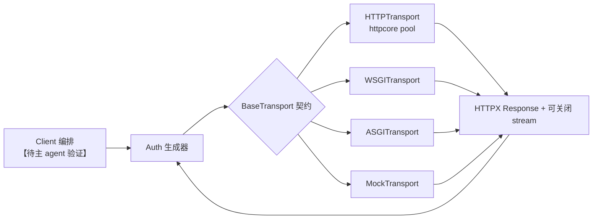
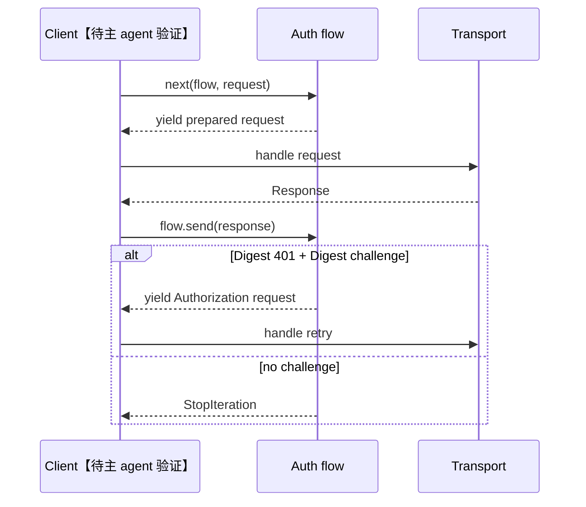

# 模块六：执行适配、配置与认证策略

前文的 client 编排已经把请求组织成稳定的模型状态；这里要解决的是另一件更棘手的事：如何让同一套 HTTPX `Request/Response` 语义能落到网络、代理、进程内 ASGI/WSGI 和测试替身上。答案是把执行替换点、运行策略和认证往返都压在明确的边界，而不是让调用方直接面对连接池实现。

## 角色与核心判断

项目的这一层体现了“**稳定 HTTP 语义，替换执行机制**”的取舍。

| 子域 | 问题 | 关键结构 | 结果 |
|---|---|---|---|
| transport | 谁执行一次请求、谁负责流关闭？ | `BaseTransport` / `AsyncBaseTransport` | 客户端只面对 `Request -> Response` 和 stream 生命周期 |
| 默认网络适配 | `httpcore` 的池、异常与 HTTPX 的公开模型怎样隔离？ | `HTTPTransport`、响应 stream 包装、异常映射 | 后端细节不外泄，流式传输不被提前物化 |
| 配置 | TLS、超时、连接复用、代理的策略如何统一表达？ | `Timeout`、`Limits`、`Proxy` | 值对象在 client/transport 间可传递、可比较 |
| 认证 | 401 challenge 和二次请求如何不硬编码进 client？ | 生成器式 `Auth` | Basic 是一步，Digest 可有条件地往返多步 |

这一判断和此前“client 负责请求生命周期”的叙事相接：client 保持策略编排者，transport 只执行一个已准备请求。【待主 agent 验证】本模块随后为模型层的 stream/异常机制补上真实 I/O 的实现边界。

## 执行契约：小到只剩一次交换

`BaseTransport.handle_request()` 与异步的 `handle_async_request()` 各只接收一个 `Request`、返回一个 `Response`；上下文管理器将退出时分别收束到 `close/aclose`（`httpx/_transports/base.py:14-86`）。文档还把“消费或关闭返回 stream”明确为调用约束（同文件:26-59）。这很克制：重试、重定向、cookie、认证不应侵入所有 transport 的实现。

这不是“为接口而接口”。若 client 直接依赖连接池，进程内应用测试就得伪造 socket；若 transport 承担重定向和认证，各实现又必须复制 HTTP 策略。当前分层的成本是自定义 transport 必须正确实现 stream 回收，但 `BaseTransport` 的文档把这个责任暴露得足够早。

### 默认网络 transport：薄而有意义的反腐层

`HTTPTransport`/`AsyncHTTPTransport` 把 HTTPX 请求的 method、原始 URL 分量、原始 headers、stream 和 extensions 逐项转成 `httpcore.Request`，再将 status、headers、extensions 与包装后的响应流还原为 HTTPX `Response`（`httpx/_transports/default.py:230-262,374-406`）。它没有复制协议栈或连接池，而是将其委托给 `httpcore`。

包装并非多余：`ResponseStream` / `AsyncResponseStream` 在**迭代**期间执行异常翻译，并把 `close/aclose` 转交底层流（同文件:121-133,265-276）。这保留了流式回压和延迟错误，而非在 `handle_*` 返回前读取全部 body。

异常翻译表按具体性挑选最窄的 HTTPX 异常类型，例如 `httpcore.ReadTimeout -> httpx.ReadTimeout`，并保留原异常链（同文件:71-118）。因此公开 API 的 catch 语义不随 httpcore 的类层级变化而漂移；代价是适配表需要跟随后端异常演化维护。直接把 `httpcore` 异常抛给用户会更少代码，却会破坏 HTTPX 的稳定异常契约。

### 连接池与代理选择

构造器把字符串/URL 代理规范化为 `Proxy`，创建 TLS context，再按无代理、HTTP(S) 代理、SOCKS 代理选择 `ConnectionPool`、`HTTPProxy` 或 `SOCKSProxy`；异步版本使用相应 `Async*` 后端（`httpx/_transports/default.py:135-215,279-359`）。连接数、keep-alive、协议开关、UDS、本地地址、重试和 socket options 被下推到池。

这把“执行器可替换”落实成两个方向：同一个公开 transport 配置可换同步/异步池；而代理并非 client 中散落的条件分支。SOCKS 采用按需导入并在依赖缺失时给出安装指引（同文件:187-194,331-338），优点是基本安装不强制带可选依赖；缺点是配置错误在 transport 实例化时而非包导入时才显现。

### 进程内与测试适配器

| 适配器 | 输入到宿主协议的变换 | 语义取舍 |
|---|---|---|
| `WSGITransport` | 先读完 request，构造 WSGI environ，包装应用 iterable | WSGI 输入是同步 `BytesIO`，请求端不再保留流式上传；响应 iterable 仍延迟迭代（`wsgi.py:91-149`） |
| `ASGITransport` | 形成 ASGI scope，以 `receive/send` 转换 request body 与 response messages | 收集 body parts 后才返回单个 `ASGIResponseStream`，测试方便但响应并非端到端增量（`asgi.py:99-187`） |
| `MockTransport` | 请求 body 被读完后交给 handler；异步路径允许 await handler | 让单测替换 I/O，且同步路径明确拒绝 async handler（`mock.py:15-43`） |

ASGI transport 对 `HEAD` 丢弃响应 body，并让 `raise_app_exceptions=False` 把未开始的失败变为 500（`asgi.py:158-180`）。WSGI 则保留应用 iterable 的 `.close()`，并可选择重新抛出 `start_response` 提供的异常（`wsgi.py:30-41,119-149`）。它们的共同点不是模拟网络，而是将宿主协议翻译回同一 `Response` 形状。

## 配置：将环境策略变成值对象

### TLS、超时与资源边界

`create_ssl_context()` 的默认路径信任环境中的 `SSL_CERT_FILE/SSL_CERT_DIR`，否则使用 certifi；`verify=False` 关闭 hostname 校验和证书验证；字符串 CA 与 `cert` 参数仍保留但发出弃用警告（`httpx/_config.py:23-69`）。安全默认值清晰，且把兼容旧调用的负担集中在一个入口。

`Timeout` 允许单值、四元组、已有实例或四个显式字段；拒绝“无默认值但只填写部分字段”的模糊配置，并能 `as_dict()` 下推（同文件:72-156）。四个维度是 `connect/read/write/pool`，说明等待连接池与网络读写被有意区分。`Limits` 则定义最大连接、可保留 keep-alive 数和空闲过期（同文件:159-198），默认是总 100、保活 20（同文件:246-248）。

`Proxy` 验证协议、从 URL 提取并移除凭据、保留可单独配置的代理 TLS context 与 headers；`repr` 遮蔽密码，而 `raw_auth` 在适配边界才编码为 bytes（同文件:201-243）。这避免 URL 同时成为路由和秘密载体。替代方案是 transport 接收未经解析字符串，但每个实现都要重复合法性和凭据处理。

## 认证：生成器承担挑战-响应状态机

认证基类将一次或多次请求抽象成 generator：client 发送 `yield` 出的请求，再把 `Response` 送回；基类分别提供 sync/async 外壳，并仅在声明需要时预读 request/response body（`httpx/_auth.py:22-110`）。因此简单认证与握手型认证共享控制面，且 I/O 型认证可覆盖 sync/async flow 而不阻塞错误的运行时。

`FunctionAuth` 是最小变换，`BasicAuth` 预建 Basic header，`NetRCAuth` 按 host 查凭据（`httpx/_auth.py:113-172`）。`DigestAuth` 缓存上次 challenge；首次得到携带 Digest `WWW-Authenticate` 的 401 后解析 realm/nonce/algorithm/opaque/qop，重置 nonce count、带 cookie 再发请求（同文件:175-253）。它支持 MD5、SHA、SHA-256、SHA-512 及 `-sess`，为每次 nonce count 生成 cnonce；多重 qop 优先 `auth`（同文件:255-340）。

真实的边界也应说清：当服务器只提供 `auth-int` 时会显式 `NotImplementedError`（同文件:329-340）；而流式 request 在认证二次请求中不可重放会导致 `StreamConsumed`，异常信息也点出这一情形（`httpx/_exceptions.py:309-324`）。生成器没有消灭协议复杂度，但让这个复杂度停留在认证实现，而非泄漏到所有调用点。

## 依赖与评价

* 向下依赖：`httpcore` 连接池/协议 I/O，`certifi` 可信 CA，SOCKS 时可选 `socksio`；这些依赖仅穿过默认 transport 的适配层（`default.py:74-92,135-215`）。
* 横向依赖：`Request/Response`、`SyncByteStream/AsyncByteStream` 是协议载体；异常层定义可捕获失败类别（`base.py:6-7`; `default.py:39-58`）。
* 向上服务：client 的重定向、生命周期和 auth flow 调度依赖此处的“单次执行”承诺。【待主 agent 验证】

总体上，这是一个很干净的端口-适配器结构：网络后端可替换，应用内和测试内执行也可替换，HTTPX 对外的 response stream 与异常语义仍不变。最值得借鉴的是适配层不止做字段搬运，还在异常、关闭责任和可选依赖上定义了稳定边界；最应警惕的是 ASGI 的聚合响应与 WSGI/Mock 的预读请求，它们适合测试/兼容，但不等价于真实网络传输特性。

## 覆盖率（标准模式，核心要求 >=60%）

实际读取范围按文件总行数计；相邻区间已合并。

| 文件 | 实际读取行 | 总行 | 覆盖 |
|---|---:|---:|---:|
| `_transports/base.py` | 1-86 | 86 | 100% |
| `_transports/default.py` | 1-406 | 406 | 100% |
| `_transports/asgi.py` | 1-187 | 187 | 100% |
| `_transports/wsgi.py` | 1-149 | 149 | 100% |
| `_transports/mock.py` | 1-43 | 43 | 100% |
| `_transports/__init__.py` | 1-15 | 15 | 100% |
| `_config.py` | 1-248 | 248 | 100% |
| `_auth.py` | 1-348 | 348 | 100% |
| **核心合计** | **1,482** | **1,482** | **100%（达标）** |
