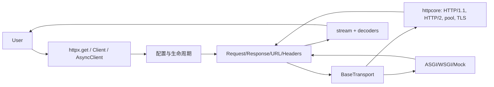

# HTTPX 架构分析报告

## 一句话结论

HTTPX 用 requests 风格的高层体验，包住一个严格、可替换的 transport 边界，从而在同一套 Request/Response 模型上同时支持同步、异步、HTTP/2、流式响应和 ASGI/WSGI 测试调用。

## 项目全景

典型请求从 `Client` 进入：客户端合并默认 headers、cookies、auth、timeout、base URL 与环境代理，构建 `Request`，执行 hooks 和认证，再把单次交换交给 `BaseTransport`。默认实现连接 `httpcore`；测试和应用内调用可以换成 Mock、WSGI 或 ASGI transport。返回的 `Response` 仍由模型层负责流、解码、文本和 JSON 视图。

## 1. 客户端与请求生命周期

`BaseClient` 集中维护会话级状态，`Client` 和 `AsyncClient` 保持语义对称（`httpx/_client.py:190-360`）。这使连接池、cookie persistence、默认认证和事件钩子天然属于长期存活的 Client，而不是每次请求都重新创建。`ClientState` 明确未打开、已打开、已关闭三态，减少资源误用。

`USE_CLIENT_DEFAULT` 是一个小但重要的 API 设计：省略参数时沿用 client 默认值，显式 `None` 则禁用它。重定向放在 client 层，因为它需要处理 origin、认证清理、历史和最大次数；transport 只需知道一次 Request 如何得到 Response。代价是 `_client.py` 成为系统最大文件，sync/async 对称实现也提高修改成本。

## 2. Request/Response 模型

模型层把 headers、cookies、URL、请求体和响应体从网络实现中分离出来（`httpx/_models.py`）。Headers 规范化为字节并支持大小写不敏感访问；Request 统一 bytes、JSON、表单、multipart 与迭代器；Response 以 stream 为核心，便利属性只是对已读内容的视图。

这种设计解决了一个常见边界问题：真实 socket、Mock 和 ASGI 应用都能消费同一 Request，并返回同一 Response，不必各自实现 JSON、编码和 cookie 行为。`StreamConsumed`、`StreamClosed`、`RequestNotRead`、`ResponseNotRead` 把一次性资源的状态显式化。其代价是模型层状态较多，调用者必须理解何时读取和关闭流。

## 3. Transport 边界

`BaseTransport.handle_request` 与异步对应物构成窄接口（`httpx/_transports/base.py`）。默认 transport 把协议、连接池、TLS 和 HTTP/2 交给 `httpcore`，而 ASGI/WSGI/Mock transport 复用上层契约。对于测试，这是比 monkeypatch socket 更稳的替换点；对于应用内调用，它还避免了把测试路径变成另一套 API。

transport 只负责单次请求，不负责业务级重试、应用 lifespan 或响应状态异常。这是合理的边界：连接重试属于 transport 配置，503 重试则属于应用策略；ASGI lifespan 也明确不由 HTTPX 触发。窄接口换来了可替换性，但跨模块行为必须由 Client 和模型共同保证。

## 4. 内容与解码

`_content.py` 将不同输入编码为同步/异步 ByteStream，`_decoders.py` 将压缩解码、文本编码、分块和按行迭代组合起来。HTTPX 因此同时提供 `.content` 这种便利路径和 `iter_bytes/aiter_bytes` 这种低内存路径。响应压缩后进度统计以解码前后的边界区分，避免把用户看到的字节数误当作网络传输量。

流式设计的关键权衡是性能与责任转移：连接可以长期复用、响应无需一次性载入内存，但手动 `send(..., stream=True)` 必须最终 `close/aclose`。文档明确提示这一点；更强的上下文封装可以降低泄漏风险，但会限制转发到其他异步框架的可组合性。

## 5. 评价与启发

HTTPX 最成熟的地方不是某个协议算法，而是边界设计：高层 API 兼容用户习惯，底层 transport 保持窄而稳定，模型层统一跨环境语义。`httpx/_transports/*.py` 与 `docs/advanced/transports.md` 共同证明这一边界既服务生产网络，也服务测试替身。

主要演进风险是大 client/model 文件与同步/异步双路径的重复维护。重设计可以提取共享的请求策略和重定向决策，但必须保留调用栈可读性；过度抽象会损害 HTTP 客户端最重要的属性之一：用户能预测一次请求究竟何时打开连接、读取内容和释放资源。

## 证据与限制

结论依据 README、pyproject、核心 `httpx/*.py` 与本地 docs。固定 HEAD 已验证，源树未修改。外部搜索、用户偏好确认、subagent 并行分析、Git 历史和网络测试均 `not performed`；覆盖率汇总见 `drafts/08-coverage.md`。
