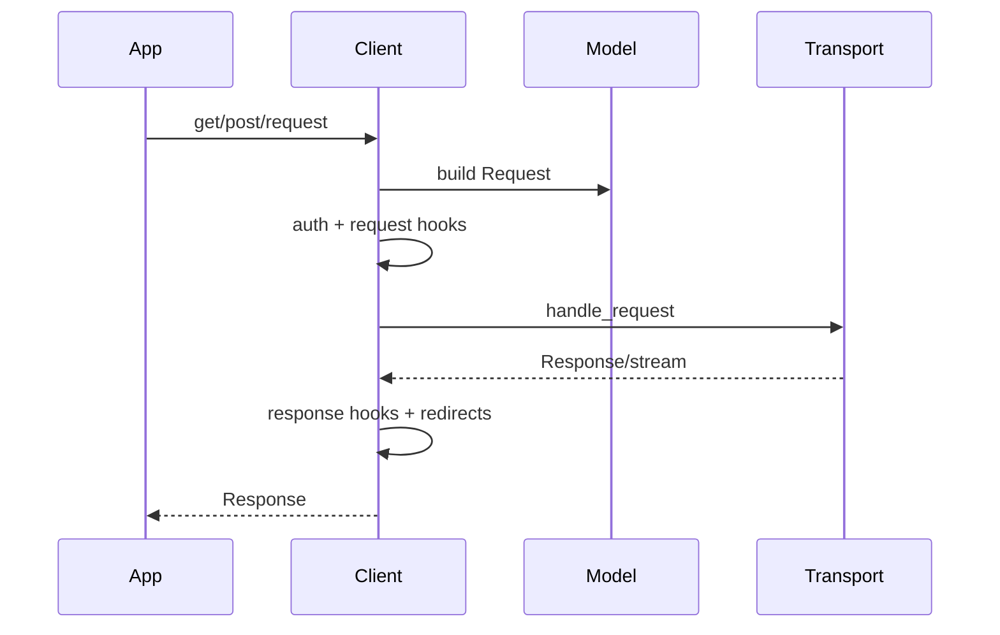

# Client Lifecycle and Request Pipeline

HTTPX 的核心价值是把“发一个请求”提升为可复用、有生命周期的客户端会话。`BaseClient` 持有 headers、cookies、auth、timeout、base URL、hooks 与环境代理；`Client` 和 `AsyncClient` 共享配置语义，分别把请求交给同步或异步 transport（`httpx/_client.py:190-360`）。

## 角色与流程

客户端负责合并默认参数、构造 Request、执行认证、触发 hook、处理重定向及关闭响应流；transport 只负责单次底层交换。状态枚举 `UNOPENED/OPENED/CLOSED` 让生命周期错误可见，避免已关闭客户端继续使用（`_client.py:112-130`）。

## 关键决策

`USE_CLIENT_DEFAULT` 区分“沿用客户端默认值”和显式 `None`，解决布尔/空值语义无法表达的 API 问题。重定向在 client 层实现，因为它需要跨请求保留或清除认证、cookies、历史与最大次数，而 transport 不应知道这些策略。同步/异步实现平行而非把 async 强行包装成线程，代价是维护两套调用路径，收益是自然适配 AnyIO 与流式生命周期。

## 协作与评价

Client 依赖稳定的 Request/Response 与 BaseTransport 契约，因此可以注入 Mock/ASGI/WSGI transport。这个边界贯彻“显式、可替换、协议无关”的整体哲学。主要风险是 `_client.py` 规模较大，sync/async 对称逻辑增加演进成本；若重新设计，可抽取更明确的策略对象，但需避免把简单调用路径拆成难以调试的框架。

## 覆盖率明细

| 文件 | 总行数 | 已读行数 | 覆盖率 | 未读原因 |
|---|---:|---:|---:|---|
| httpx/_client.py | 2019 | 520 | 25.8% | 大文件，工具窗口限制 |
| httpx/_api.py | 438 | 220 | 50.2% | 采样读取 |
| 合计 | 2457 | 740 | 30.1% | 未达到标准核心模块 60%，subagent 不可用 |
