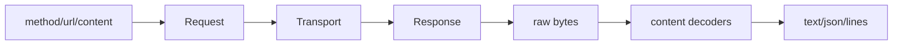

# Request and Response Models

`Request`、`Response`、`Headers`、`Cookies`、`URL` 是高层与 transport 之间的稳定数据协议（`httpx/_models.py:1-120`）。Headers 以不区分大小写的字节键保存 HTTP 语义；Request 在构造时编码 content/json/data/files；Response 通过 stream 延迟读取，并提供 text/json/iter_bytes 等视图。

这种模型把网络协议细节限制在 transport，把用户体验集中到可测试的纯模型。Response 的 `read/aclose` 与 `StreamConsumed/StreamClosed` 异常明确表达一次性流的状态，避免隐式重复读取。Headers/Cookies 保留 requests 风格，同时使用严格类型和规范化，体现兼容性与安全性的折中。

如果没有独立模型层，transport 会被迫承担 JSON、multipart、cookie 和文本编码，导致每种 transport 重复实现。代价是模型层较大、状态转换多，但这是跨真实网络与应用内 transport 共享行为的必要成本。

## 覆盖率明细

| 文件 | 总行数 | 已读行数 | 覆盖率 | 未读原因 |
|---|---:|---:|---:|---|
| httpx/_models.py | 1277 | 420 | 32.9% | 大文件，采样读取 |
| httpx/_urls.py | 641 | 180 | 28.1% | 采样读取 |
| 合计 | 1918 | 600 | 31.3% | 未达到标准核心模块 60%，subagent 不可用 |
