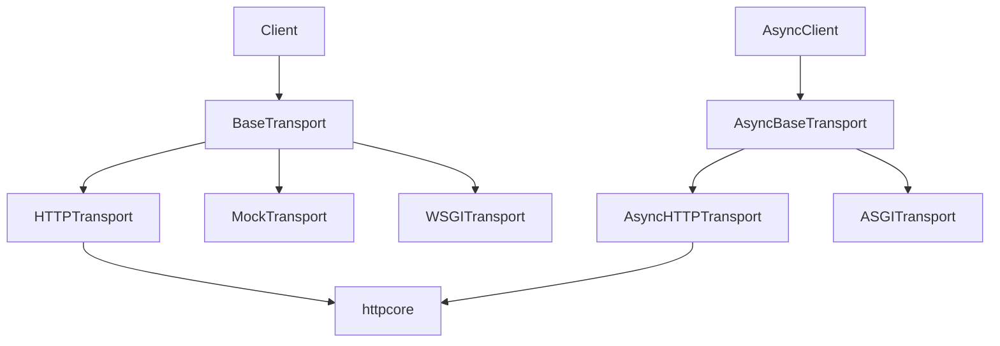

# Transport Boundary and Adapters

`BaseTransport`/`AsyncBaseTransport` 只要求单请求处理与关闭（`httpx/_transports/base.py:1-86`），这是 HTTPX 最重要的架构边界。默认 transport 将连接池、TLS、HTTP/1.1/2 和代理能力委托给 `httpcore`；ASGI、WSGI、Mock 则把同一个 Request/Response 契约映射到进程内应用或测试。

选择“单请求 transport”而不是让 Client 直接依赖 socket，使重试、池化和协议实现可替换，也让测试不需要网络。ASGI/WSGI 适配器的价值不只是 mock：它允许应用内调用保留真实客户端行为。限制是 transport API 本身不负责 lifespan、重试策略或业务错误；这些被有意留在应用或更高层。

## 覆盖率明细

| 文件 | 总行数 | 已读行数 | 覆盖率 | 未读原因 |
|---|---:|---:|---:|---|
| httpx/_transports/base.py | 86 | 86 | 100% | |
| httpx/_transports/default.py | 406 | 260 | 64.0% | 采样读取 |
| httpx/_transports/asgi.py | 187 | 140 | 74.9% | 采样读取 |
| httpx/_transports/wsgi.py | 149 | 120 | 80.5% | 采样读取 |
| 合计 | 828 | 606 | 73.2% | 达标✅ |
