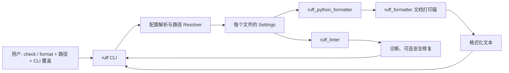
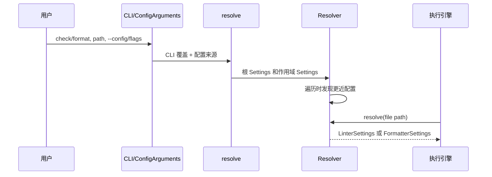
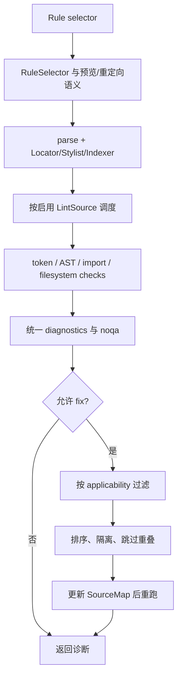

# Ruff 架构分析：把 Python 工具链收束为一个可解释的运行面

## 结论先行

Ruff 的核心价值不只是“Rust 写得快”。从本次审阅的路径看，它把原本分散在
Flake8 生态、import 排序、文档检查、代码升级、自动清理和 Black 格式化中的两个
难题收束起来：**一个文件到底应使用哪组规则/格式设置**，以及**哪些自动修改可以
放心交给工具执行**。前者由 CLI 与配置 resolver 统一处理，后者分别由 lint 的
安全修复机制和 formatter 的 AST/注释打印链保障。

这份统一并不等于把所有算法混在一起。Ruff 将 lint、Python formatter 和语言无关
printer 划为不同 crate；共享的是用户入口、配置生命周期和 Python 基础设施
（`CONTRIBUTING.md`，`Cargo.toml`）。这种“边界统一、内核分治”是它能同时追求
替代多工具与保持可维护性的关键。

> 分析范围：固定 HEAD `c588a3f7f57461692652d339936222b4496c5953`；只读源码。
> 本次是大型仓库的 bounded standard-mode 分析，深读 CLI/配置、lint/fix、formatter
> 三条路径。ty、绝大多数规则、parser/AST、缓存、server、WASM 等不在范围内。
> 未运行构建或测试；完整限制与覆盖率在 `drafts/08-coverage.md`、
> `checks/verification.md` 中记录。

## 1. Ruff 解决的不是一个 lint 问题，而是工具链协调问题

一个 Python 仓库很容易同时依赖 Flake8 插件、isort、pydocstyle、pyupgrade、
autoflake 和 Black。即使各工具功能完善，团队仍要承受多套启动、配置发现和自动
修改语义。Ruff 的 README 明确把其中多项列为替代目标；formatter 则故意以 Black
为兼容目标，而不是另起一套风格（`README.md`；`docs/linter.md`；
`docs/formatter.md`）。

这也解释了其设计取向：格式化器宁可维持较小的配置面，也优先降低已有 Black
项目的迁移风险；lint 则不把“可以修”简化为二元开关，而区分 safe/unsafe fix
（`docs/formatter.md`；`docs/linter.md`）。前者选择一致性，后者选择可解释的
保守自动化。

与此相对，Ruff 没有仿效 ESLint 式父配置隐式合并。每个文件采用最近配置，父层
继承需要显式 `extend`（`docs/configuration.md`）。这牺牲了少量方便，却防止一个
遥远的祖先配置在不易察觉时改变子项目行为。对 monorepo 而言，这个可复现性优先
的决定比“少写一段 TOML”更重要。

## 2. 全景：共享入口，分开的执行内核

`crates/ruff/src/lib.rs:128-264` 在进程级别按命令分发；`check` 与 `format` 都先
将动作参数同配置参数分开，再经过共同 resolver。其后才出现两个不同的消费者：
check 获取 linter settings，format 获取 formatter settings
（`crates/ruff/src/commands/check.rs:37-193`；`crates/ruff/src/commands/format.rs:70-150`）。

因此，Ruff 复用的并非“一个巨型 Options struct”，而是一个重要契约：**路径决定
设置**。顶层命令选项只影响本次运行，路径相关的规则、排除项和格式设置可在
同一次遍历中发生变化。这个契约既支撑嵌套项目，也让 lint 和 format 不会各自长出
一套配置发现逻辑。

## 3. 第一条核心路径：从用户意图到每文件设置

CLI/配置模块把一个含空值和覆盖语义的 `Configuration`，编译成带默认值、路径根和
可执行 glob 的 `Settings`（`crates/ruff_workspace/src/configuration.rs:175-400`；
`settings.rs:16-170`）。前者必须保留“用户没有指定”和“用户显式覆盖”的差异，
后者则让执行路径不必每次解析 TOML 或推导默认值。这是经典的“可合并描述”与
“不可变运行配置”分层。

这里有三项值得注意的取舍。

1. **优先级显式化。** isolated、显式配置、祖先配置、用户配置和默认值有明确路径
   （`crates/ruff/src/resolve.rs:20-145`）。CI 若传 `--config`，子目录不能暗中改变
   其设置；代价是用户必须明确表达希望继承什么。
2. **延迟的按路径路由。** Resolver 持有作用域设置并按最长前缀解析
   （`crates/ruff_workspace/src/resolver.rs:103-199,269-283`）。这避免每个文件重复
   向上搜索，也让子项目的影响限制在子树；代价是并行遍历要协调 resolver，且
   配置发现故障会阻断遍历。
3. **覆盖与追加分开。** `Configuration::combine` 对普通覆盖和 `extend-*` 列表采用
   不同语义（`configuration.rs:654-695`）。若全部按最后值覆盖，规则扩展会被意外
   丢失；若全部合并，又会失去清晰的局部重定义。

这条路径的风险也很集中：宽大的配置对象和手工 combine 容易随新选项演进漂移。
`resolver.rs:311-314` 的注释还指出 extend 链可被重复解析。静态阅读无法判断它在
真实仓库中的代价，但组合性质测试和针对 extend 链的缓存/trace 会比继续堆叠条件
分支更有价值。

## 4. 第二条核心路径：规则广度如何不变成不安全的修改

配置解决“选什么”，lint 引擎解决“如何一次扫描运行异构规则”。`Rule::lint_source`
把规则映射到 AST、token、物理行、导入、文件系统或 noqa 等执行面
（`crates/ruff_linter/src/registry.rs:234-351`）。`check_path` 只为已启用的执行面
准备和调用 checker，并在聚合后统一处理 suppression
（`crates/ruff_linter/src/linter.rs:119-369`）。

这比“每条规则自己解析并决定是否修复”复杂，却更适合 900+ 内建规则的产品：解析、
索引和 suppression 只有一个系统级解释。它也把 notebook、无效语法等边界放在
统一调度层，而不是交给每个规则各自处理（`linter.rs:330-369,443-509`）。

修复逻辑尤其能说明 Ruff 的克制。`fix_file` 先根据 unsafe 设置筛选适用 fix，再用
编辑起点排序，跳过同一 isolation group、重复编辑与位置重叠，最后同时返回新源码、
修复计数和 `SourceMap`（`crates/ruff_linter/src/fix/mod.rs:29-124`）。外层的
`lint_fix` 重跑检查，因为一个修复可能暴露下一轮才成立的修复；它同时设 100 轮
上限，并防止原本有效的文件被修成语法无效（`linter.rs:576-668`）。

这是一种“受约束的固定点”设计。单遍替换会更快、更容易实现，却会把规则间冲突
与链式修改推给用户；Ruff 选择正确性与可解释性，代价是可能多轮 parse，且存在
少量手写的规则优先级例外（`fix/mod.rs:128-167`）。

一个真实的维护风险在 selector：`from_str` 与 `parse_no_redirect` 旁都有需要同步
变更的注释（`rule_selector.rs:176-210,435-466`）。对于要承载迁移、preview 和旧
规则名的边界，这种双路径是合理历史包袱，却很适合被收束成共享解析核心或用
表驱动测试保护。

## 5. 第三条核心路径：Black 兼容不等于“字符串替换”

Ruff formatter 的策略是提升性能而尽量保持 Black 迁移预期，文档称其对大型
Black-formatted 项目可达到接近一致的输出，并明确不鼓励把两者持续交替使用
（`docs/formatter.md`）。这意味着格式化器首先要保护语义和注释，而不是单纯拼接
空格。

`format_module_source` 依次 parse、收集 trivia、构建格式化上下文并 print
（`crates/ruff_python_formatter/src/lib.rs:136-178`）。`format_node` 以 AST、原始
源码、token/trivia 构建 `Comments`，格式化完成后断言所有注释都被处理；通用
`Printer` 则消费 document 的格式元素、行模式和缩进，最终产生 `Printed`
（`lib.rs:158-178`；`crates/ruff_formatter/src/printer/mod.rs:44-92`）。

这套分层的动机很明确：Python 语法与注释归属只能在语言层理解，换行、缩进、组
展开和输出标记则可由通用 printer 处理。若 formatter 直接在 AST visitor 中写
字符串，处理最大行宽、软换行和尾随注释会迅速把语言规则与布局策略缠在一起。
分层的代价是文档 IR、comment map 和 printer 都有学习成本，但它让 Black 兼容
这种大量边界案例的目标有稳定承载点。

Formatter 有意限制风格选项，只保留 quote、indent、line ending、docstring code
等少数配置（`docs/formatter.md`）。若追求 YAPF 式高度可配置，会扩大组合空间，
也会削弱“团队看到同一份输出”的承诺；Ruff 明确押注后者。

## 6. 综合评价与可借鉴之处

**架构成熟度。** 本次覆盖的三条路径有清晰的责任面：resolver 解释配置；lint
协调规则、suppressions 和 fix；formatter 解释 Python 语法/注释并把布局交给
printer。统一入口没有强迫它们共享错误的抽象。

**最值得学习的模式。** 当产品试图替代一组相邻工具时，先统一“输入如何被解释”
和“输出如何被呈现”，再让各领域内核保持独立，通常比把所有逻辑合进一个通用
pipeline 更持久。Ruff 的 per-file settings 和 safety-aware fix 正是这种边界设计。

**主要演进风险。** 统一边界也会成为变更热点：配置合并、selector 兼容和 fix
优先级都有跨领域影响。建议优先投资：

- 配置优先级的表驱动/性质测试，覆盖 CLI、inline、local extend 与最近配置；
- selector 两条解析路径的同构测试；
- 将 fix 的规则优先级例外做成显式可审阅的数据或测试矩阵；
- 为 resolver 提供调试 trace，帮助用户解释“某文件为何得到这组设置”。

这些建议是对已读边界的推断，并非已验证的缺陷。Ruff 的完整性能、规则正确性、
缓存效果和 ty 协作仍需独立的构建、基准及更大范围源码审阅才能评价。
