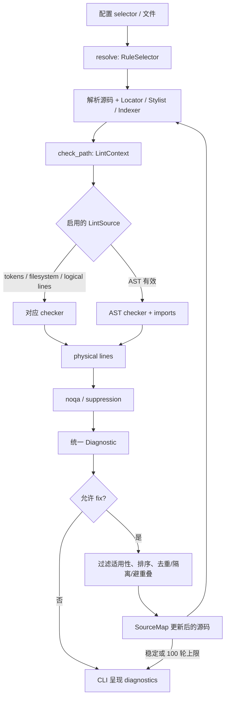

# 模块：Lint 执行、规则选择与安全修复引擎

## 来源与边界

- **源仓库（只读）**：`/Users/chuzu/projests/stark-repo-analyzer-reference-sources/ruff`
- **固定 HEAD**：`c588a3f7f57461692652d339936222b4496c5953`（执行 `git -C <source> rev-parse HEAD`，退出 `0`；未读取 Git 历史）。
- **实际分析文件**：`crates/ruff_linter/src/{linter.rs,fix/mod.rs,registry.rs,rule_selector.rs,lib.rs}`。任务所列的 `fix/fixes.rs` 在该快照不存在；经 `find` 确认，修复入口实际在 `fix/mod.rs`，未越界阅读 `fix/` 的其它实现文件。
- **工具与命令**：shell 的 `find`、`wc -l`、`rg -n`、`sed -n`、`nl -ba`；源码分析命令退出 `0`，仅 `wc` 针对不存在的 `fix/fixes.rs` 退出非零并报告该路径缺失。草稿验证的 `git diff --check` 未执行成功（当前输出目录不是 Git 仓库，退出 `128`）。未运行编译、单测、CLI 或基准；未修改源树。
- **限制**：本稿不阅读 checker、settings、CLI、formatter、rule definitions 或测试夹具；因此这些边界之外的调用链均只作带标签的推断。项目整体理念由任务给定：在统一、高吞吐 CLI 下兼容广泛生态，并只自动实施可接受的安全修正。

配置层已决定要启用哪些规则与文件，接下来这个模块把 Python 源码转成可呈现的诊断，并在用户允许时把其中的修复稳定地合成为新源码。它不是某一条规则的实现，而是将异构规则接入同一次扫描的执行骨架；其末端产出 `Diagnostic`、修复计数和变换后源码，供 CLI 决定显示、写回与退出状态【待主 agent 验证】。

## 角色与业务问题

Ruff 面对的是兼容面很宽的规则集合：有些只需 token，有些依赖路径、行、AST、导入或 `noqa`。若每条规则都自行解析、索引和排序，扫描成本和行为分歧都会随规则数增长。`check_path` 将一次解析结果、定位器、风格和索引作为共享输入，在真正调用某类 checker 前先看该类规则是否启用（`linter.rs:119-253`）。这既避免无用工作，也让各规则实施点保持专注。

自动修复的业务风险更高：两个合理诊断的编辑可能重叠、一个修复可能只在安全级别放宽时允许，修完后还可能触发新规则。这里的目标不是“尽可能改”，而是给出可解释、可终止、不会继续处理已知无效语法的变换（`linter.rs:355-359`, `543-668`; `fix/mod.rs:29-124`）。

去掉这个模块，CLI 只能分别调用各 checker，无法共享解析和抑制语义；更严重的是，修复顺序、重叠处置和收敛上限会散落在调用者中，安全承诺不再可统一验证。

## 核心结构与契约

| 结构/边界 | 职责 | 关键证据 |
|---|---|---|
| `LinterResult` / `FixerResult` | 分离“诊断是否来自有效语法”的状态、诊断集合、变换源码和每规则计数。 | `linter.rs:40-56`, `108-116` |
| `FixTable` | 以 secondary code 为键保存规则展示名与累计修复次数，供多轮修复聚合。 | `linter.rs:59-105`, `643-646` |
| `Rule` -> `LintSource` | 将规则映射到 AST、token、行、导入、文件系统、noqa 等执行面，而非把调度知识分散到规则实现中。 | `registry.rs:234-351` |
| `UnresolvedRuleSelector` -> `RuleSelector` | 保留 selector 的来源（文件、CLI、编辑器），解析时处理迁移、名称预览门控与可定位错误。 | `rule_selector.rs:18-119`, `172-210` |
| `FixResult` | 一次合并产生的新文本、修复统计、`SourceMap` 三位一体返回，令 notebook/位置映射能随内容更新。 | `fix/mod.rs:20-27`, `92-124` |

公开库门面只稳定导出 `Locator`、规则 selector、抑制编辑与 violation 类型；`linter`、`fix` 等仍是 crate 私有实现（`lib.rs:7-13`, `20-47`）。这是明确的契约分层：CLI/集成者可依赖“选什么、报什么”，不能把内部调度顺序当成稳定 API【待主 agent 验证】。

## 执行流

1. selector 先把 `ALL`、遗留组 `C`/`T`、linter 前缀、规则前缀和精确规则归一为 `RuleSelector`；重定向保留原 selector，便于后续提示（`rule_selector.rs:126-210`）。实际规则还会经过 stable/preview/deprecated/removed 的可见性过滤，preview 可要求显式精确选择（`rule_selector.rs:253-299`）。
2. `lint_only` 依据路径解析目标 Python 版本，只解析一次，并构造 `Locator`、`Stylist`、`Indexer`、指令和范围抑制，再进入 `check_path`（`linter.rs:443-509`）。`ParseSource::Precomputed` 允许上游复用已解析 AST（`linter.rs:748-769`）；notebook 则按 cell 解析并合并 module，以维持跨 cell 定义可见性（`linter.rs:772-795`）。
3. `check_path` 从启用规则的 `LintSource` 决定执行面。AST 与 import 检查只在语法有效时运行；doc-line 规则却先从 token、后从 AST 收集并去重，因为注释与 docstring 分属两种表示（`linter.rs:143-253`）。随后统一执行 noqa，并在用户启用 noqa 时移除被忽略诊断；若语法无效，保留诊断但去掉所有 fix（`linter.rs:330-369`）。
4. `lint_fix` 每轮重建与当前文本一致的派生数据，调用相同 `check_path`；首轮记录语法基线，后续若首次有效的文件被修坏则报错并返回 `Err`（`linter.rs:576-640`）。存在合格修复时合并计数、以 `SourceMap` 更新 `SourceKind`、再扫描；100 轮仍未稳定时报告未收敛而返回当前诊断/文本（`linter.rs:642-668`, `679-745`）。
5. `fix_file` 以 `UnsafeFixes` 的 required applicability 过滤；合并器按特殊依赖、最小起点和少数冲突对排序，跳过同隔离组、已应用编辑和位置重叠的编辑，最后拼接余下原文（`fix/mod.rs:29-167`）。

## 关键决策与权衡

### 1. 按执行面分批，而不是“一规则一次全量遍历”

`Rule::lint_source` 将少数特殊规则明确映射到物理行、token、导入、文件系统等，其余默认 AST（`registry.rs:247-351`）；`check_path` 只启动已启用类别（`linter.rs:151-253`）。这偏向吞吐和共享前处理，适合大量兼容规则并存的 CLI。代价是协调器必须知道多种 checker 的输入，成为高变更影响点；换成每规则自带驱动会降低该中心复杂度，但会重复解析/索引，且难以统一 `noqa` 与 notebook 坐标。

### 2. 把配置兼容性建模为 selector 状态，而不只是字符串匹配

`RuleSelector` 区分规则、前缀、linter、遗留组和 all，`UnresolvedRuleSelector` 还带 `ValueSource`，因而报错能告诉用户问题来自哪个配置入口（`rule_selector.rs:18-119`, `126-147`）。预览规则的精确选择策略也在 selector 展开阶段执行（`rule_selector.rs:275-292`）。这让 CLI 兼容老代码、重定向和 preview 开关，而不污染每个 checker；代价是解析逻辑存在“修改必须同步到 `parse_no_redirect`”的显式双实现注释（`rule_selector.rs:176`, `435-466`）。

### 3. 安全修复是受约束的固定点计算

修复器不在原文本上就地乱改：先按安全等级过滤，再通过 `BTreeSet`、隔离组和 `last_pos` 选择非重叠编辑，并产出 `SourceMap`（`fix/mod.rs:35-124`）。外层重复 lint，原因是第一轮改动可暴露第二轮才能成立的修复；100 次上限及“修复不得新造语法错误”的检测给这个过程加了终止与正确性护栏（`linter.rs:557-668`）。代价是大文件或大量链式修复会多次解析，且少数规则间优先级仍以手写例外维护（`fix/mod.rs:128-167`）；相较单遍批量替换，Ruff 选择了更可预测的正确性。

## 协作关系与全局理念

此模块的输入契约是：上游提供已解析或可解析的 `SourceKind`、文件路径、已选 settings、目标 Python 版本及抑制策略；输出契约是带源位置的 `Diagnostic`，或在修复模式下附带变换源码、映射与按规则计数的 `FixerResult`。checker 不拥有写回权，`fix` 不解释规则语义，selector 不运行规则，职责边界清晰。

这正服务于“兼容广度 + 安全自动化 + 高吞吐 CLI”：registry 将大量生态规则归入稳定命名空间（如多个 flake8 系列、isort、Pylint，`registry.rs:35-215`），selector 吸收迁移与 preview 语义，调度器共享一次解析和索引，修复器宁可跳过冲突也不猜测。最终 CLI 获得统一的诊断和可计数修复结果【待主 agent 验证】。

## 亮点、风险与建议

1. **亮点：抑制与语法错误是系统级语义。** `noqa` 在聚合后统一处理，且无效语法会剥夺所有 fix（`linter.rs:330-369`）。这避免规则作者各自解释 suppression，符合“安全优先”。
2. **亮点：修复的可追踪性。** `SourceMap` 与 `FixTable` 同时返回（`fix/mod.rs:20-27`, `linter.rs:643-648`），说明修复不是只产出字符串，也要保留位置与统计的用户体验契约。【待主 agent 验证：CLI 是否直接消费二者】
3. **风险：双解析路径可能漂移。** `from_str` 与 `parse_no_redirect` 均有“变更必须同步”的注释且代码结构重复（`rule_selector.rs:176-210`, `435-466`）。未来新增 selector 特例若只改一边，会使常规配置解析和 schema/验证路径不一致。可将公共的 `ALL/C/T + Linter/Prefix/Rule` 解析抽为一个带“是否跟随 redirect”参数的私有函数。
4. **风险：规则级排序例外是增长点。** 合并器针对少数规则对硬编码优先级，以保证全序传递性（`fix/mod.rs:128-167`）。这比任意比较器可靠，但新冲突组合需要修改中心列表并添加回归测试；可把依赖关系登记为可验证的有向约束，再在冲突集合上稳定拓扑排序，不过实现与诊断复杂度会增加。

## 覆盖率明细

覆盖率按实际发出的 `sed -n` / `nl -ba | sed -n` 全文件行范围计算；仅统计本模块被允许的源文件，测试和构建**未执行**。

| 文件 | 总行数 | 实际读取行数 | 覆盖率 | 未读原因 |
|---|---:|---:|---:|---|
| `crates/ruff_linter/src/linter.rs` | 1261 | 1261 | 100% | 无 |
| `crates/ruff_linter/src/fix/mod.rs` | 416 | 416 | 100% | 无 |
| `crates/ruff_linter/src/registry.rs` | 526 | 526 | 100% | 无 |
| `crates/ruff_linter/src/rule_selector.rs` | 563 | 563 | 100% | 无 |
| `crates/ruff_linter/src/lib.rs` | 96 | 96 | 100% | 无 |
| **合计（核心模块）** | **2862** | **2862** | **100%** | **达标 ✅（standard >=60%）** |

`crates/ruff_linter/src/fix/fixes.rs`：不存在，未纳入分母；这是文件可用性限制，非已读内容。
