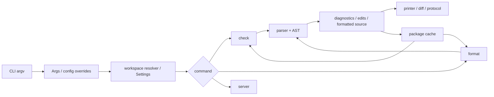
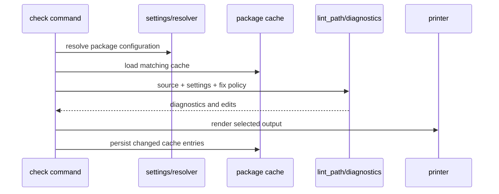

# Ruff 架构分析报告

> 固定源码 HEAD：`c588a3f7f57461692652d339936222b4496c5953`  
> 模式：physical reference-skill standard，bounded scope  
> 运行配置：`gpt-5.6-luna` / `model_reasoning_effort=low`

## 结论先行

Ruff 的核心不是把很多 lint rule 塞进一个快速二进制，而是把一次代码质量操作拆成可组合的中间结果：配置与 settings、解析后的 AST、诊断与 edits、格式化后的 source、可复用 cache。CLI、formatter、server 因而可以共享事实，而不必各自重新实现规则和输出。

这个选择解决了一个实际张力：用户希望工具“一个命令就完成”，系统却必须同时支持 CI 批处理、自动修复、diff、Notebook、编辑器协议和多种输出格式。Ruff 用显式命令状态和结构化中间表示承受复杂度；代价是跨 crate 边界多、学习曲线高，但替代方案通常会把复杂度藏进副作用和重复逻辑中。

## 范围与证据等级

本次优先深读三条主线：CLI/config、lint/fix、formatter/printer；次要覆盖 parser/AST、cache、server、ty。Ruff 全部 Rust 源码扫描计数约 664,970 行，含测试和生成边界，不能当作纯生产代码规模。本报告不声称全仓库覆盖。

证据分三层：

1. 源码行号是最终裁决，例如 `crates/ruff/src/commands/check.rs:34-204`。
2. Graphify 0.9.13 `--code-only --no-cluster` 只做导航：58118 nodes、152791 edges、5098 code files。
3. `doctor-post-graph.json` 仅证明 code-only 图可消费，不能证明语义完整或分析覆盖率。

## 系统全景

这条链路的设计哲学是“显式输入、结构化处理、统一输出”。它解释了为什么配置不直接散落到每个 rule 中，为什么 fix 由命令策略控制，以及为什么 printer 不重新计算 lint 事实。

## 1. CLI 与配置：把用户意图变成可复现状态

`GlobalConfigArgs` 在 `crates/ruff/src/args.rs:43-101` 统一承载日志级别、`--config` 和 `--isolated`。源码文档明确规定单项配置覆盖优先于配置文件（`args.rs:50-59`），而 `isolated` 与配置文件的冲突延迟到后续处理（`args.rs:67-76`）。

Why：CLI 解析和配置语义不是同一件事。clap 适合把 argv 变成结构化值，但“多个配置源谁优先”需要 workspace resolver 的上下文。延迟校验避免把跨来源规则硬编码在参数解析器里，也让 check、format、server 共用一套设置解析。

`Command` 在 `args.rs:116-198` 把 `Check`、`Format`、`Server`、`Config`、`Analyze` 等能力放在同一命令模型中。`CheckCommand` 进一步显式表达 `fix`、`unsafe_fixes`、`diff`、watch 等状态。bool 较多是复杂度来源，但也让 CI 中“是否写文件、是否允许不安全修复”成为可审计的输入。

如果重做，可以把互斥 bool 收敛为 FixPolicy/OutputPolicy 枚举，减少非法组合；不过这会增加 clap 兼容层，且现有显式 flag 是 CLI 稳定性的组成部分。当前实现更偏向向后兼容和可发现性。

## 2. lint/fix：诊断先于副作用

`crates/ruff/src/commands/check.rs:34-184` 体现了 check 的编排顺序：根据 cache 设置加载 package cache，遍历目标，调用 lint 流程，最后持久化。`lint_path` 在 `check.rs:194-204` 把 settings、cache、noqa、fix mode 与 unsafe policy 传入 diagnostics 层。

Why：规则只产生诊断，命令层决定是否 apply fix。若每条规则直接写文件，规则之间会争抢写入顺序，diff、JSON、fix summary 也会重复实现。当前设计把诊断作为跨输出中间表示，代价是 diagnostics、fix table、printer 之间的类型边界较多，但收益是 CLI、server 和多种 emitter 可以共享同一事实。

## 3. formatter 与 printer：两种“打印”共享稳定结果观

`crates/ruff/src/commands/format.rs` 的 `format_path` 先查询格式缓存，再读取 `SourceKind`，调用 `format_source`，最后按 Write、Check、Diff 模式处理。Python 路径调用 `format_module_source`；Notebook 路径按 cell 处理并维护 source map。这表明格式化不是全文件字符串替换，而是 parse → layout/document → print → range-preserving update。

Notebook 的 source map 是关键设计：它允许只替换发生变化的 cell，并保留文件中其他内容与位置关系。替代的整文件重建更简单，却容易破坏元数据、非代码 cell 和编辑器范围。

`crates/ruff/src/printer.rs:41-220` 的 `Printer` 聚合 output format、log level、fix mode、unsafe policy 与 flags；它从 `Diagnostics` 和 `FixTable` 计算剩余错误、已修复错误和可修复统计。Why：输出层不应重新推断规则结果，所有人类摘要、fix summary 与结构化 emitter 都应基于同一诊断集合。

更底层的 `crates/ruff_formatter/src/printer/stack.rs`、`queue.rs`、`call_stack.rs`、`line_suffixes.rs` 体现布局打印的真实难点：换行、缩进、后缀与嵌套决策需要延迟和状态管理。它不是一个简单 AST visitor，而是可回溯的布局决策器。状态机复杂度是代价，稳定可组合的格式结果是收益。

## 4. 次要边界

Parser 的 `crates/ruff_python_parser/src/token_source.rs:9-268` 维护跳过 trivia 的 token 流、checkpoint/rewind、嵌套深度和 re-lex。其 Why 是在 Python 语法歧义和错误恢复下同时保留高质量位置信息与继续解析能力。

AST 的 `crates/ruff_python_ast/src/visitor.rs:119-638` 将 statement/expression 遍历分派集中化。规则和 formatter 共享这一结构，降低了“每个消费者自己理解 AST”的漂移风险。

Cache 的 `crates/ruff/src/cache.rs:65-306` 以 package root、settings、文件时间戳和权限等组成 key；持久化在 `cache.rs:164-190` 先写临时文件再 rename。Why：缓存正确性比缓存命中更重要；配置变化和文件变化都必须使旧结果失效，原子替换则降低中断或并发写坏文件的风险。

Server 的 `crates/ruff/src/commands/server.rs` 只有薄 CLI 入口，实际会话、调度、编辑和协议逻辑位于 `crates/ruff_server/src/server/*`、`session/*`、`edit/*`。这说明一次性 CLI 状态与长生命周期 LSP 状态被隔离。ty 相关边界在 Graphify 导航中出现 `TypeInferenceBuilder`、`SemanticIndexBuilder`、`ConstraintSetBuilder` 等节点，但本次没有逐行深读类型推断，不作完整语义架构结论。

## 5. 交叉结论与评价

已验证的跨模块事实是：`args.rs` 显式定义 fix policy，`check.rs` 消费它并交给 diagnostics；`printer.rs` 消费 diagnostics/fix table；check 与 format 都在命令编排层接入 cache。因此 Ruff 的边界不是按“功能名”孤立切分，而是按可复用结果切分。

最值得借鉴的是副作用控制：解析、诊断、修复、打印、缓存各自拥有清晰输入输出。最需要警惕的是复杂度转移：大量 settings、flag、跨 crate 类型和 formatter 状态机要求维护者具备较强上下文。架构文档、契约测试和更强的策略类型可以降低这部分认知成本。

## Graphify code-only 与 semantic Graphify

本次 Graphify 的 `semantic_extraction` 明确为 `disabled`，因此它只提供 AST/代码结构导航证据；其 inferred/extracted 关系不能被写成业务语义或设计动机。semantic Graphify 通常会额外抽取自然语言式调用意图、角色和跨模块语义关系，但也会引入模型推断误差。本次禁止 semantic/LLM extraction，所以报告中所有 Why、权衡和评价都来自源码阅读与明确的推理链，Graphify 只用于定位候选模块和高连接节点。

## 限制与覆盖

本次是 bounded standard，不是全仓库分析。实际覆盖率汇总见 `drafts/08-coverage.md`：CLI/config 约 34.1% estimated，lint/fix 约 60.6% estimated，formatter/printer 约 58.9% estimated；parser/AST、cache、server 为 bounded，ty 为 navigation only。未执行网络研究、Git history、build/test，P5 动态验证排除，subagent not performed。

## 交付索引

- 计划与研究：`drafts/03-plan.md`、`drafts/03-research.md`
- 模块规划：`drafts/05-modules-plan.md`
- 模块深读：`drafts/06-module-cli-config.md`、`06-module-lint-fix.md`、`06-module-formatter-printer.md`、`06-module-secondary.md`
- 验证与洞察：`drafts/07-cross-validation.md`、`drafts/08-insights.md`
- 覆盖率：`drafts/08-coverage.md`
- 执行与约束：`execution-log.md`、`checks.md`、`metadata.json`
