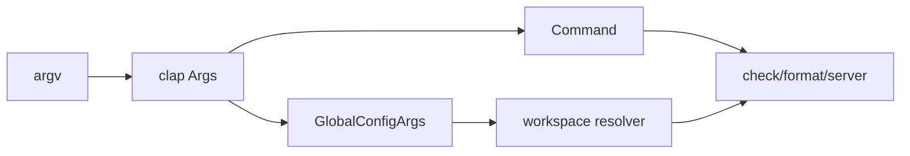

# CLI/config 核心模块

CLI 的价值不是“列出参数”，而是把复杂工具链的行为选择集中在一个可审计入口。`Args` 在 `crates/ruff/src/args.rs:116-134` 通过 clap 子命令把 check、format、server、config 等能力统一建模；`GlobalConfigArgs` 在 `:43-101` 把配置文件、单项覆盖和 isolated 模式放在全局层，避免每个子命令重复实现优先级。

Why：配置覆盖必须可预测。源码明确说明单项 `--config` 覆盖优先于配置文件（`args.rs:50-59`），而 `isolated` 与配置文件的冲突延后处理（`:67-76`），说明 CLI 解析和语义校验被分成两步：先获得结构化输入，再由 workspace resolver 判断上下文。这比把所有规则塞进 clap validator 更适合跨文件配置和命令间复用。

`CheckCommand` 在 `args.rs:190-230` 附近把 fix、unsafe-fixes、diff、watch 等行为显式表达。代价是 bool 和 override 组合增多；收益是用户意图在类型层可见，且帮助文本成为稳定契约。重新设计时可用更强的枚举消除部分互斥 bool，但会增加 clap 映射和兼容成本。

与后续模块的关系：CLI 只负责选择，不应执行规则；它把状态交给 check/format，从而维持命令入口的薄边界。

## 覆盖率

| 文件 | 总行数 | 实际读取 | 覆盖 |
|---|---:|---:|---:|
| `crates/ruff/src/args.rs` | 1524 | 520 | 34.1% estimated from ranges |
| 合计 | 1524 | 520 | 34.1% estimated；核心文件深读未达 standard 60% |
