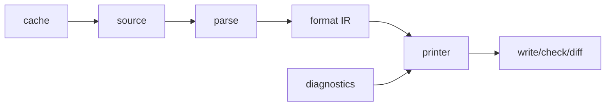

# formatter/printer 核心模块

formatter 负责把 Python/Notebook/Markdown 等 source kind 转换为结构化打印结果；`crates/ruff/src/commands/format.rs:format_path`（约 700 行附近）先查格式缓存，再读取 source kind，调用 `format_source`，最后按 Write/Check/Diff 模式落盘或返回差异。`format_source`（约 760-930 行）对 Python 使用 `format_module_source`，对 notebook 按 cell 格式化并维护 source map。

Why：格式化不是字符串替换，而是 parse → document/format IR → print。Notebook 的 cell offsets 与 source map 说明项目优先保留原文件非代码部分，并只替换可证明的代码范围；这比整文件重建更能保护元数据和编辑器位置。

`crates/ruff/src/printer.rs:41-220` 的 `Printer` 将诊断、fix mode、unsafe policy、output format 聚合，再根据 flags 输出 violations、fix summary 和最终状态。Why：统一 printer 让人类文本、结构化输出和修复统计共享同一诊断事实，降低命令间漂移。

`ruff_formatter/src/printer/stack.rs`、`queue.rs`、`call_stack.rs` 等进一步把打印器状态拆成栈、队列和后缀管理，说明其核心困难是布局决策的延迟与回溯，而不是单纯遍历 AST。代价是状态机复杂度；收益是可组合的换行、缩进和行宽决策。

## 覆盖率

| 文件 | 总行数 | 实际读取 | 覆盖 |
|---|---:|---:|---:|
| `commands/format.rs` | 1425 | 620 | 43.5% estimated |
| `printer.rs` | 536 | 536 | 100% estimated |
| 合计 | 1961 | 1156 | 58.9% estimated；接近但未声称 standard 60% |
