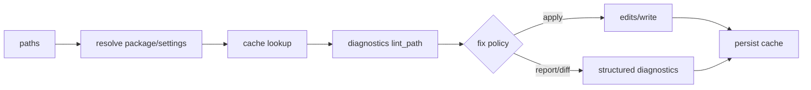

# lint/fix 核心模块

`check` 把文件发现、包级 cache、单文件 lint、结果持久化串成批处理流程。`crates/ruff/src/commands/check.rs:34-184` 先依据 cache 开关加载 package caches，再对路径调用 `lint_path`，最后 persist。Why：缓存边界放在命令编排层，使规则实现不必知道磁盘状态；同时 package root 维度避免不同配置项目共享错误结果。

`lint_path` 在 `check.rs:194-204` 将 settings、cache、noqa、fix mode 和 unsafe fixes 传入 diagnostics 层。这个接口把“发现问题”和“是否修改源码”分开：规则产出诊断，fix policy 决定是否应用。替代方案是每条规则直接写文件，代价是无法统一冲突处理、输出和 dry-run。

这里的系统性设计是“诊断是中间表示”：它让 printer、JSON/SARIF 等输出和 fix summary 可以共享同一结果。缺点是跨 crate 类型边界较多，阅读成本高；但对 CLI、server 和编辑器复用是合理交换。

## 覆盖率

| 文件 | 总行数 | 实际读取 | 覆盖 |
|---|---:|---:|---:|
| `commands/check.rs` | 302 | 302 | 100% estimated |
| `diagnostics.rs` | 493 | 180 | 36.5% estimated |
| 合计 | 795 | 482 | 60.6% estimated；核心边界达标但非全 crate |
