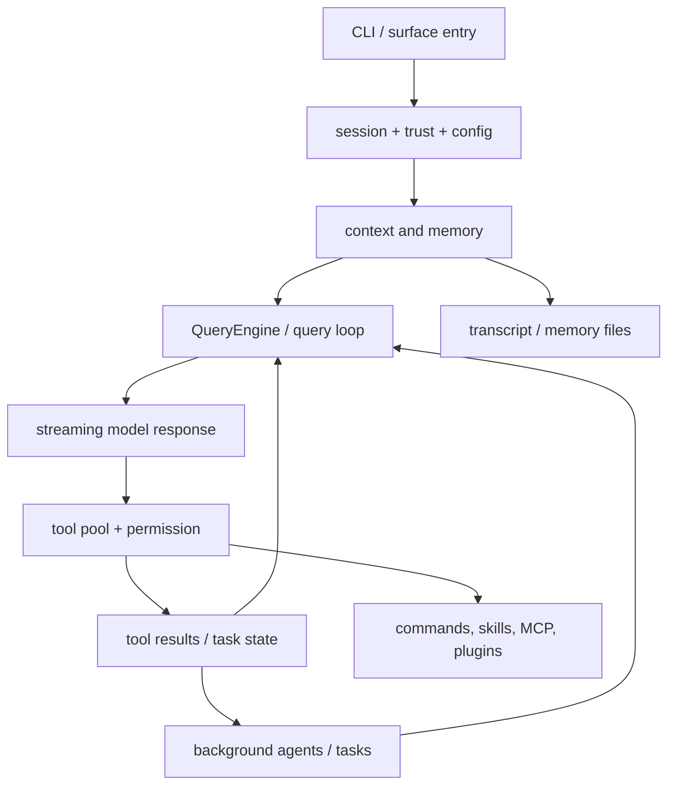

# Claude Code 源码架构基线

> 分析模式：`standard`  
> 固定 HEAD：`a371abbe75ffa0d0a3c92290e2bbf56a7ef54367`  
> 证据边界：当前 commit 源码、当前 README、公开 GitHub 元数据和 Anthropic 官方 Claude Code overview。未使用 Git 历史推断当前实现。

## 1. 定位与边界

Anthropic 官方文档把 Claude Code 定位为能够理解代码库、跨多个文件和工具完成开发任务的 AI coding assistant，并支持终端、IDE、桌面和 Web 等表面。当前源码来自 `yasasbanukaofficial/claude-code` 研究镜像；镜像 README 明确它不是 Anthropic 官方产品。因此，本文把官方资料用于产品背景，把源码用于实现事实。

仓库包含 1,884 个 TypeScript/TSX 文件、512,664 行代码，但没有 `package.json`、`tsconfig`、lockfile、CI 或测试配置。这个缺失使得依赖、构建入口、feature flag 发布值和动态测试均无法从当前 commit 验证。

## 2. 全局架构

系统的核心哲学是“共享执行内核 + 显式策略上下文 + 可插拔能力来源”。入口负责组装，Query loop 负责持续执行，Tool runtime 负责能力调用，Task/agent 负责长任务，Command/skill/MCP/plugin 负责扩展，Context/memory 负责把项目和会话状态带入下一轮。

## 3. Query Loop

`query()` 以异步生成器暴露一次 agent turn，内部状态包含消息、工具上下文、压缩跟踪、恢复计数和继续原因（`src/query.ts:181-239`）。每次 API 请求前会执行工具结果预算、可选 history snip、microcompact、context collapse 和 autocompact（`src/query.ts:365-467`）。流式响应中，tool_use 会进入工具执行器；可恢复的 prompt-too-long、max-output 或 fallback 错误会先被隐藏，避免 SDK 消费者在恢复完成前结束会话（`src/query.ts:788-845`）。

这里的关键取舍是用复杂的显式状态机换取长会话的恢复能力。替代方案是简单的“请求-响应-再请求”，实现更易读，但无法安全表达压缩、孤儿消息、工具结果顺序和模型 fallback。

## 4. Tool Runtime

`ToolUseContext` 连接工具定义、AppState、权限、取消信号、消息和选项（`src/Tool.ts:123-300`）。`getAllBaseTools()` 建立内置能力全集，`getTools()` 根据 simple mode、feature/env、deny 规则和 `isEnabled()` 过滤（`src/tools.ts:193-327`）。MCP 工具再与内置工具合并，分区排序并按名称去重，保留内置工具优先级（`src/tools.ts:330-366`）。

工具执行按 `isConcurrencySafe` 分批：连续只读调用可并发，其他调用串行；无法解析或安全性判断抛错时保守地按不可并发处理（`src/services/tools/toolOrchestration.ts:19-115`）。流式执行器还维护顺序缓冲、兄弟取消和合成错误（`src/services/tools/StreamingToolExecutor.ts:34-240`）。这体现了性能与安全的平衡：并发只发生在工具声明为安全时，失败不会任意终止父查询。

## 5. Tasks and Agents

任务类型覆盖 local shell、local/remote agent、in-process teammate、workflow、monitor 和 dream（`src/Task.ts:6-20`）。共享状态有类型、状态、输出文件、偏移和通知字段（`src/Task.ts:44-57`），task ID 用类型前缀加随机后缀（`src/Task.ts:78-124`）。

`runAgent` 为子代理解析工具、MCP、模型和上下文后重新进入 `query()`（`src/tools/AgentTool/runAgent.ts:648-756`）。本地 agent task 通过 child abort controller 继承父级取消，并在完成/失败时写入终态（`src/tasks/LocalAgentTask/LocalAgentTask.tsx:410-514`）。foreground/background 转换通过任务状态和 signal 协调（`LocalAgentTask.tsx:521-651`）。

这是长任务隔离的强项，但 task-agent 模块实际覆盖率为 59.1%，低于 60% 门槛；`utils/swarm/inProcessRunner.ts` 未充分读取，不能把完整 swarm 实现写成已验证事实。

## 6. Commands and Skills

命令注册把内置、feature-gated、bundled、plugin、workflow 和 skills 组合起来，并在每次 `getCommands()` 时重新检查可用性和启用状态（`src/commands.ts:224-346`, `445-505`）。skill frontmatter 会被归一化为 prompt command，包含工具限制、模型、hooks、fork context、agent 和路径条件（`src/skills/loadSkillsDir.ts:185-316`）。

加载器按真实文件身份去重，把条件 skill 暂存；文件操作可以发现嵌套 `.claude/skills`，匹配路径后再激活（`src/skills/loadSkillsDir.ts:716-802`, `861-915`, `997-1058`）。SkillTool 选择 inline 或 forked agent 执行（`src/tools/SkillTool/SkillTool.ts:118-236`）。这让项目能力可扩展，但也把优先级、缓存和来源安全带入了命令系统。

## 7. Context and Memory

系统上下文包含可选 Git 状态和 cache breaker；用户上下文包含 CLAUDE.md 内容与当前日期，并通过 memoize 缓存（`src/context.ts:113-189`）。Git 状态会在 remote 或禁用 Git 指令时跳过，且是对话开始时的快照（`src/context.ts:36-110`）。

Session memory 以 post-sampling hook 触发 forked agent，并通过 exact-path `canUseTool` 把写入限制到记忆文件（`src/services/SessionMemory/sessionMemory.ts:352-375`, `460-481`）。AutoDream 再用时间、会话数和 lock gate 控制后台 consolidation，失败时回滚 lock（`src/services/autoDream/autoDream.ts:95-190`, `200-271`）。

## 8. Peripheral Boundaries

- MCP config/client 提供 scoped config、signature dedup、policy filter、连接缓存、工具/资源/命令获取和结果转换（`src/services/mcp/config.ts:202-417`, `src/services/mcp/client.ts:552-595`, `2226-2408`, `2632-2720`）。
- 插件 loader 提供 versioned cache、Git/NPM/local 安装和 manifest 读取（`src/utils/plugins/pluginLoader.ts:126-183`, `293-365`, `470-718`, `1147-1265`）。
- 命令层维护 `REMOTE_SAFE_COMMANDS` 与 `BRIDGE_SAFE_COMMANDS`，并拒绝 remote bridge 上的 local JSX（`src/commands.ts:610-686`）。
- 权限/安全层在工具池过滤之外继续约束 Bash、PowerShell 和文件路径；本次只完成代表性读取。
- `main.tsx` 是大型 composition root，连接启动、信任、配置、工具、MCP、插件、远程和 UI；这使组装集中，但也形成高耦合热点。

## 9. Evaluation

### Strengths

- 恢复优先：压缩、streaming fallback、tombstone 和工具顺序都有显式路径。
- 能力装配统一：工具、命令、技能、MCP 都可注册、过滤、执行。
- 安全边界显式：deny、canUseTool、exact-path memory writer 和 bridge allowlist 形成纵深防御。
- 长任务可管理：任务状态、取消、sidechain transcript 和 background 化被建模。

### Problems and Redesign Suggestions

- 拆分 `main.tsx` 为 bootstrap pipeline，降低 composition root 的变化半径。
- 将 `ToolUseContext` 拆为 query/execution/permission/surface context，减少耦合。
- 用统一 capability registry 收敛 Command/Tool/Task 的来源、优先级和缓存清理。
- 生成 build manifest，记录 feature flag 实际启用集合。
- 将任务生命周期转成可枚举状态机，并补充 foreground/background/kill/complete 动态测试。

## 10. Coverage and Limitations

核心 5 个模块中 4 个达到 60%，加权读取覆盖率 85.5%；task-agent 为 59.1%，按门槛判定未达标。次要模块中 MCP/plugin 为 34.3%、permission/security 为 36.2%、entry/UI 为 23.6%，remote/platform 未计算。全仓库不声称达标。

未验证事项包括：真实依赖版本、构建产物、发行 feature flag、动态测试、完整 swarm、完整 REPL UI、完整插件 marketplace 和 remote/SDK transport。详情见 `execution-log.md`、`drafts/08-coverage.md` 和 `checks.md`。

## External References

- https://docs.anthropic.com/en/docs/claude-code/overview
- https://github.com/yasasbanukaofficial/claude-code
