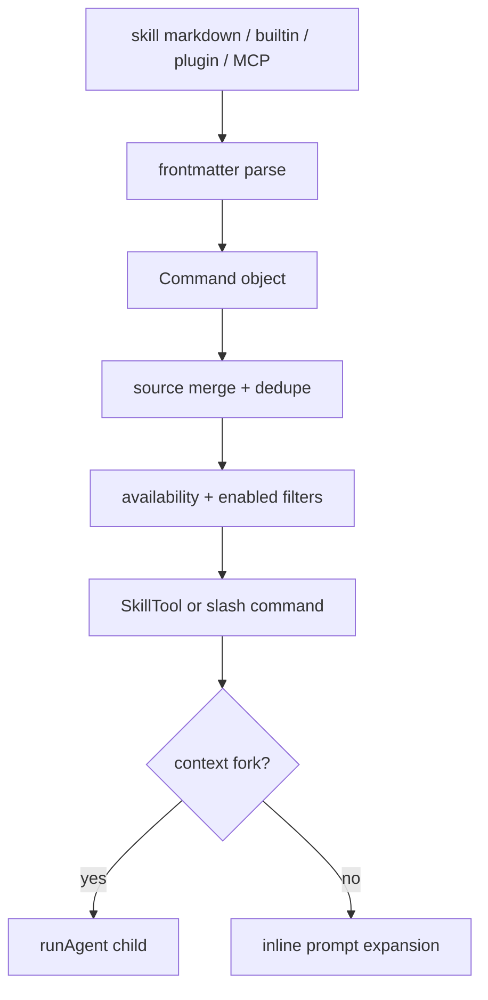

# Core Module: Command and Skill Extension

## Role and Business Problem

Commands and skills are the extension membrane between a fixed CLI and changing project/user capabilities. They merge built-ins, bundled skills, project files, plugins, workflows and MCP prompts into model-facing commands without making every source a hard-coded import.

## Data Structures and Flow

The command registry assembles built-ins and feature-gated commands lazily (`src/commands.ts:224-346`). `getSkills()` loads skill-directory, plugin, bundled and built-in-plugin sources in parallel and degrades to empty lists on source failure (`src/commands.ts:353-398`). `loadAllCommands()` merges sources; `getCommands()` applies availability/enabled checks and adds dynamic skills (`src/commands.ts:445-505`).

Skill frontmatter becomes a normalized prompt command with description, allowed tools, model, hooks, fork context, agent and path metadata (`src/skills/loadSkillsDir.ts:185-316`). Loading deduplicates by real file identity and separates conditional path skills from unconditional skills (`src/skills/loadSkillsDir.ts:716-802`). File operations can discover nested skill directories, and matching paths activate conditional skills (`src/skills/loadSkillsDir.ts:861-915`, `997-1058`). SkillTool can execute a forked skill by preparing a child context and calling `runAgent` (`src/tools/SkillTool/SkillTool.ts:118-130`, `205-236`).

## Design Decisions and Trade-offs

1. **Source normalization.** Different sources become one command shape, simplifying downstream discovery. The cost is a large metadata surface and source-priority rules.
2. **Lazy/memoized loading.** Expensive disk/plugin work is delayed and cached, while auth/enablement is evaluated fresh (`src/commands.ts:445-485`). This balances startup cost and mid-session login changes, but creates cache invalidation responsibilities.
3. **Conditional skills are activated by file paths.** The model does not see every skill immediately; matching files can activate relevant ones (`src/skills/loadSkillsDir.ts:985-1058`). This reduces prompt noise at the cost of hidden availability and path-matching edge cases.

## Collaboration

The query loop consumes command/skill descriptions for prompt construction; SkillTool feeds selected skills back into the agent runtime; plugin and MCP layers extend the same command surface. The architecture favors a shared command contract over separate invocation protocols.

## Coverage

| File | Lines | Read | Coverage |
|---|---:|---:|---:|
| `src/commands.ts` | 754 | 754 | 100% |
| `src/skills/loadSkillsDir.ts` | 1,086 | 1,086 | 100% |
| `src/tools/SkillTool/SkillTool.ts` | 1,108 | 1,108 | 100% |
| **Total** | **2,948** | **2,948** | **100% (core target 60%, pass)** |
